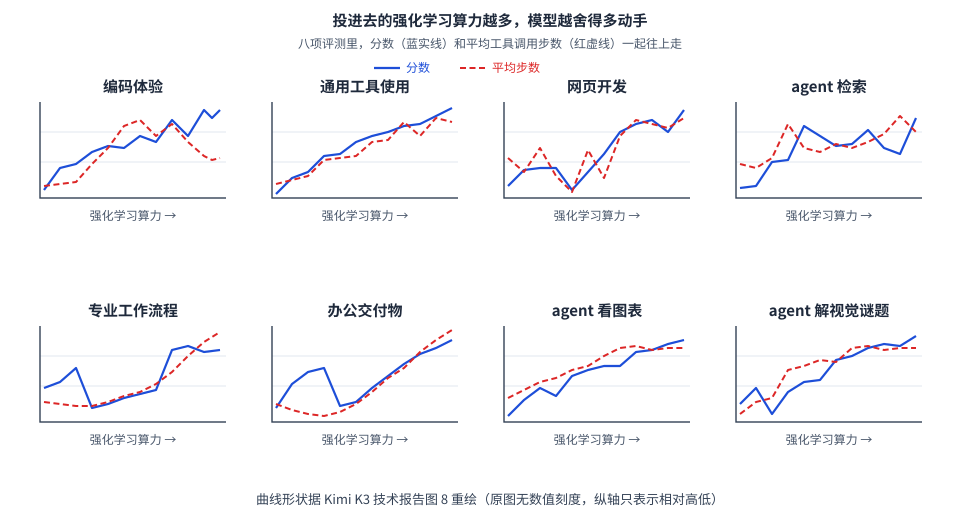

【Agentic RL】DeepSeek和Kimi的N个专家，合成了一个模型

━━━━━━━━━━━━━━━━━━━━

◆ 那个 low / high / max 的开关，是怎么来的？

━━━━━━━━━━━━━━━━━━━━

现在打开各家的 API 文档，会看到一个越来越常见的参数：思考力度，通常分成三档。

Kimi K3 和 GLM-5.3 是低、高、最大；DeepSeek V4 稍有不同，是不思考、高、最大。智谱那边还顺手把"关闭思考"这个选项砍掉了，文档里写得很干脆：只支持开启推理，不支持关闭。

我一直以为这是个推理时的旋钮。同一个模型，你说少想一会儿它就少想，说使劲想它就多花点 token，像油门踏板。

283 期（ https://mp.weixin.qq.com/s/qBGsQ75RQYExZW1Vj0BhIg ）翻 Kimi K3 技术报告的时候，我只顾着看第 4 章第 2 节的造题那部分，前面一节整个跳过去了。这两天补看，第一段就把我看愣了：

> 我们的后训练管线遵循三阶段范式：用监督微调初始化基础 agent 能力，用强化学习**培养不同思考力度下的领域专家**，再用多老师在线蒸馏**把这些领域策略合并进一个模型**。

再往下数了一遍：**三个领域 × 三档思考力度 = 九个专家模型。**

**交到用户手上时，它当然还是一个模型的三种模式；但这三种模式，是先分成三批专家练出来，再合回去的。**

而且这事不是 Kimi 独有的。DeepSeek V4 的技术报告里，同一套路数写得更早——**四月底就已经写进报告**，比 K3 早了三个月。它那边训的专家更多，报告原话是"**超过十个老师模型**"。

所以这期讲的是 283 期的下半场：题造出来之后，拿这些题**怎么练**。

━━━━━━━━━━━━━━━━━━━━

◆ 先说清楚：这九个不是九次从头训

━━━━━━━━━━━━━━━━━━━━

看到"九个专家模型"，第一反应容易是：那不得把 2.8T 的模型烧九遍？

不是的。报告给出的管线只有一次预训练：先得到 K3 基座，再做监督微调得到冷启动策略，然后才进入分领域、分思考力度的强化学习。

也就是说，九个专家共享前面那段最贵的路，区别从后训练才开始长出来。

最贵的那一段——预训练——只花了一次钱。后面的专家训练仍然很贵，但和重新预训练九次完全是两回事。报告没有公布九个专家各自的参数量、训练算力和保存方式，这几笔账不能替它补。

那这九个专家，和最后合出来那个模型，是一样大的吗？

**报告没有明说。** 后面的公式要拿老师和学生对同一个 token 给出的概率相除，只能说明两边的分词和词表得对得上，推不出参数量一定相同。公开能确定的是：这次蒸馏写明的目的不是压缩模型，而是把九个专家的能力合进一个统一模型。

顺带说，这一整期讲的都是后训练。K3 报告里预训练是第 3 章，后训练是第 4 章，两章分得很清楚，本文只在第 4 章里打转。

━━━━━━━━━━━━━━━━━━━━

◆ 为什么要分头练：三个领域，三档力度

━━━━━━━━━━━━━━━━━━━━

先看 K3 分的那三个领域：

- **通用任务**：一般对话体验、视觉、推理、忠实度、搜索能力、知识类工作；
- **通用 agent**：长程助理任务、深度研究、段落级写作；
- **编码 agent**：软件工程、编码体验、kernel 任务、网页开发。

────────────────────

💡 这三个领域，和 283 期那"三条路"不是一回事

283 期分的是**题从哪来**——去现实里捞、让模型自己长知识图谱出题、连题目所在的世界一起造。那是我读完报告自己归纳的说法。

这里分的是**拿这些题去练什么**，是报告原文列的三个领域。

两边压根不对应。比如 kernel 任务，按造题方式属于"去现实里捞"，按训练领域归"编码 agent"；个人助理任务，按造题方式是"连世界一起造"，按训练领域归"通用 agent"。

**一个说的是题目的出身，一个说的是题目的用途。** 数字上都是三，纯属巧合。

────────────────────

这里有句话值得留意，报告是专门交代的：**他们不给每个细分任务单独训一个模型，而是把强化学习铺在三个大领域上，每个领域里再装一大堆子任务。**

换句话说，"专家"这个词的粒度是有讲究的——不是"数学专家""正则表达式专家"那种颗粒度，是"这一大类活儿"的颗粒度。报告没有解释为什么停在三大领域，只能确认他们没有给每个细分任务各养一位老师。

**这三个领域专家的区别，主要长在任务、提示词和奖励信号上**：练的活儿不同，判分方式不同，最后自然各有所长。至于三边的数据是不是严格分家、有没有交叉，报告没交代。

再乘上低、高、最大三档思考力度，就是九个。

报告里有张图（图 8）画的是随着强化学习投入的算力增加，各项能力的变化。八个子图，每张里有两条线：



蓝色实线是分数，这个不意外，投算力就该涨。**有意思的是那条红虚线：模型平均的工具调用步数，也跟着一路往上。**

这两条线基本是缠在一起走的。算力投得越多，模型不是话变多了，是**干活的步数变多了**——多查一轮、多跑一次、多验证一遍。报告给这张图的说明就一句：随着强化学习算力扩大，工具调用步数持续增长，同时模型整体能力全面提升。

八个子图涵盖的活儿也各不相同：编码体验、通用工具使用、网页开发、agent 检索、专业工作流程、办公交付物、看图表、解视觉谜题。**除了少数几张前半段有起伏，形状基本一致。**

────────────────────

💡 这张图画的是训练途中，不是最终成绩

**曲线上画的是强化学习阶段的过程，不是最后蒸馏完成那个模型的水平。**

两个依据：图的横轴是强化学习投入的算力，而这张图本身排在报告讲强化学习的那一节里——蒸馏合并是再往后一节的事。

至于这八条线具体对应九个专家里的哪几个、还是取了平均，报告没交代。

────────────────────

DeepSeek 那边的分法没有列这么细，只举了例子：数学专家、代码专家。它训的专家数量更多，超过十个，但报告没给完整清单。

━━━━━━━━━━━━━━━━━━━━

◆ 思考力度是"用钱管出来的"

━━━━━━━━━━━━━━━━━━━━

那么，同一个领域里的"低、高、最大"三档，具体怎么练出来？

**K3 的办法简单粗暴：给每道题定个预算，超支就判负。**

每道题先拿冷启动模型跑一遍，估出一个初始的 token 预算，记作 b₀。训练的时候设一个倍数 τ，**如果一条轨迹用掉的 token 超过了 τ × b₀，那么不管它答得对不对，任务奖励直接被覆写成 −1。**

注意这里是**覆写成 −1，不是扣几分**。答得再漂亮，超预算就是负分。

算什么算超支，两类任务口径不同：通用任务数的是思考 token，agent 任务数的是**累计输出**——包括推理过程，也包括工具调用的参数。这个口径挺公道：你在工具调用里写了一大堆参数，那也是花掉的钱。

然后是训练的次序，报告用的词是"课程表式"：

**先训一个 τ 比较大的最大档**，但仍然给它设一个上限，防止想得没边；**然后把 τ 一步步调小，退火出高档和低档。**

这句话里藏着一个容易看漏的信息：**这三档不是三次各练各的，是一条接着一条退火下来的。** 最大档练成之后，收紧预算接着往下训，得到高档；再收紧，得到低档。

**所以低档专家不是拿简单题喂出来的，是拿同样的活儿、只给更少的钱逼出来的。**

这么一来，"九个专家"的形状也就清楚了：**不是九条互不相干的支线，是三条领域支线，每条上面串着三个一路收紧预算退火出来的档位。**

τ 具体调到多少？报告写的是"**按领域配置，人在环引导**"。

上文讲造题那期得出过一个印象：人没退场，只是往上挪了一层，从写题目挪到定标准。这里又出现一次——**τ 这个数是人定的，各领域还不一样。**

DeepSeek 那边达到的目的一样，路子不同：他们**给三种思考模式配不同的长度惩罚和上下文窗口**，分别做强化学习，训出不思考、高、最大三个模式。而且 Think Max 那一档还多一手——**在系统提示词开头注入一段专门的指令**。那段原文写得挺凶，我照抄一句：

> 推理强度：绝对最大值，不允许走任何捷径。你必须在思考中极其彻底，全面分解问题直到解决根本原因，用所有可能的路径、边界情况和对抗场景严格压力测试你的逻辑。

一边训一边喊话，双管齐下。

━━━━━━━━━━━━━━━━━━━━

◆ 没有标准答案的活儿，谁来判分

━━━━━━━━━━━━━━━━━━━━

上文 283 期说过，强化学习转起来的前提是能自动判分。代码跑测试、算子对数值，这些都好办。可"通用任务"这一大类里有一堆没法自动判的东西：写作、开放式问答、知识类工作。

**K3 的办法是请一个 agent 当裁判**，而且给它定了一套必须走完的流程：

1. 先读候选的产出——不管是结论、成品还是一段文字；
2. **现场生成一份评分表**；
3. 拿这份评分表逐条给每个候选打分；
4. 把评分表给出的分数记进一个记分板。

判的方式是锦标赛式的两两对比，一局出一个胜负。

这里有个防作弊的设计我很喜欢。裁判要是个模型，它多半会渐渐偏爱那些写得长、看着认真的答案——这在行话里叫奖励作弊，261 期（ https://mp.weixin.qq.com/s/nLFv6m-ONkXd7frHevgPOQ ）整篇讲的就是这件事：**被测的奖励和你真正想要的东西之间只要有缝，就会被优化器找到并放大。**

K3 堵这条缝的办法，跟前面管思考力度是同一招：**先估一个正常的输出长度 ℓ₀，再定一个倍数 σ，谁的输出超过 σ × ℓ₀，这一局直接判输。**

不是扣分，是判输。跟超预算判 −1 一模一样的思路——**用一条机械的硬规则，堵死一条模型迟早会发现的捷径。**

DeepSeek 在这件事上走得更远一步：他们干脆**不训独立的打分模型了**。

传统做法是另外训一个模型专门打分，V4 报告说他们把这套扔了，改成让**策略模型自己兼任裁判**——同一个网络，一边学怎么答题，一边学怎么判分，两种能力一起优化。报告给的理由是：这样模型的推理能力天然融进了它的评判过程，而且**只需要很少量的人工标注**，剩下的靠它自己的逻辑去推广。

━━━━━━━━━━━━━━━━━━━━

◆ 一堆专家，怎么合成一个

━━━━━━━━━━━━━━━━━━━━

现在手上有九个各有所长的模型。最后交付的只能是一个。怎么合？

最省事的想法是把权重平均一下。这条路 V4 报告专门提了一句，说他们这套做法**规避了传统权重合并或者混合强化学习经常遇到的性能退化**——言下之意，直接合权重是会掉性能的。

两家用的都是同一个思路：**在线蒸馏**。

"蒸馏"这个词不新鲜，只是这里用法有点特别。平时说蒸馏，多半是大模型教小模型，图的是把本事压进一个更省的壳子里；**这里没有公开老师和学生的尺寸关系，报告强调的目的也不是压缩，而是让一群专家把各自的本事交给同一个学生。**

而更关键的是前面那两个字：**在线**。

传统蒸馏是老师先写一堆范文，学生照着背。**在线蒸馏反过来：让学生自己去答题，老师在学生写出来的东西上做批注。**

这个区别很实在。学生自己写出来的句子，才是它真正会犯的毛病所在；老师的范文再漂亮，讲的可能是学生根本不会走到的岔路。所以要在学生自己的轨迹上教。

────────────────────

💡 跟平时说的"蒸馏"差在哪儿

外面常说的蒸馏，多半指这么一件事：拿一个强模型的输出当训练数据，喂给另一个模型学。行话叫黑盒蒸馏——只看得见老师写出来的字，看不见它心里的把握。

跟这里的做法比，差了两处：

**一是序列谁写的。** 黑盒蒸馏是学生背老师的范文；这里是学生自己答题，老师在学生写的东西上批注。这就是"在线"两个字的分量。

**二是每个位置给什么信号。** 常见的黑盒蒸馏只留下老师最终写出的 token；这里还能读到老师和学生对这个 token 各自给了多大概率，再取两者的比值。

第二点的差别比看上去大。有了分母，信号才有正负：老师看好而学生没看好，是正的，往上推；学生比老师还看好，是负的，往下压。**只拿老师写完的成品当数据，能看到它写了什么，看不到它有多笃定。**

也正因为有了正负和大小，这个信号才长得跟强化学习里的优势值一样，能直接塞回原来那套管线里。

────────────────────

K3 的做法是这样的：训练时给定一个领域和一档思考力度，**就从九个专家里挑出对应的那一个来当老师**。老师给出的奖励长这样：

```
对学生写下的每一个 token：
  奖励 = log( 老师给这个 token 的概率 ÷ 学生给这个 token 的概率 )
  再截断到 ±R_max 之内
```

翻译成人话：**同一个字，老师比你更看好，就说明你这儿写保守了，奖励为正，往上推；你比老师更看好，说明你这儿有点飘，奖励为负，往下压。**

这个式子跟 261 期讲的 GRPO 是同一个位置上的零件。GRPO 算的是"你比同组的兄弟好多少"，这里换成了"**老师比你好多少**"——参照物从同组兄弟换成了那位专家，其余的机器照转。所以报告才说这个信号能**无缝接进原来的强化学习框架**，连长程任务的那些工程优化都能继续用。

末尾那个截断，就是 261 期讲过的涨跌停板，防止个别 token 上出现极端信号把训练带飞。

DeepSeek 的合并方式跟这里有个明显的结构差异，值得摆一起看：

**V4 的总目标把十几位老师都写进一个加权和里**，不同老师各有权重；**K3 的路由规则写得更明确**，按当前这道题属于哪个领域、哪一档力度，挑对应的那一位专家。

注意，这不等于 V4 每条样本都把十几位老师同时装进显卡、一起前向计算。它的工程章节反而写明，同一时刻设备里至多放一个老师的输出头。这里比较的是目标函数和老师选择方式，不是机器上真的围了一圈人。

━━━━━━━━━━━━━━━━━━━━

◆ 同一根粒度轴，两家停在了不同位置

━━━━━━━━━━━━━━━━━━━━

先说清楚一件容易误会的事：**在"让学生自己写"这一点上，两家没有分歧。** 都是学生生成轨迹，老师在这条轨迹上批注，这就是"在线"的含义。

岔路口在后面：**拿到这条轨迹之后，每个位置上到底比多少东西。**

模型在每个位置吐出来的，其实是一整个词表上的概率分布——十几万个词，每个都摊到一点概率。最后写出来的那个字，只是从这堆概率里挑出来的一个。

于是就有了粒度的选择：

- **只比写出来的那一个字**：老师给它多少概率、学生给它多少概率，一比一除。最省事；
- **比概率最高的那几个字**（行话叫 top-k）：折中；
- **整个词表全比**：十几万个数逐一对齐。最完整，也最贵。

**K3 用的是第一档。** 前面那个奖励公式就是——只看实际写出来的那个 token，两边概率之比取对数。

**DeepSeek 用的是第三档，而且专门讲了为什么。** V4 报告的原话是：以往的工作通常把全词表的比较简化成每个位置上的单点估计，还顺手把它塞进强化学习框架当逐 token 的优势值用；这么做省资源，但**梯度估计方差很大，经常导致训练不稳定**。

选了贵的那条，就得把贵的代价扛下来，所以报告专门用了一节讲工程。几个数字能说明难在哪儿：词表十几万，十几位老师，每位都可能是万亿参数——**把所有老师的完整概率表都摊开存下来，就算写到硬盘上也扛不住。**

他们的办法是：老师的权重全部卸到集中存储里，用到谁临时加载谁；前向的时候**只缓存最后一层的隐状态**，等真要算的时候再过一遍对应老师的输出头，把完整概率表**现场重建**出来；再把训练样本按老师编号排好序，保证同一时刻显存里最多只放一位老师的输出头。最后算两边差距那一步，还专门写了个 kernel。

**一句话：全词表这条路不是想走就能走的，得先把这些账全填平。**

值得留意的是：**V4 报告点名说容易产生高方差的那个逐 token 估计，形式上正是 K3 采用的这类单点奖励。**

而中间那一档，K3 也试过。报告里留了一句：他们实验过更细粒度的 top-k 蒸馏目标，但"**在收敛速度和最终效果上，都没有看出明显的好处**"。

于是同一根粒度轴上，两家停在了不同位置：**DeepSeek 认为单点估计在自己的训练里方差大、容易不稳，于是花钱比全词表；Kimi 从单点往 top-k 走了一步，在自己的设置里没看出收益，于是退回只比实际 token。**

这还不能叫正面打架：K3 没报告自己试过全词表，DeepSeek 也没报告同一套 K3 目标上的对照；数据、模型和训练框架全不一样。能说的是，**这条路线的工程选择还没收敛，各家在自己的设置上下注。**

这种时候恰恰是最值得围观的。等哪天所有人的做法都长一样了，反倒没什么可看的了。

━━━━━━━━━━━━━━━━━━━━

◆ 第三家：只给三档，不说做法

━━━━━━━━━━━━━━━━━━━━

GLM-5.3 也是低、高、最大三档，而且比另外两家更进一步：**推理不许关**，文档里专门写了迁移提示，让原来用"关闭思考"的应用改成开启加低档。

那它这三档是怎么来的？

**没说。** 官方博客和文档我翻了一遍，讲了环境怎么扩展，讲了安全能力的意外增长，讲了跑分，唯独没提这三档是怎么训出来的，更没提专家或者蒸馏。

不过有个东西挺有意思：智谱开源的训练框架 slime 里，已经带了一套**在线蒸馏示例**——学生自己生成答案，老师服务返回逐 token 的概率，差值再并入训练损失。

但这条证据只能到这里。公开示例是一位老师、逐 token 信号，不能据此推出 GLM-5.3 用了多老师，更不能推出它用了 DeepSeek 那套全词表蒸馏。**框架里有 OPD 这个零件，不等于 GLM-5.3 装了它。**

━━━━━━━━━━━━━━━━━━━━

◆ 回头看这条流水线

━━━━━━━━━━━━━━━━━━━━

把两家的做法叠起来看，形状是一样的：

**一次预训练 → 一次监督微调 → 分头做强化学习，练出一批各有所长的专家 → 用在线蒸馏把它们收回一个模型。**

差别在细节：K3 是三领域乘三档等于九个，按领域和力度选老师；V4 是超过十个专家，在一个加权的多老师目标里合并；一个用逐 token 的密集奖励，一个用全词表的完整分布。

而顺序上，**DeepSeek 在前**——四月底那份报告里，这套已经不是试水了，报告明说它是相对上一代的一次方法论替换：原来那个混合强化学习阶段，被整个换成了在线蒸馏。K3 是七月底，把同一条路走得更细，也讲得更透。

**所以你在 API 里点的那个 low / high / max，表面上确实是一个旋钮，旋钮下面却埋着一批老师。**

它们各自练成，然后被合进一个交到你手上。你调那个参数的时候，不是在后台临时切换九份权重，而是在调用这个统一模型里由不同老师教出来的行为模式。

━━━━━━━━━━━━━━━━━━━━

◆ 留到后面的账

━━━━━━━━━━━━━━━━━━━━

这一期只讲了管线的形状，还有几块留着：

**专家自己是怎么练的，也就是强化学习那一步的算法。** K3 报告在这儿写得很省，只说沿用上一代 Kimi 的算法，没有展开；DeepSeek 那边倒是明说了用 GRPO，正好接上 261 期。这一块单独讲。

**这么长的轨迹，训练怎么跑得动。** 一条 agent 轨迹动辄几十上百轮，跑得慢的那条会把整批人都拖住。两家在这上头都有专门的设计，属于另一条线了。

**还有部署那一头**：训练全程带着量化一起训、把预测下一个 token 的那层改造成投机解码的草稿模型——这些和"怎么练"关系不大，和"怎么便宜地跑起来"关系很大。

慢慢来，一次说一件。

━━━━━━━━━━━━━━━━━━━━

◆ 参考资料

━━━━━━━━━━━━━━━━━━━━

- Kimi Team, Kimi K3: Open Frontier Intelligence, arXiv:2607.24653（第 4.1 节：后训练三阶段、九个专家、MOPD）
- DeepSeek-AI, DeepSeek-V4: Towards Highly Efficient Million-Token Context Intelligence, arXiv:2606.19348（第 5.1 节：专家训练与多老师在线蒸馏；模型 2026 年 4 月底发布）
- Z.ai, GLM-5.3 官方文档（三档推理力度与迁移说明）
- THUDM, slime（开源训练框架中的逐 token 在线蒸馏示例）

━━━━━━━━━━━━━━━━━━━━

你在 API 里点的那个 low / high / max，表面是一个旋钮，旋钮下面埋着一批老师。

在线蒸馏和传统蒸馏差的就是两个字：学生自己写出来的毛病，才是它真正需要被教的地方。

同一根蒸馏粒度轴，一家花力气走到全词表，另一家试到 top-k 没见收益又退回单点——路线还没收敛，正是最值得围观的时候。

━━━━━━━━━━━━━━━━━━━━

// 靳岩岩的 AI 学习笔记 × Claude 的严谨 × Gemini 的浪漫
// 2026年8月19日
