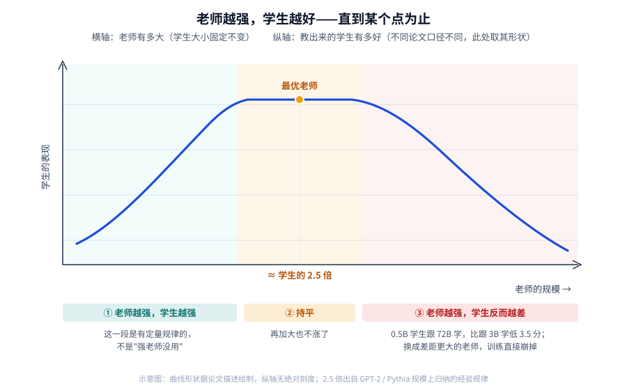

【Agentic RL】接受了强化学习的老师再传授给学生——为啥大家都这么干？

━━━━━━━━━━━━━━━━━━━━

◆ 一个顺理成章的念头

━━━━━━━━━━━━━━━━━━━━

284 期（ https://mp.weixin.qq.com/s/zHnVU5JG6ADr4WWyJrWwJw ）讲了一件事：现在的大模型后训练，是先分头练出一批各有所长的专家，再用在线蒸馏（on-policy distillation，OPD）把它们合并成一个模型。Kimi K3 是九位老师，DeepSeek V4 超过十位。

写完之后我心里冒出一个特别顺理成章的念头：

**既然是找老师来教，那老师当然是越强越好吧？**

自家练出来的专家，能力总归有限。外面明明有更强的模型摆在那儿——干嘛不请个更厉害的来教？

这个念头看着无懈可击。而且它背后是我们对"教学"这件事最朴素的直觉：**名师出高徒。**

结果我去翻论文，发现这件事上有一个做得很干净的对照实验，结论是反的。

━━━━━━━━━━━━━━━━━━━━

◆ 那个对照实验：换了个更强的老师，学生崩了

━━━━━━━━━━━━━━━━━━━━

小米和北大有一篇论文，做的正是 284 期讲的那套多老师蒸馏。他们顺手做了一个消融实验，控制得很干净。

原本的设置是：学生是 Qwen3-30B-A3B，各领域的老师都是**从这个学生自己身上强化学习练出来的**——数学老师、指令遵循老师、软件工程老师，都是同一个模型的分身。

实验只改一处：**把数学老师换成 Qwen3-235B-A22B**，一个大得多、数学能力明显更强的外部模型。其余全部不动——另外两位老师不变，数据不变，超参不变。

论文的原话是：

> 尽管 Qwen3-235B-A22B 的绝对数学能力显著更强，**学生的数学性能在两种损失形式下都退化了。**

不是提升变小，是**退化**。

而且崩得挺难看。论文给了三个数字：

- **师生之间每个 token 的初始 KL 散度，约 0.19，是同源设置（约 0.04）的五倍**——两边说话的方式差太远了；
- 一种损失形式下，数学准确率一路往下掉，**模型输出的熵从 0.30 收缩到 0.21**；
- 另一种形式更惨，**大约在第 18 步训练直接发散**，KL 和熵剧烈震荡，完全失去优化稳定性。

第 18 步。这已经不叫效果不好，这叫训练崩了。

那个五倍的差距，让我想起"人和黑猩猩的基因只差百分之几"那种句式——**差得不多，但差的那点决定了能不能对上话。**

**教人这件事，来教的那个得是个人。** 换成猩猩不行，换成外星人也不行。不是它们不够聪明，是压根说不到一块儿去。

━━━━━━━━━━━━━━━━━━━━

◆ 为什么会这样：学生一直在挨骂

━━━━━━━━━━━━━━━━━━━━

论文对机制的解释只有一句，但这句话是全篇的题眼：

> 学生的策略收窄成单一模式，**因为它从老师的低概率区域收到的大多是惩罚性的梯度信号。**

翻译成人话。

284 期讲过，在线蒸馏是**让学生自己答题，老师在学生写出来的东西上批注**。每个字的奖励是这么算的：老师给这个字的概率，除以学生给这个字的概率，取对数。老师比你更看好，往上推；你比老师更看好，往下压。

现在问题来了：**学生自己写出来的那些字，在那个 235B 老师眼里，概率普遍很低。**

不是因为写错了，是因为**两个模型说话的方式本来就不一样**。同一道数学题，30B 习惯这么开头，235B 习惯那么开头，都对，但不是一回事。

于是学生写下的很多字，都落在老师的低概率区域里。那个比值算出来大多是惩罚信号——**学生一路写，一路挨骂。**

挨骂多了会怎样？**它不敢说话了。**

熵从 0.30 掉到 0.21 就是这个意思：不是字数简单变少了，而是模型下一步的概率分布越来越尖、选择越来越单一，把自己缩成一条窄路。它没学会老师的本事，只学会了闭嘴。

**这跟一个特别强的老师带一个跟不上的学生，是同一个画面。** 老师讲的每一步都对，但学生跟不上节奏，交上去的作业每次都被划得满篇红叉。划到最后，学生不是学会了，是不敢下笔了。

━━━━━━━━━━━━━━━━━━━━

◆ 这不是新鲜事，它有个名字

━━━━━━━━━━━━━━━━━━━━

我原以为这是大模型时代的新发现，查了才知道，这件事在深度学习圈里被研究了快十年，还有个正经名字：**能力鸿沟（capacity gap）**。

2019 年有篇论文标题就叫 **Improved Knowledge Distillation via Teacher Assistant**（用助教改进知识蒸馏），摘要里那句话说得非常直白：

> 我们证明，**当师生之间差距很大时，学生网络的性能会下降。给定一个固定的学生网络，你不能用一个任意大的老师**——换句话说，一个老师只能把知识有效地传给某个尺寸以上的学生，再小就不行了。

它开的方子也很朴素：**中间加个助教**。先让大老师教一个中等个头的助教，再让助教去教小学生。一步跨不过去，就分两步走。

到了语言模型时代，这件事被重新验证了不止一次。2023 年一篇 ACL 论文干脆给它起了个更狠的名字——**能力鸿沟之咒**，并且总结出这么一条：

> 更好的学生，常常来自一个**规模相对较小**的老师，而不是更大的那个。

而 2025 年一篇专门研究小模型的论文，给出了实打实的数字。

⚠️ 先说清楚它跟前面小米那个实验不是一回事：小米那套是**在线蒸馏**——学生自己答题，老师在学生写的东西上逐字批注；这篇走的是更常见的路子——**让老师把解题过程写出来，当作训练数据去微调学生**，学生照着老师的范文学。两条路都要跨过师生之间那道沟，观察到的现象能互相印证，但机制不同，别读串了。

────────────────────

💡 那 R1 蒸馏出来的那批小模型，怎么没崩

去年 DeepSeek 发 R1 的时候，顺手用它蒸了一批 Qwen 和 Llama 的小模型，效果相当好。既然强老师会把学生教废，那批模型怎么活下来的？

**因为走的是两条不同的路，不能把小米实验里的崩法直接搬过去。**

R1 那批走的是刚才说的第二条：**拿 R1 生成的解题数据去做监督微调（supervised fine-tuning，SFT）**，学生照着范文学。学生不先生成自己的轨迹，老师也不在那条轨迹上逐 token 给正负奖励，所以**没有小米实验里那条闭环惩罚回路**。

而小米那套是在线蒸馏：学生先自己写，老师再逐字批注。**惩罚回路就在这儿**——学生写出来的东西在强老师眼里概率极低，每个字都在挨罚。

但这不等于监督微调就没有代价。下面这两张表测的恰恰是这条路：训练跑完了，**分数却更低**。

**两种失败长得不一样：在线蒸馏是当场崩掉，监督微调是正常跑完、悄悄变差。** 两者都跟师生差距有关，但机制不是一回事。

**而且 R1 那批不只是没崩，是真的有用**——这还对上了后面会讲到的另一个条件：**老师手里得有学生没有的新东西。** Qwen、Llama 那些底座模型本来就不会长链推理，R1 那 80 万条数据带来的不是"同一件事做得更熟练"，是**从不会到会**的落差。跟"老师和学生走同一条流水线就没什么新增量可给"的情况，正好相反。

────────────────────

它的实验设计很规整：**在同一个模型家族里，挑大的那个当大老师、小的那个当小老师**，让它们各自生成解题过程，再拿去教同一批学生。

Qwen 家族那组是 **Qwen2.5-72B 当大老师，Qwen2.5-3B 当小老师**；另外还做了 Llama 家族（70B 对 8B）和 Gemma 家族（27B 对 9B）。

|学生|跟 72B 学|跟 3B 学|
|---|---|---|
|Qwen2.5-0.5B|16.9|**20.4**|
|Qwen2.5-1.5B|32.2|**33.0**|

**0.5B 的学生跟着 72B 学，比跟着 3B 学还低了 3.5 分。**

论文里还有一个更极端的数字：0.5B 的学生跟大老师学之后，**在 AMC 那个基准上直接掉了 10 分以上**。

同一篇论文还测了另一个维度：让小模型学长篇的解题过程，还是学简短的。

长的那份由 **QwQ-32B-Preview** 生成。这是阿里 2024 年底放出来的推理专项模型，名字是"会提问的 Qwen"的缩写，属于国内最早对标 OpenAI o1 那一批——它的特点就是答题前先长篇自言自语，反复推敲、自我质疑、走回头路，把整个思考过程都打出来。论文对"长解法"的定义也扣着这一点：不只是更长，**还带着更复杂的反思**。

短的那份由 **Qwen2.5-32B-Instruct** 生成，同样是 32B。**两个老师一样大，区别只在讲得细不细。**

|学生|学长的|学短的|
|---|---|---|
|Qwen2.5-0.5B|14.8|**19.5**|
|Qwen2.5-1.5B|27.0|**34.2**|
|Qwen2.5-3B|40.3|**43.4**|

**1.5B 的学生学长解法，比学短解法低了 7.1 分。**

老师想得越深、讲得越细，小学生反而学得越差。

────────────────────

💡 但这里有条分界线

同一篇论文也指出：**在它测试的 Qwen 和 Llama 系列里，7B 及以上的学生开始能从长解法或强老师身上获益。**

还是那个 72B 老师，跟 3B 老师相比，教 Qwen 7B、14B、32B 的平均增益分别是 **6.6、3.0、6.5 分**；其中 32B 学生在 AIME 上高出 **16.7 分**。

**同一位老师，教 32B 在 AIME 上高 16.7 分，教 0.5B 在 AMC 上反而低 12.5 分。**

所以这不是"强老师普遍有害"，是**有一条尺寸门槛**。门槛以下，强老师帮倒忙；门槛以上，强老师才是好事。

这条边界很重要，下一节还要用到。

────────────────────

门槛这件事说完了，接着得处理一个更容易走偏的方向。

━━━━━━━━━━━━━━━━━━━━

◆ 别急着下结论：它其实是条倒 U 形曲线

━━━━━━━━━━━━━━━━━━━━

讲到这儿容易走向另一个极端：那是不是老师越弱越好？

当然不是。苹果公司 2025 年有一篇六十多页的 **Distillation Scaling Laws**（蒸馏缩放律），把这件事的形状说得最准。它的结论是：

> 学生的损失是老师交叉熵的幂律函数……**交叉熵更低的老师，通常会产生交叉熵更低的学生——直到能力鸿沟出现为止。**

这句话得分成两半读。前半句是"老师越强学生越强"，**这在很大一段范围内是成立的，而且有定量规律**；后半句才是转折：**过了某个点，关系反转。**

所以真实的形状是一条**倒 U 形曲线**：老师从弱变强，学生一路受益；越过最优点之后，老师继续变强，学生开始变差。

**存在一个"最优老师尺寸"。**

⚠️ 这一节和前面几节不是一个战场，得先钉清楚：**这里研究的是传统的知识蒸馏（knowledge distillation，KD），不是前面那种"学生自己写、老师逐字批注"的在线蒸馏。** 它能说明"老师越强越好"不是普遍规律，但下面那条尺寸公式不能直接套到 K3 或 V4 上。

不过苹果那篇还专门提醒：更底层的变量是师生的**学习能力差**，既包括能表示什么，也包括能不能把目标优化出来；参数量只是其中一种特殊情况，老师训练了多少数据、最后的 loss 是多少，也会移动那个最优点。

那这个最优点在哪儿？

有一篇论文专门去找这条规律，实验是拿 GPT-2 和 Pythia 两个系列，把老师按不同比例结构化剪枝成学生，再反复蒸馏。它记录的现象和上面那条曲线一致：**固定学生的大小、把老师一点点加大，性能会先提升，然后持平，最后恶化。**

然后他们把最优点拟合成了一条式子，论文里郑重其事地标成"定律一"：

**最优老师的规模 ≈ 学生规模 × 2.5**

论文换了个说法：相当于从老师身上剪掉大约 60% 再蒸给学生，这个比例在不同模型架构、不同数据规模下都挺稳。

这条规律的实用价值在于**缩小搜索范围**：本来要确定最优老师，得拿一堆不同尺寸的老师挨个蒸一遍试出来，开销很大；在它的实验范围内，可以先拿学生尺寸乘 2.5 当候选点。

⚠️ 得说明这条定律的实验范围：它是在 GPT-2、Pythia 这类模型上归纳出来的，规模比今天动辄几百 B 的模型小很多。拿它当量级参考可以，别当成能外推到任意规模的铁律。

━━━━━━━━━━━━━━━━━━━━

◆ 更要紧的一问：真正起作用的到底是什么

━━━━━━━━━━━━━━━━━━━━

到这里为止，故事还是围着"参数量"转的：老师太大，学生跟不上。

但有一篇 2026 年 4 月的论文，把这个解释往下挖了一层，而且它的结论**表面上跟前面那个实验是反的**。

那篇专门研究在线蒸馏，做了一组对照，而且对照设计得极干净——**两位老师是同一个模型，区别只在于其中一个多训了一段。**

具体说：学生是 1.5B，两位老师都是 7B。

- 老师甲：跟学生同一条流水线出来的那个 7B —— 教学生，**提升很有限**；
- 老师乙：**拿老师甲再做一轮强化学习**得到的 —— 教同一个学生，**提升明显大得多**。

他们在两个模型家族上各做了一遍，结果一致。

**两位老师参数量一样、出身一样，唯一的区别是乙比甲多走了一段强化学习。** 而学生还没走过那一段。

这跟小米那个实验（换外部强模型就崩）不是打架吗？

**不是。它们合起来，正好指出了真正的变量。** 那篇论文给了两个条件：

**第一个条件：思维模式得对得上**（thinking-pattern consistency）。论文里的受控对照显示，老师跑分更高却不一定教得更好；反而是师生初始的高概率 token 重叠，更能把成功和失败的训练分开。成功案例里，重叠率从约 72% 升到 91% 以上；另一项统计中，双方共享的 top-k token 承载了各自约 97% 到 99% 的概率质量。

**第二个条件：老师得有新东西可教。** 论文的说法是：**分数更高，不等于有新能力可迁移。** 如果老师和学生走过的是同一段训练流水线、见过相同的数据与配方，那老师哪怕跑分高出一截，也可能带不来多少真正的增量。

而"新东西"具体指什么，那组对照给得很明确：**就是老师多走的那一段强化学习。** 学生没走过，所以那一段里学到的本事，对它来说才是真正的增量。

**把这两个条件摆出来，前面几组看似矛盾的 OPD 现象就能串起来了：**

- 小米那个 235B 老师为什么崩？按这套框架看，**首先卡在第一个条件**——初始 KL 是同源设置的五倍，两边分布差得太远；
- 老师甲为什么收效有限？**第二个条件没过好**——跟学生走的是同一条训练流水线，可迁移的新增量不多；
- 老师乙为什么增益大？**两个条件更接近同时满足**——它由老师甲继续强化学习而来，分布仍大体对得上，又多了一段学生没学过的能力。

所以至少在这篇论文研究的 OPD 设置里，决定成败的不只是"老师有多强"，还包括**老师离学生有多远，以及它手里有没有学生没见过的能力**。参数量只是前一件事的一个粗糙代理。

把这两个条件拿回去对 284 期讲的那套做法，会发现结构很像：

**那套做法里的老师，都是从与学生相同或相近的训练起点继续做领域强化学习得到的**——这跟上面那位增益更大的老师乙，是同一类构造方式。

于是它天然更容易同时靠近两个条件：起点相近，思维模式不至于隔得太远；多走的那段领域强化学习，又可能提供学生没见过的能力。

小米那篇后来还做了一轮迭代：**拿第一轮蒸出来的学生当新起点，重新训练老师，再蒸一轮。**

这一轮他们只重训了数学和指令遵循两个老师，没碰软件工程。结果是学生的归一化分数从 0.937 升到 0.986，涨的也正是那两个域。

按前面那套框架理解，每重来一轮，新老师的出发点就跟着学生往前挪一次，师生之间的距离始终没拉开。**不过这是我顺着框架推的，论文本身没做这个验证。**

时间顺序也得摆正：**这不是各家先看懂了道理才这么干的。** DeepSeek 那份报告是四月底，Kimi 是七月底，而讲清这两个条件的论文是今年四月——**大致是同时发生的两件事，一边在工程上摸到了这条路，一边在研究上给出了解释。**

━━━━━━━━━━━━━━━━━━━━

◆ 反过来的怪事：老师和学生架构一样，学生照样超过老师

━━━━━━━━━━━━━━━━━━━━

顺着上面那条思路，会冒出一个古怪的推论：如果关键不是"老师更强"，那师生一样强的时候，蒸馏还有用吗？

2018 年有篇论文就是干这个的，标题起得很有意思，叫 **Born Again Neural Networks**（重生神经网络）。做法简单粗暴：**让学生和老师用完全相同的结构、完全相同的参数量**，唯一的区别是学生跟着老师的输出学。

结果是：**学生显著超过了老师。** 而且在图像和语言两类任务上都成立。

师生的结构和参数量相同，蒸馏依然有效——**这说明蒸馏的收益，不全来自"把大模型压缩成小模型"这件事。** 但两份权重的训练状态并不相同，不能写成"能力差为零"。

那收益从哪来？

知识蒸馏最常见的解释是这样的：老师给的不是一个硬邦邦的标准答案，而是**一整片概率分布**——它同时告诉你"这个答案对"和"那几个答案也有点道理，但差一些"。这些"差一些"的信息，标准答案里是没有的。

Born Again Networks 还比较了几种蒸馏目标，结果说明老师对预测类别和非预测类别给出的概率都可能起作用。**但这些消融没有收敛成一个唯一机制**，所以这里只把现象摆出来，不拿"暗知识"三个字包办解释。

它至少给前面那个迭代提供了一个旁证：**老师与学生同构，并不会让蒸馏自动失效。** 但 Born Again Networks 用的是传统知识蒸馏，不是小米那套多老师在线蒸馏（MOPD，multi-teacher on-policy distillation），不能拿它直接解释那条迭代曲线。

两类实验放在一起，只能说明"外面找个更强的来教"并不天然占优；究竟选同构老师还是外部老师，还得看任务、分布和蒸馏目标。

━━━━━━━━━━━━━━━━━━━━

◆ 最后一条：有人指出这堆实验的对照组可能选错了

━━━━━━━━━━━━━━━━━━━━

写到这儿本来可以收尾了，但检索时翻到一篇 2026 年的论文，提了个挺尖锐的方法论问题，我觉得应该一并写出来。

它重新审视了能力鸿沟这一整套实验的常规做法，发现一个被普遍忽略的坑：

> **思维链蒸馏经常会让性能低于学生蒸馏之前的水平——而当人们只报告"蒸馏之后"的几个结果互相比较时，这个问题就被掩盖了。**

意思是：很多实验把重点放在"用大老师蒸出来的学生"和"用小老师蒸出来的学生"谁高谁低，却没有把**蒸馏前的原始学生**放在同一张主表里。于是读者看不出两边相对起点究竟是涨了还是跌了。

一旦补上这个对照，会发现一件尴尬的事：有时候两边都在跌，只是跌得多少不同。

这篇论文的结论也因此更保守：**能力鸿沟的影响，并不是在所有任务和设定下都占主导。**

它没有推翻前面那些结论，但提醒了一件事：**这个领域里，基线选在哪儿，能决定你看到什么。**

━━━━━━━━━━━━━━━━━━━━

◆ 收一下

━━━━━━━━━━━━━━━━━━━━

回到开头那个问题：**为什么各家不约而同都用"学生自己练出来的老师"，而不是去请个更强的？**

摊开这一路看到的东西，答案大概是这样：

一个很硬的工程答案是：**同源老师更容易把师生分布控制在可教的距离内，同时又能通过额外的领域强化学习制造能力增量。**

老师是从同一个 SFT 起点继续强化学习得到的，于是——**分布通常更接近**（第一个条件容易满足），**多走的那一段又可能带来学生没有的能力**（第二个条件靠领域任务和奖励信号制造）。这不是唯一可能成功的配方，但它把两项风险同时压低了。

而另外几条路，各有各的毛病：

- **去外面请个更强的**：可能带来更强能力，也可能带来过大的分布差——小米那个 235B 数学老师实验属于后者；
- **在自家找个跑分更高的**：分布可能对得上，可如果它和学生走的是同一套数据与配方，可迁移的新增量仍可能很少；
- **直接把几个专家的权重平均一下**：在小米那组实验里最省事，但归一化成绩也是几条基线中最低的。

**所以剩下的那条路，就是让老师从学生的同一个起点长出来，再回头教学生。**

再往回看这一路的其它几条：**在传统蒸馏的特定实验里，关系呈倒 U 形，最优老师尺寸随学生规模近似线性变化**；**师生结构和参数量相同时蒸馏依然可能有效**，说明它的收益不只是压缩；而这堆结论本身也还有裂缝——**有人指出不少实验漏掉了蒸馏前基线。**

━━━━━━━━━━━━━━━━━━━━

◆ 最后一个类比：这套东西像什么

━━━━━━━━━━━━━━━━━━━━

写完这一路，脑子里冒出来的对应物是**学骑车**。

刚开始肯定歪歪扭扭。前庭系统、肌肉、小脑那套学习回路，给了人学会骑车的底子——但"会骑"这条具体路径并没有预装好。光有底子不行，**那段摔摔打打的过程一步都省不掉。**

这三层，正好能对上这一路讲的东西（**下面这套对应是我自己的类比，不是论文里的说法**）：

- **基因，对应预训练。** 先给出身体、基本回路和能学会哪些东西的底子；
- **练习，对应后训练。** 在既有底子上，把某些动作练成稳定路径；
- **在线蒸馏，像学生自己骑，教练跟着每一下纠偏。**

最后一条是这个类比里最贴近在线蒸馏的地方。**人学骑车，必须自己蹬、自己晃，旁边的人才有得纠。** 你把陀螺效应讲得再透，也替代不了身体自己跑过那条反馈回路——**那个本事不在语言里。**

模型还多一条人这边没有的通道：**监督微调**。把老师写出的解题过程当成目标序列，直接用梯度更新学生。人也会看示范、背棋谱，但**背得再熟，手上功夫不会自动长出来**——人没有这个接口。

**把这两件事分清楚，前面那些现象就都对上了：**

**小米那次外部强老师，为什么会把学生教崩？** 因为在线蒸馏纠的是学生自己蹬出来的那一下。教练的标准离学生太远，大量动作收到惩罚信号，蹬到最后只剩一条窄路。

**为什么监督微调那组实验没有复现第 18 步那种崩法，却可能悄悄变差？** 因为它不走"学生采样—老师逐 token 打正负奖励"的闭环；它直接拟合老师给出的序列。论文认为，小模型可能吃不下过长、过复杂或分布相差太远的推理轨迹；后续研究还提醒，微调也可能覆盖学生原有能力。具体是哪一种占主导，现有实验没有完全分开。

**为什么师生同构，学生还能超过老师？** Born Again Networks 至少证明，同样的结构和参数量不等于蒸馏没有新增信号；老师给出的概率分布仍能改变学生的训练目标。至于它为什么超过老师，那篇论文做了多种目标消融，不能只用骑车这一个比喻盖过去。

所以最后落到一句话上：**名师出高徒这句话在这儿得打个折扣——得是能扶着你、而不是替你骑的那种名师。**

━━━━━━━━━━━━━━━━━━━━

◆ 但还有一个更前面的问题没答

━━━━━━━━━━━━━━━━━━━━

写到这儿，其实还欠着一笔账。

这一整期讨论的都是"老师该怎么选"，可它默认了一个前提：**得先分头练出一批专家，再把它们合起来。**

**那为什么非要这么绕？** 直接把所有领域的数据混在一起，训一个模型不行吗？说到底，蒸馏这一步是在把已经分开的东西重新缝上——**当初何必分开。**

我原以为这是个有标准答案的问题，去翻了一圈论文，发现事情比想象的拧巴：**有一篇做了正面对照，结果是打平，而且混合训练还更省算力；另有一篇把这套分头练的做法讲得很透，但它自己的成绩单上，是输给混合重训的。**

这条线索太长，塞进这一期会把主线搅乱。**下一期专门说。**

━━━━━━━━━━━━━━━━━━━━

◆ 参考资料

━━━━━━━━━━━━━━━━━━━━

- Ma et al., MOPD: Multi-Teacher On-Policy Distillation for Capability Integration in LLM Post-Training, arXiv:2606.30406（北大 + 小米；换用更强外部老师的消融实验出自第 4.4.2 节）
- Mirzadeh et al., Improved Knowledge Distillation via Teacher Assistant, arXiv:1902.03393（AAAI 2020；能力鸿沟与助教方案）
- Zhang et al., Lifting the Curse of Capacity Gap in Distilling Language Models, arXiv:2305.12129（ACL 2023）
- Zhang et al., Towards the Law of Capacity Gap in Distilling Language Models, arXiv:2311.07052（最优老师规模随学生线性缩放）
- Li et al., Small Models Struggle to Learn from Strong Reasoners, arXiv:2502.12143（ACL 2025 Findings；小模型可学性鸿沟，本文两张数字表出处）
- Busbridge et al., Distillation Scaling Laws, arXiv:2502.08606（ICML 2025；倒 U 形关系与最优老师）
- Li et al., Rethinking On-Policy Distillation of Large Language Models: Phenomenology, Mechanism, and Recipe, arXiv:2604.13016（thinking-pattern consistency 与新增能力两个条件）
- Furlanello et al., Born Again Neural Networks, arXiv:1805.04770（ICML 2018；师生同构下学生超越老师）
- Kajitsuka et al., Revisiting the Capacity Gap in Chain-of-Thought Distillation from a Practical Perspective, arXiv:2604.08880（基线选择的方法论批评）

━━━━━━━━━━━━━━━━━━━━

给学生换个更强却不同源的老师，学生不是学会了更多，是一路挨罚，最后把自己缩成了一条窄路。

老师有多强不是唯一变量：还得看它离学生多远，手里有没有学生没见过的东西。

名师出高徒这句话得打个折扣：得是能扶着你、而不是替你骑的那种名师。

━━━━━━━━━━━━━━━━━━━━

// 靳岩岩的 AI 学习笔记 × Claude 的严谨 × Gemini 的浪漫
// 2026年8月20日
