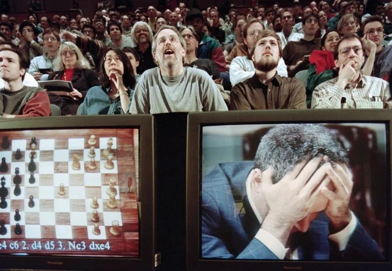

【周末杂谈】从两个机柜到一部手机——AI象棋界三十年观察

━━━━━━━━━━━━━━━━━━━━

◆ 大家都记错了那滴泪的位置

━━━━━━━━━━━━━━━━━━━━

说起“AI 打败人类”，大多数人脑子里浮现的是 2016 年：李世石对着棋盘落泪，AlphaGo 4:1。那个画面太上镜了，以至于它被当成了故事的开头。

其实那是中场。这出戏 1997 年就开演了，苏联解体前出生的老登们应该都还记得当年的新闻——深蓝 3.5:2.5 击败卡斯帕罗夫（国际象棋记分赢一盘 1 分、和棋各得 0.5，六盘里深蓝 2 胜 1 负 3 和——后面几个比分里的半分都是这么来的），人类在“自己最引以为傲的智力项目”上输给机器，到今年已经**二十九年**。

那一年也有一张跟李世石那滴泪同等分量的照片，只是被忘了：观众席前两台电视，左边一块棋盘，右边是双手抱头的世界冠军。国际象棋界不光演完了震惊、否认、防守的全过程，连“被超越之后的日子怎么过”这个售后阶段都过了二十年。

所以如果想观察别的脑力行业被机器超越后会怎样——比如眼下正轮到的数学界——象棋比围棋多了近二十年售后记录。**它不是全行业通用剧本，却是目前最长、资料最完整的一组样本。**

这期就把这三十年翻一遍。周末，当故事看。

━━━━━━━━━━━━━━━━━━━━

◆ 第一条线：赢你的机器越来越小

━━━━━━━━━━━━━━━━━━━━

先看最直观的一条线——战胜人类需要多大的机器。

**1997 年，深蓝**：IBM 的 RS/6000 SP 超级计算机，30 个节点外加 **480 颗专门为下棋定制的芯片**，占了两个机柜，峰值每秒约 2 亿个局面（论文记录的一分钟以上搜索平均约 1.26 亿）。为了赢卡斯帕罗夫，IBM 造了一台专用设备，比赛后项目很快结束。

**2006 年，Deep Fritz**：一台双核服务器，每秒约 800 万局面——按搜索节点数只有深蓝宣称峰值的二十五分之一。世界冠军克拉姆尼克迎战，第二局在均势下走出著名的“世纪大漏”：漏看一步杀，被机器将死，最终 2:4。节点口径依然不能直接当 FLOPs，但硬件规模已经从专用机柜掉到通用服务器。

**2009 年，Pocket Fritz 4**：一部 HTC Touch HD 手机。在布宜诺斯艾利斯的公开赛上 9 胜 1 和夺冠，对手包括多位特级大师，单次赛事表现分 2898。它每秒搜索不到两万个局面，和深蓝宣称的 2 亿相比差约一万倍。**不同引擎的“局面数”并非完全等价，2898 也只是这次比赛的表现分**，但一部手机跨进顶级人类区间已经是事实。

从两个机柜到一部手机，十二年。这显然不只是摩尔定律：LessWrong 上一项 hardware overhang 粗测，把 Stockfish 8 限制到老式 486-100 MHz 的计算档位，估出来大约 2850 Elo——**今天的算法回到 1994 年的家用机上，就已经摸到卡斯帕罗夫的量级**。这笔账粗，算不出精确的百分比，但方向清楚：硬件三十年涨了几个数量级，而赢人类这件事上，**大头是算法挣的**。

2020 年还有一笔账值得记：Stockfish 把 NNUE 神经网络评估塞进了**纯 CPU**，手机也能运行。计算机引擎榜上的 Stockfish 常在 3500 左右，人类 FIDE 纪录是卡尔森的 2882；**这两个 Elo 来自不同对手池，不能直接相减成六七百分**，但“顶级引擎已远强于顶级人类”这个量级没有疑问。

围棋这条线晚二十年，也出现了同样的缩小：2016 年赢李世石的 AlphaGo Lee 用 48 个 TPU；此后的 AlphaGo Master/Zero 已缩到单机 4 个 TPU。今天的 KataGo 开源、一张消费级显卡就能跑到顶尖人类之上；手机上也有内置它的应用（默认档位棋力不一，就不替它们逐个报分了）。我原来猜围棋 AI 怎么也得几十 G 显存的大卡才压得住人类——查完发现大幅高估。

━━━━━━━━━━━━━━━━━━━━

◆ 第二条线：人类的反应，三幕剧

━━━━━━━━━━━━━━━━━━━━

机器这边是条平滑的曲线，人这边是三幕剧。

**第一幕：否认。** 1997 年输棋后，卡斯帕罗夫公开指控 IBM 可能让人类大师介入，尤其怀疑第二局那些“不像机器”的选择。他要求看到更完整的运行记录并提出重赛，IBM 没有接受重赛，深蓝项目随后结束。第二年，他又创办了人机协作的 advanced chess（高级象棋）。两件事都有案可查，连线是我连的：**同一个“人类判断 + 机器计算”的组合，头一年当了他指控的对象，第二年成了他发明的赛制——指控和发明，是同一个信念的两次出场。** 2017 年《深度思考》里，他终于写下“I was wrong and owe the Deep Blue team an apology”；同年的 TED 演讲则把故事转向“机器赢了，人类不必输”。从指控到书面道歉，整整二十年。

**第二幕：防守。** 引擎强过人类之后，问题立刻反转：不再是“机器会不会作弊”，而是“**人会不会用机器作弊**”。2006 年世界冠军赛就爆出“厕所门”——托帕洛夫阵营指控克拉姆尼克上厕所太频繁，暗示他在隔间里查引擎，闹到组委会把他的专用洗手间封了，他抗议拒赛一局被判负（最后还是赢了冠军；讽刺的是事后被国际棋联道德委员会制裁的是**指控方**）。

之后的实锤案子越来越有时代感：2010 年法国那起是三人接力——场外一人看引擎，短信把着法编码成电话号码发给队长，队长再用**站位当暗号**传给场上棋手，工程量堪比谍战片；到 2019 年，一位 58 岁的特级大师直接在厕所隔间里刷手机被逮个正着。**作弊手段越来越懒，因为引擎越来越随手。**

于是今天的重要比赛会按风险等级采用电子设备检查、限制通信和洗手间管理；欧洲反作弊规则还要求部分赛事把网络转播延迟 15 分钟。布法罗大学的 Kenneth Regan 则长期为 FIDE 和赛事方提供统计分析：估计某等级分棋手下出一组引擎式着法的概率，异常了再进入人工调查（不是每场比赛都开齐全套，报警也只是启动调查，不是定罪）。

看明白这套基建在干什么了吗？**比赛证明的东西，悄悄换了**。以前一场比赛证明“我会下棋”；现在证明的是“**我没联网**”。人类组成了一个需要安检来维持的保护区。

**第三幕：改行——然后繁荣。**

被机器超越快三十年，国际象棋死了吗？**恰恰相反，至少线上参与正处在历史高位。** Chess.com 在 2025 年突破两亿注册账户，官方年度回顾称当年用户对局超过 60 亿盘；《后翼弃兵》、疫情居家和直播生态共同推高了这一轮热潮。在世特级大师则从 1993 年的约 524 人，涨到今天的近 1900 人（FIDE 数据库口径）。一个可追溯约一千五百年的项目，最热闹的年头出现在被机器碾压之后——这本身就够说明问题。

引擎从敌人变成了大众训练工具——今天学棋的人几乎都能低成本获得分析和陪练。与此同时，最年轻特级大师纪录从菲舍尔时代的 15 岁，一路压到 2021 年 Abhimanyu Mishra 的 **12 岁 4 个月 25 天**；2024 年，18 岁的 Gukesh 成为最年轻的无争议世界冠军，改写了卡斯帕罗夫 1985 年留下的纪录（参赛人口和网络教育当然也出了力，但那个口袋里的陪练是这一代神童独有的配置）。

不过这里藏着一个安静的数字：卡斯帕罗夫 1999 年的峰值等级分 2851，卡尔森 2014 年推到 2882，此后纪录没有再提高。等级分是同代人之间的相对分，不能直接当绝对棋力时钟。研究确实发现，接触更强棋类软件能改善人的着法质量，而且对较弱棋手帮助更大——某种“拉平赛场”的效果。所以 2882 没破更可能不是顶尖停滞，而是**水涨了，露出水面的那截反而矮了**（这是个说得通的读法，不是这两个数字能单独证明的事）。

━━━━━━━━━━━━━━━━━━━━

◆ 一段插曲，不太中听

━━━━━━━━━━━━━━━━━━━━

被机器超越之后，人类想出过一个体面的中间方案：**人机组队**，术语叫“高级象棋”或“半人马棋”——人出战略，机器出计算。发起人正是卡斯帕罗夫本人，1998 年——第一幕里那个信念，换了身正装出场。这个模式确实辉煌过：2005 年 PAL/CSS 自由式比赛上，两位等级分只有 1685 和 1398 的业余棋手带着三台电脑夺冠，击败了多支特级大师领衔的人机队，也压过了参赛的强引擎。卡斯帕罗夫后来把这类结果概括成：弱人类 + 机器 + 好流程，可以胜过强人类 + 机器 + 差流程。

然后呢？半人马棋没有讣告，也没有明确的死亡日期——大型自由式赛事后来就那么淡出了主流。回看 2005 到 2008 年赛事的研究确认，当年人机队确实领先过纯人和纯机器；近年的建模研究给出了更细的账：高手有时能找到自己相对机器的少数优势，但**这种增益很小，而且很快饱和**。窗口是真存在过，也真的在关上。

今天很多行业都在讲“AI 不会取代你，会用 AI 的人才会取代你”。象棋界能提供的提醒不是“十九年后人机协作必死”，而是：**协作优势有窗口期，也有边界。** 当机器继续变强，人类的价值会从“替机器纠错”转向选目标、设计流程、解释结果；哪一层还能保留多久，不能靠一句口号保证。

━━━━━━━━━━━━━━━━━━━━

◆ 收尾：这面镜子现在照着谁

━━━━━━━━━━━━━━━━━━━━

把三十年压成一段：机器从两个机柜缩到一部手机；人类从指控作弊、修反作弊墙、试人机组队，一路走到“明知机器更强，仍然观看人类彼此比赛”。行业没有因此消失，线上参与反而创下新高。**被超越不一定是死刑，更可能逼着项目重新回答：观众究竟为什么来看。** 象棋提供了一份完整案例，但不是所有行业的预言书。

现在，请把镜子转向正在被 AI 证明定理的数学界，欣赏一下台词的复刻程度。

“AI 不理解数学，它只是在做统计。”——这句话的姿势，和 1997 年“深蓝背后一定藏着人类大师”是同一个：结果摆在那儿动不了，就去质疑产生结果的方式。要分账的话：“理解”是个可以慢慢吵的哲学问题，**但它取消不了已经通过验证的定理**——拿它当理由不看结果，就是把哲学当了盾牌。当年那位好歹二十年后写下了“I was wrong”；按这个时间表，2045 年前后我们应该能读到第一批《我错了：论我当年为什么说 AI 不理解数学》。

还有个讲究点的说法：AI 的证明是“生肉”，得由数学家“消化”了才算数。公平地说，消化是真成本——解释、连接、放进已有理论让别人能复用，这些活儿不是盖章仪式。**但看清楚护城河正在怎么搬家**：证明的生成和形式验证越来越便宜，声望就从“谁先吐出证明”迁往“谁能解释和采用它”——而 AI 也在朝着搬进去的那几间房排队。消化权今天是真手艺，明天未必是人类专营；把它当永久产权，就是象棋界当年把“人类才会下棋”当永久产权的翻版。

象棋的档案里确实有好消息：机器碾压人类以后，参与人数、对局量和特级大师数量仍在增长，孩子取得顶级成绩的年龄也不断下降。**这不能证明数学必然复制同一条曲线，却足以推翻“机器超过人类，项目就会死亡”的直觉。** 象棋用了二十年才从指控走到书面道歉；数学界不必照抄最慢的那一幕。

━━━━━━━━━━━━━━━━━━━━

◆ 散场彩蛋 .hack//SIGN：人类赢回来过一次

━━━━━━━━━━━━━━━━━━━━

正文到此为止，散场前补一条令人开心的消息——来自隔壁围棋馆。

2023 年，一位美国业余高段棋手在不借助程序的对局中，**15 局赢了 14 局**，击败超人水平的 KataGo 配置。他不是突然悟道了——FAR AI 先训练出专门攻击固定 KataGo 的对抗程序：约一百万局自对弈就练成了，**不到 KataGo 自己训练局数的 2%**。后来的人工打法利用的是一类 cyclic attack（循环包围攻击）：诱导 AI 错判巨大环状棋块，直到局面已经不可收拾仍高估自己的胜率。研究者把这套模式教给人类，人类照方抓药。

最有意思的细节是：那个对抗程序**本身会输给业余棋手**。它不是整体更会下棋，而是专门学会了利用特定对手。这个故事还没完：KataGo 加入针对性训练后，2024 年的后续研究又训练出新的循环攻击，打穿了更新后的网络——**防得住上一个漏洞，防不住“找漏洞”这件事本身。**

所以人类在保护区里赢回来的这一局，赢法不是棋艺，是**渗透测试**。被超越之后，人类智力的新岗位说明书大概就这一行：**别跟它比算，去摸它的墙。**

━━━━━━━━━━━━━━━━━━━━

◆ 参考资料

━━━━━━━━━━━━━━━━━━━━

- Hsu, F.-H., IBM's Deep Blue Chess Grandmaster Chips, IEEE Micro, 1999（深蓝硬件规格）
- hippke, Measuring Hardware Overhang, LessWrong, 2020（Stockfish 8 在 1994 年 486 档位的粗略强度估计）
- Kasparov, G., Deep Thinking, 2017（卡斯帕罗夫对 1997 年指控的公开修正）
- ChessBase, Dark horse ZackS wins Freestyle Chess Tournament, 2005（两位业余棋手的人机协作夺冠）
- Shoresh and Loewenstein, Modeling the Centaur: Human-Machine Synergy in Sequential Decision Making, arXiv:2412.18593（半人马棋的人类相对优势与饱和）
- Wang, T. T. et al., Adversarial Policies Beat Superhuman Go AIs, ICML 2023, arXiv:2211.00241（循环杀漏洞与人类反杀）
- Tseng, T. et al., Can Go AIs Be Adversarially Robust?, arXiv:2406.12843（补丁被新攻击再次打穿）
- Stockfish Team, Introducing NNUE Evaluation, 2020（神经网络进纯 CPU）
- Chess.com, Chess Stats / 2025 Board Reports（注册账户与年度对局量）
- ChessBase, Chess Statistics Today, 2025（1993—2025 特级大师数量）
- Tao, T., Terence Tao on AI — a living summary, 2026（证明生成、验证与消化）

━━━━━━━━━━━━━━━━━━━━

战胜人类的机器从两个机柜缩到一部手机用了十二年；粗测甚至让现代算法在 1994 年家用机档位摸到卡斯帕罗夫级别——软件进步远比“硬件变快”四个字更重。

比赛证明的东西悄悄换了：从“我会下棋”变成“我没联网”——人类组是一个需要安检来维持的保护区。

被超越不是死刑，是改行；象棋留下了一份三十年样本——机器会赢，但人类项目未必因此死亡。

━━━━━━━━━━━━━━━━━━━━

// 靳岩岩的 AI 学习笔记 × Claude 的严谨 × Gemini 的浪漫
// 2026年8月23日
