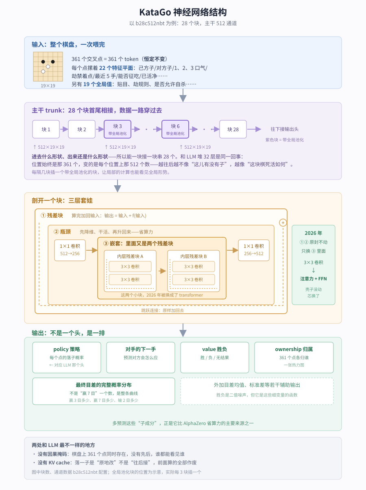

【KataGo】围棋 AI 的神经网络，和 LLM 差在哪儿

━━━━━━━━━━━━━━━━━━━━

◆ 顶配也只有 0.23B

━━━━━━━━━━━━━━━━━━━━

288 期 https://mp.weixin.qq.com/s/aT1wn5jsGvNRPl6ic7WRyg 翻了三十年象棋界的账，末尾提到围棋这条线晚二十年、今天一张消费级显卡就能跑到顶尖人类之上。写完我自己留了个疑问：**那个网络到底长什么样？**

带着 LLM 的印象去查，第一个数字就把我打住了。

KataGo 公开分布式主训练线目前最强的卷积网络叫 `b40c768nbt`，权重文件 823 MiB。我把配置读出来数了一遍参数——**2.3 亿，也就是 0.23B**。次一档的 `b28c512nbt` 是 0.073B，再往下 `b18c384nbt` 只有 0.026B。新发布的 transformer 网络在同等算力下已经更强，但体量同样远低于 1B。

习惯了 LLM 那套记法的话，这几个数得愣一下：**它整条产品线全在 1B 以下**。我们平时说“小模型”指的是 1.7B、7B 这些，KataGo 顶配还不到其中最小那档的六分之一。而它在围棋上早就不跟人类比了。

我是从 LLM 开始学的，熟悉注意力、KV cache、上下文长度，但对更早那段机器学习的历史几乎一无所知——**倒着往回走的路径**。这两年入门的人多半都这样，而且不学也照样干活，LLM 已经是个自足的世界了。

但那些东西没有过时，只是不在这条路上。而 KataGo 恰好是个好对照物：它 2026 年也换上了 transformer，**换法却和 LLM 完全不是一回事**。

这期就顺着“和 LLM 差在哪儿”这一条线走一遍。至于围棋专属的那些精巧设计，我还没读明白，留着以后学。

> 材料来源：仓库 github.com/lightvector/KataGo （作者 David J. Wu，MIT 协议），论文 arXiv:1902.10565。参数量是我自己建模型数出来的，官方没有现成的表；权重体积是从官方下载站的 HTTP 响应头读的实际字节数。

━━━━━━━━━━━━━━━━━━━━

◆ 差异一：一个 token 是一个交叉点，19 路棋盘固定 361 个

━━━━━━━━━━━━━━━━━━━━

LLM 里 token 是词或子词，一句话切成几十个。序列长度是变量，这几年整个行业都在拼命把它拉长。

KataGo 里，**一个交叉点就是一个 token**。按这篇讨论的 19 路棋盘算，19×19 = 361 个。代码里这行写得直白（`model_pytorch.py`）：

```python
seq_len = height * width
```

序列长度就是棋盘面积。KataGo 也支持别的棋盘尺寸，所以跨尺寸并非永远 361；但在一盘 19 路棋里，**它始终是一个常数**。没有“上下文窗口”这个概念，下到第 200 手和第 3 手，喂进去的都是 361 个位置。

LLM 那边也说自己无状态，但它每次的输入越来越长：写到第 100 个词，得把前面 99 个一起带上。KataGo 的网络不用带完整棋谱，因为**当前局面加上劫、最近几手等特征，已经足够评估盘面**；完整的合法着判定仍由引擎结合规则和历史负责。

那落子之后变的是什么？**是格子里的值，不是格子的个数。**

一句话记：**LLM 是往后接，序列变长、前面不动；KataGo 是原地改，序列不变、格子里的数变了。**

这里得澄清一件我一开始没想明白的事：**你没法给这个网络“输入一步棋”。** 它不认识“一步棋”这个概念。

**落子是引擎干的，不是网络。** C++ 那边维护着棋盘对象，你调 `playMove(黑, D4)`，它更新自己的数据结构：放子、重算气、提掉死子——普通的围棋规则代码，跟神经网络没关系。然后**引擎给当前局面拍一张照片**，摊成一个 22×19×19 的数组，整张喂给网络。

```
引擎落子 → 更新棋盘 → 重新拍照 → 整张照片喂进网络 → 拿到判断
```

**每走一步都是整张重喂一遍**，不是追加点什么。网络本身不保存上一轮状态——它不记得刚才算过什么。

━━━━━━━━━━━━━━━━━━━━

◆ 差异二：历史不在序列里，画在“照片”上

━━━━━━━━━━━━━━━━━━━━

那 22 个平面是什么？每个交叉点上摞着的一叠信息。我照代码列了一遍：

每个平面问的都是同一种问题：**“这个点，是不是……？”** 是就填 1，不是就填 0。

|通道|这个点是不是……|
|---|---|
|0|在棋盘上|
|1, 2|我方的子 / 对方的子|
|3, 4, 5|所属的这块棋只剩 **1 口气 / 2 口气 / 3 口气**|
|6|因为劫或超级劫而禁着的点|
|7, 8|续弈阶段使用的特殊劫信息 / 保留位|
|9–13|**上一手 / 上上手 / …… / 五手前**刚落下的那颗子|
|14–17|和征子有关的四种判定|
|18, 19|按当前规则估算的我方 / 对方区域|
|20, 21|续弈阶段开始时就在的棋子|

另有 19 个全局值（贴目、采用哪套劫规则、是否允许自杀等），不属于任何具体位置，整盘共用。它们走的路也不一样：**22 个平面进主干、一层层穿过去；19 个全局值经过一次线性投影，变成一组偏置加到主干上**——有点像塞在最前面的一段系统提示词，不占位置，但后面每一步都受它影响。空间平面约 31 KB（22×19×19 个 float，每格 4 字节），再加 19 个全局值。

这张表里有两处，跟 LLM 对照着看挺有意思。

**一是全用开关，不用数值。** 气就是典型：它不存“这块棋有几口气”，而是拿三个平面分别问“是不是只剩 1 口气 / 2 口气 / 3 口气”，**4 口气以上干脆不问**——3 气以内才算紧急。这种“只记要紧那几档”的二值编码，比塞一个连续数字更好学。

**二是网络输入只留最近 5 手，更早的历史不画进特征平面。** 当前局面加上最近几手和劫，足够让网络评估盘面；超级劫等合法性判断仍由引擎保留更长历史。这 5 手也不是排成序列，是各画进一个平面：那 5 颗子现在都还在盘上、1、2 号平面早标出来了，但盘上一百颗子长得一样，网络分不出哪颗是刚落的。于是 9 号专门问“上一手是不是落在这个点”，整张 361 格里只有一个 1。**LLM 靠序列顺序表达“谁先谁后”，还得把整段历史都带着；KataGo 的网络只画 5 步，而且拿平面存、不排序列。**

（也正因为要靠这些平面补历史和劫，更长的规则历史还得由引擎保管，所以“棋盘就是完整状态”只能当直觉，不能当严格定义。）

────────────────────

💡 三个围棋词，够看完这篇了

**气**（liberty）：一块棋周围紧挨着的空点数。**气全被堵死，这块棋就被提走。** 一块棋是否立即被提，规则判据就是还有没有气；更大的“死活”问题还会牵涉眼、劫和双活。

**劫**（ko）：盘上出现一个双方可以反复提来提去的点，最简单的劫规则禁止立刻提回，更长的循环则由不同规则分别处理。**于是棋盘另一头的一手棋，能决定这里的归属。** 这就是围棋著名的非局部性。

**征吃**（ladder）：一路追打的手段，像下楼梯一样把对方逼向边缘。它成不成立，**取决于棋盘另一头斜线上有没有接应的子**。英文叫“梯子”，画出来确实是斜着下楼梯的形状。

括号里是代码和论文里的用词，想翻仓库按这几个搜就对了。顺带一个小发现：英语里 liberty、ladder 用本族词描述，ko、komi 则直接借了日语，因为这套术语是经日本传到西方的。

────────────────────

输入的形状说完了，接下来看这些数据进去之后要穿过什么。

━━━━━━━━━━━━━━━━━━━━

◆ 差异三：主干上套着一层卷积时代的壳子

━━━━━━━━━━━━━━━━━━━━

数据穿过网络的方式，和 LLM 是一样的：**块 1 → 块 2 → …… → 输出头，串行走一遍，块就是层。**



能这么串的前提是形状不变：进块之前 512×19×19，块内部临时压到 256，出来还是 512×19×19。LLM 也靠这个前提堆层——4096 维进去、4096 维出来。

穿过一层什么变了？**位置没变，位置上的数变了。** 越往后，这些数越不像“这儿有没有子”，越像“这块棋死活如何”。和 LLM 一样：浅层还贴着字面意思，深层已经是抽象语义了。

不一样的地方在**块内部的形状**。KataGo 的块叫 nested bottleneck residual block，从外往里三层：

**① 残差块**——算完加回输入，`输出 = 输入 + f(输入)`。

**② 瓶颈**——先把 512 通道压到 256，在低维上干活，干完再升回 512。负责压和升的零件写作“1×1 卷积”，**其实就是投影矩阵**：把每个位置上那个 512 维向量乘一个 512×256 的矩阵，361 个位置各乘各的，位置之间不混合。你在 LLM 里见的 `W_q`、FFN 升降维矩阵，做的是同一件事——**换成卷积网的写法就叫 1×1 卷积**。

**③ 嵌套**——中间那层是 KataGo 2023 年自己加的。标准瓶颈中间只放一个 3×3 卷积，作者试下来发现不划算：为了省那一次，前后各加一个投影矩阵，等于花两笔钱省一笔钱。放两个才回本，放三四个更划算。而到了四个的时候，官方文档里的原话是：

> 有了四个 3×3 卷积，很自然就会把它们两两配对、各自加上跳跃连接，变成它们自己的残差块。

**于是残差块里面又长出了残差块。** 这就是 nested。

型号名到这儿能读了：**b = 块数，c = 通道数，nbt = nested bottleneck**。`b28c512nbt` 就是 28 个嵌套瓶颈块、主干 512 通道。

那 3×3 卷积在干什么？它同时看当前位置和周围 8 个邻居，把 9 个向量加权求和，然后窗口滑到下一个位置，**用同一套权重再算一遍**。这一步 LLM 里没有对应物——**LLM 靠注意力混合位置之间的信息，卷积网靠 3×3**。

（卷积本身值得单开一期，这篇先按“它负责混合邻居信息”用着。）

────────────────────

💡 它和你印象里的卷积网络不一样：全程不缩小

搜“卷积神经网络”，多半会看到这么一条流水线：

```
224×224 →卷积→池化→ 112×112 → … → 拉平 → 线性层 → 猫/狗
```

**分辨率一路缩小、通道一路变多**。池化就是干缩小这件事的：2×2 池化把 4 个数压成 1 个，没有参数，纯粹是降采样。

KataGo 不长这样，它**从头到尾 19×19，一次都不缩**。原因在任务：分类最后只要一个答案，空间信息丢了无所谓；KataGo 要给出**每个交叉点的落子概率、每个交叉点归谁**——361 个位置各要一个答案，中途缩成 10×10 就还不回来了。**是任务形状决定网络形状。**

顺带说，围棋 AI 用卷积，源头就是照搬识别猫狗那套：

```
一张彩色图片 =  3 个平面 × 高 × 宽    红、绿、蓝
一个围棋局面 = 22 个平面 × 19 × 19    有没有子、几口气、能不能征吃……
```

形状一模一样，只是通道的含义从颜色换成了棋理。倒也谈不上慧眼独具——**2015 年前后，卷积就是处理二维网格最成熟的工具**。站在今天回头看每一代的技术选择，多半都是这样：不是从一堆方案里挑了最好的，是当时手上只有这个。

────────────────────

而十年之后，手上有的东西变了。

━━━━━━━━━━━━━━━━━━━━

◆ 2026 年：壳子没动，芯换了

━━━━━━━━━━━━━━━━━━━━

KataGo 的 Python 训练端此前已有实验性 transformer 支持，v1.17.0 则第一次让正式 C++ 引擎的主要后端都能运行它；主训练线准备在贡献者完成升级后切过去。但**换法很克制**——代码里那个类叫 `NestedBottleneckTransformerBlock`，注释第一句就说明白了：

> 结构：1×1 卷积（c_main → c_mid）→ N 个 transformer 块 → 1×1 卷积（c_mid → c_main）+ 残差
> 这个结构照搬 NestedBottleneckResBlock，只是把内层的卷积残差块换成了 transformer 块。

上一节那个三层套娃，**外面两层原封不动**，变的只有最里面那层：几个 3×3 卷积换成了几个 transformer 块。

用 LLM 的语言把 master 配置里那个尚未发布的 `b13c1024h16nbttflrs` 重述一遍：

```
361 个 token（棋盘上的 361 个交叉点）
主干宽度 1024
13 个大块，每块内部：
    降到 512 维 → 2 个标准 transformer 块（注意力 + FFN）→ 升回 1024，加残差
最后接一排输出头
```

摊平了数，**13 块 × 每块 2 个 = 26 个 transformer 块**，层数落在中小型语言模型的区间里。配置文件里那几行你也认识：

```python
"trunk_num_channels": 1024,
"transformer_ffn_channels": 1536,
"transformer_heads": 16,
```

注意力头、FFN 宽度——和你读 LLM 配置时看到的一模一样。这一层确实就是标准 transformer 块：多头注意力 + 前馈网络，各带残差和归一化。

把这块的尺寸摊开：主干 1024 维，进块后降到 512，注意力就在这 512 维上算，切成 **16 个头、每头 32 维**（名字里的 `h16` 就是这个）。参数量 **1.03 亿**——比最大的那个卷积网（2.33 亿）少了一半多，而官方已放出的几个小号 transformer，每次评估的棋力已超过卷积主线最强的 b18 档，速度相当或更快。

换了芯参数反而变少，账在这儿：**两种网络花参数买的东西不一样。** 卷积的参数在买视野——一层 3×3 只把视野往外扩一圈，想让左上角看见右下角就得堆几十层，b40c768 光内层卷积就吃掉两个亿，而且每层的混合模式印死在权重里，对所有局面都用同一套。注意力的参数只买“提问方式”——一层就看全盘，那张“谁看谁多少”的 361×361 混合表**不存在参数里，是每次前向拿 Q·K 现算的**，参数只存怎么提问（W_q）、怎么应答（W_k）。一句话：**卷积把混合表打印在权重里，注意力的混合表现场打——参数省下了，账转到了算力上。**

那个“降维再升回”的壳子，**是从卷积时代继承下来的**：原来装 3×3 卷积，现在装 transformer，壳子原样留着。LLM 那边没有这一层，是一层接一层直接堆的。

注意力机制 2017 年就有了，KataGo 到 2026 年才把正式推理后端接上；官方给出的理由很现实：transformer 终于能在同等计算成本下明显更强。**和 2015 年搬卷积很像，工具成熟到划算了，才真正换进去。**

━━━━━━━━━━━━━━━━━━━━

◆ 差异四：没有因果掩码，也没有 KV cache

━━━━━━━━━━━━━━━━━━━━

先摆张表，左边是你熟悉的 LLM，右边是 KataGo，全部对着代码核过。

| | LLM | KataGo |
|---|---|---|
| 一个 token | 词 / 子词 | **一个交叉点** |
| 序列长度 | 几千到上百万，变长 | **恒定 361** |
| 因果掩码 | 有，只能看前面 | **没有** |
| KV cache | 核心优化 | **没有** |
| 位置编码 | 1D RoPE，频率写死、全网共用 | **2D RoPE，每块每个头自己学一套频率** |
| 多头注意力 | 有 | **有，16 头 × 32 维** |
| 前馈网络 | 有，常用 SwiGLU | **有，也能用 SwiGLU** |
| 输出 | 一个头，给自己用（下个 token 又变回输入） | **七八个头，给外面的搜索用** |
| 参数量 | 几 B 到几百 B | **顶配 0.23B** |

**还在的那些**说明 transformer 这套零件确实通用：多头注意力、FFN、SwiGLU、归一化、残差——照搬，不用改。（分组查询注意力这类省显存的招它也支持，只是主力型号没开，就不列进表了。）

**没有因果掩码。** 代码里的注意力只遮掉棋盘外的位置，没有下三角形的“只许看前面”遮罩。

LLM 要因果掩码，是因为它**逐字往下写**——预测第 5 个词时不能偷看第 6 个，否则训练就作弊了，所以注意力得戴上眼罩只许往回看。KataGo 面对的是一整盘棋，361 个交叉点**同时摆在那儿**，没有先后。要什么眼罩？它的注意力是全连接的，每个点直接看见其余 360 个。

这里有个容易带进来的旧画面，值得停下来掰正一下。

────────────────────

💡 注意力在跟谁算：不是历史，是别处

LLM 的注意力是新 token 回头看之前的 token，混合的轴是**时间**；KataGo 是盘上一个点去看**同一张快照里**的其余各点——左上角一块棋的 Q，可能跟右下角那颗征子接应的 K 算出高分，混合的轴是**空间**。**同一套机制，LLM 拿它回顾历史，KataGo 拿它环顾四周。** 也正因为一张照片里的点无所谓先后，“过去不许看未来”这条规矩才无从谈起。

其实到这儿可以把整张差异表一句话归类了。“定长序列 + 双向全连接注意力”这个模式有现成的名字——**encoder**。transformer 家族从头就分两支：**decoder** 逐字生成、戴因果掩码、序列变长、靠 KV cache（聊天用的 LLM 全是这支）；**encoder** 一次吃下整个输入、双向看、定长、无缓存（BERT 吃句子、ViT 吃图片切成的小块、今天多模态大模型的视觉塔也是它）。KataGo 换完 transformer，加入的就是 encoder 这一支——只是它的“图块”细到每个交叉点。**上面那张表里的“没有”清单，不是 KataGo 一家的怪癖，是 encoder 家族的族徽。**

────────────────────

**没有 LLM 式的 KV cache。** 这也是上一条差异带来的结果。

LLM 的 KV cache 靠的是“序列在增长，且前缀不变”。KataGo 两条都不满足：序列不增长；输入也不是在末尾追加——它是**原地改**，落一手棋，那个点变了，周围的气变了，被吃的子没了。双向注意力一层层传播之后，不能把上一局面的 K、V 当成不变前缀接着用。

不过这不等于 KataGo 完全没有缓存。引擎另有按完整局面复用网络评估结果的 eval cache：如果搜索再次碰到同一个局面，可以直接拿上次的整份答案。**它缓存的是“这张照片算过了”，不是 LLM 那种“前 300 个 token 的 K、V 不用重算”。**

━━━━━━━━━━━━━━━━━━━━

◆ 差异五：输出不是一个头，是一排

━━━━━━━━━━━━━━━━━━━━

前面那些差异，根子都在“棋盘不是句子”。这一条不是——它是主动选的。

LLM 的输出很单纯：下一个 token 的概率分布，一个头。KataGo 的主干跑完之后，接的是一整排：

- **policy（策略）**：每个点的落子概率——**这个就对应 LLM 的 LM head**，只是“词表”从几万个词换成了棋盘上 361 个点（外加一个 pass），一样是在候选集合上做 softmax
- **对手的下一手**：预测对方会怎么应
- **value（胜负）**：胜 / 负 / 无结果 三分类
- **ownership（归属）**：**逐个交叉点**预测终局归谁，361 个 −1 到 1 之间的数，相当于一张热力图
- **最终目差的完整概率分布**：不是“预计赢 7 目”一个数，是“赢 3 目多少、赢 7 目多少、输 2 目多少”整条曲线
- 外加目差均值、标准差等若干辅助输出

论文把这个设计当成主要贡献之一，论证挺漂亮：

> 虽然对局结果是带噪的二值信号，但它是更细变量的直接函数：最终目差，以及每个交叉点的归属。把结果分解成这些更细的变量、一并预测，应当能改善正则化。

翻译成人话：只告诉网络“这盘赢了”，监督信号太粗。而**赢多少目、哪块地归谁**——这些信息本来就在同一盘棋里躺着，白扔了可惜。作者把它提炼成一句通用经验：**预测目标的子成分，能大幅改善训练。**

这里藏着一个反直觉的点：**有些头首先是为了给训练增加监督，不是为了直接挑下一手。** “对手下一手”基本是纯辅助目标，ownership 主要服务分析和收官逻辑；目差预测在现代 KataGo 里还会进入搜索效用，所以也不能一概说成“训完就废”。

只有胜负目标时，从一盘棋抽出的许多训练局面拿到的都是同一个粗标签：“赢”或“输”。要靠它去调几千万个参数，信号太稀太糊，像老师只说“这次考砸了”却不说错哪。加上归属（361 个点各判归谁）、目差分布这些目标后，同一局面就多出更细的监督——相当于老师逐题批改。**输出层多开几个口子，反向传播拿到的信息就更密。**

消融实验里，去掉辅助的归属和目差目标，学习效率下降到原来的约 1/1.65；再去掉“对手下一手”目标，对应还有约 1.30 倍的差距。全部七项改进乘起来约 9.1 倍（作者认为还是低估）。而摘要里那个更出名的“减少 50 倍算力”，是相对 ELF OpenGo 估出来的总账——**两笔账不是一回事**。

━━━━━━━━━━━━━━━━━━━━

◆ 差异六：这个网络只是个零件

━━━━━━━━━━━━━━━━━━━━

写到这儿得把一个一直压着没说的前提翻出来，它其实比上面所有结构细节都重要：**我们这篇从头讲到尾的“神经网络”，在整个 KataGo 里只是一个被反复呼叫的零件。** 真正“下棋”的，是它外面那套蒙特卡洛搜索。KataGo 早期和 AlphaZero 一样讲树搜索，2022 年起已经换成图搜索；下面为了好懂，只画搜索的共同骨架。

关系是这么嵌套的：

```
下一手棋
  └─ 蒙特卡洛搜索：展开大量假想局面（我下这儿→对方接那儿→我再下……）
        └─ 扩展到尚未评估的局面时：送进神经网络，问两件事——
             · policy：这局面该往哪几手深挖（帮搜索剪枝，不然 361 个方向没法挑）
             · value：走到这儿我赢面多大（帮搜索给每条推演线打分）
```

搜索把大量推演线的分数汇总，挑出综合赢面最大的那一手，才真正落到棋盘上。**那手棋不是哪个头直接说了算，是搜索反复推演之后定的。**

搜索预算可以从几百次访问一路开到成千上万；后端还会把多个待评估局面批成一批送进网络。这个前提一摆出来，前面好几个点全串起来了：

- **为什么总算力仍主要花在反复网络评估上**：单次前向很便宜，架不住乘上大量待评估局面。
- **为什么一个 0.23B 网络能下得这么强**：它不用一次就把变化算完，搜索会反复拿不同局面来问它。
- **为什么用不上 LLM 式 KV cache**：不同叶节点通常要分别做整盘评估，不能沿着一条不断增长的文本前缀追加；重复局面则交给整局面的 eval cache。

跟 LLM 的根本差别就在这一句：**LLM 把“想”基本都压进了那一次前向——吐出下一个 token，直接就用；KataGo 把“想”外包给了外面的搜索——网络只负责“看一眼给个判断”，搜索负责“看很多眼”。** 一个是独自思考的大脑，一个是被推演程序反复调用的直觉。

换个更顺口的说法：**这个网络就是“棋感”。** 瞄一眼盘面，不做任何搜索，直接给你个直觉——这几手看着顺（policy）、这局面我占优（value）。而“算路”是外面搜索干的活。所以整个 KataGo 分开看就是两件事：**网络出棋感，搜索出算路。** 这很像顶尖人类棋手的分工——棋感是几十年下出来的直觉（对应网络从自对弈里练出来的权重），算路是当场在脑子里推变化（对应搜索）。高手看一眼觉得“这手不对”，然后才低头算“如果我这样他那样”。AlphaGo 当年的突破，就是让机器把这两样接到了一起。

顺便，这也说清了上一节那些输出头是给谁用的：**policy、value 和目差派生出的统计量会进入搜索**；ownership 主要供分析展示，也参与若干收官和特殊搜索逻辑；“对手的下一手”则基本只在训练时用。

━━━━━━━━━━━━━━━━━━━━

◆ 差异七：要是按 LLM 那套硬来，会怎样

━━━━━━━━━━━━━━━━━━━━

顺着上面再想一步：**要是按 LLM 那套来，把每一手当成序列里新增的一个 token，会怎么样？**

一盘棋 250 手就是 250 个 token，序列一路变长。如果每个假想局面都从头跑完整序列，注意力成本会随长度平方增长；如果照 LLM 那样保存 KV cache，新增一步的成本能降下来，却得为搜索树的许多分支分别维护和复制缓存。KataGo 的棋盘表征则始终是 361 个位置：同一网络、同一批量设置下，第 1 手和第 250 手的单次整盘评估成本基本稳定。

更要命的是这笔成本要乘以搜索次数：

```
KataGo：  每个待评估局面 = 固定尺寸的整盘输入
LLM 式：  每个搜索分支 = 变长序列 + 各自的缓存状态
```

分支当然共享祖先，理论上也能复制祖先的 KV cache；只是这会把问题变成一套复杂的分支缓存管理。固定棋盘表征的好处更朴素：**每个局面的输入形状和单次成本稳定，也不用维护随手数增长的分支序列。**

当然这也不是当年谁权衡出来的。**那会儿就没有 transformer**，卷积天然吃固定尺寸的输入，“序列长度恒定”是白送的，不是设计出来的。

━━━━━━━━━━━━━━━━━━━━

◆ 差异八：位置编码编的是坐标，不是第几手

━━━━━━━━━━━━━━━━━━━━

先说个前提：**KataGo 老的那个卷积网，根本没有位置编码这回事。** 卷积始终在 19×19 网格上滑窗口，窗口罩在哪个点、上下左右是哪几个点，“谁挨着谁”天生写在滑动这个动作里，白送的。位置编码是**换成注意力之后才冒出来的新问题**——这一节讲的就是这个新问题怎么补。

（严格说这只对“图像式卷积”成立：它要的是空间相邻，滑窗自带。卷积拿去做序列建模时反而得外挂位置编码——它感知得到窗口内的相对次序，却感知不到一个词在整句里的绝对位置。顺带一个冷知识：位置编码并不是 transformer 首创。2017 年 5 月的卷积序列模型 ConvS2S 已经用了可学习的绝对位置嵌入，比 transformer 的预印本早 35 天；transformer 论文也引用并比较了这条路线，只是最终选了正弦编码。）

还有一处很容易串：**RoPE 编的是“这个点在第几行第几列”，跟“这是第几手下的”没有半点关系。**

LLM 的位置编码带着时间顺序——第 3 个词、第 7 个词，谁先谁后。KataGo 的 361 个点同时存在，无所谓先后，它的“位置”指的是**空间坐标**。“第几手下的”另有去处：在第 9 到 13 号平面里。**那是特征，不是位置编码。**

我一开始卡在一个问题上：**输入不就是 22×19×19 吗，位置不是早就在了？**

在，但**注意力这个操作会把它丢掉**。进注意力之前，那个二维数组被摊成一袋子向量：

```
22×19×19  →  361 个向量，每个 512 维
```

注意力要算的是“第 i 个向量和第 j 个向量的内积”，而**内积只看两个向量装了什么数，不看编号**。把这 361 个向量顺序整个打乱，算出来一模一样——它不知道 3 号和 4 号原本是邻居，也不知道 3 号和 300 号隔了半个棋盘。在它眼里，**那是一袋子向量，不是一张棋盘**。

卷积没这问题：**它从来不摊平**，始终在 19×19 网格上滑窗口，“谁在谁旁边”写在这个动作里。

**RoPE 干的就是在丢掉之前抢救一下**：按行列坐标把 Q 和 K 旋转一个角度，这样内积结果里自动带上“它俩差几行几列”。**位置从“下标”变成了“内容的一部分”**，注意力才看得见。LLM 那边同理——token 本来有先后，但注意力看不见顺序。

补一句它什么时候做：**不是输入端加一次，是每层算注意力时现做一次。** 原始 transformer 那版是老办法，输入端把词向量和位置向量一加就完事；RoPE 反过来，输入端什么都不加，每层现旋转。而且它**只转 Q 和 K，不碰 V**——位置只在“算谁该看谁”这步有用，要搬运的内容不该被位置搅进去。

KataGo 这边有两处改造。

**一是 2D。** RoPE 编位置靠的是“旋转”——位置每往后一格，就把向量在复平面上多转一个固定角度，这个“每格转多少”就叫频率。LLM 是一维序列，只有一个方向的频率。棋盘是二维的，两点之间是“差 3 行 2 列”，所以得有行、列两套频率，合起来才能表示一个二维的位置差（代码里那个函数叫 `precompute_freqs_cos_sin_2d`）。

**二是频率可学。** LLM 常用的那套频率由公式写死，各层共用同一组。KataGo 把它变成了参数——在这个配置里，**每个 transformer 子块的每个头，都各自学一套二维频率**。前面数过，13 个大块每块 2 个 transformer 子块、共 26 个，每个再分 16 个头，于是有 26 × 16 套之多。好处是能分工：有的头把频率调大、专盯紧挨着的邻居，有的头调小、专盯半个棋盘外的呼应；浅处和深处想要的距离尺度不一样，也各调各的。固定的轴向 2D RoPE 主要沿横、竖分配频率；频率可学之后，每一对频率都能同时带行、列两个分量，表达斜方向会更直接——而围棋里斜着的关系到处都是，征吃更是一路走斜线。

━━━━━━━━━━━━━━━━━━━━

◆ 顺手记几笔账

━━━━━━━━━━━━━━━━━━━━

**参数量和权重体积**（参数量我建模型数的，体积是官方下载站实测字节数）：

（型号名里，b 后面是块数、c 后面是通道数，`nbt` 是嵌套瓶颈、带 `t` 的是 transformer 版。）

| 型号 | 参数量 | 权重 .bin.gz |
|---|---|---|
| b**18**c**384**nbt | 2640 万 | 93.4 MiB |
| b**28**c**512**nbt | 7290 万 | 259 MiB |
| b**40**c**768**nbt | 2.33 亿 | 823 MiB |
| b**13**c**1024**h**16**nbttflrs | 1.03 亿 | 未发布 |

拿参数量除体积，每个参数占 3.5 到 3.7 字节。权重文件存的是 32 位浮点数（4 字节），gzip 压完也就省一成上下——**浮点数就是压不动**。文件里没有量化，FP16 那些是推理后端运行时的事。

**训练规模**（katagotraining.org 首页实时数字，抓取于 2026 年 8 月 23 日）：主训练线从 2020 年 11 月底跑到现在，累计 **9677 万局**自对弈、**48.2 亿行**训练数据，产出过 945 个网络，**1449 位**贡献者。

最后这个数字值得多看一眼：**这不是某家公司的集群跑出来的，是一千四百多个志愿者账户把自家闲置显卡挂上去，跑了将近六年。**

━━━━━━━━━━━━━━━━━━━━

◆ 还没读明白的部分

━━━━━━━━━━━━━━━━━━━━

这期只讲了骨架。读代码时撞见几处明显更精巧、但我还没读明白的，先记在这儿：

**第一个是 global pooling（全局池化）。** 2019 年论文里就有，解决“卷积看不见全局”的问题。卷积每次只看一个点周围一小圈，而**劫**恰恰是非局部的——这里的死活由棋盘另一头的一手棋决定。论文里还有一层更通用的理由，我很喜欢：**强棋手领先时倾向选简单的下法，落后时寻求复杂化**。同一个局部该怎么下，取决于全局是赢是输。

**第二个是注意力偏置。** 代码注释里写了三套方案，其中一套是围棋专属的，出发点是这么一句话：

> 在围棋这类游戏里，一条棋链能让空间上很远的两点变得实际上“相邻”。

一条大龙横跨半个棋盘，头和尾**气是一起算的，死一起死**。这两端在网格上离得很远，在**拓扑**上却紧挨着。卷积和普通注意力默认的“近”都是空间上的近，可围棋的“近”每落一子就重排一次。作者为此写了一整套基于复数卷积的机制，让注意力能表达“关注这块棋的所有子”。这段我读了两遍还没吃透。

顺带记一个想法。卷积像是个受限版的注意力：都是让位置之间混合信息，只是卷积把“看谁”锁死成周围 8 格、把“看多重”锁死成一组训练出来的常数。但那些限制不全是缺陷，有一半是**塞进去的先验**——图像和棋盘确实有“相邻的更相关”这条性质，焊进结构里等于白送网络一个正确假设。

而焊死的那条假设，本质上是人替网络下的判断。这就带出一个分界线：**这块地盘，人到底有没有感知力。** 三维世界里的事，人有几亿年进化刻出来的直觉，又快又准；可维度一上去，人的感知力就归零了——不是变慢，是压根没有，这时候再焊一条先验进去，焊的其实是个瞎猜。

那 22 个输入平面也是同一回事。“记 1、2、3 口气就够，4 口气以上不必记”“征子得算四个角度”——**每一条都是一个懂围棋的人坐下来想出来的**，是特征工程时代的典型做法：人先把领域知识嚼碎、编码好，网络只负责最后那段拟合。

有意思的是 AlphaZero 当年正是要把高阶人工特征扔掉——只给按基本规则编码的棋子位置和历史，不给气、征子这些现成答案，让它自己学。而 KataGo 反着来，还专门做了消融：去掉这些围棋专属特征和两项终局优化，学习效率明显下降。论文的原话是，虽然 AlphaZero 不用它们也成功了，但这远不等于它们过时了。

两条路线的实测结论有点不合直觉：**在算力紧的时候，人塞的先验还是硬通货。** KataGo 用不到 30 张 V100 跑 19 天，超过了 ELF OpenGo 用 2000 张 V100 跑约两周得到的最终模型；气、征子等高阶特征和终局优化是原因之一，不过论文也明确说，这部分只占总加速的一小部分。而这些东西恰好还落在人的感知力范围内——**塞得进去，塞了还有用。**

KataGo 换 transformer，撞的正是范围外那部分。棋盘看着是二维网格，但**棋子之间真正的关系不住在这张网格上**——哪两个点该关联，每落一手就重排一次，这已经不是人能提前写死的东西了。它的解法是：**该焊死的地方继续焊着，人说不清的那层交给网络自己去摸。**

**第三个不是技术，是那份代码注释本身。** 在实现那套机制的地方，作者留了这么一段：

> TODO：我觉得我这儿犯傻了，我认为这一整套其实可以实现得便宜得多——只保留最后一次旋转、把其余的旋转和反旋转全部去掉。为什么？因为卷积完全可以把这些旋转折进自己的权重里，如果确实需要的话。值得以后测一下——不过暂时留在这儿，作为我们走到这一步的思路轨迹的记录。

一个人维护七年半的项目，把自己想岔的路留在正式代码里当路标。我看到这段的时候愣了一下。

━━━━━━━━━━━━━━━━━━━━

◆ 参考资料

━━━━━━━━━━━━━━━━━━━━

David J. Wu, Accelerating Self-Play Learning in Go, arXiv:1902.10565（2019 年首发，至 2020 年 11 月共五个版本；论文对应卷积时代的架构，作者在 README 里说明具体参数多已过时、总体方法仍在用）

KataGo 仓库（github.com/lightvector/KataGo，MIT 协议，2019 年建仓，本文读的是 2026 年 8 月 22 日的 master；结构在 python/katago/train/model_pytorch.py 与 modelconfigs.py，输入特征在 cpp/neuralnet/nninputs.cpp）

docs/KataGoMethods.md（论文之后的十三项改进，嵌套瓶颈块的出处）

KataGo v1.17.0 / v1.17.1 发布说明（transformer 正式推理支持、发布模型与同算力棋力）

Gehring et al., Convolutional Sequence to Sequence Learning, ICML 2017（ConvS2S 的可学习绝对位置嵌入）

katagotraining.org（公开的分布式训练站，训练规模数字与权重下载）

━━━━━━━━━━━━━━━━━━━━

同样的零件，装在不同的问题上，长出来的形状完全不同。

序列有先后，所以要戴眼罩；棋盘没有先后，所以不用。

2015 年搬卷积，2026 年搬注意力——同一个剧本，隔了十年演第二遍。

这个碾压全人类的东西，分开看就两样：一个 0.23B 的小网络出棋感，一段谁都写得出的蒙特卡洛搜索出算路。

━━━━━━━━━━━━━━━━━━━━

// 靳岩岩的 AI 学习笔记 × Claude 的严谨 × Gemini 的浪漫
// 2026年8月24日
