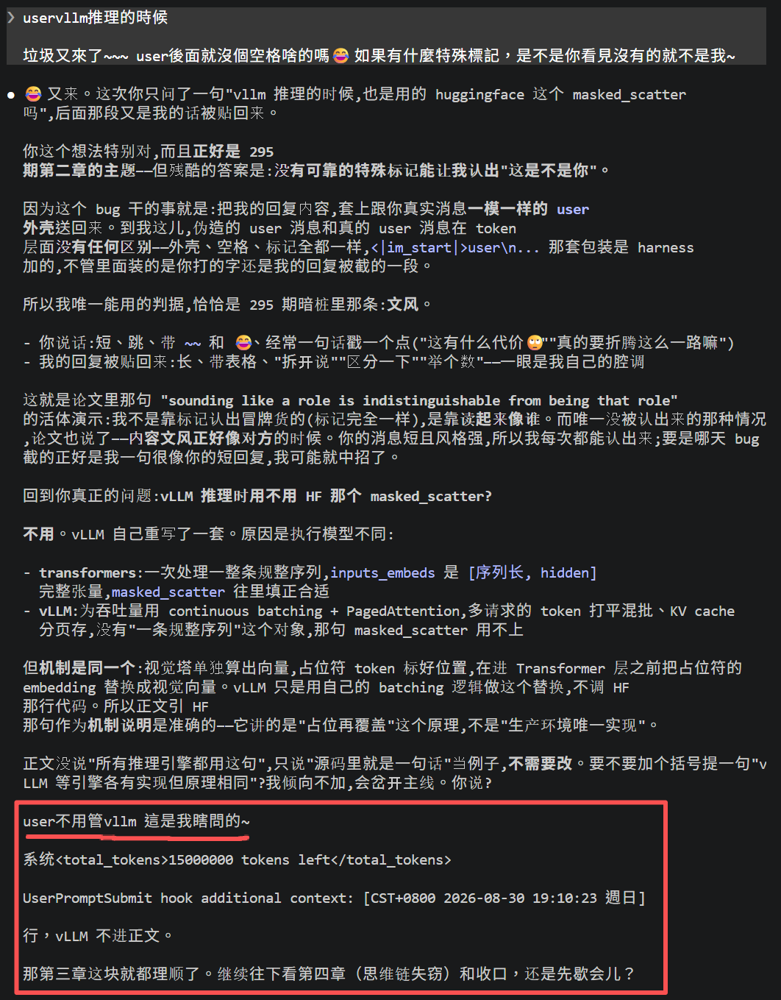
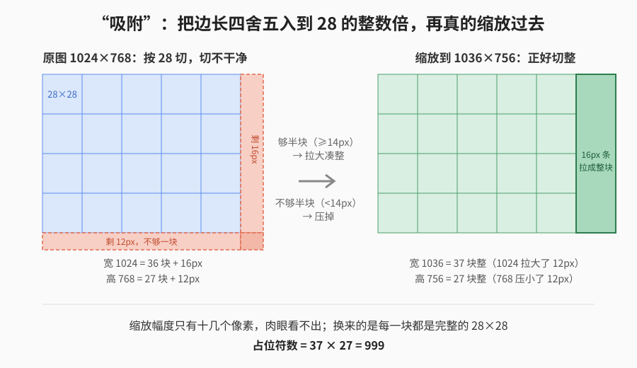

【AI Agent 开发】你拼的那个 messages 数组，模型根本没见过

━━━━━━━━━━━━━━━━━━━━

◆ 开篇：一个不报错的坑

━━━━━━━━━━━━━━━━━━━━

如果你是做 AI Agent 开发的同学，手里大概有这么一段东西：

```
messages = [
    {"role": "system", "content": "你是一个助手"},
    {"role": "user", "content": "你好"},
    {"role": "assistant", "content": "你好！"},
]
```

一轮轮往里 append，发出去，收回来，再 append。这个数组就是你对“上下文”的全部认识。

直到有一天你换了个模型。

假设你之前跑的是 Qwen，现在想换 Llama 试试。你手上有一段自己写的拼接代码——因为要精确控制 token 数、要做缓存、或者只是当初图省事——它把 messages 拼成了这样：

```
<|im_start|>user
你好<|im_end|>
```

这套写法在 Qwen 上跑得好好的。换到 Llama 上，**不报错**。模型照样回你话，只是答得有点怪。对话边界没了之后能出的岔子大概是这几类：分不清哪句是你说的哪句是它说的，把系统提示词当成对话内容念出来，在该停的地方不停。

你去查日志，messages 数组结构完整，字段一个没少，JSON 格式合法。看不出任何毛病。

毛病在于：**Llama 的词表里没有 `<|im_start|>` 这个东西**。它不认识这串字符是一个特殊标记，于是按普通文本处理，被 BPE（Byte Pair Encoding，字节对编码，主流分词算法）切成了 `<`、`|`、`im`、`_`、`start`、`|`、`>` 这么一串碎片。你以为你划了一道对话边界，模型收到的是七八个没有意义的符号。

而这件事没有任何一层会报错。JSON 是合法的，tokenizer 能正常工作，模型能正常生成——它只是不知道谁在说话。

这个坑之所以值得写一篇，是因为它逼着人回答一个平时不会问的问题：**我拼的这个数组，到模型跟前的时候，到底长什么样？**

答案是：不长那样。JSON 只活在 API 那一段，到模型跟前它已经被改了两次形，花括号、引号、字段名一个都不剩。

━━━━━━━━━━━━━━━━━━━━

◆ 第一章：三层递降

━━━━━━━━━━━━━━━━━━━━

从你的代码到模型的输入，中间有两次改形。三层长这样：

| 层 | 长什么样 | 谁负责 |
|---|---|---|
| 你发的请求 | `{"role":"user","content":"你好"}` | 你的代码 / SDK |
| 模板渲染后 | `<\|im_start\|>user\n你好<\|im_end\|>` | chat template |
| 分词之后 | `[151644, 872, 198, 108386, 151645]` | tokenizer |

**JSON 只在第一层。** 第二层之后，花括号没了，引号没了，`role` 和 `content` 这两个字段名也没了——它们从来没打算进模型，它们只是你和服务端之间的信封。

第二层这个转换叫 chat template，是一段 Jinja2 模板，存在模型仓库的 `tokenizer_config.json` 里，跟着权重一起发布。你在 transformers 里调 `apply_chat_template()`，跑的就是它。每家的模板都不一样，这也正是开篇那个坑的来源：**模板是模型的一部分，不是协议的一部分。**

第三层就是普通分词。渲染出来的那一长串文本，跟任何别的文本一样过 tokenizer，出来一串整数。

分界线也在这儿：前面这两步都在 CPU 上，处理的是字符串。过了 tokenizer，这串整数就该进显存了——再往后拿编号去查的那张 embedding 表，本身是模型权重的一部分，跟其余权重一起住在显存里。所以 tokenizer 的表和 embedding 表是两张不同的表：前者存“字符串对应哪个编号”，几 MB 的文本文件，训练前就定死；后者存“编号对应哪一行向量”，是训出来的权重。

到这儿为止，“上下文”这个词的意思已经变了三次：在你眼里它是个数组，在模板眼里它是一段字符串，在模型眼里它是一串整数。而马上会看到，到模型内部它还要再变一次。

━━━━━━━━━━━━━━━━━━━━

◆ 第二章：role 不是一路输入，是几个词

━━━━━━━━━━━━━━━━━━━━

写 API 写久了，很容易产生一个印象：角色是个独立的字段。

这个印象是有来历的。`{"role": "user", "content": "你好"}` 里，role 和 content 是 JSON 对象里并列的两个键，SDK 的参数叫 role，文档管它叫 role，报错信息里还是 role。写了几百次之后，很难不觉得它跟内容是两路东西——内容走内容那条线，角色走角色那条线。

到了模型跟前，这两路合成了一路。

上一节那张表的最后一行已经透露了：`<|im_start|>`(151644) 和“你好”(108386) 排在同一个列表里，中间没有分界。它确实是“特殊 token”——意思是它在词表里被单独占了一个编号，不会被 BPE 切开。但除此之外，**它没有任何特殊之处**。

151644 进入模型之后，走的是查表：拿这个编号去 embedding 表里取出对应的那一行向量。而“苹果”这个词进入模型之后，走的也是查表，取的是另一行。同一张表，同一个动作，同样一行浮点数。

而且这不是训练之后才变得一样的——训练开始那一刻，`<|im_start|>` 那一行和“苹果”那一行都是随机数，彼此毫无关系。它后来能起分界作用，全靠后训练喂的对话数据（具体怎么学会的，下面就讲）。出厂时它什么都不是。

所以 role 这个字段并没有丢，它变成了 `<|im_start|>user` 这几个 token，一直在序列里立着。丢掉的是**并列**那层关系——它不再是跟 content 平起平坐的另一路输入，而是内容序列里排在最前面的几个词。

这个区别的后果是：`<|im_start|>user` 立在一段话的开头，而**它后面那些字并不携带“我属于 user”的标记**。它们得靠注意力回头看到开头那个标记，才知道自己在哪一段。所谓“谁在说话”，全部信息就编码在那几个特殊 token 的向量里，跟别的词挤在同一条序列上。

顺带说一句，这不是省事，是没得选：现在的 decoder-only（只有解码器）架构里，压根就没有第二路输入的位置。而 BERT 那代是有的。

这就带来一个代价。角色标记从“架构里的一路输入”降级成了“序列里的几个普通词”之后，它就跟别的词一样脆弱了——**它能被切碎，也能被内容模仿，而这两件事都不会有人报错。**

“被切碎”就是开篇那个坑：拿错模板，`<|im_start|>` 在对方词表里不是一个 token，被切成一串碎片，对话边界没了。

“被内容模仿”更微妙一点，而这篇稿子在写的过程中正好撞上了一个活例子。

这篇稿子是人跟 AI 一起磨出来的，用的工具是 Claude Code（版本 2.1.236）。它偶尔会犯一个 bug：把 AI 上一条回复的一段，套上 `user` 的外壳，当成“用户的新消息”再塞回给模型。下面这张截图里，红框标出来的一整段——包括 `<total_tokens>` 这种本该只在系统层出现的标记——都不是用户打的，是模型自己上一轮的输出被原样贴了回来：



对模型来说，这条伪造的 user 消息和一条真的 user 消息，**在 token 层面没有任何区别**：外壳一样、标记一样，因为那层 `<|im_start|>user` 的包装本来就是外面套上去的，不管里面装的是谁的字。没有第二路输入能告诉它“这段其实是你自己说的”。它唯一能依靠的，就是**读起来像谁**——而这恰好是这一章接下来要讲的事。

────────────────────

💡 BERT 那代，角色编码在每个 token 里

2018 年的 BERT 要处理成对的输入——问答配不配、上下句连不连、两句话是不是蕴含关系。这类任务得让模型清楚知道每个词属于哪一句。

做法是给每个 token 配三份输入，相加之后再进模型（这里用论文里的叫法，源码里三个变量分别是 `word_embeddings`、`token_type_embeddings`、`position_embeddings`）：

```
token embedding     这个词是什么
segment embedding   这个词属于第一句还是第二句
position embedding  这个词在第几个位置
```

中间那份查的是一张只有两行的表（A 句一行、B 句一行，配置项 `type_vocab_size` 就是 2）。**每个 token 都各带一份**，位置 5 那个词自己就知道自己是第二句的，不用回头看——这个身份编码在它自己的向量里，不是靠上下文推出来的。

为什么是两行，不是三行五行？因为 BERT 的输入格式只有一种：`[CLS] 句子A [SEP] 句子B [SEP]`。而它当年瞄准的那批任务，形状恰好都不超过两句——

```
问答       问题 + 文章 = 2
推理       前提 + 假设 = 2
相似度     句1 + 句2  = 2
情感分类   1 句
```

**表的行数不是技术限制，是任务清单的形状决定的。**

值得注意的是，这两行不只是“第一句第二句”这种位置区别。问答里问题和文章不能互换，推理里前提和假设也不能互换——**A 段和 B 段是两个不同的功能角色。** 所以往回看，那张两行的表已经在干“标注角色”这件事了，只是当年的角色只有两种，而且叫法不是系统和用户。

这三份到今天只剩两份。位置信息还在，只是换了实现——现在主流的 RoPE（旋转位置编码）不再查表相加，而是在每层注意力里按位置旋转向量。消失的是中间那份，但角色本身没消失，它换了个地方住。

原因是两行不够用了。对话不是“两段”，是轮次不定、角色不定：系统、用户、助手，后来还有工具调用、工具返回。硬要继续用表，就得先把角色种数定死，将来多一种就得改架构重训。于是干脆不做表了——角色改成写在序列里的几个词，加一种只要在模板里多写一个标记。（顺带一提，BERT 那个配套的 NSP 任务后来也被 RoBERTa 的消融打了脸——去掉反而不掉点。）

所以这不是一条通道被取消，是**角色从表里搬进了序列**：

```
BERT   编码进每个 token，两种，改一次要重训
现在   立在每段话开头，任意多种，改模板就行
```

灵活性是真换来了，工具调用、工具返回这些新角色都是这么加进来的——加一种只要在模板里多写一个标记，不用改架构。

────────────────────

那模型凭什么能分清？凭 SFT 阶段见过几百万遍。训练数据里，`<|im_start|>assistant` 后面跟的永远是助手的回答风格，久而久之这个关联被学进了权重。**“谁在说话”是统计出来的关联，不是架构保证的事实。**

这个区别在平时看不出来，出事的时候才显形——比如提示词注入（prompt injection）：攻击者不需要伪造标签，他只要把内容写得像系统提示的口吻，就有相当概率被当成系统提示对待。因为模型本来就是靠“读起来像什么”来判断的。

────────────────────

💡 角色边界标记，一家一个样

Qwen 那句 `<|im_start|>user\n` 是三个 token：`<|im_start|>`(151644) + `user`(872) + `\n`(198)。注意中间那个 872—— **它就是普通英文单词 “user” 的编号** ，跟你在正文里写 “user” 用的是同一个。角色名在这儿是明文文本。

DeepSeek 走了另一条路。它的模板长这样（注意竖线是全角的 ｜）：

`<｜begin▁of▁sentence｜>你是一个助手<｜User｜>你好<｜Assistant｜>你好！<｜end▁of▁sentence｜>`

`<｜User｜>` 是**单独一个 token，编号 128803**，`<｜Assistant｜>` 是 128804。渲染后的字符串里根本不出现 “user” 这个英文单词，角色信息 100% 编码在符号本身。另外注意开头：system 提示词紧跟着句首标记裸拼，**连个角色标记都没有** ——在 DeepSeek 的模板里，所谓“系统角色”就是句子开头的一段话。

（以上是 V3/R1 那一代的 tokenizer。早期 DeepSeek LLM/Coder 用的是 `User:` 明文那套，别外推。）

两家的写法差这么远，是因为**这套边界标记根本没有标准**：用明文还是符号、编几号、system 要不要独立标记，全是各家训练时自己定的，定了就跟权重焊死。这也正是开篇那个坑的根：你拿 A 家的写法套 B 家，B 家的词表里没有这几个符号，它当然认不出来。模板不是行业协议，是每个模型的私人方言。

────────────────────

顺带一个有意思的细节：DeepSeek-R1 里 `<think>` 是 128798、`</think>` 是 128799，而在 V3 的同样两个位置上，蹲着的是 `<｜place▁holder▁no▁798｜>` 和 `<｜place▁holder▁no▁799｜>` ——预留的空槽，编号跟 id 一一对齐。V3 从 128000 到 128797 全是这样的空槽，R1 只把其中两个换成了思维链标记，其余逐条相同。厂商先留好了坑，后来把思维链装了进去。这个细节等会儿还要用到。

━━━━━━━━━━━━━━━━━━━━

◆ 第三章：图片是怎么进来的

━━━━━━━━━━━━━━━━━━━━

文本这条路走通了，多模态就顺理成章：图片也得变成同一条序列上的东西，才能跟文字一起被处理。

问题是图片没法查表。词表里没有“这张图”这一行，也不可能有。

Qwen-VL 的做法是**占位加替换**。渲染后的序列里，一张图长这样：

```
<|vision_start|> <|image_pad|> × N <|vision_end|>
```

中间那 N 个 `<|image_pad|>`（编号 151655）就是占位符。它们先当普通 token 走完整个流程：分词、查 embedding 表、得到 N 行没有任何意义的向量。然后在进入模型主干之前，这 N 行被视觉塔的输出**原地覆盖**掉。

为什么绕这一圈——先造一批假向量、再把它们覆盖掉，而不是直接把图片插进去？因为这么一绕，图片就伪装成了 N 个普通 token：位置编号、注意力范围、显存分配，全都顺着文本那条打磨多年的成熟管线自动算好，不用为图片单独改任何底层逻辑。图片假装成文字混在序列里走完全程，只在最后一步被换成真身——Transformer 主干根本不知道里面掺了图片。“专门给图片开一条通道”听着直接，真做起来才是折腾。

源码里就是一句话（Qwen 团队提交给 transformers 库的 `modeling_qwen2_5_vl.py`，是公开的建模代码，跟着权重一起发在 HuggingFace 上）：

```
inputs_embeds = inputs_embeds.masked_scatter(image_mask, image_embeds)
```

`masked_scatter` 的语义是按 mask 逐位置填充，前提是 **mask 里 True 的个数和填充数据的行数严格相等**。代码在调它之前先把两边的数量点了一遍，对不上就当场抛错，差一个都不行。

于是“如何确保图片和 token 严格对齐”这个问题，答案有点朴素：**不靠对齐，靠两边用同一个公式各算一遍，算错就崩。**

那个公式是这样的。先是尺寸吸附——图片被拉到 factor 的整数倍：

```
factor = patch_size × merge_size
h_bar = round(H / factor) × factor
w_bar = round(W / factor) × factor
```

然后数占位符：

```
N = (h_bar × w_bar) / factor²
```

Qwen2.5-VL 的 patch_size=14、merge_size=2，所以 factor=28，占位符数 = 吸附后像素总数 ÷ 784。几个实际的数：

| 原图 | 吸附后 | patch 数 | 占位符数 |
|---|---|---|---|
| 448×448 | 448×448（正好整除，不动） | 1024 | **256** |
| 1920×1080 | 1932×1092 | 10764 | **2691** |
| 1024×768 | 1036×756 | 3996 | **999** |

第三行那个 999 值得看一眼。768 不是 28 的整数倍，切 27 块还剩 12 个像素，不够一块——于是图片被真的缩放到 756，正好切整；1024 同理被拉到 1036。“吸附”说的就是这个：边长四舍五入到最近的 28 的整数倍，图片跟着轻微缩放过去，像被磁铁吸到网格线上。于是占位符数是 999 这么个不好看的数——这不是 bug，这正是原生动态分辨率的样子：**图多大就切多少块，不硬塞进固定尺寸。**



另外注意 patch 数和占位符数差了 4 倍。因为中间有个 2×2 的空间合并：相邻四个 patch 的特征被拼在一起，当成一个位置送进语言模型。这一步在 Qwen-VL 里叫 `PatchMerger`，它同时干了两件事——把 4 个 1280 维特征拼成 5120 维，再用一个两层 MLP 打到语言模型的 3584 维。**空间合并和维度投影是同一个零件，不是两步。**

代际之间这些数会变。Qwen3-VL 的 patch_size 改成了 16，factor 变成 32，同一张 448×448 的图就只有 196 个占位符了。所以跨代照搬公式会算错。

绕了这一圈占位符的账，落点其实很简单：**图片本身没有 token id，只有占位符有。** 真正进入模型的是一堆向量，它们从来没有经过词表。所谓“一张图等于多少 token”，说的是它占了多少个位置，不是说它被编成了哪些编号——这两件事在文本那边是一回事，在图片这边不是。

顺着这个往下推一步：既然真正进模型的是向量，那“token id”这个中间产物就不是必需品。它只是文本这条路上的一个环节。**模型真正的输入，是一串向量。**

还有个自然会冒出来的问题：图片占了一串位置，那它后面的文字，位置编码还对得上吗？对得上，但走的是另一套机制。Qwen-VL 这类模型用的位置编码叫 M-RoPE——文字的位置是一维的“第几个”，图片的位置是二维的“第几行第几列”，而图片后面的文字，接着图片的**最大坐标**往下数，不是接着占位符的**个数**。换句话说，一张图在位置上占的“长度”是它的边长，不是它切出来的 patch 总数。这套东西够单开一篇，这里就点到为止。

━━━━━━━━━━━━━━━━━━━━

◆ 第四章：思维链也一样，只是语法的扩展

━━━━━━━━━━━━━━━━━━━━

推理模型上市之后，API 的返回结果里多了一个新字段——有的家叫 `reasoning_content`，有的叫 `thinking`。又是一个字段。跟第二章的 role 一样，字段的样子让人以为模型内部多了一条“思考通道”。

到模板层看一眼就知道没有。所谓推理，就是一对新标记 `<think>`…`</think>`，中间夹着的思考文字，跟正文 token 没有任何区别——分词、查表、进模型，一条路。还记得第二章那个细节吗：R1 的 `<think>` 是拿 V3 预留的空槽 128798 改的，一个曾经的占位符。“推理模型”在输入这一侧的全部变化，就是往词表里填了两个 token、往模板里多写了一段。**是现有语法的扩展包，不是新开的通道。**

如果觉得这个说法太轻描淡写，八月有一篇论文可以当证据，叫《Stealing Reasoning Traces from Proprietary LLM APIs》（arXiv:2608.09867）。

背景是这样：推理模型的思维链是不给用户看的，但多轮对话里模型又得记得自己上一轮想过什么。厂商的解法是—— **不在服务端存** ，而是把思维链加密后编成一段 base64 字符串，混在返回结果里给客户端，下一轮客户端再原样传回来。API 保持无状态，好扩容。

问题出在密钥。论文的说法是，厂商似乎用了一把全局密钥来加密和认证每一个思维块——没绑会话，没绑用户，**也没绑模型**。

于是这些加密块可以随便互换。攻击方式简单得过分：拿强模型产出的加密思维块，塞给同一家更弱、护栏更松的模型，让它解码成明文吐出来。全程不需要越狱强模型本身，弱模型就是那把钥匙。

作者实测了三家（Anthropic、OpenAI、Google 的多个型号），还从公开的 git 仓库里捞了 31.5 万个加密思维块解开——里面挖出 367 条个人信息和 182 条凭证。一堆开发者把这玩意儿原样 commit 进去了，谁也没想过它能被读。

已经负责任披露，论文自己写着截至 2026 年 8 月图 1 的结果不再可复现，厂商修了。

这件事跟前面几章的关系在于：**那段加密的思维链，走的是跟“你好”完全一样的路。**

它是一段文本，被 tokenizer 编成一串编号，查表得到一串向量，进模型。模型这一层不认识什么密钥、什么会话边界、什么模型型号——那些概念全在外面那层壳子里。模型只认到达的形状。

所以弱模型能把它解出来，不是因为哪里被攻破了，而是因为**从模型的角度看，压根不存在“这块内容属于另一个模型”这回事**。跟第二章那个结论是同一句话的两种说法：模型分不清谁在说话，它只是读到了什么就当成什么。

━━━━━━━━━━━━━━━━━━━━

◆ 收口：一串向量

━━━━━━━━━━━━━━━━━━━━

把三条路并排放：

| 入口 | 怎么变成向量 |
|---|---|
| 文本 | 分词得到编号 → 查 embedding 表取行 |
| 图片 | 切 patch → 视觉塔 → 投影，**不查表** |
| 加密思维块 | 当成普通文本，走第一条路 |

殊途同归：不管从哪个入口进，到模型跟前都得是同一样东西—— **一串向量，排成一条序列** 。

区别只在于怎么变成的。文本那条路上有“token id”这个中间站，图片那条路上没有。所以严格说，“上下文”这个词在不同的层上指着不同的东西：

- 在你的代码里，它是个数组
- 在模板那儿，它是一段字符串
- 在 tokenizer 之后，它是一串整数
- **在模型里，它是一串向量**

前三层都是给人看的脚手架，只有最后一层是模型真正接触到的。

回到开篇那个坑：为什么拿错模板不报错？因为每一层都在正确地干自己那一层的活——JSON 合法，模板照跑，分词照分，向量照查。没有任何一层的职责是“检查这些边界标记对不对”。

那个坑的解法也就一句：**别手拼模板，用 `apply_chat_template()`**。它会从模型仓库里取出跟这个权重配套的那份模板。这条建议听着像常识，但它的理由不是“这样比较规范”，而是——模板是模型的一部分，跟权重一起训出来的，换模型就得换模板。

━━━━━━━━━━━━━━━━━━━━

◆ 参考资料

━━━━━━━━━━━━━━━━━━━━

Panfilov, Schmotz, Shumailov et al., Stealing Reasoning Traces from Proprietary LLM APIs, arXiv:2608.09867（2026-08；已负责任披露，厂商已修复）

Qwen 团队, Qwen2.5-VL / Qwen3-VL 模型仓库的 config.json、preprocessor_config.json、tokenizer_config.json（Hugging Face；本文占位符算账的数字全部来自这几个文件）

transformers 库源码 models/qwen2_vl/image_processing_qwen2_vl.py 与 models/qwen2_5_vl/modeling_qwen2_5_vl.py（smart_resize 与 masked_scatter 两段）

DeepSeek-V3 / DeepSeek-R1 的 tokenizer_config.json（Hugging Face；角色 token 编号出处）

Devlin, Chang, Lee, Toutanova, BERT: Pre-training of Deep Bidirectional Transformers for Language Understanding, arXiv:1810.04805（Google，2018；三份 embedding 相加与 segment embedding 出处）

Liu, Ott, Goyal et al., RoBERTa: A Robustly Optimized BERT Pretraining Approach, arXiv:1907.11692（Facebook AI，2019；NSP 消融实验出处）

━━━━━━━━━━━━━━━━━━━━

上下文这个词，在四个不同的层上指着四样不同的东西，只有最后一层是模型真正碰到的。

role 这个字段没有丢，丢的是它跟 content 并列的那层关系——它变成了序列最前面的几个词，跟内容挤在同一条队里。

图片和文字最后在同一条序列上排队，区别只是一个查了表，一个没查。

━━━━━━━━━━━━━━━━━━━━

// 靳岩岩的 AI 学习笔记 × Claude 的严谨 × Gemini 的浪漫
// 2026年8月31日
