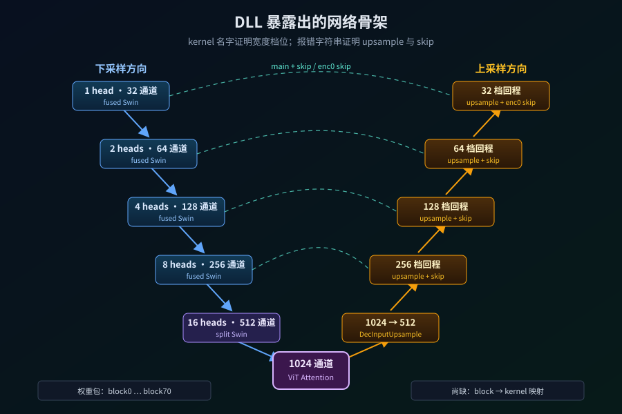

【DLSS5】把模型从 DLL 里挖出来：它长什么样，又是怎么看出来的

━━━━━━━━━━━━━━━━━━━━

◆ 开篇：上一篇留下的问题

━━━━━━━━━━━━━━━━━━━━

上一篇（ https://mp.weixin.qq.com/s/ZlMYIXnkGNTGAWZqpIiSzg ）讲了 DLSS 5 那个泄露的 158 MB 文件是怎么回事：代码不到 1 MB，剩下九成多是一个跑在显卡上的视觉网络的权重。

那一篇站在门口往里看，这一篇动手进去。分两步：先把这个网络**大概长什么样**画出来，再讲这张图**是怎么从一堆二进制里看出来的**。

先给结论、再给证据——因为光看一串 `swin_1h_32_1`、`swin_8h_256_8` 的核心名字，谁也想象不出网络的形状。得先在脑子里立起一个轮廓，那些名字才有地方落。

━━━━━━━━━━━━━━━━━━━━

◆ 第一章：它长什么样——一个 U 形

━━━━━━━━━━━━━━━━━━━━

先给整体形状：这是一个 **U 形网络**。左边一路往下、右边一路往上，中间最窄，画出来像个字母 U。

它干两件事：**先把画面读懂，再把画面重画。**

**左边下坡（读懂）**：游戏渲染好的一帧从最上面进来。每往下走一站，画面的**尺寸缩一半**，但描述每个点的**通道数翻倍**。一共六站：

```
第 1 站   32 通道    ← 画面刚进来，尺寸最大、最清楚
第 2 站   64 通道
第 3 站  128 通道
第 4 站  256 通道
第 5 站  512 通道
第 6 站 1024 通道    ← 最深、最窄（U 形底部）
```

这一路下来是在拿“看得清”换“想得明白”。刚进来时像素多，但每个点只知道自己那点颜色；越往下点越少，可每个点承载的信息越浓——从“这里是红色”慢慢变成“这里是金属护甲的高光边缘”。

**U 形底部（想清楚）**：到第 6 站，画面已经被压得很小，但每个点都是高度浓缩的语义。在这儿把整帧“想”一遍——该怎么让它更真实。

**右边上坡（重画）**：从最深处开始，一站站放大，尺寸翻倍、通道减半，把抽象的理解重新变回一张高清画面，最后输出。

**横向的“抄细节”（skip 连接）**：下坡时每一站的画面，会横着**直接抄一份给对面同高度的上坡站**。为什么？因为下坡压缩时会丢细节，上坡光靠放大补不回来；把下坡时还清楚的那份存着、上坡时直接拿来对齐，细节就不丢了。

────────────────────

💡 通道和注意力头，用大白话说是什么

**通道**：想成“描述每个像素用几个形容词”。32 通道 = 每个位置用 32 个数来描述——不只是 RGB 三个颜色，还有“是不是边缘”“是不是高光”“材质糙不糙”这些学出来的特征。越深通道越多，形容词越丰富。

**注意力头（就是核心名字里的 `1h`/`2h`/`8h`/`16h`）**：想成“几双眼睛同时看”。1 个头 = 一双眼睛看一种关系；16 个头 = 16 双眼睛，有的盯边缘、有的盯颜色一致性、有的盯远处光源。越深的站头越多，看的角度越多。

所以那串核心名字里，`swin_8h_256_8` 就是“第 4 站：8 双眼睛、256 个形容词”。

────────────────────

再往细一层：这个 U 形不是六个站就完了，每个站里还叠着**好几个小模块**（后面会看到，权重包把它们编号成 block0 到 block70，全网一共 71 个）。它们在六个站里的分布是这样：

```
下坡                          上坡
────────────                  ────────────
block 0-4    第1站 32通道       block 66-70  第1站回程 + 输出
block 5-8    第2站 64通道       block 62-65  第2站回程
block 9-14   第3站 128通道      block 56-61  第3站回程
block 15-22  第4站 256通道      block 49-55  第4站回程
block 23-30  第5站 512通道      block 40-48  第5站回程
        block 31-38   第6站 1024通道（8 个模块，U 形底）
        block 39      1024→512 的拐弯
```

左右对称、中间最深，这就是 U 形的全貌。**71 个模块不是挤在一个站里，是六个站各分几个、加上下坡上坡凑成的总数。**

至于每个模块内部怎么运转——注意力具体怎么算、窗口怎么滑——那是下一篇的事。这一篇先把这张地图立住。



━━━━━━━━━━━━━━━━━━━━

◆ 第二章：这张图是怎么看出来的

━━━━━━━━━━━━━━━━━━━━

上面那张 U 形图，不是猜的，也不是从哪篇文档抄的——NVIDIA 什么都没公开。它是**一层层从这个二进制文件里读出来的**。工具全是现成的，不需要任何深度学习库。分三步。

**第一步，`objdump` 看这个文件分成几段。** DLL 内部分成若干“段”：一段放代码，一段放数据，还有一段“资源段”本来是给图标、版本信息用的。列出来一看，反差很扎眼：

```
.text  （代码）      0.67 MiB
.data  （数据）     16.38 MiB
.rsrc  （资源）    140.85 MiB
```

代码不到 1 MiB，资源段却独占 140 多 MiB——接近整个文件的九成。这说明它不是“以代码为主的程序”，而是“背着一大坨东西的壳”。那一大坨，就是模型。

**第二步，解析资源段，锁定权重。** 不能光看段大小就说“这就是权重”，得再往里看一层。资源段内部是一棵树，把它解析出来，干净得出乎意料——**整个 140 MiB 里只有两个叶子**：一个 1184 字节的版本信息，另一个叫 `WEIGHTS_HT`、147,695,410 字节，几乎就是整个资源段。

名字把身份写在脸上了：**weights，权重**。到这儿，模型就从文件里分离出来了——一小块 CPU 代码 + 一大块权重资源。

────────────────────

💡 “解析资源树”不是黑魔法，是照死格式查表

听到“把资源树解析出来”可能觉得挺玄，其实没有任何猜测，就是照一份公开的文件格式查表。

PE 文件（Windows 的 exe、dll）的资源段格式写在微软规范里，是死的。它是一棵三层树：第一层按**类型**分（图标、字符串、自定义数据……），第二层按**名字**分，第三层按**语言**分。最底下的叶子只记一件事——**这份资源在文件的哪个位置、有多大**。

每层都是一张小表，表头写“我下面有几个条目”，顺着指针一层层往下走，走到叶子读出那两个数（偏移和大小），就知道 `WEIGHTS_HT` 长 147,695,410 字节。这个数不是数出来的，是目录表里写好的。几十行代码就能把这棵树走完。

────────────────────

**第三步，`strings` 读核心名字，认出六站宽度阶梯。** 权重本身是一大坨数字，看不出结构。但编译进 DLL 的 GPU 核心是**带名字**的——`strings` 能把这些文本标签全列出来。筛一遍，最先浮出来的就是那条整齐的宽度阶梯：

```
cc_tinlayout_fused_swin_1h_32_1     第1站   1 head    32 通道
cc_tinlayout_fused_swin_2h_64_2     第2站   2 heads   64 通道
cc_tinlayout_fused_swin_4h_128_4    第3站   4 heads  128 通道
cc_tinlayout_fused_swin_8h_256_8    第4站   8 heads  256 通道
cc_split_swin_16h_..._512           第5站  16 heads  512 通道
CCVitAttentionLayer                 第6站  输入宽度 1024
```

`32 → 64 → 128 → 256 → 512 → 1024`，每升一档，眼睛数和形容词数一起翻倍。这就是第一章那六站的直接来源——**名字里明写着通道数，一个都不用猜。**

那怎么知道它是“下去还能回来”的 U 形，而不是一路走到黑？靠另一批名字和报错文本。

────────────────────

💡 U 形不是“看着像”，回程和跳线都写在报错里

每一站的核心都带 `_ds`（下采样）和 `_upsample`（上采样）两个变体——说明同一档宽度既往深处走、也有往外还原的回程。

skip 抄细节的证据更直白，是程序自己报错时打印的输入名：

```
CCTinlayoutFusedSwin... (upsample) requires 2 inputs (main + skip)
CCTinlayoutFusedPostBlock... requires 2 inputs (main + enc0 skip)
```

`main + skip`、`enc0 skip`——解码时除了上一层的主干，还要拿编码端存的那份特征一起算。下采样、上采样、编码到解码的跳接，全都有二进制里的直接证据；把它们拼成 U 形，是这些证据共同指向的结论。

────────────────────

至于第一章那个“block 0-4 是第 1 站、block 31-38 是 U 形底”的精确分配，来自权重包里连续编号的记录（`block0` 一直到 `block70`）加上 CPU 里那段构图代码——把 71 个编号模块逐个对到六个站上。这一步最费劲，也是把“大概的 U 形”钉成“精确的 U 形”的关键。

━━━━━━━━━━━━━━━━━━━━

◆ 第三章：存的是 FP16，算的是 FP8

━━━━━━━━━━━━━━━━━━━━

顺便交代两个容易搞混的细节，都在权重包里。

先说参数量。顺序解析权重包，153 条记录每条都满足“字节数 = 元素数 × 2”——每个参数占 2 字节。所以合计约 **7380 万个参数**（上一篇按每参数一字节估的“1.48 亿”要修正：字节数没变，但每个参数占两字节，参数量是它的一半）。

────────────────────

💡 到底是 FP8 还是 FP16？——存的和算的不是一回事

DLL 里的核心名字大量带 `_fp8`，很容易以为权重是 FP8（8 位、每个数 1 字节）存的。但解开权重包一看不是：每个参数占 2 字节，按 FP16（16 位、半精度）解码，数据全是合理的有限数。**文件里存的是 FP16**，这步是确定的。

那 `_fp8` 从哪来的？把原版 GPU 核心也反汇编看了一眼：**运行时不直接吃这份 FP16。加载时它把权重重新打了一次包**——压成 8 位的 FP8（配一份缩放系数把精度找补回来），GPU 真正算的是这份 8 位数据。

一句话：**文件里存 FP16（好分发、精度高），芯片上算 FP8（省一半带宽、吃满显卡加速），中间隔着一次加载时转换。** `_fp8` 说的是后者——**模型的存储精度和计算精度，本来就是两件事。**

────────────────────

💡 `WEIGHTS_HT` 里的 HT 是什么？只能猜

`WEIGHTS` 没悬念，`HT` 这个后缀查不到出处——NVIDIA 内部命名，DLL 里只出现这一处，没有任何地方拼全。所以下面几个都是猜，标清楚是猜：

- **H-Net 的缩写**（我觉得最可能）：这个网络在代码里的类名前缀全是 `HNet`，比如 `CCNetwork@HNetCpp`。既然网络自己叫 H-Net，“H-Net 的权重”缩成 `WEIGHTS_HT` 很顺。
- **Hash Table（哈希表）**：权重包正是一串“名字 → 数据”的记录，按名字查，结构就像张哈希表。
- **Half Tensor（半精度张量）**：上面刚验过权重是 FP16，也就是 half precision。

到底是哪个，DLL 里没留全称，查不出来。**能确定的只有 `WEIGHTS`**——这也是逆向的常态：很多命名是厂商脑子里的，文件里不会替你解释。

────────────────────

`HT` 查不出全称这件事，其实是个小小的提醒：从文件里能读出的东西是有边界的。下一章就把这条边界说清楚。

━━━━━━━━━━━━━━━━━━━━

◆ 第四章：工具箱不等于执行顺序

━━━━━━━━━━━━━━━━━━━━

最后要给自己划条线：**看见了不等于全看透了。**

`strings` 列出来的是编译进 DLL 的整只工具箱，里面同时放着 FP8 和非 FP8、普通版和分块同步版、各种输入视图。**工具箱里有某把扳手，不等于今天这台模型一定用了它。** 把扳手按尺寸排好，也不等于知道工人按什么顺序拧螺丝。

所以严格说，现在手里有三张纸：

```
核心名字      有哪些算子、哪些宽度档位          —— 能读
权重记录      有哪些编号模块、每块几组数据       —— 能读
构图代码      把模块和算子接成执行图的逻辑        —— 还在啃
```

前两张已经读通，第一章那张 U 形图就是靠它俩加上第三张的一部分拼出来的。但要把 71 个模块**每一个**都精确贴到“用哪种核心、吃谁的输出、吐给谁”，还得把那段藏在不到 0.7 MiB CPU 机器码里的构图逻辑完全还原——这部分还没走完。

**能下的结论和不能下的，得分清楚：**

- **能说**：U 形结构、六站从 32 到 1024、下采样上采样、真实的 skip 输入、71 个编号模块、存 FP16 算 FP8
- **还不能说**：每个模块内部的完整连接图、每一层精确多宽、它是怎么训练出来的

这不是没走完，恰恰是逆向工程最要紧的一步：**知道哪条线是文件里读出来的，哪条线还等着下一件证据。**

━━━━━━━━━━━━━━━━━━━━

◆ 收尾：先有轮廓，再谈细节

━━━━━━━━━━━━━━━━━━━━

这一期把 DLSS 5 那个泄露模型的**外形**摸清楚了：一个 U 形视觉网络，左边六站把画面从 32 通道一路读到 1024 通道、读懂，右边六站再一路重画回去，中间横着一堆 skip 把细节抄过去；全网 71 个编号模块，权重按 FP16 存、加载时转 FP8 算。

而这张图靠的是三样现成工具——`objdump` 看段、资源树挖权重、`strings` 认名字，外加程序自己吐的报错。没有任何深度学习框架，一个泄露文件、几十行代码，就把黑箱的外形描了出来。

轮廓有了，门牌号还没全贴上。下一篇往里走一层：这些“注意力”“窗口”到底怎么算，为什么图像不能像文字那样直接全局注意，那些“窗口”又是干嘛的。那才是这台“电影画质”机器真正有意思的地方。

━━━━━━━━━━━━━━━━━━━━

◆ 参考资料

━━━━━━━━━━━━━━━━━━━━

本文所有数字来自对网上流传的那份泄露样本 `nvngx_dlssnr.dll`（SHA-256：`e16bcf15e16e13f527491cdf7845b2fe6521a738d8f7c9c721866a8496e1fc8e`）的直接分析，工具为 objdump、strings 及零依赖 Python 脚本。这份文件网上能找到，谁都可以自己下一份、跑一遍，数字对得上

Microsoft, PE Format - The .rsrc Section（PE 资源树的 Type / Name / Language 三级结构与叶子格式）

Microsoft, Finding and Loading Resources / LoadResource / LockResource（Windows 运行时定位并取得嵌入资源的机制）

TechPowerUp, DLSS 5 DLL 分析与核心枚举（2026-08；GPU 核心与 CUBIN 数目的公开对照）

━━━━━━━━━━━━━━━━━━━━

一个 U 形视觉网络：左边六站把画面从 32 通道读到 1024 通道读懂，右边六站再重画回去，中间横着 skip 抄细节。

它长什么样不是猜的——`objdump` 看段、资源树挖出 WEIGHTS_HT、`strings` 认出六档宽度、报错字符串坐实回程和跳线，一层层读出来的。

全网 71 个编号模块，权重按 FP16 存、加载时转 FP8 算——存储精度和计算精度是两件事。

━━━━━━━━━━━━━━━━━━━━

// 靳岩岩的 AI 学习笔记 × Claude 的严谨 × Gemini 的浪漫
// 2026年9月2日

━━━━━━━━━━━━━━━━━━━━

【摘要（发布用，不进正文）】

先给结论再给证据：DLSS 5 是个 U 形视觉网络，六站从 32 通道读到 1024 再重画回去。而这张图不靠猜——objdump 看段、资源树挖权重、strings 认名字，三样现成工具从泄露 DLL 里一层层读出来。
