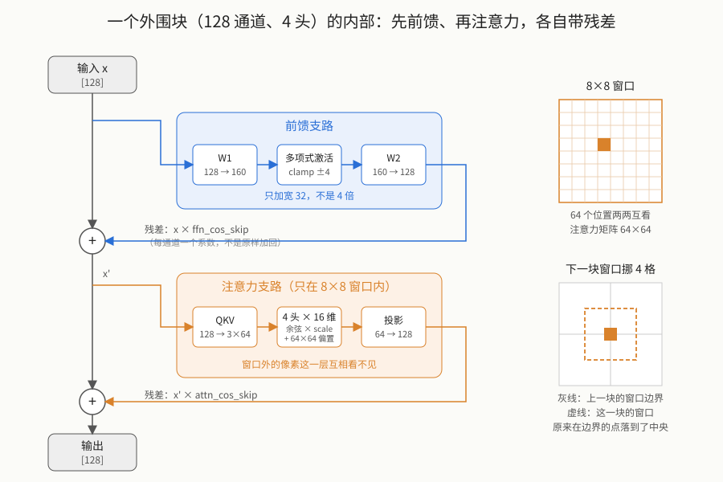

【DLSS5】“丁鱥”模型的房间里摆着什么：一个块的内部，和它为什么只看 8×8

━━━━━━━━━━━━━━━━━━━━

◆ 开篇：平面图画完了，该进房间了

━━━━━━━━━━━━━━━━━━━━

上一篇（ https://mp.weixin.qq.com/s/Eq2IDP5QvFPGToQuCsBLRw ）把 DLSS 5 那个泄露模型的外形立住了：一个 U 形视觉网络，六站从 32 通道一路读到 1024 再重画回去，全网 71 个编号模块、152 个计算层。结尾留了一句“每个模块内部怎么运转，这一篇先不往里追”。

这一篇就追这个。

问题很具体：**一个模块（block）里到底摆着什么运算？** 说“注意力”“前馈”谁都会说，但这个网络的注意力跟大语言模型的注意力是一回事吗？前馈有多宽？残差是怎么加回去的？

先把结论摆出来，后面再一项项对：

**外围四站（32 到 256 通道）的每个块，是一个“窗口注意力”块——注意力只在 8×8 的小窗口里算，窗口外的像素互相看不见。** 到 U 形底部的 1024 通道那站，才换成大语言模型那种全局注意力。一个网络，两种注意力。

为什么要这么设计，是这一篇要讲清楚的。

━━━━━━━━━━━━━━━━━━━━

◆ 第一章：一个外围块里有什么

━━━━━━━━━━━━━━━━━━━━

拿第 3 站（128 通道、4 个注意力头）的一个块举例，因为它的数字最典型。这个块的权重记录解开来，里面的矩阵按顺序是这些（形状写成“输出×输入”）：

```
weight1        [160, 128]     前馈：128 → 160
weight2        [128, 160]     前馈：160 → 128
ffn_cos_skip   [128]          前馈残差的每通道系数
qkv            [192, 128]     注意力：128 → Q、K、V 各 64
attn_bias      [4, 64, 64]    每个头一张 64×64 的位置偏置表
attn_scale     [4]            每个头一个缩放系数
projection     [128, 64]      注意力输出投影：64 → 128
attn_cos_skip  [128]          注意力残差的每通道系数
```

八样东西，分成两条支路：前三样是**前馈支路**，后五样是**注意力支路**。每条支路算完，都把自己的输入按通道乘一个系数再加回来。写成代码形状就是：

```
# 前馈支路
h = activation(x @ W1ᵀ)          # [128] → [160]
x = h @ W2ᵀ + x * ffn_cos_skip   # [160] → [128]，加回输入

# 注意力支路（在 8×8 窗口内）
q, k, v = split(x @ Wqkvᵀ)       # [128] → 三个 [64]
a = window_attention(q, k, v)    # 见第二章，输出 [64]
x = a @ Wprojᵀ + x * attn_cos_skip   # [64] → [128]，加回输入
```

这就是一个块的全部。画成图是这样：



跟教科书里的 Transformer 块比，骨架一样（注意力 + 前馈 + 两次残差），只是顺序反着：教科书先注意力后前馈，这里是**先前馈后注意力** （从机器码里看，第一次矩阵乘法后面紧跟着的是激活函数，注意力的 QKV 在后头）。除了顺序，还有三处细节明显不一样，每一处都是从权重形状或者 GPU 机器码里直接读出来的。

────────────────────

💡 细节一：残差不是“加回去”，是“乘个系数再加回去”

标准残差连接是 `x + f(x)`，输入原样加回。这个网络多了一步：`x * s + f(x)`，其中 `s` 是每个通道一个学出来的系数（就是那两个叫 `_cos_skip` 的向量，每站各 32 到 256 个数）。

怎么确定的？在 512 通道那站的前馈层机器码里，能看到它先从权重指针的固定偏移读这一排系数，把 `input * ffn_cos_skip` 预装进矩阵乘法的累加器，然后才累加前馈的输出。累加器里先放什么，公式就是什么，没有猜的余地。

这个改动的意思是：网络可以自己决定“原信号保留几成”，而不是被架构锁死在“保留十成”。名字里那个 `cos` 我没找到解释，暂时只把它当个标签，别往余弦上硬靠。

────────────────────

第二处不一样的是前馈的宽度。

────────────────────

💡 细节二：前馈只宽 32，跟大语言模型的 4 倍完全不是一个量级

大语言模型的前馈层惯例是把维度放大 4 倍再压回来（4096 → 16384 → 4096）。这个网络外围站的前馈是 `d → d + 32 → d`：32 通道的站是 32 → 64 → 32，128 通道的站是 128 → 160 → 128，256 通道是 256 → 288 → 256。**放大的绝对量永远是 32，不是倍数。**

这个规律是把四站所有 36 个普通块的权重记录逐条按容量公式算出来的，每一条的字节数都严丝合缝地对上，才敢说它是规律而不是巧合。

为什么这么窄？这里只能给推测：外围站的位置数巨大（1080p 第一站有两百万个位置），前馈是逐位置算的，宽度每加一维，全图就多两百万次乘加。它宁可把宽度压到最低，把算力留给别处。到底部那站就反过来了，第三章会看到。

────────────────────

第三处是前馈中间那个激活函数。

────────────────────

💡 细节三：激活函数是三个常数的多项式，不是 GELU 也不是 ReLU

前馈中间那一步 `activation()` 是什么？这种东西权重里没有，只能看机器码。在 32 通道块的 SASS（NVIDIA GPU 的汇编）里，第一次矩阵乘法之后反复出现同一段：

```
x = clamp(x, -4, 4)
g = 0.447265625 - 0.055908203125 * |x|
g = 0.89453125 + x * g
y = x * g
```

先把值截到 [-4, 4]，然后用三个 FP16 常数算一个二次多项式当门控，再乘回 x。代进去看形状：负半轴一路压向零（x = -4 时输出几乎是 0），正半轴放行且略微放大。**形状像 SiLU / GELU 那一族，但系数是它自己定的，用多项式而不是指数或误差函数，因为 FP16 上算多项式最便宜。**

这三个常数是逆向时最踏实的一类证据：它们以立即数的形式写在指令里，反汇编出来就是那几个数，没有第二种解释。

────────────────────

到这儿，一个块的两条支路都清楚了，只剩中间那个 `window_attention()` 没展开。它是这个网络和大语言模型分道扬镳的地方。

━━━━━━━━━━━━━━━━━━━━

◆ 第二章：窗口注意力——只看 8×8

━━━━━━━━━━━━━━━━━━━━

先看大语言模型的开销。注意力的核心是“每个 token 看所有 token”：n 个 token 就要算 n × n 对关系。4096 个 token 的上下文，是 1600 多万对，显卡吃得下。

现在换成图像。假设第一站的位置数是 1080p 的像素数：

```
n = 1920 × 1080 ≈ 207 万个位置
全局注意力：n × n ≈ 4.3 × 10¹²  对关系
```

四万亿对。就算每对只算一次乘法，一帧要跑几毫秒的实时渲染根本不可能。**图像的 token 数比文本多三个数量级，n² 就爆了六个数量级。** 这不是优化能解决的，是量级问题。

Swin 的解法（2021 年微软提出，就是核心名字里那个 `swin`）简单粗暴：**把画面切成 8×8 的小窗口，注意力只在窗口内 64 个位置之间算。** 窗口外的像素在这一层互相看不见。

```
窗口注意力：n × 64 ≈ 1.3 × 10⁸  对关系
```

从四万亿降到一亿多，缩了三万多倍。代价是每个位置这一层只能看到周围 8×8 的邻居。

────────────────────

💡 为什么文字能全局看、图像不能

不是图像“不值得”全局看，是 token 数量级不同。一段 4K 长度的文本是 4096 个 token；一帧 1080p 画面是 207 万个位置，多了五百倍。注意力的开销按平方涨，五百倍的 token 就是二十五万倍的开销。

所以视觉网络在外围（位置多、通道窄）一定用某种局部化的注意力，到了深处（位置少、通道宽）才用得起全局注意力。这不是 DLSS 一家的选择，是所有高分辨率视觉 Transformer 的共同处境。

────────────────────

窗口内怎么算？把第一章那个 128 通道块的数字代进来，一个 8×8 窗口里有 64 个位置，4 个头：

```
q, k, v：每个位置 64 维，分 4 个头，每头 16 维
每个头：
  logits = cos(q, k) × attn_scale + attn_bias    # [64, 64]
  weights = softmax(logits)                       # [64, 64]
  out = weights @ v                               # [64, 16]
四个头拼起来：[64, 64]，再过 projection 回到 128
```

有两处跟标准注意力不一样：

**一是用余弦相似度代替点积。** 标准注意力是 `q · k / √d`；这里 q 和 k 先各自归一化成单位向量再算点积，结果就是夹角的余弦，范围锁死在 [-1, 1]，然后乘一个每头独立的缩放系数 `attn_scale`（实测 128 通道块的四个头分别是 11.47、5.14、5.26、9.62）。这么做的好处是数值稳定，在 FP8 这种精度上尤其要紧。

**二是加了一张 64×64 的位置偏置表。** 窗口内 64 个位置两两之间的相对位置关系，各自学一个偏置加到 logits 上。这张表每个头一张，从权重记录里能直接数出来：`4 × 64 × 64 = 16384` 个数，正好是 `attn_bias` 那条记录的大小。

────────────────────

💡 每个头永远是 16 维，头数跟着通道数走

外围四站的注意力内宽都是通道数的一半，再按头数平分：32 通道 1 头就是 1 × 16，64 通道 2 头是 2 × 16，128 通道 4 头是 4 × 16，256 通道 8 头是 8 × 16。**头的维度锁死在 16，加通道就是加头数。**

上一篇说“注意力头就是几双眼睛”，这里能看到每双眼睛的“分辨率”是固定的，站越深眼睛越多，但每双眼睛的构造一样。

到 512 通道那站规律变了：QKV 的权重记录是 3 × 512 × 512 个数，也就是 Q、K、V 各 512、不再是通道数的一半；16 个头分下来每头 32 维。这一站的头是不是真按 32 维切，还没像外围四站那样用受控输入验过，只是按记录大小算出来的，先记着。

────────────────────

还有一个问题：窗口切死了，窗口边上的像素永远看不到隔壁窗口的邻居，边界处岂不是有缝？Swin 的标准答案是**相邻两层交替平移窗口**：这一层窗口从 (0, 0) 起切，下一层整体挪 4 格再切，原来在边界的像素这一层就落在窗口中央了。

这个网络也这么干。从 GPU 核心的运行参数看，每站的第一块不平移，后面的块带 `shift = (-4, -4)`：先把整幅特征图循环挪 4 格、切 8×8 窗口算注意力、用一张遮罩把挪过来“串门”的位置屏蔽掉、再挪回去。这套“挪、切、遮、挪回”跟 Swin 论文里的做法一致，是在原版核心上用受控输入做角点脉冲测试确认的：不平移的核心，脉冲的影响范围是完整 8×8；平移的核心，边界处被遮罩切成 4×4 的连通块。

━━━━━━━━━━━━━━━━━━━━

◆ 第三章：越深切得越细，到底部换成另一种注意力

━━━━━━━━━━━━━━━━━━━━

上一篇那张表里，外围四站每个块只占一个计算层，512 通道站一个块占四层，1024 通道站一个块占五层。现在能说清楚切的是什么了。

**外围四站：一个块 = 一个 GPU 核心。** 第一章那八样东西，前馈、激活、注意力、投影、两次残差，全部融合在一个核心里一次算完。核心名字里的 `fused` 就是这个意思。窗口只有 64 个位置、通道最多 256，一个线程块吃得下。

**512 通道站：一个块切成四个核心。**

```
第 1 层  前馈展开     512 → 中间宽度
第 2 层  前馈收缩     中间宽度 → 512，加残差
第 3 层  QKV + 注意力
第 4 层  注意力投影，加残差
```

数学没变，还是那两条支路，只是显卡一次融合不了这么宽的运算，切成四步。核心名字从 `fused_swin` 变成了 `split_swin`，字面意思。

**1024 通道站（U 形底部）：一个块切成五个核心，而且注意力换了种类。** 这站的核心名字是 `cc_vit_1d_block`，不再带 `swin`。五层的权重记录逐字节解开是这样：

```
第 1 层  Expand       1024 → 4096        权重 4 MB
第 2 层  Contract     4096 → 1024        权重 4 MB + 1024 个残差系数
第 3 层  QKV          1024 → Q、K、V 各 1024   权重 3 MB
第 4 层  Attention    没有权重，只有一个标量
第 5 层  Projection   1024 → 1024        权重 1 MB + 1024 个残差系数
```

八个底部块完全同构。对比第一章外围块的数字，能看到底部块**每一处都反过来了**：

- 前馈中间宽度是 4096，正好 4 倍，跟大语言模型的惯例一样，不再是“加 32”；
- QKV 是全宽的，Q、K、V 各 1024，不再是通道数的一半；
- 名字里的 `1d` 说明位置已经被拉平成一维序列，**注意力在整个序列上算，没有窗口**。

也就是说，**U 形底部这八个块就是标准的 Transformer 块**，跟大语言模型里的一层没有本质区别。它用得起，是因为位置数已经压到了很小：256×144 的输入到这站是 8×8 = 64 个位置；从 4K 原版运行时读到的尺寸推，底部是 60×36 = 2160 个位置。两千个 token 的全局注意力，对显卡来说是小菜。

一个网络，两种注意力：**外围位置多、通道窄，用 Swin 窗口注意力省算力；底部位置少、通道宽，换成 ViT 全局注意力把整幅画看一遍。** 上一篇说的“下坡读懂、底部想清楚”，机制上就是这个。

────────────────────

💡 skip 是“把旧稿塞回来”，不是“带着问题去查资料”

上一篇讲了回程五个块（39、48、56、62、66）各接两路输入：主干加对面下坡站的 skip。有读者可能会联想到另一种“看别的信息”的机制：交叉注意力（cross-attention），比如翻译模型解码时去看编码端的表示。两者要分清：

- **交叉注意力**：拿自己的 q 去对方那边算 k、v，做一遍 softmax 加权读取。是“带着问题去档案库检索，只挑相关的段落回来”。
- **skip**：把对面那份特征原样拿过来，跟主干拼在一起喂给下一层。是“怕你忘了，直接把旧稿整份塞回来”。

这个网络的回程用的是后者。执行图里这五个块就是两路输入进一个核心，没有额外的 QKV 权重记录，跟交叉注意力的开销完全不是一回事。前面说过外围站连自家 8×8 窗口都舍不得扩，更不可能在回程再加一套全局检索。

────────────────────

到这儿，一个块里的每样东西都有了着落。最后交代一下这些数字是从哪来的。

━━━━━━━━━━━━━━━━━━━━

◆ 第四章：这些数字是怎么读出来的，以及一处勘误

━━━━━━━━━━━━━━━━━━━━

上一篇讲的是“网络长什么样是怎么看出来的”，这一篇的数字来源不太一样，简单交代三条：

**权重记录的形状，靠容量公式逐条闭合。** 每条权重记录只有名字和总字节数，没有形状。做法是先假设一套形状（比如“前馈中间宽度 = d + 32、QKV 是 3d/2 × d”），算出总字节数，跟记录对；四站 36 条普通记录全部对上，公式才成立。对不上的假设当场就死了，比如一开始按 4 倍前馈算，第一条就差一大截。

**激活函数和残差公式，靠读 GPU 机器码。** 权重里没有的东西，只能看核心怎么算。DLL 里内嵌了 15 个编译好的 CUDA 核心，提取出来用 NVIDIA 自家的 `nvdisasm` 反汇编，那三个激活常数、残差系数的读取偏移，都是指令里的立即数和地址。

**窗口平移和头的划分，靠在真显卡上直接跑原版核心。** 这些泄露的核心是 Blackwell 架构的，DGX Spark 的 GB10 芯片能直接加载运行。喂受控输入（比如只在一个角点放脉冲、其余全零，或者把权重换成单位矩阵）看输出的响应范围，8×8 的窗口边界、平移后的 4×4 连通块、每头 16 维的划分，都是这么验出来的。

────────────────────

💡 勘误：上一篇说“文件里存的是 FP16”，说早了

上一篇第三章的结论是“文件里存 FP16，芯片上算 FP8，中间隔着一次转换”。写的时候证据是：每条权重记录的字节数都等于元素数 × 2，抽样按 FP16 解码全是合理的有限数。看起来很硬。

这两天往下追那个“转换器”，追出了反转：**根本没有转换器。** 从机器码逐字节核对一条 512 通道站的 QKV 记录，它内部分成三段：前面一大段是按 FP8 打包好的矩阵，中间一段是 FP16 的位置偏置表，尾巴上 16 个 float32 的缩放系数。机器码从这三段读数的偏移量，跟这个分法逐字节对上。也就是说权重包是**混合格式**：大矩阵本来就是 FP8，小向量才是 FP16。“字节数 = 元素数 × 2”只是打包时的外层计数方式，抽样解出合理的 FP16 是因为抽到的那几条恰好是小向量。

所以“加载时转一次”撤回：FP8 在训练完导出权重时就做好了，运行时拿到的就是核心要的格式。上一篇说“卡在权重折叠格式”这件事还在，只是卡的不是精度转换，是 FP8 矩阵在显存里按张量核心要求的重排规则。

错在哪很清楚：外层计数方式和内层数据类型是两回事，看到“× 2”就往 FP16 上靠，跳得太快。连载就这点好，上一集的推断这一集能翻案。

────────────────────

认完账，收个尾。

━━━━━━━━━━━━━━━━━━━━

◆ 收尾：一个网络，两种注意力

━━━━━━━━━━━━━━━━━━━━

这一篇把上一篇那张 U 形图的房间打开了。外围四站每个块是一个 Swin 窗口注意力块：前馈只宽 32、注意力用余弦加位置偏置、每头 16 维、只在 8×8 窗口里算，相邻块交替平移窗口补缝；残差是乘系数再加，激活是三个常数的多项式。到 U 形底部，八个块换成标准 Transformer：前馈 4 倍、QKV 全宽、全局注意力。

外围为什么只看 8×8？因为图像的 token 比文本多三个数量级，全局注意力的平方开销爆六个数量级，只能局部看；底部为什么敢全局看？因为位置数已经压到两千个。**一个网络里两种注意力并存，不是设计上的折中，是量级逼出来的分工。**

至于这个网络在别的显卡上跑出来的画面现在到了什么程度，是另一篇的事。

━━━━━━━━━━━━━━━━━━━━

◆ 参考资料

━━━━━━━━━━━━━━━━━━━━

本文所有数字来自对网上流传的那份泄露样本 `nvngx_dlssnr.dll`（SHA-256：`e16bcf15e16e13f527491cdf7845b2fe6521a738d8f7c9c721866a8496e1fc8e`）的直接分析：权重记录按容量公式逐条闭合，激活与残差公式来自内嵌 CUDA 核心的反汇编，窗口与头的划分在 DGX Spark 上直接运行原版核心验证。

Liu et al., Swin Transformer: Hierarchical Vision Transformer using Shifted Windows, arXiv:2103.14030（微软亚洲研究院，2021；8×8 窗口注意力与交替平移窗口的出处）

Dosovitskiy et al., An Image is Worth 16x16 Words: Transformers for Image Recognition at Scale, arXiv:2010.11929（Google，2020；ViT，底部那站核心名字的出处）

Ronneberger et al., U-Net: Convolutional Networks for Biomedical Image Segmentation, arXiv:1505.04597（弗赖堡大学，2015；U 形网络与 skip 拼接的出处）

NVIDIA, PTX ISA 9.1, Matrix Fragments for mma.m16n8k32（E4M3 张量核心片段布局的官方规范）

━━━━━━━━━━━━━━━━━━━━

外围四站每个块是一个 Swin 窗口注意力块：注意力只在 8×8 窗口里算，前馈只宽 32，每头 16 维；到 U 形底部才换成前馈 4 倍、全局注意力的标准 Transformer。

图像的 token 比文本多三个数量级，注意力的平方开销就爆六个数量级——外围只能局部看，底部压到两千个位置才敢全局看。

一个网络里两种注意力并存，不是设计上的折中，是量级逼出来的分工。

━━━━━━━━━━━━━━━━━━━━

// 靳岩岩的 AI 学习笔记 × Claude 的严谨 × Gemini 的浪漫
// 2026年9月3日

━━━━━━━━━━━━━━━━━━━━

【摘要（发布用，不进正文）】

打开 DLSS 5 模型的房间：外围每个块是 Swin 窗口注意力，只看 8×8、前馈只宽 32、每头 16 维；到 U 形底部才换成全局注意力的标准 Transformer。图像 token 比文本多三个数量级，一个网络里两种注意力并存，是量级逼出来的分工。
