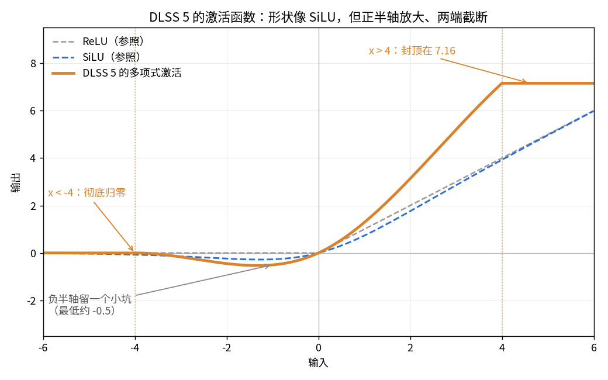
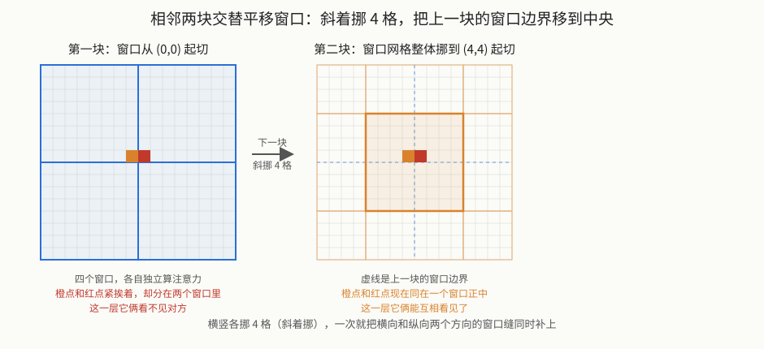

【DLSS5】相比 DLSS 4.5，扔掉了卷积、扔掉了归一化，直接画

━━━━━━━━━━━━━━━━━━━━

◆ 开篇：平面图画完了，该进房间了

━━━━━━━━━━━━━━━━━━━━

上一篇（ https://mp.weixin.qq.com/s/Eq2IDP5QvFPGToQuCsBLRw ）把 DLSS 5 那个泄露模型的外形立住了：一个 U 形视觉网络，六站从 32 通道一路读到 1024 再重画回去，全网 71 个编号模块、152 个计算层。结尾留了一句“每个模块内部怎么运转，这一篇先不往里追”。

这一篇就追这个。

问题很具体：**一个模块（block）里到底摆着什么运算？** 说“注意力”“前馈”谁都会说，但这个网络的注意力跟大语言模型的注意力是一回事吗？前馈有多宽？残差是怎么加回去的？

先把结论摆出来，后面再一项项对：

**外围四站（32 到 256 通道）的每个块，是一个“窗口注意力”块——注意力只在 8×8 的小窗口里算，窗口外的像素互相看不见。** 到 U 形底部的 1024 通道那站，才换成大语言模型那种全局注意力。一个网络，两种注意力。

看清内部之后，这一篇还把上一代 DLSS 4.5 的 dll（NVIDIA 官方 GitHub 上公开挂着）也下来扫了一遍，跟它并排一放，这代到底改了什么就清楚了：**卷积没了，归一化层也没了，输出从“教滤镜怎么滤”变成了“直接画”。** 画质的变化，多半就是从这几处来的。

━━━━━━━━━━━━━━━━━━━━

◆ 第一章：一个外围块里有什么

━━━━━━━━━━━━━━━━━━━━

拿第 3 站（128 通道、4 个注意力头）的一个块举例，因为它的数字最典型。这个块的权重记录解开来，里面的矩阵按顺序是这些（形状统一写成“输入×输出”，跟 273 期（ https://mp.weixin.qq.com/s/iT0_PbnghTDiVaohrFWLFg ）立的行向量约定一致：数据从左边进、乘矩阵、从右边出）：

```
weight1        [128, 160]     前馈：128 → 160
weight2        [160, 128]     前馈：160 → 128
ffn_cos_skip   [128]          前馈残差的每通道系数
qkv            [128, 192]     注意力：128 → Q、K、V 各 64
attn_bias      [4, 64, 64]    每个头一张 64×64 的位置偏置表
attn_scale     [4]            每个头一个缩放系数
projection     [64, 128]      注意力输出投影：64 → 128
attn_cos_skip  [128]          注意力残差的每通道系数
```

八样东西，分成两条支路：前三样是**前馈支路**，后五样是**注意力支路**。每条支路算完，都把自己的输入按通道乘一个系数再加回来。写成代码形状就是：

```
# 前馈支路
h = activation(x @ W1)           # [128] → [160]，activation 是逐个数算的多项式，见细节三
x = h @ W2 + x * ffn_cos_skip    # [160] → [128]，加回输入

# 注意力支路（在 8×8 窗口内）
q, k, v = split(x @ Wqkv)        # [128] → 三个 [64]
a = window_attention(q, k, v)    # 见第二章，输出 [64]
x = a @ Wproj + x * attn_cos_skip    # [64] → [128]，加回输入
```

这就是一个块的全部。画成图是这样：


跟教科书里的 Transformer 块比，骨架一样（注意力 + 前馈 + 两次残差），只是顺序反着：教科书先注意力后前馈，这里是**先前馈后注意力** （从机器码里看，第一次矩阵乘法后面紧跟着的是激活函数，注意力的 QKV 在后头）。除了顺序，还有三处细节明显不一样，每一处都是从权重形状或者 GPU 机器码里直接读出来的。

────────────────────

💡 细节一：残差不是“加回去”，是“乘个系数再加回去”

标准残差连接是 `x + f(x)`，输入原样加回。这个网络多了一步：`x * s + f(x)`，其中 `s` 是每个通道一个学出来的系数（就是那两个叫 `_cos_skip` 的向量，每站各 32 到 256 个数）。

怎么确定的？在 512 通道那站的前馈层机器码里，能看到它先从权重指针的固定偏移读这一排系数，把 `input * ffn_cos_skip` 预装进矩阵乘法的累加器，然后才累加前馈的输出。累加器里先放什么，公式就是什么，没有猜的余地。

这个改动的意思是：网络可以自己决定“原信号保留几成”，而不是被架构锁死在“保留十成”。名字里那个 `cos` 我没找到解释，暂时只把它当个标签，别往余弦上硬靠。

────────────────────

第二处不一样的是前馈的宽度。

────────────────────

💡 细节二：前馈只宽 32，跟大语言模型的 4 倍完全不是一个量级

大语言模型的前馈层惯例是把维度放大 4 倍再压回来（4096 → 16384 → 4096）。这个网络外围站的前馈是 `d → d + 32 → d`：32 通道的站是 32 → 64 → 32，128 通道的站是 128 → 160 → 128，256 通道是 256 → 288 → 256。**放大的绝对量永远是 32，不是倍数。**

这个规律是把四站所有 36 个普通块的权重记录逐条按容量公式算出来的，每一条的字节数都严丝合缝地对上，才敢说它是规律而不是巧合。

为什么这么窄？这里只能给推测：外围站的位置数巨大（1080p 第一站有两百万个位置），前馈是逐位置算的，宽度每加一维，全图就多两百万次乘加。它宁可把宽度压到最低，把算力留给别处。到底部那站就反过来了，第三章会看到。

────────────────────

第三处是前馈中间那个激活函数。

────────────────────

💡 细节三：激活函数是三个常数的多项式，不是 GELU 也不是 ReLU

前馈中间那一步 `activation()` 是什么？这种东西权重里没有，只能看机器码。在 32 通道块的 SASS（NVIDIA GPU 的汇编）里，第一次矩阵乘法之后反复出现同一段：

```
x = clamp(x, -4, 4)
g = 0.447265625 - 0.055908203125 * |x|
g = 0.89453125 + x * g
y = x * g
```

先把值截到 [-4, 4]，然后用三个 FP16 常数算一个二次多项式当门控，再乘回 x。代进去画出来是这样：



**形状像 SiLU / GELU 那一族**：负半轴留一个浅坑（最低约 -0.5）而不是像 ReLU 那样一刀切平，正半轴放行。但有两处它自己的脾气：**正半轴比输入还大**（输入 2 输出 3.13，输入 4 输出 7.16，斜率接近 1.8 倍），以及两端被 clamp 硬截断——小于 -4 彻底归零、大于 4 封顶在 7.16。

放大和截断多半是配套的：这一步之后的数值要压回 FP8 存下来，能表示的范围有限，与其让极端值溢出，不如提前把两头削平；中间那段放大，则让有用的信号在 FP8 那点可怜的精度里占满格。用多项式而不是指数或误差函数，也是同一个道理——**FP16 上算多项式最便宜**，一次 clamp 加三次乘加就完事。

这三个常数是逆向时最踏实的一类证据：它们以立即数的形式写在指令里，反汇编出来就是那几个数，没有第二种解释。

────────────────────

到这儿，一个块的两条支路都清楚了，只剩中间那个 `window_attention()` 没展开。它是这个网络和大语言模型分道扬镳的地方。

━━━━━━━━━━━━━━━━━━━━

◆ 第二章：窗口注意力——只看 8×8

━━━━━━━━━━━━━━━━━━━━

在算开销之前，先说清一件容易卡住的事：**图像的注意力，是跟谁比？**

大语言模型里，注意力是往回看的：生成第 100 个词时，这个词的 q 要跟前面 99 个词的 k 挨个比相似度。前面那些词是以前算的，所以得把它们的 k、v 存着——这就是 KV 缓存的由来。

图像这边是往旁边看。一帧画面进来，所有位置**同时**参与计算：窗口里 64 个位置各自算出自己的 q、k、v，然后位置 0 拿 q 去跟这 64 个 k 挨个比（**包括它自己**），得到 64 个相似度，softmax 之后加权读那 64 个 v，就是位置 0 的新特征。64 个位置各做一遍，就是一张 64×64 的注意力矩阵。

**所有 k、v 都是这一刻当场算出来的，没有一个来自“历史”**，所以这个网络里没有 KV 缓存这回事，算完这帧就全扔掉。它比的对象是空间上的邻居：浅层是邻居像素，深层是邻居那块已经被压缩过的“抽象像素”。

一句话记这个区别：**文本的注意力往回看，图像的注意力往旁边看。** 文本里相关的东西在时间上（前面说过的话），图像里相关的东西在空间上（旁边那块画面）。

那为什么不能像文本一样，让每个位置跟全图所有位置比一遍？算笔开销就知道了。

先看大语言模型这边。注意力的核心是“每个 token 看所有 token”：n 个 token 就要算 n × n 对关系。4096 个 token 的上下文，是 1600 多万对，显卡吃得下。

现在换成图像。假设第一站的位置数是 1080p 的像素数：

```
n = 1920 × 1080 ≈ 207 万个位置
全局注意力：n × n ≈ 4.3 × 10¹²  对关系
```

四万亿对。就算每对只算一次乘法，一帧要跑几毫秒的实时渲染根本不可能。**图像的 token 数比文本多三个数量级，n² 就爆了六个数量级。** 这不是优化能解决的，是量级问题。

Swin 的解法（2021 年微软提出，就是核心名字里那个 `swin`）简单粗暴：**把画面切成 8×8 的小窗口，注意力只在窗口内 64 个位置之间算。** 窗口外的像素在这一层互相看不见。

```
窗口注意力：n × 64 ≈ 1.3 × 10⁸  对关系
```

从四万亿降到一亿多，缩了三万多倍。代价是每个位置这一层只能看到周围 8×8 的邻居。

────────────────────

💡 为什么文字能全局看、图像不能

不是图像“不值得”全局看，是 token 数量级不同。一段 4K 长度的文本是 4096 个 token；一帧 1080p 画面是 207 万个位置，多了五百倍。注意力的开销按平方涨，五百倍的 token 就是二十五万倍的开销。

所以视觉网络在外围（位置多、通道窄）一定用某种局部化的注意力，到了深处（位置少、通道宽）才用得起全局注意力。这不是 DLSS 一家的选择，是所有高分辨率视觉 Transformer 的共同处境。

────────────────────

窗口内怎么算？动手之前先把三个层级摆清楚，不然很容易串——拿 1080p 在第 1 站（32 通道）的实际数字：

```
整幅画面    1920 × 1080 个位置
切成窗口    240 × 135 = 32400 个窗口     （1920÷8，1080÷8）
每个窗口    8 × 8 = 64 个位置
每个位置    32 个数（第 1 站的通道数）
```

三层从大到小是**窗口 → 位置 → 维度**。要记住的是：**q、k、v 挂在最底下那层——每个位置各有一份，不是每个窗口一份。** 第 1 站每个位置的 32 维过一遍 qkv 矩阵，得到属于它自己的 q、k、v 各 16 维；一个窗口里因此有 64 份 q、64 份 k、64 份 v，两两一比就是那张 64×64 的注意力矩阵。三万多个窗口各干各的，互不相干——这也正是显卡喜欢的形状。

层级理顺了，把第一章那个 128 通道块的数字代进来，一个 8×8 窗口里有 64 个位置，4 个头：

```
q, k, v：每个位置 64 维，分 4 个头，每头 16 维
每个头：
  logits = cos(q, k) × attn_scale + attn_bias    # [64, 64]
  weights = softmax(logits)                       # [64, 64]
  out = weights @ v                               # [64, 16]
四个头拼起来：[64, 64]，再过 projection 回到 128
```

有两处跟标准注意力不一样：

**一是用余弦相似度代替点积。** 标准注意力是 `q · k / √d`；这里 q 和 k 先各自归一化成单位向量再算点积，结果就是夹角的余弦，范围锁死在 [-1, 1]，然后乘一个每头独立的缩放系数 `attn_scale`（实测 128 通道块的四个头分别是 11.47、5.14、5.26、9.62）。这么做的好处是数值稳定，在 FP8 这种精度上尤其要紧。

**二是加了一张 64×64 的位置偏置表。** 窗口内 64 个位置两两之间的相对位置关系，各自学一个偏置加到 logits 上。这张表每个头一张，从权重记录里能直接数出来：`4 × 64 × 64 = 16384` 个数，正好是 `attn_bias` 那条记录的大小。

────────────────────

💡 每个头永远是 16 维，头数跟着通道数走

外围四站的注意力内宽都是通道数的一半，再按头数平分：32 通道 1 头就是 1 × 16，64 通道 2 头是 2 × 16，128 通道 4 头是 4 × 16，256 通道 8 头是 8 × 16。**头的维度锁死在 16，加通道就是加头数。**

上一篇说“注意力头就是几双眼睛”，这里能看到每双眼睛的“分辨率”是固定的，站越深眼睛越多，但每双眼睛的构造一样。

**但这条规律只管外围那四站。** 到 512 和 1024 这两站，两处都变了：QKV 不再砍半，Q、K、V 各自跟通道数一样宽（512 站是各 512，1024 站是各 1024）；每头的维度也从 16 涨到了 32——512 站是 16 个头，1024 站从那条 128 字节的缩放系数记录推算是 32 个头（每头一个四字节的系数），两站都是 32 维一个头。

一句边界：外围四站的每头 16 维是在真显卡上用受控输入验过的，512 和 1024 这两站的头数和维度是按权重记录的大小算出来的，还没实测过。而且那条缩放系数记录内部到底怎么排，逆向时按几种常见格式解码都对不上，目前还没读通。

────────────────────

还有一个问题：窗口切死了，窗口边上的像素永远看不到隔壁窗口的邻居，边界处岂不是有缝？Swin 的标准答案是**相邻两块交替平移窗口**：这一块窗口从 (0, 0) 起切，下一块把整个窗口网格**横竖各挪 4 格**（斜着挪，不是只挪一个方向）再切，原来卡在边界上的像素，这一块就落到窗口中央了。



斜着挪是有讲究的：只挪横向，纵向那条缝就永远补不上。横竖各挪一半窗口，一次就把两个方向的边界都移到了中间。

这个网络也这么干。从 GPU 核心的运行参数看，每站的第一块不平移，后面的块带 `shift = (-4, -4)`：先把整幅特征图循环挪 4 格、切 8×8 窗口算注意力、用一张遮罩把挪过来“串门”的位置屏蔽掉、再挪回去。这套“挪、切、遮、挪回”跟 Swin 论文里的做法一致，是在原版核心上用受控输入做角点脉冲测试确认的：不平移的核心，脉冲的影响范围是完整 8×8；平移的核心，边界处被遮罩切成 4×4 的连通块。

━━━━━━━━━━━━━━━━━━━━

◆ 第三章：越深切得越细，到底部换成另一种注意力

━━━━━━━━━━━━━━━━━━━━

上一篇那张表里，外围四站每个块只占一个计算层，512 通道站一个块占四层，1024 通道站一个块占五层。现在能说清楚切的是什么了。

**外围四站：一个块 = 一个 GPU 核心。** 第一章那八样东西，前馈、激活、注意力、投影、两次残差，全部融合在一个核心里一次算完。核心名字里的 `fused` 就是这个意思。窗口只有 64 个位置、通道最多 256，一个线程块吃得下。

**512 通道站：一个块切成四个核心。**

```
第 1 层  前馈展开    512 → 512
第 2 层  前馈收缩    512 → 512，加残差系数
第 3 层  算 QKV 并做注意力
第 4 层  注意力投影  256 → 512，加残差系数
```

数学没变，还是那两条支路，只是显卡一次融合不了这么宽的运算，切成四步。核心名字从 `fused_swin` 变成了 `split_swin`，字面意思。

**1024 通道站（U 形底部）：一个块切成五个核心，而且注意力换了种类。** 这站的核心名字是 `cc_vit_1d_block`，不再带 `swin`。五层的权重记录逐字节解开是这样：

```
第 1 层  前馈展开    1024 → 4096              权重 4 MB
第 2 层  前馈收缩    4096 → 1024              权重 4 MB + 1024 个残差系数
第 3 层  算 QKV      1024 → Q、K、V 各 1024    权重 3 MB
第 4 层  做注意力    无权重，只有一条缩放系数
第 5 层  注意力投影  1024 → 1024              权重 1 MB + 1024 个残差系数
```

底部这一站一共八个块，编号 block31 到 block38，**结构完全同构**——这八块的五层权重记录逐字节对下来，分区大小分毫不差，是同一个模子出来的八份。对比第一章外围块的数字，能看到底部块**每一处都反过来了**：

- 前馈中间宽度是 4096，正好 4 倍，跟大语言模型的惯例一样，不再是“加 32”；
- QKV 是全宽的，Q、K、V 各 1024，不再是通道数的一半；
- 名字里的 `1d` 说明位置已经被拉平成一维序列，**注意力在整个序列上算，没有窗口**。

也就是说，**U 形底部这八个块就是标准的 Transformer 块**，跟大语言模型里的一层没有本质区别。它用得起，是因为位置数已经压到了很小：4K 档实测下来，底部是 60×36 = 2160 个位置（这条尺寸链下面讲 skip 时会完整列出来）。两千个 token 的全局注意力，对显卡来说是小菜。

一个网络，两种注意力：**外围位置多、通道窄，用 Swin 窗口注意力省算力；底部位置少、通道宽，换成 ViT 全局注意力把整幅画看一遍。** 上一篇说的“下坡读懂、底部想清楚”，机制上就是这个。

那除了注意力块，这网络里还有别的东西吗？有，但很少，而且全在两头：

**进门处有卷积。** block0 的权重记录里，头两样是 `input_adapter_weight [7, 32]` 和 `dw_weight [32, 3, 3]`——前者把七个输入通道投影成 32 个特征通道，后者是一个 3×3 的深度卷积。**全网的卷积就这一处**，作用是把原始像素先捏成特征，然后才交给后面那一长串注意力块。有意思的是输入是七通道而不是三通道：RGB 三个之外还有四个，机器码里能看到它们是当场用 Box–Muller 方法生成的高斯随机数。一个确定性的修复网络本来不需要随机数，这条线索留到后面的期数再追。

**上下楼的层不是注意力块。** 下坡的降采样和上坡的升采样各有专门的核心（名字带 `_ds` 和 `_upsample`），干的是尺寸和通道数的换算，数学上更接近“重新排列加一次线性变换”，不做注意力。上一篇表里那几个单独占位的块编号，就是它们。

**出门处有一个混合系数。** 最后的 block70 除了主权重，还挂着一条只有一个数的权重记录：`blend_scale = 0.7397`。网络算完的结果不直接当画面，而是跟原图按大约 74 比 26 混合后才输出。整个 147 MB 权重包里，它是唯一一个单独成条的标量。

除此之外，泄露的 DLL 里还有一批不参与网络计算的配套核心——亮度转换、自动曝光、画面捕获，甚至还有渲染调试文字用的字体核心。它们是工具，不是模型的一部分。

所以完整的答案是：**主干上是一长串注意力块一条道走到底，卷积只在门口守着，出门时按一个固定比例跟原图调和。** 结构上极其规整，没有分支、没有循环、没有条件判断——一帧画面进来，顺着这条直线走一趟就出去了。

────────────────────

💡 那几条横跨半个网络的线，到底在干什么

上一篇讲 U 形图时提过六条 skip：下坡某一站的输出，横跨半个网络直接送给对面上坡站。有读者留言问这到底是什么，这里补足。

**先说它要解决的问题。** 网络下坡时画面尺寸一路缩小（说的是横向像素数）：1920 → 960 → 480 → 240 → 120 → 60。缩到 60 这么小的时候，模型对整幅画的理解已经很到位——知道这是个人、这块是金属护甲、那片是头发。但**每根头发具体在哪儿，早就没了**：60×36 的格子里装不下那个精度。

右边上坡要把画面重新放大回 1920。光靠“这里有头发”这个抽象理解，模型只能猜每根头发画在哪，画出来必然是糊的。

**skip 就是给它补上这份丢掉的位置信息。** 下坡每走到一站，顺手把当时的画面存一份；上坡回到同样尺寸时，把这份直接取回来一起用。存的那份里，头发的位置还是清楚的。

拿 4K 档实测到的尺寸看，六站是这么一路缩下去、六条 skip 一路对应回来的：

```
第 1 站  1920 × 1088    block0  ──skip──→  block70（输出块）
第 2 站   960 ×  544    block4  ──skip──→  block66
第 3 站   480 ×  272    block8  ──skip──→  block62
第 4 站   240 ×  136    block14 ──skip──→  block56
第 5 站   120 ×   68    block22 ──skip──→  block48
第 6 站    60 ×   36    block30 ──skip──→  block39（底部出来的第一站）
```

（网络吃的是游戏渲染出来的低分辨率画面、输出才是 4K，所以第一站是 1920×1088 而不是 3840×2160。高度是 1088 不是 1080，因为 1080 连着除五次 2 会出小数，得先补齐到 8 的倍数——多出来的几行填零，缩到底才正好是整数。最底下那个 60×36 就是第三章说的“压到两千个位置”的出处。）

两路信息分工很干净：

- **主干**（从最深处一路上来的）：告诉网络**画什么**——这块该是头发；
- **skip**（从对面横过来的）：告诉网络**画在哪**——具体是这根线的位置。

换个更土的说法：**下坡是把一篇文章读成摘要，上坡是照着摘要重写全文。** 光凭摘要写不回原文，所以下坡时每读一段就存一份原文，重写到对应位置时拿出来对着改。这就是 skip，2015 年 U-Net 论文的核心发明，后来做超分、去噪、图像生成的网络基本都照抄。

**顺带纠正上一篇的一句话。** 上一篇写“这个网络的 skip 更接近拼接”，还留了句“到底是纯拼接还是拼接后再压一层，得看具体运算”——现在运算读通了，两个说法都不太准。

按教科书，两路信息汇合有两种老办法：**相加**（对应位置逐个加，维度不变）和**拼接**（并排摆一起，维度翻倍，后面再加一层压回去）。这个网络两种都不是：那五个接 skip 的上坡块，**两路输入直接进同一个 GPU 核心，一次算出结果**，输出宽度是核心写死的。以 block66 为例，主干从 block65 拿 64 通道进来，skip 从 block4 横过来，输出 32 通道——它本来就是个“通道减半、尺寸放大一倍”的层，skip 是作为第二路输入参与这次运算，不是先拼成 96 通道再找地方压。所以不存在“翻倍”这回事。

还有个容易漏的细节：执行图里 skip 取的是 `output1`，**不是那个下坡块的主输出**。这类下坡块一次运行吐两份东西——output0 是压缩过、给主干继续往下走的，output1 是专门留给对面的那份。**它不是顺手把废料递过去，是特意为对面准备的一路输出。**

最后分清一个容易混的：交叉注意力（cross-attention）也是“看另一份信息”，比如翻译模型解码时回头看编码端。但那是拿自己的 q 去对方那边算一遍加权读取，**带着问题去档案库检索、只挑相关段落回来**；skip 是**把整份旧稿原样塞回来**。前者要额外一套 QKV 权重，后者一条线就够。这五个块的权重记录里没有多出来的 QKV，是后者。前面说过外围站连自家 8×8 窗口都舍不得扩，更不可能在回程再加一套全局检索。

────────────────────

到这儿，一个块里的每样东西都有了着落。顺手回答一个自然的问题：这套结构跟上一代比，到底变没变？

━━━━━━━━━━━━━━━━━━━━

◆ 第四章：跟 DLSS 4.5 比一眼——从混血到纯血

━━━━━━━━━━━━━━━━━━━━

DLSS 4.5 的超分模型不用泄露——`nvngx_dlss.dll` 就在 NVIDIA 官方 GitHub 上挂着（DLSS 仓库 v310.7.0，56 MB），谁都能下。把它按同样的路数扫一遍 strings，收获比预想大。先说血缘：4.5 的 dll 里留着一份训练时的权重名清单，命名就是 `swin_enc_4_block_attention_...`——**它自己就管自己叫 swin**。所以 4.5 和丁鱥是同一条 Swin 技术线上的两代，都是窗口注意力的 U 形网，窗口也都是 8。

但同一条线不等于同一套东西：两代根本不是同一个代码库（丁鱥的类名前缀是 `CC`，4.5 是 `dltss`，deep learning temporal super sampling），细节差在五处：

**一、卷积还在 vs 卷积没了。** 4.5 的核心名单里一大半是卷积：`conv_3x3_pool` 负责下采样、`bilinear_upsample_conv` 负责上采样，注意力站（enc0 到 enc4、dec0 到 dec5，也是个 U 形）穿插其间——**卷积负责上下楼，注意力负责思考**，是个混血结构。丁鱥全网除了入口那一个 3×3 depthwise，一个卷积都没有，上下采样也换成了专门的重排层——纯 Transformer。官方宣传里 DLSS 4 就“从 CNN 换成了 Transformer”，从二进制看，4.5 换得没那么彻底，丁鱥这代才把血换干净。

**二、宽度差一档。** 4.5 注意力层的通道数直接写在编译模板参数里：32、64、96、128、160——最宽一百来个通道，而且从头到尾全是 8×8 窗口注意力，**没有全局注意力那一站**。丁鱥一路加宽到 1024，还在底部摆了八个全局注意力块。第二章算过的那笔开销，4.5 的答案是“全程只看窗口”，丁鱥的答案是“压到够小再看全局”。

**三、丁鱥把归一化层砍了。** 4.5 的权重名里，每个块都有两条 `norm_weight`——注意力支路前一条、前馈支路前一条，就是大语言模型里每层必备的那种归一化层（这批名字只有 weight 没有配套的 bias，更像 RMSNorm 那一类，不是标准 LayerNorm——两者的区别 189 期 https://mp.weixin.qq.com/s/1eHHpKrJAtKvA_4RZExNvQ 讲过）。此外还有 `pos_embedding`，位置嵌入。丁鱥这两样都没有：全网 153 条权重记录，**没有任何一条是归一化**。它靠什么稳住数值？第二章讲过的余弦注意力——q、k 先归一化成单位向量再算相似度，归一化被揉进注意力本身了，不再单独占一层；位置信息也从嵌入换成了那张 64×64 偏置表。对翻过大语言模型权重的读者，“整个网络没有 norm”应该是这一章最意外的一条。

**四、FP8 不是同一种 FP8。** 4.5 用的是 E5M3、还逐核心跟 FP16 混搭；丁鱥统一 E4M3。这两种都是 8 位浮点，区别在怎么分配那 8 个 bit：E5M3 指数位多一位、管的是数值范围，E4M3 尾数位多一位、管的是精度。从 4.5 到 5 的切换方向是“范围换精度”——网络算得更稳了，不需要那么大的动态范围兜底。

**五、最后一笔怎么画，思路变了。** 4.5 的输出头叫 `aniso_gaussian_dfn`：网络不直接输出像素，而是给每个位置预测一个 3×3 或 5×5 的滤波核，拿这个核去滤原图——本质是“教滤镜怎么滤”，画面上的每个像素仍然来自原图的像素加权。丁鱥是网络直接输出 RGB、再按一个混合系数跟原图叠——**从“预测怎么滤”变成“直接画”**。要说哪处改动跟“画质变化大”关系最直接，多半是这一处：滤波头再聪明，也只能重新组合原图里已有的东西；直接画，才能补出原图里没有的细节。这也跟丁鱥入口吃四个噪声通道对上了——生成新细节需要随机性当原料，这个话题留给后面的期数。

一句边界：4.5 这份分析只到 strings 和编译模板这层，没做丁鱥那种在真显卡上逐块核对的硬功夫；这一个 dll 里还装着好几套模型（字符串里有 Preset A 到 E），不排除部分卷积核是在伺候旧版模型。另外 4.5 的窗口类叫 `PaddedWindow`（补边窗口），跟丁鱥验证过的“平移 + 遮罩”可能不是同一种边界处理，但光看名字定不了案。轮廓可信，细节留有余地。

────────────────────

💡 彩蛋：NVIDIA 内部是个动物园

丁鱥（honest_tench）不是孤例。4.5 的 dll 里漏出来的内部权重版本号全是这个画风：juicy_penguin（多汁企鹅）、arboreal_hedgehog（树栖刺猬）、cornflower_rook（矢车菊白嘴鸦）、eager_donkey（热切驴）、garrulous_pillbug（话痨鼠妇）……随机形容词加随机动物，一套训练权重一个代号。更有意思的是还漏了一条完整的内部路径：某研究组某年九月在集群上跑去噪实验存下的 PyTorch checkpoint。**编译器不撒谎，二进制里连训练日期都带着。**

────────────────────

比完这一眼，最后交代这一篇的数字是从哪来的。

━━━━━━━━━━━━━━━━━━━━

◆ 第五章：这些数字是怎么读出来的，以及一处勘误

━━━━━━━━━━━━━━━━━━━━

上一篇讲的是“网络长什么样是怎么看出来的”，这一篇的数字来源不太一样，简单交代三条：

**权重记录的形状，靠容量公式逐条闭合。** 每条权重记录只有名字和总字节数，没有形状。做法是先假设一套形状（比如“前馈中间宽度 = d + 32、QKV 是 d × 3d/2”），算出总字节数，跟记录对；四站 36 条普通记录全部对上，公式才成立。对不上的假设当场就死了，比如一开始按 4 倍前馈算，第一条就差一大截。

**激活函数和残差公式，靠读 GPU 机器码。** 权重里没有的东西，只能看核心怎么算。DLL 里内嵌了 15 个编译好的 CUDA 核心，提取出来用 NVIDIA 自家的 `nvdisasm` 反汇编，那三个激活常数、残差系数的读取偏移，都是指令里的立即数和地址。

**窗口平移和头的划分，靠在真显卡上直接跑原版核心。** 这些泄露的核心是 Blackwell 架构的，DGX Spark 的 GB10 芯片能直接加载运行。喂受控输入（比如只在一个角点放脉冲、其余全零，或者把权重换成单位矩阵）看输出的响应范围，8×8 的窗口边界、平移后的 4×4 连通块、每头 16 维的划分，都是这么验出来的。

────────────────────

💡 勘误：上一篇说“文件里存的是 FP16”，说早了

上一篇第三章的结论是“文件里存 FP16，芯片上算 FP8，中间隔着一次转换”。写的时候证据是：每条权重记录的字节数都等于元素数 × 2，抽样按 FP16 解码全是合理的有限数。看起来很硬。

这两天往下追那个“转换器”，追出了反转：**根本没有转换器。** 从机器码逐字节核对一条 512 通道站的 QKV 记录，它内部分成三段：前面一大段是按 FP8 打包好的矩阵，中间一段是 FP16 的位置偏置表，尾巴上 16 个 float32 的缩放系数。机器码从这三段读数的偏移量，跟这个分法逐字节对上。也就是说权重包是**混合格式**：大矩阵本来就是 FP8，小向量才是 FP16。“字节数 = 元素数 × 2”只是打包时的外层计数方式，抽样解出合理的 FP16 是因为抽到的那几条恰好是小向量。

所以“加载时转一次”撤回：FP8 在训练完导出权重时就做好了，运行时拿到的就是核心要的格式。上一篇说“卡在权重折叠格式”这件事还在，只是卡的不是精度转换，是 FP8 矩阵在显存里按张量核心要求的重排规则。

错在哪很清楚：外层计数方式和内层数据类型是两回事，看到“× 2”就往 FP16 上靠，跳得太快。连载就这点好，上一集的推断这一集能翻案。

────────────────────

认完账，收个尾。

━━━━━━━━━━━━━━━━━━━━

◆ 第六章：所有的“怪”，都是几毫秒逼出来的

━━━━━━━━━━━━━━━━━━━━

回头看这一篇发现的每一处“跟教科书不一样”，它们不是各自独立的设计趣味，全部指向同一个约束：**这个网络一帧只有几毫秒，还得跟游戏本身抢同一块显卡。** 游戏跑 60 帧，一帧总共 16 毫秒，画面本身的渲染要占掉大半，留给它的就是那么几毫秒。

把它们排在一起就是一张优化清单：

```
前馈只加 32、不是放大 4 倍     外围两百万个位置，每加一维就是两百万次乘加
注意力只看 8×8 窗口           全局要四万亿对关系，窗口只要一亿多
QKV 砍到通道数的一半          注意力内宽 64 而不是 128，又省一半
激活用多项式、不用指数         一次截断加三次乘加就完事，exp 太贵
归一化层整个不要              揉进余弦注意力里，省掉一整层的读写
外围一个块融合成一个核心       八样运算一次算完，中间结果不落显存
矩阵按 FP8 存、按 FP8 算       张量核心吃 8 位比 16 位快一倍
底部才敢用全局注意力           因为那时只剩两千个位置了
```

这里面没有一条是“为了效果更好”，全是“为了在预算内跑完”。**它不是因为模型只能做这么小才长成这样，是先把每帧几毫秒焊死，再倒推模型能长多大。**

跟大语言模型对照一下就更清楚了：那边现在是“能堆多大堆多大，慢一点用户等得起”；这边是预算焊死、在里面雕花。7380 万参数今天听起来很小，但它每秒要跑一百多次——按每秒消耗的总算力算，未必比一个慢吞吞的大模型省。

真正值得学的是它省得挺讲究：**砍掉的都是能用结构补回来的**（窗口小，就靠交替平移和一路下采样把视野扩回来；没有归一化层，就靠余弦把数值范围锁死），**保住的是真正决定画质的那几处**（底部那一站敢用 4 倍前馈、敢用全局注意力）。知道该在哪省、该在哪花，比单纯把模型做小难得多。

━━━━━━━━━━━━━━━━━━━━

◆ 收尾：预算焊死，然后在里面雕花

━━━━━━━━━━━━━━━━━━━━

这一篇把上一篇那张 U 形图里的房间挨个打开看了一遍。外围四站每个块是一个 Swin 窗口注意力块：前馈只宽 32、注意力用余弦加位置偏置、每头 16 维、只在 8×8 窗口里算，相邻块交替平移窗口补缝；残差是乘系数再加，激活是三个常数的多项式。到 U 形底部，八个块换成标准 Transformer：前馈 4 倍、QKV 全宽、全局注意力。

外围为什么只看 8×8？因为图像的 token 比文本多三个数量级，全局注意力的平方开销爆六个数量级，只能局部看；底部为什么敢全局看？因为位置数已经压到两千个。**一个网络里两种注意力并存，不是设计上的折中，是量级逼出来的分工。**

跟 DLSS 4.5 并排一放，代际的方向也清楚了：卷积清出场、注意力加宽加深、输出从“教滤镜怎么滤”换成“直接画”。丁鱥才是 NVIDIA 第一个纯 Transformer 的画面模型。

把这些放在一起看，这个模型真正的本事不在参数量，而在**它清楚地知道哪些地方可以省、哪些地方必须花**。至于它在别的显卡上跑出来的画面现在到了什么程度，是另一篇的事。

━━━━━━━━━━━━━━━━━━━━

◆ 参考资料

━━━━━━━━━━━━━━━━━━━━

本文所有数字来自对网上流传的那份泄露样本 `nvngx_dlssnr.dll`（SHA-256：`e16bcf15e16e13f527491cdf7845b2fe6521a738d8f7c9c721866a8496e1fc8e`）的直接分析：权重记录按容量公式逐条闭合，激活与残差公式来自内嵌 CUDA 核心的反汇编，窗口与头的划分在 DGX Spark 上直接运行原版核心验证。

Liu et al., Swin Transformer: Hierarchical Vision Transformer using Shifted Windows, arXiv:2103.14030（微软亚洲研究院，2021；8×8 窗口注意力与交替平移窗口的出处）

Dosovitskiy et al., An Image is Worth 16x16 Words: Transformers for Image Recognition at Scale, arXiv:2010.11929（Google，2020；ViT，底部那站核心名字的出处）

Ronneberger et al., U-Net: Convolutional Networks for Biomedical Image Segmentation, arXiv:1505.04597（弗赖堡大学，2015；U 形网络与 skip 拼接的出处）

NVIDIA, PTX ISA 9.1, Matrix Fragments for mma.m16n8k32（E4M3 张量核心片段布局的官方规范）

NVIDIA, DLSS Super Resolution SDK v310.7.0, github.com/NVIDIA/DLSS（第四章对比用的 nvngx_dlss.dll 出处，官方仓库公开可下，SHA-256：be6e434a94ca32499515eb62ca0e6c274526055d568d0426e4c652dcdfb6ee6e）

━━━━━━━━━━━━━━━━━━━━

外围四站每个块是一个 Swin 窗口注意力块：注意力只在 8×8 窗口里算，前馈只宽 32，每头 16 维；到 U 形底部才换成前馈 4 倍、全局注意力的标准 Transformer。

图像的 token 比文本多三个数量级，注意力的平方开销就爆六个数量级——外围只能局部看，底部压到两千个位置才敢全局看。

一个网络里两种注意力并存，不是设计上的折中，是量级逼出来的分工。

前馈只加 32、注意力只看 8×8、归一化整个不要、矩阵按 FP8 算——没有一条是为了效果更好，全是为了在几毫秒里跑完。

━━━━━━━━━━━━━━━━━━━━

// 靳岩岩的 AI 学习笔记 × Claude 的严谨 × Gemini 的浪漫
// 2026年9月3日

━━━━━━━━━━━━━━━━━━━━

【摘要（发布用，不进正文）】

把 DLSS 4.5 的 dll 也下来对比了一眼：从 4.5 到 5，卷积没了、归一化层没了、输出从“教滤镜怎么滤”变成“直接画”。顺带看清一个块的内部：8×8 窗口注意力、余弦相似度、三个常数的激活函数，全部从二进制里读出来。
