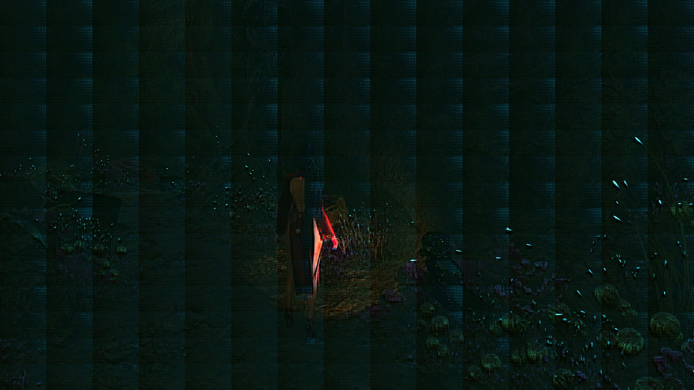

【DLSS5】如何在 AMD RX 9070 XT 上跑通 DLSS 5 的神经网络

━━━━━━━━━━━━━━━━━━━━

◆ 开篇：先说现在跑到哪了

━━━━━━━━━━━━━━━━━━━━

前面三篇（ https://mp.weixin.qq.com/s/ZlMYIXnkGNTGAWZqpIiSzg ）把泄露的 DLSS 5 模型从 dll 里挖出来、画了 U 形图、开了每个模块的门。297 期（ https://mp.weixin.qq.com/s/Eq2IDP5QvFPGToQuCsBLRw ）结尾说“执行图已经读通，卡住的是权重在显存里的排列”；298 期（ https://mp.weixin.qq.com/s/FrmuoEoqpUkze7nlTGIAbg ）结尾说“它在别的显卡上跑出来的画面到了什么程度，是另一篇的事”。

这一篇就是那另一篇。这是一个开发中的项目，所以先把现状原样摆出来，不修饰：

**这个网络已经能在 AMD Radeon RX 9070 XT 上完整跑通 71 个模块，输入是《剑星》正在运行时的真实游戏帧，输出的画面能认出角色、界面和细线，还能在游戏不重启的情况下把结果热切换进正在显示的画面。** 这些是真的。

**但一帧要 30 秒，其中网络本身 11 秒，离“实时”差三个数量级。** 也是真的。同一天早上还是 484 秒一帧，一天之内砍到 30 秒，砍掉的东西几乎没有一样是“算得更快了”，这个后面细说。

先上图。这是 9070 XT 算完、写回正在运行的《剑星》之后的桌面截图，主菜单，4K：


一句实话要先讲：这个网络的最后一步是“原图加上网络算出的残差”，残差相对原图的平均误差只有 0.012，所以这张图看上去就是《剑星》正常的一帧。它证明的是**链路通了、71 块没算坏**，不是画质提升。要看画质差异得跟 NVIDIA 原版逐像素比，那是后面的事。

整件事分三步：先证明每一块都算对，再接进真游戏，最后让它快起来。三步各卡过一次，每次卡的地方都不是一开始以为的地方。

先交代设备，这次是三台机器一起干活：

```
DGX Spark（GB10）        逆向 + 标准答案机：直接加载泄露的 CUDA 核心
RTX 5090（外置 OCuLink）  原版运行环境：跑真游戏，抓真实中间层
RX 9070 XT（Windows 11） 移植靶机：Direct3D 12 + HLSL 计算着色器
```

三台机器各干一件事，缺一台整条路都走不通。为什么，看下去就知道。

不过在讲过程之前，得先补一章我自己的课。这个项目里出现的东西，D3D12、HLSL、DXC、DirectML、NvAPI、ReShade，我之前一个都不懂，写 CPU 程序的人对显卡这套东西基本是陌生的。下面这章是我边问边记的，懂图形编程的读者可以直接跳到第二章。

━━━━━━━━━━━━━━━━━━━━

◆ 第一章：补课：显卡是怎么被程序使用的

━━━━━━━━━━━━━━━━━━━━

**先说最根本的一条：在显卡上你不是在调用函数，是在往一条传送带上放任务。**

写 CPU 程序的直觉是“我调用一个函数，它立刻执行，返回值到手”。显卡完全不是这样。显卡是一台独立的机器，有自己的内存（显存）、自己的调度器，CPU 只能**给它写任务清单**，然后等。不管是微软的 Direct3D 12、跨平台的 Vulkan 还是 NVIDIA 的 CUDA，底层都是同样四样东西：

```
资源（resource）            显存里的一块内存，缓冲区或者纹理
着色器（shader）            跑在显卡上的程序，成千上万个线程同时跑同一份代码
命令列表（command list）    CPU 写的任务清单：“把这块拷到那块、跑这个着色器、等一下”
队列和栅栏（queue / fence）  清单提交进队列，显卡按序执行，栅栏是“做到这了”的信号
```

“着色器”这个名字我迷糊了很久，其实它就是“显卡上的程序”，名字是个化石：二十多年前显卡上唯一能编程的地方是“算每个像素什么颜色”那一步，给像素上色，所以叫 shader。后来显卡什么都能算了，名字没改。这个项目里的着色器全是 compute shader，一个像素都没上过色。同一个东西 AI 世界叫 kernel，正文里 NVIDIA 那边说的“CUDA 核心”和 AMD 这边说的“着色器”是一回事。

在显卡上做一次矩阵乘法，完整流程是这样的：

```
1. 在显存里建三块缓冲区：输入、权重、输出
2. CPU 把数据写进“上传堆”，再命令显卡把它拷进显存本体
3. 录一条命令列表：“跑这个着色器，起 N 个线程”
4. 提交进队列，等栅栏
5. 命令显卡把结果拷到“回读堆”，CPU 这才能读到
```

第 2 步和第 5 步里出现了三种内存，后面会反复见到：**默认堆（default heap）** 是显存本体，CPU 看不见；**上传堆（upload heap）** 是 CPU 往显存送东西的中转站；**回读堆（readback heap）** 是显存往 CPU 送东西的中转站。每过一次中转站就是一次拷贝加一次等待。第五章讲的“把中间张量留在默认堆，只在入口上传、末端回读”，砍的就是这些往返。

线程模型也跟 CPU 反着来。你不写循环，你写 **“一个线程干什么”**，然后告诉显卡起多少个线程。起线程的单位是“线程组”，一组几十到几百个线程，一次派发（dispatch）可以起几万个组。它有硬上限：单个维度最多 65535 个组。这个项目里就撞过：4K 一帧按 8×8 窗口切有十几万个组，一维排下去直接超限，改成二维索引才过。

**着色器用什么写？** D3D12 那边是 HLSL，长得像 C，一个函数就是一个线程要干的活，加几个内置变量告诉你“我是第几个线程”。它的编译跟 CPU 程序有个关键区别：**分两段，第二段不在你手里**。

```
HLSL 源码                      你写的
   │  第一段：FXC 或 DXC          微软的编译器，在你机器上
   ▼
中间字节码（DXBC 或 DXIL）      跟厂牌无关，像 Java 的 .class
   │  第二段：显卡驱动里的编译器   AMD / NVIDIA 各自的，加载着色器时才跑
   ▼
显卡原生指令                    9070 XT 就是 RDNA4 的机器码
```

你编出来的是中间码，真正的机器码是驱动在运行时现翻的，所以驱动一升级，同一份着色器跑出来的东西可能就不一样。第一段的编译器有两代：老的叫 FXC，2009 年 DirectX 11 时代的产物，只支持到 Shader Model 5，输出微软自家的 DXBC 字节码；新的叫 DXC，基于 LLVM，输出的 DXIL 本质上是 LLVM 中间表示，支持 Shader Model 6 以上。Shader Model 是 HLSL 和驱动之间的合同版本号，规定这个版本的着色器能用哪些指令、哪些数据类型，类比 CPU 那边的 SSE、AVX：6.0 起有 wave 操作（一组 32 或 64 个线程之间直接交换数据，不用走显存），6.2 起有原生 FP16，9070 XT 的驱动报的上限是 6.8。第五章那个“只换编译器快 14 倍”，就是第一段从 FXC 换成 DXC：LLVM 把前馈里那个固定次数的循环完全展开、常量折叠、寄存器分配全是现代水平，交给驱动第二段的原料好得多。数据类型没动，所以输出逐字节一样。

到这里，把这个项目用到的东西按层摆一遍，就能看出每样东西是干什么的了：

| 层 | 东西 | 解决什么问题 |
|---|---|---|
| 驱动接口 | Direct3D 12（微软） | 上面那套资源、命令、队列的接口，所有厂牌显卡通用。AMD 侧全部宿主程序走它 |
| 驱动接口 | CUDA（NVIDIA） | 同一套东西的 NVIDIA 专用版，只认 N 卡。Spark 上直接加载泄露的核心当标准答案机，走它 |
| 着色器 | HLSL + FXC / DXC | 显卡程序的语言和编译器。AMD 侧所有计算核心 |
| 矩阵加速 | DirectML（微软） | 架在 D3D12 上的算子库，矩阵乘、卷积等，能用上显卡里的矩阵单元。A 卡在 Windows 上想碰矩阵单元，这几乎是唯一的公开路 |
| 厂商后门 | NvAPI（NVIDIA） | 在 D3D12 程序里直接启动 CUDA 核心。DLSS 就是这么跑的 |
| 中间件 | NGX / Streamline（NVIDIA）、FidelityFX（AMD） | 游戏和 DLSS / FSR 之间的合同：游戏把颜色、深度、运动矢量交出来，中间件返回超分结果 |
| 注入框架 | ReShade | 第三方后处理注入器，以 `d3d12.dll` 的名字放进游戏目录，游戏一加载就被它接管；插件能看到每一帧的资源和命令 |
| 调试器 | PIX（微软） | 显卡抓帧工具，录下一帧所有命令重放。这个项目试了五种办法没进去，放弃 |

先回答一个我自己问过的问题：HLSL 是 AMD 专用的吗？不用 ROCm 吗？**HLSL 是微软的，不认厂牌**，N 卡 A 卡 Intel 卡在 Windows 上都跑，编译出的字节码交给各家驱动再翻成自家指令。ROCm 是 AMD 对标 CUDA 的东西，语言叫 HIP，语法几乎照抄 CUDA，但它是 Linux 优先的，Windows 上只有一个残缺的版本。这个项目不用它，跟好不好用无关，是目标决定的：网络最终要跑在游戏进程里，游戏是 D3D12 的，输入是 D3D12 纹理，输出要写回 D3D12 的交换链。ROCm 跟游戏的 D3D12 资源互不认识，中间数据只能拷出显存再拷回去，那就回到慢路上了。所以必须留在 D3D12 体系内，着色器语言就是 HLSL，矩阵库就是 DirectML。

换个说法：底下是同一块硅片，D3D12 和 CUDA 是通往它的两扇门，一扇是游戏世界的，一扇是 AI 世界的。两扇门都能做矩阵乘、都能用张量核心，**功能重叠，但资源不通**：图形门里的一张纹理和计算门里的一块显存，是同一块物理显存的两套句柄，互不认识。要互通得有桥，NVIDIA 有（NvAPI 就是那座桥），AMD 在 Windows 上没有。AI 世界的东西（PyTorch、vLLM、ROCm）全长在计算门那边，游戏全在图形门这边，一个模型要塞进游戏，要么走桥，要么整个搬到图形门重造。DLSS 走桥，这个项目重造。

看这张表最要紧的一行是 NvAPI。**DLSS 5 在游戏里的运行方式是：游戏走 D3D12，网络本体是编好的 CUDA 核心，中间靠 NvAPI 这道后门把 CUDA 核心塞进 D3D12 的命令流里。** N 卡有两套接口并且允许混用，A 卡在 Windows 上只有 D3D12 一套。所以移植的本质不是“把 CUDA 翻译成 HLSL”，是把一个走后门跑的东西改成走正门，而正门那边（DirectML）能不能接住矩阵吞吐，是实时化能不能成的关键，第五章末尾会讲到。

**然后是调试。这块是我问得最多的，因为完全反直觉。** 显卡编程有三个“没有”：

**没有 printf。** 着色器里不能打印。出错的表现只有两种：输出数字不对，或者整个设备挂掉。所以这个项目的验收全靠“读回来跟标准答案逐字节比”，日志里每一段都以哈希或者“逐字节 exact”收尾，不是强迫症，是**唯一的调试手段**。没有一台能给标准答案的机器，这条路根本走不通，错了都不知道错在哪一层。

**没有异常。** CPU 上越界访问会崩给你看调用栈；显卡上越界访问要么静默读到垃圾，要么报一个 DEVICE_REMOVED，整个 D3D12 设备报废，所有资源作废，错误码只告诉你“设备没了”，不告诉你哪条命令干的。排查手段是二分：砍掉一半命令再跑。第四章会碰到。

**没有“现在”。** CPU 写完命令列表的时候显卡还没开始执行，你以为改了的数据，显卡可能稍后才读。资源还有“状态”的概念：一块缓冲区此刻是“给着色器读”还是“给拷贝写”，切换要显式插一道屏障（barrier），漏了就是随机错误，而且换台机器、换个驱动结果不一样。第五章里那个“先用假数据把三个阶段的屏障验一遍”，就是在防这个。

在这三个“没有”之上，这个项目还叠着两层一般人不用面对的难处：**对方的显存是私有的**，NvAPI 启动的 CUDA 核心用的中间数据不是 D3D12 资源，标准接口看不见，从外部强拷游戏直接退出；以及**有些状态只在真实调用栈里存在**，单独跑就是零。这两条第三章会讲具体怎么绕。再加上 Windows 自己的坑，比如系统的应用控制不让加载未签名插件、PIX 需要前台桌面权限而 SSH 会话没有、Steam 的 DRM 不让直接启动游戏进程。这些跟显卡无关，但每一个都得先过。

补课到此为止，下面进正题。

━━━━━━━━━━━━━━━━━━━━

◆ 第二章：不能“翻译”，只能“重造”

━━━━━━━━━━━━━━━━━━━━

一开始的想法很直：前一篇不是已经把每个块的运算读出来了吗，前馈是 `128 → 160 → 128`、注意力是 8×8 窗口余弦相似度、激活是三个常数的多项式。那把这些公式用 HLSL 写一遍，权重从 dll 里读出来喂进去，不就完了？

第一步确实顺。把 147 MB 的权重包按逆向出来的 153 条记录切开，每条按 512 字节对齐，拼成一整块连续显存，上传到 9070 XT 再读回来，逐字节一致。写一个最小的计算着色器按 153 个偏移量各读一个数，153 条全对。**权重进显卡这件事，第一天就做完了。**

然后开始写第一个块，卡住了。

卡的地方是：**NVIDIA 核心吃的输入、吐的输出，在显存里不是 `[高, 宽, 通道]` 那种整齐排法。** 一个 8×8 窗口、32 通道的激活值，是 2048 个 FP8 字节，但哪个字节对应哪个位置的哪个通道，是一套为张量核心（tensor core）定制的交错排列，核心名字里那个 `tinlayout` 说的就是它。权重矩阵也一样：一条 `[64, 32]` 的前馈矩阵，2048 个数在文件里的顺序跟数学上的行列顺序没有直接关系。

这就意味着，即使公式全对，把权重按行列读进去乘一下，结果也是错的。在 32 通道块上试过一次“按行主序解释”，直接被反证。

那怎么知道正确的排列是什么？靠猜不行，排列的可能性太多。得有标准答案。

────────────────────

💡 标准答案机：泄露的 CUDA 核心可以直接在 DGX Spark 上跑

DLL 里内嵌了 15 个编译好的 CUDA 核心，是为 Blackwell 架构（sm_120）编的。DGX Spark 的 GB10 芯片是 sm_121，CUDA 驱动能直接加载这些核心并运行。也就是说，**不需要游戏、不需要 5090，在一台 Linux 机器上就能把 NVIDIA 原版的任意一个块单独拉出来，喂任意输入，看它吐什么。**

这一下把问题的性质变了：从“猜排列”变成“做实验”。

做法叫 basis scan，思路是线性代数最基础的那一条：一个线性变换，喂单位向量进去，出来的就是矩阵的一列。把权重里的注意力支路清零、前馈矩阵换成零矩阵、只在某一个权重槽位放 1，看输出哪些字节动了，就知道这个槽位对应逻辑矩阵的哪个元素。一个 32 通道块 10336 个权重槽位，一个个扫，扫完排列就是确定的，不是猜的。

用同样的办法还定下了上文 298 期说的那些东西的物理位置：前馈残差系数在第 4104 到 4135 号槽位，注意力残差系数在 10296 到 10327 号，中间夹着 8 个填充位。这些数字在纸上推不出来，只能扫出来。

────────────────────

有了标准答案机，第一个块的流程就定型了，后面 70 个块基本照这个模子走：

```
1. Spark 上跑原版核心，随机输入 1024 组，记下输入输出对
2. 用 basis scan 恢复权重的物理排列，解出等效的行主序参数
3. 在 CPU 上用这套参数算同样的输入，跟原版比
4. 把同一套参数和公式写成 HLSL，在 9070 XT 上跑，跟 CPU 比
```

第三步和第四步各卡一道验收。第一个 32 通道块（block1）的数字是这样的：

```
CPU 等效模型 vs NVIDIA 原版核心   相关 0.9990，MAE 0.0108
9070 XT vs CPU 等效模型            误差完全一致
```

两个指标先说清。MAE 是把两组数逐个相减、取绝对值、再平均，`mean(|a − b|)`，叫平均绝对误差（mean absolute error）；0.0108 就是每个数平均偏 0.01，而这个网络的 FP8 激活值一个量化刻度就在 0.01 到 0.03 之间，所以是“差不到一个刻度”。“相关”是皮尔逊相关系数，看两组数是不是同涨同落，跟绝对大小无关。两个一起用是互相补：相关高但 MAE 大，是形状对了整体偏了一截，多半是缩放系数错；MAE 小但相关低，是数都不大但乱成一团。日志里还常见 RMSE（先平方再平均再开方，对大误差更敏感）和 max（最大单点误差，抓离群值），四个数一起看才放心。

**AMD 和 CPU 的误差一模一样，说明 D3D12 和 HLSL 没有引入任何额外偏差，剩下那 0.001 的差距来自 FP8 量化本身。** 这是往后每一块都要过的那道门：先证明公式对（CPU 对上原版），再证明实现对（GPU 对上 CPU）。两道门分开，出了问题才知道是数学错了还是代码错了。

验收用的 1024 组样本里有 256 组是留出的：拟合参数时不看它们，只拿它们打分。这一条后面会反复出现，而且救过命。

━━━━━━━━━━━━━━━━━━━━

◆ 第三章：七十一块，两次“完成”被自己撤回

━━━━━━━━━━━━━━━━━━━━

第二章的模子对外围四站的普通块很好使，五档宽度（32、64、128、256、512 通道）挨个走了一遍。麻烦在三种“不普通”的地方：

**U 形底部的 ViT 八个块。** 它们的权重是按张量核心的片段格式打包的 FP8，得按 NVIDIA PTX 文档里 `mma.m16n8k32` 指令的 B 矩阵片段公式反过来解包，还要叠两套通道位的置换。而且这八层的中间数据不是 2D 图，是拉平的一维序列，从 2D 到 1D 的重排本身也是一个核心干的，那个映射用 21 个地址位平面、跑 22 次原版核心才恢复出来，2,211,840 个字节一一对应。

**上下楼的降采样和升采样。** 它们一次吐两份输出，一份给主干继续走，一份横跨半个网络送给对面（前一篇讲的 skip）。两份输出在显存里的位置、各自的排列，都得单独抓。

**最后一块 block70。** 它有个别的块没有的特性：只能在游戏进程里正常工作。单独拉出来跑，输出永远接近零。追了很久才确认，它依赖一种叫 tile-sync 的同步状态，这个状态只有游戏正常启动那条调用栈能建立，在外面怎么模拟资源、地址、参数都复现不了。最后的解法是在游戏里做受控实验：在唯一那次正常调用之前把输入换掉、调用之后把输出抓出来、再把原资源恢复回去让游戏继续跑。游戏下游画面逐字节不变，说明这一手没有扰动到它。

这就是 5090 那台机器的用处：**Spark 能跑单个核心，但跑不了游戏；有些真相只在游戏进程里存在。** 抓真实中间层用的是自己写的探针，以 ReShade 插件的形式注入游戏，钩住 NVIDIA 那条 NvAPI 派发链，把私有显存里的激活值复制出来。中间因为把游戏指针直接解引用崩过两回，改成 `ReadProcessMemory` 安全读取才稳。

到 9 月 3 号，从 block0 到 block70 都在 AMD 上有实现了，端到端出了图，日志里写下了“目标完成”。

然后被撤回了。撤回了两次。

**第一次撤回：入口不干净。** 重新对照最初立的验收标准，发现所谓“全 AMD”有两处水分：入口用的是从 NVIDIA 抓来的 block0 输出，不是从原始输入自己算的；四条 skip 用的是跨层拟合的“桥”，也就是拿一个固定帧的 NVIDIA 数据把 AMD 的输出线性校正过去，并没有证明中间那几层真的逐块执行了。那张图降级为数值里程碑，目标改回未完成。补完这两处之后，从原始输入连续跑 0 到 69 块，不注入任何 NVIDIA 中间值，第 69 块对 NVIDIA 的相关 0.9965，这才算主干健康。

**第二次撤回：假动态。** 接进真游戏之后（第四章讲），两帧不同的游戏画面进去，出来的画面确实不同，游戏里热切换也成功了。但审计的时候算了一下两帧神经网络输出的 SHA-256：**完全相同。** 画面之所以不同，是因为最后一步是“原图加上网络输出的残差”，变的是原图那一路，网络那一路是死的。

────────────────────

💡 为什么两帧输出哈希相同是坏消息，以及它是怎么发生的

一个正常的神经网络，输入变一点，输出就该变。两帧完全不同的画面，输出逐字节一样，只有一种可能：网络中间某一层把所有输入都吸到了同一个点上。

逐层查检查点的哈希：block0、1、3、5、7、9 的输出还不同，从 block13 开始相同。原因是第二章末尾埋的那一条：为了让固定帧验收过关，中间好几层用了“对这一帧拟合的校正矩阵”。校正矩阵是从一帧数据里拟合的，它学到的东西里混着这一帧的偏置，换一帧进来，它把差异当噪声抹掉了，越往深走抹得越干净，到 13 层就没差别了。后面 skip 又把差异带回来一点，到最后那个同样只在固定帧上训练的输出头，再次抹平。

**校正矩阵是验收的拐杖，不是网络的一部分。** 拐杖用来证明“这一层算对了”没问题，用来跨帧跑就是自欺。解法是动态路径上一条校正矩阵都不用，全部换成从原版核心解出来的通用参数。去掉之后，从 block0 到 69 每个检查点两帧都不同，最终输出 99.9999919% 的元素不同。

留出验证在第二章救过一次，这次救的是留出验证本身：**留出的是像素，没留出的是“帧”。** 在一帧内部留一半像素打分，防得住对这一帧过拟合，防不住对这一帧的分布过拟合。

────────────────────

顺带还有一次小的：画面上出现规则的周期条纹，先怀疑是 block70 的排列没解对，折腾了半天。最后发现不加任何神经网络、直接把探针抓的原图渲染出来，条纹一样在。是探针自己在抓图之前跑了一个诊断用的着色 pass，把底图污染了。



**先怀疑自己的测量工具，再怀疑被测的东西**，这条教训跟 269 期（ https://mp.weixin.qq.com/s/JIPqZCTpRKiHZIiXjjETng ）那三笔错账是一个味道。

━━━━━━━━━━━━━━━━━━━━

◆ 第四章：接进正在运行的游戏

━━━━━━━━━━━━━━━━━━━━

固定帧验收过了，下一道线是：**当前游戏画面进去，AMD 上算完，写回游戏正在显示的画面，连续不同的帧都能这样。** 这条线不是数学问题，是工程管道问题，三件事：

**拿到输入。** DLSS 5 的输入不只是颜色，还有深度图和运动矢量（前一篇说的 7 个输入通道里的一部分）。这台 AMD 机器上的《剑星》走的是 AMD 自家的 FSR，那些图都在 FSR 那条管线上。做法是钩住游戏已经加载的 `amd_fidelityfx_dx12.dll` 里的派发函数，按 AMD 公开的 FidelityFX 接口布局，直接读到每帧的合同：颜色是 RGBA16F、深度是 R32F、运动矢量是 RG16F，渲染分辨率 2561×1441，补齐到 2564×1444。

**写回输出。** 游戏的主交换链是 3840×2160 的 R10G10B10A2 格式。一开始想从插件自己建的命令队列往里写，直接 DEVICE_REMOVED；改到 ReShade 的图形队列上，用它的即时命令列表录“拷入、计算、拷出”三步才稳。输出文件放在 AMD 机本地，游戏里的探针盯着文件的修改时间，变了就原子换入。所以能做到游戏不重启、画面从洞穴场景切到主菜单再切回来，探针日志记着三次加载。

**同一帧。** 输入的颜色图和写回时对照的底图必须来自同一帧，否则残差叠错了帧。管线改成只接受同一帧号的两份文件才算闭合。这里还踩了一个小坑：帧号只在一个游戏进程内唯一，游戏重启一次帧号从头计，同名的 frame16800 被另一个进程覆盖过一次，导致一份“数值回归”的虚惊。之后脚本改成打印输入的哈希当身份，不再信帧号。

到这一步，一条完整的动态链闭合了：真实洞穴场景 4K 帧进去，四路输入都在变，输出无条纹，游戏内热切换成功。**端到端 484 秒一帧。**

━━━━━━━━━━━━━━━━━━━━

◆ 第五章：484 秒到 30 秒，砍掉的不是计算

━━━━━━━━━━━━━━━━━━━━

484 秒听起来像是 GPU 算不动。先量了一下再说：单独跑最后一个 32 通道块（block69），整个进程耗时 1846 毫秒，其中从提交命令到 GPU 完成只有 347 毫秒。**八成时间花在建设备、编着色器、读写文件上，GPU 在等。**

再看中间数据：一帧下来 AMD 机上留了 92 个中间文件，合计 10.36 GB。这些文件里的一部分还要通过 SSH 拉到 Linux 机上用 NumPy 处理一下再推回去。也就是说，这条管线把**磁盘和网络当成了层与层之间的显存总线**。第二章那个“每个块一个独立程序、各自验收”的模子在证明正确性时是优点，跑起来就是这个代价。

一天的优化按这个诊断分两条线走，一条修管道，一条修计算。先看总账：

```
阶段                          网络部分     端到端     主要改动
初始                          —           484 秒     92 个中间文件，SSH 当总线
中间张量留在 AMD 机本地         20.4 秒     49.6 秒    Linux 只收 29 MB 输入、33 MB 输出
同宽连续块合进单个设备          15.3 秒     —          显存里两块缓冲交替，中间不落盘
上下楼、skip 合流也进显存       10.9 秒     29.6 秒    不再有任何 CPU 拼接和中间文件
```

（“网络部分”是 Windows 上从 block1 到 block70 的时间；“端到端”还包括抓帧、跨机传输和最后的哈希验证，那部分是实验脚手架，嵌进插件后不存在。）

**修管道这条线拿走了最多。** 先把四处“拉回 Linux 用 NumPy 拼一下再推回来”的步骤改成 Windows 原生工具，每帧少传 1.13 GB；再把着色器编译结果缓存到磁盘，冷启动 3944 毫秒、热启动 1129 毫秒；然后是真正的大头：把同一宽度的连续几层放进同一个 D3D12 设备、同一次命令列表提交，权重一次上传，激活值在两块默认堆缓冲之间来回倒，只在段的入口读一次、出口写一次。128 通道那段五层，从五个进程 2944 毫秒降到 649 毫秒；之后把上一站的降采样也并进下一段，又省掉三个进程和三份文件。

**修计算这条线出了一个最反直觉的结果。**

────────────────────

💡 FP32 不动，只换编译器，一层快 14 倍

RX 9070 XT 支持 Shader Model 6.8、wave 操作和原生 16 位运算。按常规思路，加速第一步是把 FP32 换成 FP16：数据量减半、吞吐翻倍。试了，32 通道块的前馈换成 FP16 之后，347 毫秒降到 43.7 毫秒，相关 0.99999994。看起来是 FP16 的功劳。

多做了一步控制变量：**保持全 FP32，只把编译器从旧的 FXC 换成 DXC、目标换成 Shader Model 6.2。** 结果是 24.6 毫秒，比 FP16 版还快，而且输出跟原来逐字节完全一样。

也就是说，那 14 倍里 FP16 一分没出。收益来自 DXC 对前馈里那个固定次数循环的完全展开和新的代码生成。FP16 版反倒略慢，还引入了微小误差，撤了。

64 通道块同法，912 毫秒到 35.7 毫秒，25.5 倍。128 通道以上照搬全展开就翻车了：着色器跑一分钟没出来，是展开后的指令体积和寄存器压力过了阈值。改成两个 pass，先展开到隐藏层写进临时缓冲、再投影回来，128 通道块 681 毫秒到 89.6 毫秒。

这件事的教训比数字值钱：**一个优化带来收益，不等于这个优化是收益的来源。** 换 FP16 的同时编译路径也变了，不做控制变量，就会把“编译器的功劳”记在“精度”名下，然后下一步接着往低精度走，走错方向。

────────────────────

另一处计算优化是注意力。原版实现是每个线程管一个位置的一个通道，同一个头里 32 个通道各自把 QK 点积和 softmax 重算一遍，32 倍的重复。改成每个线程管一个“位置×头”，softmax 只算一次、同时累加 32 维的 V，底部 ViT 块的注意力从 120 毫秒到 34 毫秒；再用 Wave32 让一个 wave 的 32 条 lane 各管一个维度、点积用 `WaveActiveSum` 归约，到 22.9 毫秒。外围普通块同法，128 通道块的注意力从 33 毫秒到 0.7 毫秒。

每一处优化的验收都是一条：**最终输出逐字节不变。** 有一次没过：ViT 的 QKV 分成矩阵乘和归一化两个 pass，单层看逐字节一样，八层跑完最后一层的相关掉到 0.9936，精确匹配率只剩 24.8%。FP8 让单层的微小差异看起来消失了，但它在八层里累积。3 毫秒的收益不值得，回退。之后 ViT 的验收改成必须跑满八层。

现在网络部分的 11 秒里，各段 GPU 本体多数只占 50 到 150 毫秒，剩下的还是十来个独立进程之间的设备创建和 GB 级文件读写。全网合成一个进程这件事已经验过可行性：按最保守的方式把所有中间张量同时分配出来要 6.7 GB，让不同阶段的临时区共用同一块堆（前一阶段用完的显存给后一阶段复用）能压到 5.5 GB，9070 XT 的 16 GB 装得下，游戏自己那 7 GB 也还有余量。

**管道修完之后，才轮到 GPU 本身。** 现在的 HLSL 着色器是标量点积，一条线程一次乘加，跟张量核心那种矩阵吞吐差着数量级。往下走的路是 DirectML，Windows 上直接调显卡矩阵单元的接口。试过了：同一个 D3D12 设备上能建 DirectML 设备，跑 ViT 那站的展开矩阵（2160×1024×4096）FP16 只要 0.15 毫秒，折合 120 TFLOPS。把真权重、真输入接进去，加上 FP32 到 FP16 的转换和那个多项式激活，同一条命令列表里跑完 0.43 毫秒，跟旧着色器的 8 到 29 毫秒比是 19 到 69 倍，输出跟原路径逐字节一致。

这条路也有一处坑，记一下省得别人再踩：想省掉那次转换、让 DirectML 直接吃 FP32 输入乘 FP16 权重，接口直接返回参数非法。混合类型不允许，转换只能自己在 GPU 上做，好在两段转换合起来不到 0.6 毫秒。

写到这里的时候，这条路已经从一层推到了一整站。U 形底部的 ViT 八层全部换成了 DirectML，每层五段矩阵乘逐个替换、逐个对拍，再合进同一个设备、同一次命令列表：**八层从 475 毫秒到 33 毫秒**，生产脚本已经切换。中间还出了一个很好的样本：换完之后第八层的输出跟旧路径比，相关只有 0.991、逐值相等的不到四分之一，看起来像是精度出了问题。但把它送进同样的 decoder 和最后一块，**最终 4K 画面的哈希跟旧路径逐字节完全相同**。八层 FP16 累积出来的那点误差，被后面的残差和最后的 10 位量化吃干净了。中间层的相关系数会吓人，最终画面才是裁判。

顺手记一个坑：DirectML 的算子绑定表如果一张表反复 Reset 给几层用，录制的时候看着没问题，执行的时候前面几层可能读到最后一层的描述符。第一章说的“没有现在”就是这个：CPU 录完了，显卡执行时看到的是录制结束那一刻的状态。解法是每层独立一套算子，八层四十八个，初始化多花半秒，只付一次。

外围的 Swin 块随后也一站一站换过去，每站都过同样两道门：常驻状态下连跑 100 轮取稳态时间，再把输出送到最后一块比 4K 画面的哈希。512 通道站 13 倍、256 通道站 14 到 16 倍、128 通道站 8.5 倍、64 通道站 4.5 倍，入口那个蒸馏出来的 block0 快了 56 倍，上下楼和 skip 合流也全并进了各自的常驻图，中间文件边界清零。**唯独 32 通道那站换不动**：FP16 落地的误差过不了画质门，最终画面有四成像素变了一两个刻度，性能收益又只有 15%，所以正式路径保留 FP32 的逐字节精确版。这一站成了新的瓶颈：前端四层 40 毫秒，尾端四层 60 毫秒，加上最后一块 66 毫秒和 ViT 32 毫秒，四项占全网六成。

这期间试过又撤回的路有六条：批量注意力矩阵化、预归一化注意力、注意力换编译器重编（反而慢五倍）、最后一块的前馈换矩阵核（四次全图边界把矩阵核省下的时间吃光）、前馈和 QKV 融合（寄存器溢出）、64 通道站按 K 维分段累加。每条失败都隔离成独立文件留着当反证。还顺手修了一个自己的历史错误：旧的降采样程序把一百万个线程组全塞在 X 轴上，超了那个 65535 的上限，第 68 行以下的数据静默沿用了没写过的区域，之前所有“逐字节一致”的黄金哈希因此全部换了一遍。

把各段在常驻状态下的最佳 GPU 时间按顺序加起来，是现在能给出的最诚实的一个数：

```
前端 block0–4       39.6 毫秒     32 通道，FP32 精确路径
encoder 5–30        66.6 毫秒     四站合计
ViT 31–38           31.7 毫秒
decoder 39–65       53.1 毫秒     四站合计
decoder 66–69       60.1 毫秒     32 通道，FP32 精确路径
block70             65.8 毫秒
合计               316.7 毫秒     折合 3.16 帧每秒
```

这是**乐观下限**：没算进程和着色器初始化（常驻后可消）、段与段之间的屏障、游戏本身抢 GPU。到 30 帧要整体再快 9.3 倍，到 60 帧要 18.7 倍。写到这一版，日志里的结论也改了口：之前说“只剩生命周期工程”，现在收回，常驻插件是必要条件不是充分条件，还得有好几个阶段的算法级优化。

于是目标改了：**先做 1080p，到 10 帧再说，4K 留待以后。** 不是 4K 算完再缩图，是整张网的空间轴减半跑：入口 960×544，一路缩到底部 18×30 共 540 个位置，权重、通道数、8×8 窗口都不变，只是每层的位置数少四分之三。1080p 的前端四层在常驻状态下 12.8 毫秒，是 4K 的三分之一。

主线也从离线程序切到了**一个游戏内的 DLL**：以 ReShade 插件的身份进游戏，从主交换链反查出游戏自己的 D3D12 设备，在同一设备上建 DirectML，权重和算子只初始化一次；然后钩住 FSR 的派发函数，每一帧在游戏原生的命令列表里直接录自己的 dispatch，从当帧的颜色图开始一路算，不读回、不落盘、不起任何外部进程。写到这一版，这条游戏内链已经覆盖 block0 到 block30，还没接回画面。中间碰到一个有意思的现象：1080p 几何下 block11 到 13 的激活值大面积饱和到 FP8 的极值，看着像网络死了，继续往下跑到 block22 又恢复正常，跟 FP32 参考逐值对上。饱和是可逆的中间吸引子，不是网络坏了，但要不是坚持“最终画面才是裁判”，这一步很可能就被当成失败回退了。

━━━━━━━━━━━━━━━━━━━━

◆ 收尾：能跑，没快，边界在哪

━━━━━━━━━━━━━━━━━━━━

把这一篇的状态再说一遍：71 个块全部在 RX 9070 XT 上执行，输入是运行中游戏的真实帧，输出是可辨认的画面，游戏内热切换成功；一帧 30 秒、网络本身 11 秒，当天早上还是 484 秒；矩阵核那条路除了 32 通道站全部常驻化，4K 各段最佳时间加起来是 3 帧每秒的乐观下限；目标已改成 1080p 先到 10 帧，游戏内 DLL 已把当帧跑到 block30。还有一处没闭合：block70 的输入排列用的是通用参数而不是精确解，旧的固定帧上限只有 0.43 的相关，需要 5090 抓新的多帧标准答案，而那台机器这两天 SSH 掉了。

还有一个问题值得单独回答：**这活为什么这么费劲？** 五天，日志两千行，中间大部分时间不是在写代码，是在等验证。把日志里的篇幅按类别归一下，时间是这么花掉的：

**一、排列恢复，最大头。** 逐层验收本身不贵，贵的是每一层都得先解出“NVIDIA 在显存里怎么排”，而这是组合搜索：一个 32 通道块 10336 个权重槽位一个个扫；ViT 的一维重排用 21 个地址位平面、跑 22 次原版核心；某一层的空间位序穷举 720 种候选。每试一次都是一轮显卡执行加读回比对，而且五档宽度、ViT、split-Swin 各有各的排列，解出一个不能套到下一个。

**二、只在游戏里存在的状态，纯沉没成本。** 第三章说的 tile-sync，在得出“单机复现不了”这个结论之前，试过把资源扩大、把 main 和 skip 的 16 种摆法穷举、两种公开接口各走一遍。一两天，一行可用产出都没有。但不试到底不知道该进游戏做受控实验，这种钱省不掉。

**三、拐杖造了全套又扔了，最可惜的一笔。** 为了让固定帧验收过关，从 encoder 到 decoder 每一层都拟了校正矩阵，还各自做了留出验证。转动态时整批废弃。粗估这是三分之一的工作量。根子不在技术，在验收线：最初立的目标是“固定输入离线出图”，就朝这个把 71 层全做圆了；目标一换成“动态帧”，拐杖归零。**验收线定义决定返工量**，这一条比任何技术教训都贵。

**四、基建和性格税。** 三台机器组网、系统不让加载未签名插件、抓帧工具进不去、DRM 不让直接起进程，每个一天级。再加上每处优化都试几个变体再回退（缓存方案、float8、FP16、两 pass 分开算），每个变体的验收又是整段重跑。这是“事做对才算完”的直接代价，但第五章那个“只换编译器快 14 倍”也正是这种习惯捡到的。

所以“费劲”的成分里，能省的只有第三条，而且要从立目标那天就省。其余三条是显卡编程三个“没有”的必然结果：没有 printf，验证就只能靠反复跑；跑一次的成本，乘上组合搜索的次数，就是总开销。

回头看，三步各卡在哪：第一步以为难在公式，实际难在排列；第二步以为完成了，实际是拐杖没扔；第三步以为慢在 GPU，实际慢在把磁盘当显存。**每一步真正的障碍都不是事先能想到的那个**，能往前走靠的是两样东西：一台随时能给标准答案的机器，和一条“输出逐字节不变才算过”的死规矩。

这个项目还在开发中，代码、工作日志和每一步的验收证据都在 GitHub 上： https://github.com/lmxxf/dlss5-on-amd-9070xt-porting 。提醒一句，那是开发现场，不是整理好的教程：几百个脚本和二进制文件堆在一个目录里，日志是按天流水记的，撤回的结论和错过的路都留在里面没删。这个库不是写给人看的。如果你要接着往下做，把里面的文档喂给你的 AI，它应该能少走一些弯路，那些日志本来就是 AI 写给 AI 读的。想看某个数字是怎么来的，日志里都能找到出处。

为了让你或者你的 AI 少绕路，把仓库里要紧的文件按用途列一下。八十多个源文件里，真正在生产路径上跑的就下面这一小撮，其余都是探针、验收工具和走过的弯路：

| 文件 | 干什么用 |
|---|---|
| `porting-worklog.md` | 按天记的工作日志，两千行，每个数字的出处。先读这个 |
| `reverse-engineering-notes.md` | 经二进制证实的结论，比日志干净 |
| `amd-port-plan.md` | 分阶段路线和每步的验收标准，日志里说的“验收线”就是它 |
| `parse_weights_archive.py` | 把 dll 里 147 MB 权重包切成 153 条记录、拼成显存布局 |
| `build_network_graph.py` | 生成 71 个模块的执行图 `network-graph.json` |
| `extract_embedded_cubins.py` | 从 dll 里抠出 15 个编译好的 CUDA 核心 |
| `run_original_fused_global.cpp` | 在 DGX Spark 上直接跑原版核心，标准答案机的主程序 |
| `unpack_vit_matrices.py` | 按张量核心片段公式把 ViT 的 FP8 权重解成可用矩阵 |
| `dlssnr_cubin_oracle_probe.cpp` | 塞进 5090 上游戏的探针，把 NVIDIA 私有显存里的中间层拷出来。最大的一个文件 |
| `d3d12_dynamic_resource_probe.cpp` | AMD 机上的游戏探针：钩 FSR 拿输入、把结果热切换回主交换链 |
| `d3d12_block1_test.cpp` / `d3d12_block128_test.cpp` | 逐块验收用的通用 runner，32 通道和 64 到 512 通道各一个 |
| `d3d12_swin_chain.cpp` / `d3d12_swin32_chain.cpp` | 生产路径：外围各站的 Swin 连续段，含上下楼和 skip 合流，常驻显存 |
| `d3d12_directml_vit_resident.cpp` | 生产路径：U 形底部 ViT 八层，DirectML 矩阵核版 |
| `d3d12_directml_swin512/256/128/64_resident.cpp` | 四档宽度的 DirectML 常驻版，各含自己的上下楼和 skip 合流；32 通道站没有，那站保留 FP32 |
| `d3d12_directml_preblock_resident.cpp` | 入口 block0 到 block4 的常驻前端，56 倍那个 |
| `d3d12_block70_chain.cpp` | 生产路径：最后一块，直接输出游戏要的 R10 格式 |
| `directml_gemm_runtime.h` / `d3d12_directml_gemm.cpp` | DirectML 矩阵乘的封装和基准，MinGW 下 COM 接口的坑在这里绕的 |
| `d3d12_full_graph_alias_arena.cpp` | 全网单进程显存布局的可行性验证，5.46 GB 那个数的出处 |
| `dlss5_1080p_runtime.cpp` / `swin64_1080_runtime.h` | 正在做的：游戏内统一 DLL，1080p 几何，当帧从颜色图跑到 block30 不读回 |
| `dlss5-1080p-geometry.json` | 1080p 下每一站的尺寸和补零规则 |
| `*.hlsl` | 10 个着色器源码：SM6 编译的前馈（14 倍那个）、Wave32 注意力，以及两个撤回的 FP16 实验留作反证 |
| `run_dynamic_network_resident.ps1` | Windows 侧整网编排，把上面几个生产程序按顺序串起来 |
| `run_dynamic_frame_pipeline.sh` | Linux 侧总入口：抓帧、传输、触发、验证哈希 |

最后说一句这一篇对我自己的用处。看多少遍我也写不出这些程序，但看完知道了做这件事该怎么跟 AI 说：标准答案从哪来，验收线一开始就定在哪，逐字节一致才算过，一个加速到底是哪一段的功劳。会问这几句，派活的时候就不会被一句“目标完成”骗过去。这大概就是往后干活的样子：活是它干，问题是我问。

后面的期数会继续记录，能不能到实时，现在不知道。

━━━━━━━━━━━━━━━━━━━━

◆ 参考资料

━━━━━━━━━━━━━━━━━━━━

本文所有数字来自对泄露样本 `nvngx_dlssnr.dll`（SHA-256：`e16bcf15e16e13f527491cdf7845b2fe6521a738d8f7c9c721866a8496e1fc8e`）的移植工作日志：原版核心在 DGX Spark 上直接运行取得标准答案，真实游戏中间层在 RTX 5090 上以 ReShade 插件探针捕获，AMD 侧全部数字为 RX 9070 XT 上 Direct3D 12 的实测。项目仓库见收尾处链接，日志按天记录，数字可逐条回查。

NVIDIA, PTX ISA 9.1, Matrix Fragments for mma.m16n8k32（E4M3 张量核心片段布局的官方规范，ViT 权重解包依据）

AMD, FidelityFX SDK, ffxDispatch API（从运行中的 FSR 管线取得颜色、深度、运动矢量的接口布局依据）

Microsoft, DirectX Shader Compiler 1.9.2602.24 与 Shader Model 6.2 / 6.6 Wave Intrinsics 文档（第五章编译器对照与 Wave32 归约的依据）

Microsoft, DirectML 1.15 API 文档（第五章矩阵核路径的依据；AMD 机上运行时加载的是系统自带的 DirectML.dll 1.15.6）

Liu et al., Swin Transformer: Hierarchical Vision Transformer using Shifted Windows, arXiv:2103.14030（微软亚洲研究院，2021）

━━━━━━━━━━━━━━━━━━━━

移植不是翻译公式，是把每一层的输入输出排列从标准答案机上一个个扫出来。

校正矩阵是验收的拐杖，不是网络的一部分；两帧输出哈希相同，说明拐杖还没扔。

一个优化带来收益，不等于这个优化是收益的来源：FP32 不动只换编译器，一层快 14 倍。

看多少遍也写不出这些程序，但知道了该怎么跟 AI 说：活是它干，问题是我问。

━━━━━━━━━━━━━━━━━━━━

// 靳岩岩的 AI 学习笔记 × Claude和GPT 的严谨 × Gemini 的浪漫
// 2026年9月4日

━━━━━━━━━━━━━━━━━━━━

【摘要（发布用，不进正文）】

DLSS 5 的 71 个模块已在 RX 9070 XT 上完整跑通，输入是运行中《剑星》的真实帧，能在游戏内热切换。但一帧 30 秒，当天早上还是 484 秒。两次“完成”自己撤回；最反直觉的一课：FP32 不动只换编译器，快 14 倍。
