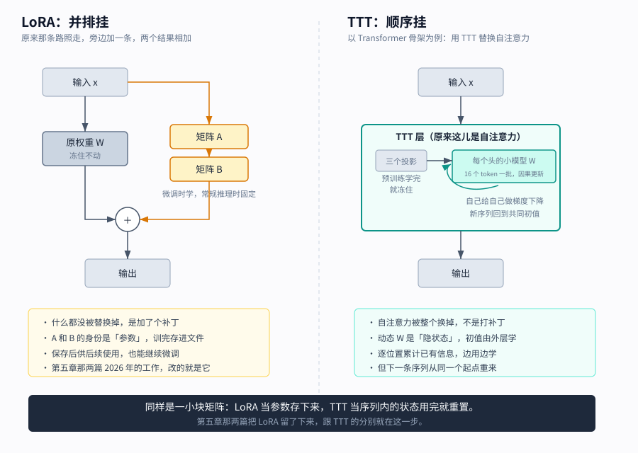
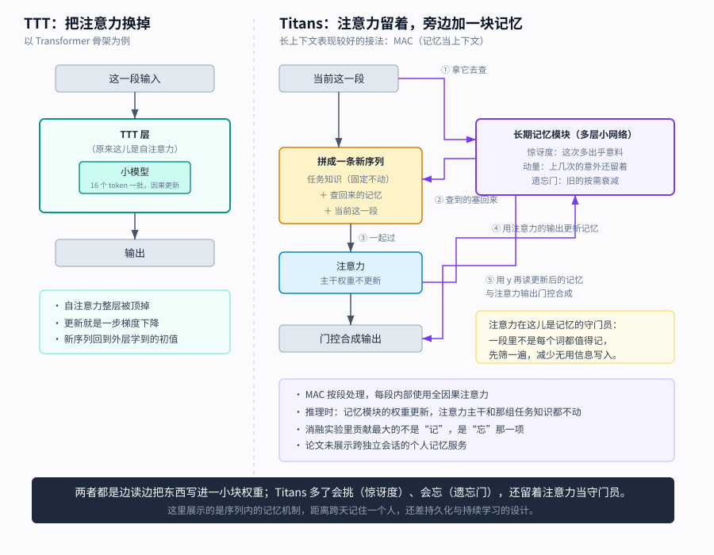
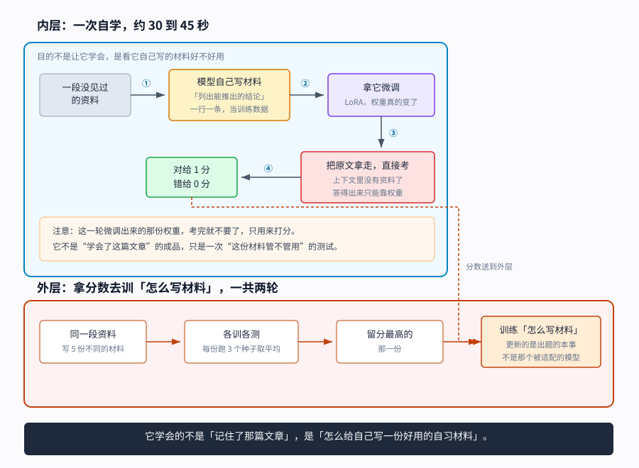

【AI Agent】我想让 AI 记住我们的过往，有办法吗

━━━━━━━━━━━━━━━━━━━━

◆ 开篇：每次都要重新自我介绍

━━━━━━━━━━━━━━━━━━━━

用 AI 干活久了都会碰到同一件烦事：昨天讲清楚的事，今天开个新窗口，它又不知道了。

我的办法是维护一份记录，每次开工先让它读一遍：我是谁、在做什么项目、上次定了什么、哪些错犯过不要再犯。这套东西现在快两千行，管用，但代价也清楚——每次都要占掉一大段上下文窗口，读进去还得跟系统提示抢注意力，写长了它反而抓不住重点。

前几天我顺着一个问题想下去：能不能干脆把这些东西训进模型里，让它不用读就知道？

这个想法一路撞了好几堵墙，但也让我发现，2026 年已经有人把这条路走通了一段——而且卡住他们的地方，跟我原先以为的完全不一样。这期就把这条路和这些墙一起摆出来。

先说清楚今天讨论的是哪种记忆。让 AI 记住“我上周说过要用 PostgreSQL”，这叫记住一条事实，检索一下就能解决。让 AI 记住“跟我干活的时候不要动不动就重构”，这是另一回事——我要的也不只是它能复述这句话，而是干活时真能照着做。**记得我说过什么，和做事受到这些过往的影响，是两个要求。** 后面会分开看。

━━━━━━━━━━━━━━━━━━━━

◆ 第一章：常用的办法，先不碰权重

━━━━━━━━━━━━━━━━━━━━

先看三种常见办法，它们都把记忆放在权重之外。

**第一种，把上下文窗口做长。** 从 4K 到 128K 再到 100 万，能塞进去的对话越来越多。但窗口再长也有尽头，而且塞满的代价是注意力被稀释，长文档中间部分容易被忽略，这个毛病模型和人一样有。

**第二种，检索增强（Retrieval-Augmented Generation，RAG）。** 把历史对话存进数据库，每次提问时检索出相关的几段，拼进提示词里。它可以在回答前自动检索，也可以由模型按需调用。好处是能删能改，坏处是能不能起作用，要看该用的记录有没有被找出来、读进去。

**第三种，摘要压缩。** 对话太长就让模型自己总结一遍，用摘要替换原文，腾出窗口继续聊。不少长会话助手都采用这类办法。

三种的共同点是：**模型本身一个参数都没变。** 单靠这三种办法，你跟它聊三个月，也不会把这些对话直接训进权重。“记住”的东西挂在外面，靠重新读入才生效。

这就是为什么我说那份记录是“外挂”。它不是模型的一部分，是每次开工前重新贴上去的便签条。

────────────────────

💡 摘要压缩到底丢掉了多少

今年 5 月，i14 和墨尔本大学的研究者量了这件事，我后面还会讲到他们。他们生成了 10 段软件开发对话，把历史按 token 长度约 6 比 1 压缩，每轮再追加新对话，模拟边聊边压缩的过程。

三轮之后，拿关于原对话的事实问题去问模型，**答对率剩下 36.8%**；保留完整上下文时是 90.1%。

摘要是有损的，而且损失会累积。你压缩一次是提炼，压缩三次就是把提炼过的东西再提炼，细节层层脱落。这里测到的，是这套对话和压缩流程下还能答对多少题。

────────────────────

既然外挂这么费劲，直接训进去行不行。

━━━━━━━━━━━━━━━━━━━━

◆ 第二章：为什么不能直接训进去

━━━━━━━━━━━━━━━━━━━━

那把对话训进权重不就完了吗？听起来是最直接的办法。这里要先弄清一件事：模型“学会”某样东西，到底是怎么回事。

模型没有一个按句子编号、原样取回的文本仓库。你问它“床前明月光”的下一句，它不是从某个格子里读出“疑是地上霜”这几个字，而是它的权重被调成了这样一台机器：遇到这个开头，就容易生成“疑是地上霜”这个后续。训练遇到这样的文本时，会往提高正确后续 token 概率的方向调整权重。反复调整之后，熟悉的开头就更容易接出熟悉的后文。

**背下来 = 那条路径被反复推深。不是存进去，是雕出来。**

所以“把对话训进权重”这个操作本身是成立的：把你们的对话当训练数据，跑几轮梯度下降，模型就会开始倾向于说出跟这些对话一致的话。问题不在能不能，在做完之后会怎样。

**第一堵墙，学新的忘旧的。** 这是持续学习领域的老问题，术语叫灾难性遗忘（catastrophic forgetting）。你拿一小批用户对话去更新权重，新任务的梯度可能扰动旧能力。**学进去多少、同时忘掉多少，要一起测。** 模型尺寸、数据、训练方法都会影响结果，不能只看参数量。

**第二堵墙，拿什么当学习的依据。** 训练需要误差信号——你说的和正确答案差多少。对话文本本身就能拿来做下一词预测，但这只教模型续写这些话。谁来判断其中哪句是纠错、哪句是玩笑、哪句该改变以后的行为？后面几篇工作的办法，是把判断放到学完之后，看它能不能做好任务。

**第三堵墙，改和删变麻烦了。** 去年你告诉它“我在用 Vue”，今年换 React 了。外挂记录可以改一行，写进权重后，却没有一个“Vue”字段等着你覆盖。知识编辑、机器遗忘（machine unlearning）都在研究这件事；若用户知识只放在独立的低秩适配（Low-Rank Adaptation，LoRA）补丁里，整份卸掉也容易。难的是只撤掉其中一条，还保住其他知识和能力。

━━━━━━━━━━━━━━━━━━━━

◆ 第三章：把固定的一段话训进去，这个早就成熟了

━━━━━━━━━━━━━━━━━━━━

从最简单的情况开始：如果要写进去的内容是固定的、事先就知道的，这件事 2021 年就有人做了，而且做这件事的是 Anthropic。

方法叫 **上下文蒸馏（context distillation）** ，机制很干净：

模型带着一段长提示 C 的时候，输出是一个概率分布，写作 P(X|C)。现在拿这个分布当老师，训练一个不带 C 的学生模型，让它的 P(X) 尽量逼近 P(X|C)。训完之后把 C 拿走，希望模型不看那段提示，也能表现得更接近看过它的老师。

这里有个很讨巧的地方：**带提示的模型可以给不带提示的模型当老师**，也可以用同一个模型的两个版本。这一步的训练目标由老师提供，不用逐条人工写答案。

Anthropic 在 2021 年那篇《A General Language Assistant as a Laboratory for Alignment》里，就是用这个办法把一段包含 14 组对话的行为准则蒸馏进了权重。这是把提示里的行为示范变成默认行为的一条早期路线。

后来这条线一直在走。2022 年扩展到把任务说明和分步推理蒸馏进去；到 2026 年 2 月微软研究院那篇 On-Policy Context Distillation，做法变成让学生自己生成回答、再对着“带上下文的老师”去逼近，这样训完之后对其他能力的损伤更小。那篇论文里有一项应用叫**经验知识蒸馏**：让模型从自己过去的解题记录里提炼可迁移的经验，固化进参数。

**这条路解决的是：已经拿到的一段上下文，能不能以后不用反复贴。** 它有点像预编译，但内容不必永远固定——2022 年那篇就讨论了顺序蒸馏，陆续学新指令、覆盖旧指令。明天的对话得等明天拿到，拿到之后仍然可以再蒸馏；难题随之变成了持续更新。

━━━━━━━━━━━━━━━━━━━━

◆ 第四章：一边用一边学，学到哪一步了

━━━━━━━━━━━━━━━━━━━━

真正难的是动态的部分：一边聊一边学。这几年有几条不同的路，得分清楚它们各自改的是什么。

**第一条路，测试时训练（Test-Time Training，TTT）。** 斯坦福、加州大学圣迭戈分校等机构 2024 年那篇工作，思路很直接：常规循环网络的隐状态是一个向量，TTT 把隐状态本身做成一个小模型，读一段 token 就对这个小模型做一步梯度下降。所以“读一段话”这个动作，字面意义上就是“训练一步”。

具体怎么接的，值得说细一点，因为这决定了它能干什么不能干什么。

**主干**：论文做了四档，1.25 亿到 13 亿参数，隐藏层维度分别是 768、1024、1536、2048，层数 12 到 24 层。

**那个小模型**：简单版的核心是方阵 W，复杂版是两层的小网络（中间层宽 4 倍，中间夹一个激活函数）。它按头分开，官方代码四档模型的头宽分别是 64、64、96、64。例如头宽 64 时，每个头的线性 W 就是 64×64，不是整个隐藏层那么宽。相对主干，**这个小模型是真的小**。

**怎么挂上去**：它自己承担序列建模，放到 Transformer 骨架里，就是替换自注意力的位置。

用 Transformer 骨架画示意，每块原来负责串起前后文的是自注意力，换成 TTT 层后，每层各有各的小模型。论文默认实验还采用了 Mamba 骨架，把 TTT 放进其中的序列建模位置；Transformer 骨架是另一组对照。

所以它不是给现成模型挂的插件，是一种从头训的模型——**它跟自注意力、线性注意力、Mamba 是抢同一个位置的竞争者。** 那个位置的活儿是固定的：给一串词，让每个位置用得上前面的信息，输出等长的一串。自注意力的办法是保留前面的键和值，每次拿当前查询去比较，Mamba 那类是压成一个固定大小的状态往前带，TTT 也是压成固定大小的状态，只不过**那个状态是一小坨模型权重，更新方式是梯度下降**。

**哪些参数动、哪些不动**，这是关键：每个 TTT 层里除了那个小模型 W，还有三个投影矩阵。**这三个是预训练时学好、之后就冻住的常量。** 推理时通过这条内层学习路径更新的，是小模型的动态权重状态；线性版也包括偏置等项，下面用 W 统称。

这三个投影，论文里沿用了注意力那套记号，写作 K、V、Q，位置和形状也确实跟注意力的一样，都是输入 x 乘一个矩阵。**但算法完全不同。**

注意力那个经典式子大家都见过，不懂也见过：

```
输出 = softmax(Q · Kᵀ / √d) · V
```

意思是 Q 跟每个 K 算相似度、归一化成权重、再去加权求和 V。它用 **Q 与 K 的比较结果** 来决定怎么取 V。

TTT 的式子是这样，两行：

```
损失 = ‖ 小模型(K) − V ‖²        ← 拿这个损失对小模型求梯度，走一步
输出 = 更新后的小模型(Q)          ← 再拿 Q 跑一遍，这才是这层交出去的
```

三份东西不比较，各当各的角色：**K 是题目**（输入 x 经过可学习投影得到的一种视图，论文从去噪自编码的角度把它理解为“被破坏的版本”），**V 是标准答案**（同一个 x 的另一种投影，是要还原成的样子），**Q 是考卷**（小模型更新完之后拿它跑一遍前向）。

一句话：**注意力是拿 Q 去 K 里查、把 V 加权取回来；TTT 是拿 K 和 V 当一道题现场训一步，再拿 Q 考它一次。**

论文之所以借用注意力的记号，是因为有个理论结果：把内层设成纯线性模型、初值设为零、学习率设为 1/2，并用论文定义的全批梯度更新，输出**严格等于最简线性注意力**。再换成使用指数核加权平均的非参数估计，可以得到 softmax 自注意力。注意力是这个框架的特例，但实际实验里的 TTT 还加了归一化、残差和可学习初值，不是把注意力原样换个名字。

顺带挡一个容易走岔的联想：这三份不是门。256 期（ https://mp.weixin.qq.com/s/yZUWKgiNRaVD1r0DpziUSw ）讲过门控那条线，**常见的门会生成一组系数，乘上去决定放多少过去，像阀门**；这里的三个投影则生成不同的特征表示。TTT 的学习率也可以看作一道门——输入算出一个数，过 S 形函数 sigmoid 压到 0 和 1 之间，再乘基础学习率，用来控制梯度更新。论文自己说这相当于给梯度加了个门控：**这个词值不值得学、学多少，由它说了算。**

还有两个细节：“怎么投影”和“还原成什么”都是预训练时一起学出来的；计算按 **每 16 个 token 一批** 组织。同批梯度在批初状态上并行计算，但每个位置只累计截至自己的梯度，仍然按前后顺序形成各自的状态，不会偷看后面的词。

**但它在每条新序列开始时，都会回到共同的初始权重。** 这个初值本身是外层训练学出来的，不是全填成零。序列内学到的改动随这次序列走，不会自动变成下个独立会话的起点。

在实现里，初始 W 是参数；从它复制出来、一路更新的动态副本，则作为隐状态传下去。跟循环网络里的 h 类似，只不过这次状态是一小组模型权重，状态转移包含一次学习更新。

说到这儿容易跟前面提到的 LoRA 混。LoRA 在原权重旁边挂两个小矩阵，把旁路输出加回主路，原权重可以不动。TTT 那个小模型也是一小块矩阵，看着像同一回事，使用方式却不同。



**挂法不同**：LoRA 是并排的旁路，原层还在，是打补丁；TTT 自己承担序列建模这份工作。

**学完之后怎么用，也不同**：本文后面那些巩固方案会把 LoRA 保存下来，留给后续会话使用；原始 TTT 实验则把动态状态留在当前序列里。隐状态当然也能存盘，LoRA 也能继续在线更新，但保存文件只是一步，还得解决接着学什么、怎样避免互相干扰。

所以这篇 TTT 工作主要回答的是“一次能读多长”。在论文的长文本实验里，Mamba 超过 16K 后困惑度改善趋平，TTT 还在改善；在 TPU v5e-256、2K 上下文的测速中，TTT-Linear 一步训练约 0.27 秒，Transformer 约 0.30 秒。这些结果还没有变成“跨天记住一个用户”的实验。

**第二条路，Google 的 Titans。** 这篇 2025 年的工作也在研究推理时更新记忆。

它的做法是给模型加一个“神经记忆模块”，这个模块在推理时按下面的规则更新自己：

它拿 **梯度的大小当惊讶度** ——某件事越出乎预料，梯度就越大，就越值得写进记忆。再加上动量（跨时间累积的惊讶）和权重衰减（主动遗忘），论文自己说，这等价于用带动量和权重衰减的小批量随机梯度下降去优化一个记忆网络。

跟 TTT 比，它多了三样东西。



**一是记忆没有顶掉注意力，是加在旁边。** 论文给了三种接法。长上下文表现较好的一种叫“记忆作为上下文”（Memory as a Context，MAC）：注意力留在每个分段内部，只看段内截至当前位置的内容。它的流程是这样：把长序列切成段，拿当前这段去记忆里检索一次，然后按“任务知识 + 检索出的记忆 + 当前段”拼成一条新序列，再一起过注意力；过完之后，**用注意力的输出去更新记忆**。然后再读一次更新后的记忆，与注意力输出做门控组合，才得到这段的最终输出。论文解释了为什么绕这一道：一段里不是每个词都同样值得记，让注意力先处理，帮助选择写入内容。**注意力在这儿是记忆的守门员。**

**二是更新规则里多了动量和遗忘。** TTT 是一步梯度下降就完了。Titans 在这上面加了两项：动量，让一件事的影响能延续几步（论文的理由是光看瞬时梯度，连续几个意外之后梯度会变得很小，后面的信息就漏掉了）；遗忘门，主动衰减旧记忆，**而且衰减多少是随当前输入变的**。消融实验里，贡献最大的恰恰是遗忘那一项。

**三是有一组持久记忆**：一小把可学的 token，拼在序列最前面，编码的是任务本身的知识，跟具体输入无关。这组在推理时是冻住的。

推理时谁动谁不动，论文写得很清楚：**记忆模块的权重更新，注意力主干不更新，那组持久 token 固定不动。**

数字上，3.4 亿参数那档，Titans 三个变体的维基百科困惑度是 25.43、25.07、24.69，同尺寸 TTT 是 27.44，Transformer++ 基线是 31.52；RULER 长文本测试的单针键值检索子任务里，也就是从长文找回指定键对应的值，16K 长度那档 MAC 拿了 98.4%，Mamba2 是 5.4%。

这里的“长期”，是相对注意力能直接看到的那一段而言。**记忆模块可以把更早的内容带到后面的分段，注意力主干的权重却没有随着用户对话一起微调。** 论文展示的是长序列任务，没有给出一个用户跨独立会话、连续使用数月的持久化协议和实验。

后续的嵌套学习（Nested Learning）框架把模型看成一组层层嵌套的优化问题，每一层有自己的更新频率，并据此提出了 Titans 的变体 Hope。这个思路更接近我想要的东西：记忆不是短期长期两档，是一串以不同频率刷新的东西。

**第三条路，让模型自己写自己的训练数据。** 麻省理工 2025 年 6 月那篇自适应语言模型（Self-Adapting Language Models，SEAL）值得细说，因为它把“拿什么当依据”这个问题往后挪了一步。

先说它要解决的场景：给模型一段它没见过的资料，目标是让它以后**不看这段资料**也能答对相关问题。



**内层做四件事：**

第一，模型自己写一份自习材料。提示词很朴素，大意是“读完这段，列出由它能直接或间接推出的结论”。模型吐出来的是一段文本，按换行切开，每行当成一条独立的训练数据。

第二，把原文和这份材料一起拿去真的微调，用的是 LoRA。权重真的变了，不是塞在上下文里。

第三，**把原文拿走**，用这篇资料配套的问题去考它。此时答题不再读原文，测试的是适配后的模型能答对多少。

第四，按参考答案统计正确率，作为这份自习材料的成绩。

**外层做的是另一件事：拿这个分数去训练“怎么写第一步那份材料”。** 具体是每段资料采样 5 份不同的材料，每份各训各测（还跑 3 个随机种子取平均），留下得分最高的那一份，再拿这批“资料 → 最好的材料”配对去做一轮微调。论文一共跑了两轮。

**它不用逐句评判自习材料，改成评判照它训完之后考得怎么样。** 不过训练这套本事时，考卷和参考答案仍得准备好。论文也把这列为局限：没有配套问答的新资料，还不能直接照搬这套奖励。

数字：单篇资料这个场景，基座模型直接答是 32.7%，让它自己写材料再训是 39.7%，两轮强化学习之后到 **47.0%**。对照组是拿 GPT-4.1 生成的材料去微调同一个基座，答对率 46.3%——SEAL 用小模型写材料，适配后的分数略高一点。不过换成 200 篇资料的小规模持续预训练，SEAL 反而落后一点（58.2 对 59.4）。那组用的是全参数微调，跟这里单篇资料的 LoRA 实验也不同。

**在外层训练比较候选材料时，内层适配出的权重用来打分，不直接拿它接着训练生成策略。** 外层学的是“怎么写自习材料”；等到实际吸收新资料时，再用学会的办法生成材料、微调模型，适配后的权重可以留下。一个阶段学会怎么学，另一个阶段把文章学进去。

代价作者自己写了：串行地一篇篇喂进去，每次更新之后回测旧任务，**早期任务的表现会随着编辑次数增加而逐渐下降**——第一堵墙还在那儿。另外这套流程贵得离谱：算一次奖励要真微调再真评测一遍，单次三四十秒，跑完一轮是 750 次内层循环，两张 H100 上大约六小时。

**第四条路，让一个网络直接生成权重补丁。** 这条我们自己试过，结果不好。

2026 年 2 月 Sakana AI 那篇 Doc-to-LoRA 的思路是：训练一个超网络（hypernetwork），输入一份文档，直接输出一组 LoRA 权重。挂上去，模型就像读过这份文档一样，以后提问不用再带原文。110 期（ https://mp.weixin.qq.com/s/zDhKbwklzuayMXUAqVThBQ ）介绍过它，当时我挺兴奋，因为这是最接近“睡一觉就记住了”的一条路。

我们当时使用的配置把文档按 512 个 token 切块，每块生成一个秩 8 的 LoRA，再沿秩的维度拼起来。另外还有一份公共的秩 8 项，所以那次实现的总秩是 `8 × (块数 + 1)`。下面表里 1 块对应秩 16，就是这么来的。

129 期（ https://mp.weixin.qq.com/s/rhfqd_BtYemPudSE-3k9hw ）我们拿 1892 年那版红楼梦英译本前八章，在 Gemma-2-2b-it 上做了 24 道事实问答。问的是一个很朴素的问题：块越多，记得越全，准确率应该越高吧？

| 挂了几块 | 秩 | 覆盖了多少原文 | 答对率 |
|---|---|---|---|
| 0（裸跑） | 0 | 0% | 25.0% |
| 1 | 16 | 0.6% | 16.7% |
| 5 | 48 | 2.8% | 8.3% |
| 20 | 168 | 11.4% | 4.2% |
| 50 | 408 | 28.4% | 0.0% |
| 176（全文） | 1416 | 100% | 0.0% |

**单调递减，一路降到零。**

两个细节值得记。第一，只挂 1 块的时候，那 512 个 token 是古登堡计划的版权声明和译者信息，跟红楼梦内容毫无关系——挂上去之后，24 道题的答对数从 6 道降到 4 道。样本小，这一格不能单独下结论，但它跟后面的下降趋势方向一致：**无关内容挂进去，不是没影响，是负影响。** 第二，挂到 50 块以后，模型的输出退化成重复乱码，不是答错，是**语言能力本身崩了**。

超网络的分块组合训练最多见过 8 块，我们喂了 176 块，远超那一阶段的训练范围。多个补丁同时叠加，彼此干扰是一个解释；秩只表示可用的方向数，单看秩还不能算出扰动有多强。

这个失败对今天这篇有用：**补丁生成出来、挂上去了，还得测原有能力有没有受伤。** 那次失败的是这个检查点下的长文分块拼接，不能拿它预言所有 LoRA 都会越用越坏。

━━━━━━━━━━━━━━━━━━━━

◆ 第五章：从对话到权重，有人把流程接起来了

━━━━━━━━━━━━━━━━━━━━

这条线比我最初以为的早。2024 年 11 月，剑桥和 Apple 的 PLUM 就把对话扩成问答对，再按对话的时间顺序持续微调 LoRA。在 100 段合成单轮对话的“是或否”回忆题上，准确率达到 81.5%，检索同一批问答材料的基线是 83.5%。对话写进权重，已经能做实验了。

到 2026 年，下面两篇又从不同方向推进了一步：一篇比较摘要压缩和定期重训，一篇专测上下文清空之后，过去的目标还能不能影响行为。

**第一篇，今年 5 月，i14 和墨尔本大学的那篇。** 他们的对照组就是第一章说的摘要压缩，实验组是“过夜巩固”，三个阶段：

**反思**：让一个模型从对话里抽出结构化的事实，分成三类——改错的教训、用户的偏好、项目的细节。

**合成**：每条事实生成大约 20 组措辞不同的问答对。这一步叫复述式排练，目的是让模型学到的是这条知识本身，而不是某一句话的字面形式。一段源对话能扩出约一万八千条训练样本。

**训练**：用 LoRA 微调，秩 16，基座是 Qwen2.5-7B-Instruct。主干权重冻住，更新集中在附加参数里；挂上去之后，整个模型的输出仍会变化。

他们每个阶段都从累计的完整对话抽取材料，重新训练一份 LoRA。**原始记录还得保存，不是同一份 LoRA 连续学三个晚上。**

结果：在这 10 段合成软件对话、1,146 道测试问题上，三轮之后摘要组答对 36.8%，**巩固组答对 80.4%**。分项更有意思——用户偏好类 94.3%（摘要组 62%），改错教训类 74.6%（摘要组 36.3%），项目细节类 78.2%（摘要组 31.5%）。这些测的都是“能不能答出来”，还没直接测编程时会不会照着做。

论文报告，一段对话的训练在 A100 上约 1.5 小时，在 RTX 5090 上约 8.2 小时。在这套小模型配置下，一晚上能跑一轮。

**第二篇，今年 6 月，中国药科大学一位研究者。** 这篇给了我这次调研里最有价值的一个概念切分：

**记忆访问**，是需要的时候能把过去的事实查回来，这是 RAG 干的活。

**记忆深度**，在这篇论文里指写进参数的持久倾向——哪怕相关的文字早已离开上下文窗口，它还在影响行为。

他的做法是给事件算两个分数：**惊讶度**，以及他称为 **效价（valence）** 的目标相关度——实现上量的是事件与持久目标、偏好的嵌入相似度。两路分数经过 sigmoid，再把乘积与阈值比较，选中的事件才进缓冲区。攒够了更新 LoRA，同时回放旧材料、约束参数不要漂得太远。**主实验每 200 个事件只触发约 2 到 3 次写入。** 绝大部分事情不写。

它在合成的长循环干扰测试里比较两种方案：原记录仍能检索，但工作上下文会被清空。下面统一看 GPT-2 这一组，数值越高越好：

| 测什么 | 检索（RAG） | 写进权重 |
|---|---|---|
| 浅层事实回忆 | 0.956 | 0.463 |
| 目标持久性 | 0.398 | 0.904 |
| 上下文清空后的恢复 | 0.394 | 0.900 |

**在这个测试里，检索更会找事实，选择性写入更能守住目标。** 不过换成没见过的问法，行为泛化还不稳定；在公开 Memora 事件流上，清除陈旧记忆的改善也没有达到统计显著。

────────────────────

💡 两种记忆，不是两种做法

看到这组数字之前，我一直在问：写权重和外挂记忆，谁效果好？

现在我觉得，得先把“效果”分成两件事：**能不能查回过去，和过去能不能持续改变做事方式。**

检索把事实找回来，0.956 是这套测试里的事实答对率。选择性写入把有限的容量优先给目标，目标持久性拿到 0.904；它本来就会拒绝不少离题事实，所以事实题输给检索，也跟选择策略有关。

对照我自己的经历就明白了。那份记录里，“这个项目用 PostgreSQL”是一条事实；“跟他干活别端着、有话直说”是一条行为要求。后者写在文件里，每次读进去也能管用。我想更进一步的是：**哪天没把那段话翻出来，它也照着做。**

所以事实和倾向是两种需求，不能跟检索和权重一一对应。PLUM 把事实写进权重，外部规则也能改变行为。要选办法，先看自己究竟想保住什么。

────────────────────

上面一篇让模型抽取事实，一篇用门控挑事件。下面这篇继续往模型内部走：能不能让写入过程也跟着任务一起学？

━━━━━━━━━━━━━━━━━━━━

◆ 第六章：睡觉这件事，真有人做

━━━━━━━━━━━━━━━━━━━━

还有一篇值得单说，因为它把“什么时候巩固、怎样巩固”放进了模型的训练过程。

卡耐基梅隆和马里兰大学今年 5 月的《Do Language Models Need Sleep?》。场景是这样：注意力缓存快满了，常规做法是丢掉最早的部分。他们的做法是先“睡一觉”——对累积的上下文做几遍离线循环遍历，通过一条更新规则把内容写进一组快速权重里，然后才清空缓存。醒来之后，一次前向就能用上这些巩固过的内容。

**研究者选定快状态的更新结构，再端到端训练其中的投影和门控，目标是让“睡醒之后”预测得更好。** 睡眠阶段通过前向递推更新快状态，并不现场对整个模型做梯度下降；反向传播发生在训练这套机制的时候。

它不要求给每一句话标上“值得记”，而是用后续预测的损失训练巩固过程。这里依然有训练目标，只是监督落在了后面的表现上。

数字目前还在受控实验的量级：在按局部规则演化格子的元胞自动机任务上，不循环的基线约 10%，循环 4 次超过 30%；在合成算术任务中，Jet-Nemotron 2B 做八步运算题，循环次数从 1 增到 6，正确率从 0.351 提到 0.388。额外循环也要花计算，而且每个新样本的快状态重新初始化；测的仍是一次任务内的巩固。

“睡觉”这个名字很形象：先停下接收新内容，把已有内容再处理几遍，再继续干活。这里实现的是这样的计算阶段，还不是给一个用户积累几年经历的整套记忆系统。

━━━━━━━━━━━━━━━━━━━━

◆ 第七章：卡在哪

━━━━━━━━━━━━━━━━━━━━

已经有人接起了流程，为什么离我每天能用的东西还差一截？

**我看到的有三条：成本、学新东西时保住旧能力，以及改错和删除。**

**第一条，成本。** i14 和墨尔本大学那篇估算，用接口合成材料、再租 A100 训练，全流程每个用户每晚约 5 美元。这是它那套配置的估算，不是所有方案的统一价格，但扩到大量用户，开销就很可观。而且每个用户都要管理自己的 LoRA，存储、加载、版本更新也得跟上。

**第二条，长期使用之后，原来的本事还剩多少。** 那篇明确写了，没测大规模多任务语言理解测试（Massive Multitask Language Understanding，MMLU）和代码测试 HumanEval。会回答用户偏好，不等于编程、推理都没受影响；从累计记录重训三份 LoRA，也还没回答连续用一个月、一年会怎样。

红楼梦实验提醒我的正是这件事：挂得上不等于用得好。但那次超网络生成补丁、一路拼到秩 1416，跟固定秩 16 的梯度微调是不同实验，不能当成同一条崩坏曲线上的快慢两档。每种办法都得同时量新知识和旧能力。

今年 7 月的《Learning on the Job》干脆走另一条路：权重冻住，把部署反馈提炼成“遇到什么情况，就怎么做”的自然语言规则，存在外面检索。作者考虑的就包括重新训练、遗忘和反复评估的成本。他们还在同一套银行任务里测到了规则库在不同模型之间双向迁移。**文字规则换个模型仍然能读；一份 LoRA 则依赖它适配的底座，不能随手换台模型就挂。**

**第三条，只改掉该改的那一点。** 如果用户记忆都隔离在自己的 LoRA 中，整份卸载、回滚或重训，路径是清楚的。难的是只去掉“我以前用 Vue”这一条，还留下其他习惯、项目经验和已经学会的本事。前面 Han 那篇在公开事件流上测陈旧记忆失效，仍没得到显著改善。

产品还要面对删除请求。欧盟通用数据保护条例（General Data Protection Regulation，GDPR）第 17 条规定了符合条件时的个人数据删除权，也列有例外。外部记录、训练材料、适配器，各存了什么、删除要覆盖哪些副本，都得能处理。机器遗忘已经有方法和基准，难处在于：让模型暂时不回答那条信息，跟把它的影响可靠地去掉，还隔着验证这一步。

**会写入只是开头，能长期维护才是产品。** 这里既有工程成本，也有学习算法还没解决好的问题。

━━━━━━━━━━━━━━━━━━━━

◆ 收尾：那我现在该怎么办

━━━━━━━━━━━━━━━━━━━━

回到我最初的问题：我想让 AI 记住我们的过往，有办法吗。

查完这一圈，我的结论分两半。

**想让它下次还能接着干活，外部记录已经很有用。** 事实、偏好、上次为什么改主意，都可以写进去，再让模型读取或检索。它占窗口、要重读，但我能看见内容，能改错，也能换个模型接着用。

**想让过去的对话不靠重读，持续影响以后的行为，参数巩固已经有原型。** 有按对话顺序持续训练的，有从累计全文定期重训的，也有边读边更新快状态的。它们各自跑通了一段，还没有哪组数字能直接替我回答：每天这样用，一年之后会怎样。

把这些论文摆在一起，我反而更在意另一个问题：**写进去之后，留下的究竟是什么？**

“怎么写”不能说完全没动：TTT 用内层梯度更新，Titans 加了动量和遗忘，Doc-to-LoRA 让一个网络直接生成补丁，睡眠那篇让快状态在离线循环里递推。

但这些改动都落在同一个动作上——**另开一小块参数，把东西灌进去**。要么是 LoRA，要么是自己搭的小模块，主干谁都没动。真正被反复琢磨的，是上游那三个问题：喂什么进去（原文？抽出来的事实？模型自己写的材料？）、什么时候喂（每 16 个词？缓冲区满了？每晚一次？）、喂多重（惊讶度、目标相关度、遗忘门）。

**筛选那一侧出了一堆办法，写入那一侧基本还是同一招。**

而这几种办法拿来验收的，多半也还是回忆题、任务正确率或目标保持分数。我想留下的，却不只有“现在偏好 PostgreSQL”这个答案，还有“为什么从 MongoDB 换过来”的那段经历。

────────────────────

💡 更新有先后，记下来的经历也有先后吗

这里有两个容易混在一起的顺序。

**第一个，是训练更新的顺序。** 普通梯度下降就是：

```
新权重 = 旧权重 − 学习率 × 当前梯度
```

当前梯度也在旧权重上计算，所以第 40 次当然依赖第 39 次。Titans 的动量还会显式带着前几步的影响；“睡眠”那篇也把上一段更新的快状态交给下一段。这些更新并不是彼此独立的。

**第二个，是模型能不能还原经历里的先后和转折。** “先试 MongoDB，碰到某个问题，后来换 PostgreSQL”，跟“这个用户偏好 PostgreSQL”，是两份不同的记录。如果抽取阶段只留下后一句，后面再怎么训练，也没法从这句话补回被删掉的原因。

**更新按时间发生，不等于经历的时间关系被保存下来。** 现有方案在这一步基本都是主动把顺序拿掉的：每晚巩固那篇把一天的对话抽成一条条独立事实，再扩成两万条问答对；SEAL 让模型把资料改写成一条条陈述。抽出来的是“这个用户偏好 PostgreSQL”，不是“他先想用 MongoDB，试了两天不行才换的”。**后者带着时间，前者只是一条属性。**

这不是原理上做不到——顺序和原因完全可以写进训练材料。但目前没人这么做，因为验收方式决定了做法：考的是能不能答对，那抽成属性表最省事。

**参数受到过往影响，和模型能把过往讲清楚，是两件事。** 这才是我想追下去的地方。

────────────────────

所以对我来说，眼下最有用的办法还是：**把记录写准。**

长上下文让这件事比以前容易了，但“放得下”不等于“用得好”。记录越长，相关内容能不能被找到、中间那段能不能被用上，仍然要看实际表现。

筛选也不只是把三行压成一句。有时该删的是重复措辞，该留的是转折：当时为什么这么想，后来什么事情让我们改了主意。只记最后结论，文件会越来越像一张用户属性表；把转折留住，下一次读的时候才接得上路。

**我想留的，不只是它知道我现在要什么，还有我们是怎么走到这里的。** 这可以写在外部记录里，也值得成为参数记忆的学习目标——只是现在还没有哪篇论文把它当成目标。

一个月后，我大概还是在改同一个文件。这不是因为没人想做得更好，而是想留下的那样东西，跟大家正在优化的那个指标，暂时还不是同一件事。

━━━━━━━━━━━━━━━━━━━━

◆ 参考资料

━━━━━━━━━━━━━━━━━━━━

Askell et al., A General Language Assistant as a Laboratory for Alignment, arXiv:2112.00861（Anthropic，2021-12；上下文蒸馏原始出处，用 KL 散度把行为准则提示训进权重）

Snell et al., Learning by Distilling Context, arXiv:2209.15189（2022-09；扩展到任务说明与分步推理）

Ye et al., On-Policy Context Distillation for Language Models, arXiv:2602.12275（微软研究院，2026-02；学生自采样加反向 KL，含经验知识蒸馏与系统提示内化）

Sun et al., Learning to (Learn at Test Time): RNNs with Expressive Hidden States, arXiv:2407.04620v4（Stanford / UCSD 等，ICML 2025；以小模型作为序列隐状态，16 token 分批计算并保持因果更新，新序列回到共同的可学习初值）

Behrouz, Zhong, Mirrokni, Titans: Learning to Memorize at Test Time, arXiv:2501.00663（Google Research，2025-01；梯度惊讶度、动量和数据相关遗忘，提供 MAC 等多种组合架构，实验主要测序列内记忆）

Behrouz et al., Nested Learning: The Illusion of Deep Learning Architectures, arXiv:2512.24695（Google Research，2025-11 官方介绍、12 月上传 arXiv；多层级不同更新频率的记忆框架与 Hope 模型）

Zweiger et al., Self-Adapting Language Models, arXiv:2506.10943v2（MIT，2025-06；模型自己生成自我编辑做微调，拿下游表现当强化学习奖励；作者自陈反复编辑会灾难性遗忘）

Dennis et al., Beyond Inference-Only Deployment: Comparing Weight-Based Consolidation Against Cascading Compaction, arXiv:2605.24657（墨尔本大学等，2026-05；反思合成训练三阶段，LoRA 秩 16，合成对话问答正确率 80.4% 对摘要压缩 36.8%；未测通用能力基准）

Han, Memory Depth, Not Memory Access: Selective Parametric Consolidation for Long-Running Language Agents, arXiv:2606.26806（中国药科大学，2026-06；惊讶度与目标相关度联合选择，主实验每 200 事件写 2 到 3 次；陈旧记忆测试改善未达显著）

Lee et al., Do Language Models Need Sleep? Offline Recurrence for Improved Online Inference, arXiv:2605.26099v2（CMU / UMD，2026-05；缓存满前离线循环写入快权重，外层端到端训练巩固机制，睡眠时通过前向递推更新快状态）

Tablan, Taylor, Bernhem, Learning on the Job: Continual Learning from Deployment Feedback for Frozen-Weights Agents, arXiv:2607.22157（2026-07；主张冻结权重加外部规则库，记忆可跨模型迁移）

Magister et al., On the Way to LLM Personalization: Learning to Remember User Conversations, arXiv:2411.13405（Cambridge / Apple，2024-11；按时间顺序学习 100 段合成单轮对话，回忆判断题准确率 81.5%）

Cohen et al., Evaluating the Ripple Effects of Knowledge Editing in Language Models, arXiv:2307.12976（TACL 2024；所测知识编辑方法在关联知识更新上的平均准确率约 38% 到 66%）

Shi et al., Continual Learning of Large Language Models: A Comprehensive Survey, arXiv:2404.16789，ACM Computing Surveys 2025（持续学习方法、遗忘与评估综述）

Charakorn et al., Doc-to-LoRA: Learning to Instantly Internalize Contexts, arXiv:2602.15902（Sakana AI，2026-02；超网络直接生成适配器，附录 C.5 测无关上下文引起的知识干扰）

Maini et al., TOFU: A Task of Fictitious Unlearning for LLMs, arXiv:2401.06121（2024-01；用合成作者信息评估机器遗忘的有效性与知识保留）

European Data Protection Board, Respect individuals’ rights（个人数据删除权的适用条件与例外；对应 GDPR 第 17 条）

━━━━━━━━━━━━━━━━━━━━

记得我说过什么，和做事受到这些过往的影响，是两个要求。

筛选那一侧出了一堆办法，写入那一侧基本还是同一招。

我想留的，不只有结论，还有我们为什么改了主意。

━━━━━━━━━━━━━━━━━━━━

// 靳岩岩的 AI 学习笔记 × Claude和GPT 的严谨 × Gemini 的浪漫
// 2026年9月9日

━━━━━━━━━━━━━━━━━━━━

【摘要（发布用，不进正文）】

每次开新窗口都要重新告诉 AI 我是谁。能把这些直接训进模型吗？查完一圈：摘要压缩三轮只剩 36.8%，每晚 LoRA 巩固能留 80.4%。但筛选那侧办法一堆，写入那侧还是同一招，留下的也只是结论，不是我们怎么走到这里。
