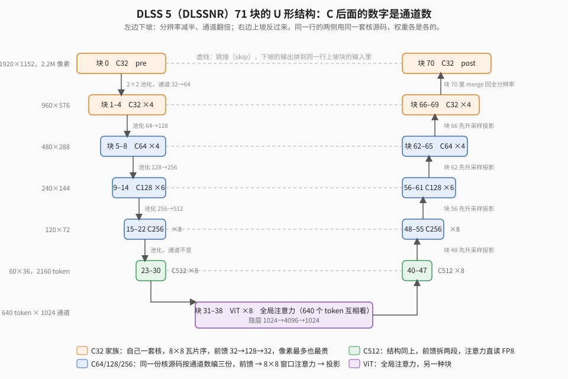

【DLSS5】从 2 帧到 28 帧：两天两夜，把一张 71 块的网络塞进 RX 9070 XT

━━━━━━━━━━━━━━━━━━━━

◆ 开篇：周一晚上 2 帧，周三傍晚 28 帧

━━━━━━━━━━━━━━━━━━━━

301 期（ https://mp.weixin.qq.com/s/YFF4EXu5XpD_FR-jdCGSsw ）讲到周日傍晚，逐值一致的重做进行到第 61 块。周一（9 月 7 日）晚上八点零九分，71 块全部对上，我进《剑星》看了一眼，日志里记的是我的原话：“这个是对的，虽然只有 2fps，主人公有一点黑。”一帧 2.7 秒，游戏里每帧连读回落盘要 4 秒。画面对了，但那是幻灯片。

周三（9 月 9 日）下午我再进去，27 到 28 帧，玩了半天过了几段过场动画都稳。中间隔了大约 46 个小时，两个 AI 轮班：周一夜里是 Codex（GPT 6 Astra），周二凌晨五点它的额度见底，Claude 接手，一直干到周三傍晚。我自己做的事就三件：进游戏看画面、看帧率、在几个岔路口拍板。

这篇把这 46 小时按顺序摆出来。数字全部来自项目仓库里的工作日志，每一步都有测试台记录。先给一张总表，后面各章讲每一段是怎么来的。

| 时间 | 测试台一帧 | 游戏里 | 靠什么 |
|---|---|---|---|
| 周一 20:09 | 2.71 秒 | 2 帧 | 第一次画面正确 |
| 周一 22:00 | 1.47 秒 | | 共享缓冲、噪声表驻留显存 |
| 周二 04:00 | 0.47 秒 | | 矩阵乘全部换硬件矩阵指令（Codex） |
| 周二 08:35 | 186 毫秒 | 5 帧 | 数据搬运重排、权重驻留、显存减半（Claude） |
| 周二 17:41 | 112 毫秒 | 8 帧 | 放弃逐位一致，换 PSNR 尺子；时序历史接进游戏 |
| 周二 21:06 | 62.7 毫秒 | 12 到 13 帧 | 核融合、硬件舍入、FP8 残差流 |
| 周三 08:33 | 约 33 毫秒 | 23 到 25 帧 | 注意力核重写、延迟提交、一毫秒一毫秒地量 |
| 周三 16:13 | 约 33 毫秒 | 27 到 28 帧 | 关掉探针里那一次等待 |

前面几篇的链接：297 期（ https://mp.weixin.qq.com/s/Eq2IDP5QvFPGToQuCsBLRw ）挖模型结构，298 期（ https://mp.weixin.qq.com/s/Dwb7f-xGARXungO-8MXcsQ ）讲每个块长什么样，299 期（ https://mp.weixin.qq.com/s/GpIZ2-GnfPe1rRvi5FsezQ ）是第一次跑通。这篇只需要记住：71 个块，每块就是通常说的一层 Transformer（注意力加前馈，DLSS 5 里先前馈后注意力），U 形排列，块与块之间用残差相连。同一通道数的块跑的是同一份程序，只是权重各是各的。下面反复出现的 C32、C64 一直到 C512，是每个块处理的通道数：从 32 通道的全分辨率进去，一路下坡翻倍到 512 通道的 60×36，中间是 8 层全局注意力，再上坡减半回到 32 通道出来。同一个通道数下坡上坡各有一段，所以“C32 块”既指开头那几块也指结尾那几块，它们像素最多，也最贵。

━━━━━━━━━━━━━━━━━━━━

◆ 第一章：周一夜里，把乘法搬到硬件上

━━━━━━━━━━━━━━━━━━━━

周一晚上那个 2.7 秒的版本，所有矩阵乘都是普通着色器里一个线程一个线程地做的。先做的几件事都不动算法：把 8 个 C512 块共用的前馈缓冲改成一份（2.71 到 2.17 秒），QKV 分块（1.86），C32 层共用前馈（1.72）。然后是一个我事后觉得离谱的发现：前面那个块要用的 192MB 随机数表，每帧都从系统内存经 PCIe 读一遍。改成初始化时上传到显存，整帧 1.72 到 1.68 秒，前面那个块从 193 毫秒降到 144。

到 1.47 秒之后普通着色器再怎么改都没收益了。晚上十点二十一分我批了两件事：换 AMD 的预览驱动，开 Shader Model 6.10 的矩阵接口；快速版只允许硬件算术上的差异，权重、结构、输入一律不动，而且先看矩阵指令能不能做到逐位一致。

矩阵指令是什么：这一代 AMD 卡上，一组 32 个线程可以合作做一次“16 行 32 列的矩阵乘 32 行 16 列的矩阵”，一条指令出结果，代替原来每个线程自己做几十次乘加。网络里所有的线性层都能切成这种 16×32 乘 32×16 的小块来算。

这一步 Codex 走得很稳。先拿一个 16×32 乘 32×16 的小探针确认矩阵指令的结果和原来标量代码零差异，再接进一个真实的块试水：C256 块里三段矩阵乘换过去之后，每段的耗时是

| C256 块里的一段 | 换之前 | 换之后 |
|---|---|---|
| 前馈展开（256 到 1024 通道） | 1.25 毫秒 | 0.34 |
| 前馈收缩（1024 回 256） | 1.71 | 0.65 |
| 注意力里的 Q 乘 K | 2.71 | 0.96 |

每换一段都拿五轮输出和原版逐字节比。然后一个通道站一个通道站往整网推，下面是整帧的耗时，每行是又换掉了哪一类矩阵乘之后的数：

| 换到哪一步 | 整帧 |
|---|---|
| 只换 C256 | 1347 毫秒 |
| C64、C128、C256 全换 | 1187 |
| ViT 的前馈展开 | 1042 |
| ViT 的前馈收缩 | 965 |
| C512 的 QKV | 862 |
| C32 的前馈 | 762 |
| C32 的注意力 | 745 |

后面是一串小的：软件半精度舍入的实现、共享内存行距加一避开 bank（存储体）冲突、softmax 并行化。到周二凌晨四点，472.9 毫秒。**全程每一版都和原版逐位一致。**

────────────────────

💡 逐位一致是构造出来的，不是测出来的

原版网络的每一个输出元素，都是固定顺序的 K32 乘加（32 个乘加为一段），每做完一段就用软件把 f32 舍入到 f16 一次。只要新核心保留“每个元素经过同样顺序的乘加、同样次数的舍入”，输出逐位一致就是构造上的保证，测十五帧只是确认没写错。

矩阵指令能做到这一点，是因为它的内部累加是 f32，而每一段 K32 的乘积在 f16 网格上是精确的。把它当成“硬件帮你做了一段你本来就要做的加法”，其他都不变，就一致。

反过来，一旦想去掉那一次软件舍入、或者换累加顺序，一致就没了。这条线后来被有意跨过去了，见第三章。

────────────────────

凌晨四点 Codex 的额度用完，交班时留了一句：注意力核以外的矩阵乘都在硬件路径上了，再往下要动的是数据怎么搬。

━━━━━━━━━━━━━━━━━━━━

◆ 第二章：周二清晨，慢的不是算，是搬

━━━━━━━━━━━━━━━━━━━━

周二凌晨五点一刻 Claude 接手，起点 472.9 毫秒。它先做了一件 Codex 没做的事：原来每往 GPU 提交一段命令都等它做完再提交下一段，改成八个槽位的环，提交完就走，只在槽位转回来复用时才等一次。整帧 472.9 到 456。

接下来三件事都不改算法，只改数据放在哪、怎么搬。

**寄存器分块。** 前面说过矩阵指令一次算 16×32 乘 32×16。原来的写法是每个 wave（GPU 上 32 个线程一组同步执行的单位）载入一份 16 行的输入，去乘一份 32×16 的权重，输出一小块；改成载入一份输入后连乘四份权重、出四小块，输入只载一次，权重的读取量降到四分之一。另外前馈中间那层隐藏值原来存 f32，改存 f16：那些值本来就是 FP8 格点上的数，用 f16 存不丢任何信息，字节减半。

| 哪一段 | 换之前 | 换之后 |
|---|---|---|
| C64 块的前馈收缩 | 1.98 毫秒 | 0.33 |
| C64 块的前馈展开 | 0.93 | 0.50 |
| 8 层 ViT 合计 | 115 | 61 |
| 整帧 | 426 | 359 |

**权重驻留。** 查下来所有权重、偏置表、索引表都放在上传堆（upload heap，一种 CPU 写入、GPU 经 PCIe 总线读取的内存）里，也就是它们住在系统内存，每帧都从主板那头读一遍。搬到显存本地段之后整帧 366 到 338 毫秒。顺带解释了一个之前反复出现的怪现象：解码器入口那一段，两次运行之间有时 4.5 毫秒有时 13.9 毫秒，就是它的权重有时落在系统内存里。

**中间缓冲共享。** 71 块每块都有自己的中间缓冲，全分辨率的一块要几百 MB。这一步不为速度，为的是进游戏：

| | 显存 |
|---|---|
| 测试进程原来 | 14.68GB |
| 游戏自己 | 7.2GB |
| 显卡一共 | 16GB |
| 改成串行共享之后测试进程 | 7.26GB |

早上八点三十五分 186 毫秒，逐位一致，十五帧对 5090 上的原版逐字节相同。九点我进游戏：连贯，大约 5 帧。周一晚上的 2 帧是每帧只处理一帧然后读回落盘，这次是每一帧都处理、不读回。打了版本标签 tag 0.01：精确版到此为止。

━━━━━━━━━━━━━━━━━━━━

◆ 第三章：周二白天，换一把尺子

━━━━━━━━━━━━━━━━━━━━

186 毫秒往下已经没有“不改数值”的空间了。剩下的成本几乎全在那些软件舍入：原版每做完一段 32 个乘加，就把 f32 压成 f16 一次（下面记作 H），把 f16 压成 FP8 一次（记作 F），激活函数那个多项式里还有三次中间舍入。它们保证逐位一致，也保证慢，因为每一次都是十来条标量指令。

于是换尺子。精确链留着当裁判，快速版每改一步都拿输出和它比峰值信噪比（PSNR）：两张图逐像素的均方误差，换算成分贝，越高越接近。42dB 定为底线，对应均方误差约 2/255，也就是平均每个像素差不到一个灰度级，和 FP8 本身的量化步长一个量级。

| 改了什么 | 整帧 | PSNR |
|---|---|---|
| 精确版起点 | 186 毫秒 | 逐位一致 |
| 矩阵指令的 f32 累加器跑完整个 K 再舍入一次，不再每 32 个乘加舍入一次 | 160 | 42.6 |
| 操作数换成 FP8（E4M3 格式）、激活多项式去掉三次中间舍入、注意力的归一化和 softmax 去掉中间舍入 | 112 | 42.0 |

112 毫秒是 8.9 帧。下午五点半时序历史接进了游戏：从 FSR 那里读运动向量，把上一帧网络输出按运动向量采样成这一帧的历史输入，这是 DLSS 5 网络真正的用法（上文 298 期漏了这一路输入）。运动向量的方向和单位是用游戏内抓的两帧离线复算四种假设定下来的，只有“UV 单位、指向上一帧”那种误差最小。傍晚我进游戏，效果和精确版一致，8 帧，tag 0.02。

晚上六点以后是密集的核融合，把原来分开跑的几步合成一个核，省掉中间结果写出去再读回来：

| 改了什么 | 整帧 |
|---|---|
| QKV 和归一化合成一个核 | 115 到 104.5 |
| FP8 激活值、硬件量化指令 | 99.5 |
| 块 0 的噪声不再查 200MB 的表，改成算术生成（那一段 7.2 到 2.0 毫秒，慢的是随机读表） | 97.6 |
| C32 注意力四个核合成两个 | 95.1 |
| C32 前馈整块读写、隐藏层用硬件指令转 E4M3 | 90.0 |
| 软件舍入 H 和 F 全换成硬件转换指令 | 87.9 |
| C512 注意力改成直接读 FP8 的路径（16 块合计减 4.8） | 62.7 |

残差流（块与块之间传递的那份特征）也全改成 FP8 存，输出逐位不变。晚上九点零六分 tag 0.03，游戏里 12 到 13 帧。

────────────────────

💡 这张卡上慢的是每个元素后面那几条标量指令

同一套代码，C64 块跑出 32 TFLOPS，C256 块跑出 119 TFLOPS。矩阵乘本身在两种块上是一样快的，差别在矩阵乘之后：每个输出元素要过一遍取出、舍入、量化、写回的标量尾巴，通道少的块每个元素分摊的矩阵计算少，尾巴的比例就大。

给 C32 前馈做过一个探针：4.9 毫秒里矩阵乘只占 0.3，激活函数里的软件量化占 1.9。把权重从 f16 换成 FP8 让字节减半，没有收益；去掉一个软件量化函数，快 30%。

后面所有优化只看一件事：每个元素经过多少条标量指令。硬件转换指令能替掉的软件舍入全替掉，能在矩阵指令里做的归约（行求和、平方和）全改成乘一个全 1 矩阵。

────────────────────

周二晚上九点我进游戏看了 62.7 毫秒这版：效果在，12 到 13 帧。到这里大的结构都动过了，下面开始的是另一种活。

━━━━━━━━━━━━━━━━━━━━

◆ 第四章：周二夜到周三早，一毫秒一毫秒地量

━━━━━━━━━━━━━━━━━━━━

62.7 毫秒往下没有哪一项能换五毫秒了，全是零碎的。这时先出了个测量问题。延迟提交之后，一帧里各段的时间戳呈双峰：有的帧干净，有的帧里夹着一次提交间隙，同一份代码两次跑 C32 编码器那段能在 6.5 到 8.2 毫秒之间晃。后来定的规矩是：两个版本交替各跑三轮，每一段取所有帧里的最小值来比，小于 0.3 毫秒的差异不当结论。

按这个规矩做下来的清单，每一项都对精确链保持 42dB 上下，多数输出逐位不变：

| 改了什么 | 哪一段 | 换之前 | 换之后 |
|---|---|---|---|
| C32 注意力：分数留在寄存器里做 exp，行求和改成乘全 1 矩阵，概率用硬件转 FP8 | 块 0 的注意力 | 3.88 毫秒 | 3.43 |
| 块 70 直接读光栅缓冲（raster，按像素行排列的那份），跳过打包、收尾、裁剪三个核 | 块 70 | 减 3.3 | |
| C32 块之间直接读上一块未量化的瓦片块（tile），跳过收尾 | 编码器、尾段 | 减 1.0 | |
| C32 前馈：输入用累加器载入、硬件转 FP8、FP8 乘 FP8 | 块 0 的前馈 | 2.6 | 1.5 |
| 编码器里藏着一个标量的 2×2 下采样，换矩阵指令 | 块 4 到 5 之间 | 2.79 | 0.06 |
| ViT 注意力：Q/K/V 打包成 E4M3，exp 留寄存器 | 每层 | 0.36 | 0.18 |
| 多头注意力同样改法 | 26 块合计 | 减 0.8 | |
| 延迟提交进游戏，环扩到 64 槽 | 游戏里整网 GPU | 38.5 | 33.2 |
| C32 注意力：QKV 和归一化合进注意力那次 dispatch（一次核调用），Q/K/V 留在共享内存 | 9 个 C32 块合计 | 减 8 | |
| 块 0 的前缀（噪声混合）合进前馈 | 块 0 | 减 1.9 | |
| 命令列表合批，每帧 100 列到 25 列 | 游戏里每帧 CPU 比 GPU 多出的 | 4.5 | 2.8 |

那个 2×2 下采样值得单说。编码器前四块每块加了时间戳之后，剩下 2.8 毫秒没人认领，只能是块与块之间那个池化：老的标量核，每线程 64 乘 32 次乘加，输入每次重读。谁也没想到看它，因为它“只是个下采样”。

周三早上八点三十三分 tag 0.04：游戏里网络的 GPU 时间 32 毫秒，23 到 25 帧。中间还查了一次“过一会儿就从 21 掉到 8 帧”：给游戏侧加了探针，每 100 帧记一次网络的 GPU 时间和每帧的 CPU 时间，掉帧时 GPU 不变，CPU 时间阶梯上涨。关掉远程桌面就恢复。是我开着 Splashtop 远程看帧率，抓屏把提交端卡住了。

━━━━━━━━━━━━━━━━━━━━

◆ 第五章：周三，最后那几帧不在核里

━━━━━━━━━━━━━━━━━━━━

周三上午按计划做了三件事：

| 改了什么 | 结果 |
|---|---|
| C32 注意力一组线程处理两个窗口，八个 wave 全忙 | 减 1.5 毫秒，输出逐位不变 |
| ViT 的 QKV 三个核合成一个 | 减 0.74 |
| 雨景闪烁：静止菜单连抓五帧，网络在输入不动的像素上输出也不动，闪的是它把输入边缘的抖动扩散成三像素内一圈 1 到 4 灰度级的光晕；加一个对上一帧输出的小平滑 | 加 0.1，闪烁压住 |

到这里游戏还是 24 到 25 帧。然后有一个变化不在任何核里：那个每 100 帧写日志的探针，为了读时间戳每帧要等一次 GPU 做完。关掉它，游戏 27 到 28 帧。GPU 一毫秒没省，纯粹是 CPU 不再每帧站着等。tag 0.06。

到这里我问了一句“还有什么可优化的”，得到的回答先是一张零碎清单，然后被自己的一次失败修正了。C512 块每块 6 次核调用，当时判断每次调用有 40 微秒的启动延迟，把其中一次并进前一个核能省 16 次调用。做完输出逐位相同，一毫秒没省。分段一量：

| C512 块里的一段 | 耗时 |
|---|---|
| 前馈 | 0.076 毫秒 |
| 投影 | 0.055 |
| QKV | 0.060 |
| 注意力 | 0.013 |
| 投影 | 0.033 |

前馈那 0.076 毫秒做了 9 GFLOP，折合 120 TFLOPS，已经贴着这张卡的算力上限，根本没有延迟可省。

顺着这个把整帧的时间线摊开：

| | 毫秒 |
|---|---|
| 网络 | 30.7 |
| 游戏自己的渲染 | 6 到 7 |
| 合计 | 37，即 27 帧 |

GPU 是满的。我之前动过“网络跑第 N 帧、游戏渲第 N+1 帧”的跨帧流水心思，GPU 满载时流水造不出时间，只能填同步空洞，而空洞在关探针那一刻已经没了。这条撤回。

剩下能做的是给网络本身减负。71 块里 45 块可以拿输入直接拷到输出（残差块跳过就是恒等映射），逐块跳一次测 PSNR，基线 41.9：

| 单独跳过哪一块 | PSNR |
|---|---|
| 解码器里的三个 C512 块（42、43、46） | 41.7 |
| 另外六块（12、28、41、44、52、53） | 41.1 到 41.4 |
| ViT 第一层、第五层 | 32.5 |
| C128 第一块 | 31.1 |

单跳无损不等于能一起跳：

| 一起跳 | PSNR | 省 |
|---|---|---|
| 三块 | 40.7 | 约 1 毫秒 |
| 九块 | 36.5 | 约 2 |
| 十七块 | 35.5 | 约 4 |

误差是叠加的。现在游戏里跳着前三块。

最后一件事是周三傍晚的另一种掉帧：玩很久之后突然 16 帧，不回升。这次抓到的现场和 Splashtop 那次相反：GPU 93% 都在游戏进程里、CPU 闲着，也就是 GPU 每帧的时间翻了一倍。查显存：

| | |
|---|---|
| 显卡一共 | 16GB |
| 已用 | 15.1GB |
| 游戏进程总提交 | 14.4GB |
| 其中已被挤到系统内存的 | 523MB |

我们的网络开局分配好的那些大缓冲，游戏进新区域流入贴图时被系统降级到了内存，网络从此每帧走 PCIe。压力不退它就不升回来。当天做的两件事：把从没人读的缓冲改成用到再分配，网络显存 6.8GB 到 5.07GB；给所有默认堆（default heap，显存本地）资源标高驻留优先级，让系统先驱逐游戏的贴图。写这篇的时候后一条还没在游戏里验过。

────────────────────

💡 数据放错地方，这一路撞了四次

第一次是 192MB 的噪声表每帧从系统内存读，第二次是所有权重都在上传堆里每帧走 PCIe，第三次是探针每帧一次等待让 CPU 白站三毫秒，第四次是显存满了之后缓冲被降级到内存、帧率砍半。

四次的共同点是核本身一行没错，慢在数据住在错的地方。而且四次都不是靠读代码发现的，是靠一个反常的数字：一段时间在两次运行之间双稳态、CPU 时间和 GPU 时间对不上、进程的“共享 GPU 内存”不是零。

GPU 上做性能，算术只是一半，另一半是每一份数据此刻在哪一级存储里、谁在什么时候等谁。这一半没有性能分析器（profiler）也能查，看的是那几个不该出现的数字。

────────────────────

周三傍晚就到这里。游戏里装的是跳三块加驻留优先级的版本，回家本地再玩一轮才知道那个 16 帧还来不来。

━━━━━━━━━━━━━━━━━━━━

◆ 收尾：还剩什么

━━━━━━━━━━━━━━━━━━━━

到 30 帧还差两到三毫秒。剩下的清单我看过：最后一块的 RGB 头还是老的标量代码（估 0.4），多头 Swin 那 26 块前馈和投影合核（估 1.5），几个上采样投影没看过内部（0.3）。全做完刚好摸到 30，没有一项是大的了。

再往上就得动网络本身。跳块是零训练的版本，能白捡一毫秒。真正的“小网络”是蒸馏：拿精确链当老师，在游戏截帧上把砍掉块的网络再训一遍。数据不难，插件本来就能每帧落盘；难的是要先把 71 块搭成一个能反向传播的模型，还得带着 FP8 假量化训。周级的工程，先记着。

仓库已经公开：https://github.com/lmxxf/dlss5-on-amd-9070xt-porting ，根目录是能编的那份（38 个宿主文件、46 个着色器、一个把 77 层嵌套脚本拍平的构建脚本），过程中的一切放在 Development 目录里，包括这两天逐小时的状态日志。权重不在里面，得从自己的 nvngx_dlssnr.dll 里提。

上文 301 期的结尾说，验收指标要看结果不看过程。这两天补了另一半：结果对了之后，快慢也得一毫秒一毫秒地看，看的时候别只盯着核。

━━━━━━━━━━━━━━━━━━━━

◆ 参考资料

━━━━━━━━━━━━━━━━━━━━

本文所有数字来自 DLSS 5 到 AMD 移植项目的工作日志 2026-09-07 晚至 09-09 晚部分（仓库 Development/CURRENT-STATE.md）：测试台数据为 RX 9070 XT 上离线 15 帧的分段时间戳，游戏内数据为《剑星》1920×1080 下 ReShade 插件实测。

Microsoft, HLSL Shader Model 6.10 Linear Algebra（dx::linalg）预览文档（第一章矩阵指令的接口、操作数类型与累加语义的依据）

AMD, RDNA 4 Instruction Set Architecture, Wave Matrix Multiply Accumulate 一节（第三章矩阵指令内部 f32 累加的依据）

Microsoft, Direct3D 12 Residency 文档，ID3D12Device1::SetResidencyPriority（第五章驻留优先级的依据）

━━━━━━━━━━━━━━━━━━━━

逐位一致是构造出来的：只要每个元素经过同样顺序的乘加和同样次数的舍入，一致就不需要运气。

这张卡上慢的不是矩阵乘，是每个元素后面那几条标量指令；字节减半没用，少一次软件舍入快三成。

核一行没错也能慢一倍，慢在数据住在错的地方；查它不靠 profiler，靠那几个不该出现的数字。

━━━━━━━━━━━━━━━━━━━━

// 靳岩岩的 AI 学习笔记 × Claude和GPT 的严谨 × Gemini 的浪漫
// 2026年9月10日

━━━━━━━━━━━━━━━━━━━━

【摘要（发布用，不进正文）】

周一晚上 DLSS 5 在 RX 9070 XT 上第一次画面正确，2 帧；周三傍晚 28 帧。46 小时两个 AI 轮班：矩阵指令逐位一致到 0.47 秒，搬数据到 186 毫秒，换尺子到 62.7，逐毫秒量到 33。最后几帧不在核里：探针的一次等待，显存被挤进内存。
