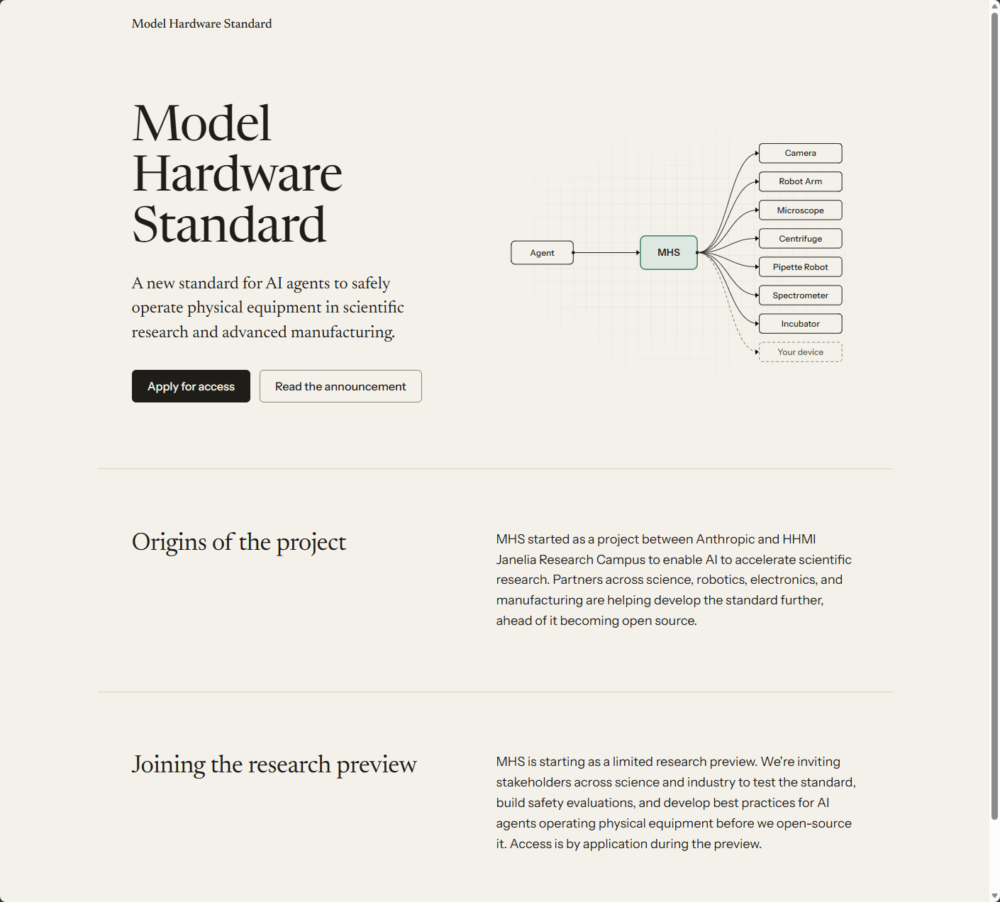

【AI Agent】这两天热议的让大模型控制机器人的“MHS 协议”是个什么东西？

━━━━━━━━━━━━━━━━━━━━

◆ 开篇：一个还读不到完整规范的标准

━━━━━━━━━━━━━━━━━━━━

8 月 27 日，Anthropic 开放了 MHS 的研究预览，全称 Model Hardware Standard，模型硬件标准。它和 HHMI Janelia 研究园区一起起步，想让 AI 连上物理机器——机械臂、显微镜、离心机、移液器。

这两天中文圈把它讨论得挺热。我想弄清楚的是具体的东西：消息长什么样、字段叫什么、read 和 write 怎么握手、安全上限写在哪儿。

查完之后发现，**公开材料还不够让我照着实现一套兼容驱动。**

截至 9 月 10 日，官网仍是研究预览申请入口，我没找到正式公开的完整规范、数据结构定义（schema）或官方软件开发工具包（Software Development Kit，SDK）。展开的合作案例里已经讲到共享内存、状态字典和脚本执行。**实现思路有了，能拿来逐字段对照的规范还没有。**

所以这期是这么两半：**前半把官方公开的机制和案例摆出来，看看我们究竟知道多少；后半沿着这些线索，猜它没公开的部分可能长什么样。** 猜的部分我会明说是猜的。

一个规范尚未公开的标准，已经引出了不少讨论，这本身值得看一眼。

━━━━━━━━━━━━━━━━━━━━

◆ 第一章：官方说了什么

━━━━━━━━━━━━━━━━━━━━

先把公告主文和展开的合作案例连起来看。这里最容易漏掉的，恰恰是折叠在“Read more”后面的内容。

**第一件，从读写理解设备操作。** 公告举了 read（读取温度）和 write（设置温度）两个例子；完整的操作清单、函数签名和错误格式，还没有给出来。

**第二件，驱动是干什么的。** 官方定义：标准化驱动，是“在计算机操作系统和硬件设备之间做翻译的软件”。

**第三件，设备信息怎么进来。** 用户可以用自然语言标签补充设备特性，也可以让 agent 采访自己的硬件配置。驱动再生成参考文件，供模型了解能力和安全限制。自然语言负责补信息，不等于机器接口也没有字段和类型。

**第四件，三个入口。** 模型上下文协议（Model Context Protocol，MCP）、命令行界面，以及代码形式的应用程序接口（Application Programming Interface，API）。

**第五件，跟 MCP 是什么关系。** 官方说它不绑定某个模型，agent 框架可以通过 MCP 等协议访问。**MCP 是访问 MHS 的方式之一，两者不能直接画等号。** “物理版 MCP”便于记忆，却容易让人以为只是在 MCP 里多加几个硬件工具。

**第六件，开源时间。** 官方原话是“在把标准开源之前，我们还有工作要做”。没给日期。

**再往下，案例给出了更具体的形状。** 卡内基梅隆大学把不同仪器整理成“状态”和“过程”的清单：状态是当前温度、样本位置，过程是吸液、摇匀等操作。Janelia 的案例则用共享内存字典，让不同程序交换图像、测量和分析结果。这些是合作方已经披露的实现方式。

**快动作也不必等模型逐步开口。** 公告明确说，agent 可以把驱动命令串成代码，让脚本执行后续步骤。QuEra 的激光恢复案例，最后交付的就是不需要 agent 在线参与的确定性脚本。

所以，我们已经能看见一套东西怎样运转。缺的是完整接口定义，以及别人独立实现后怎样验证兼容。

────────────────────

💡 “有标准”和“能读到标准”是两回事

做驱动的人需要能读到接口定义、照着实现、检查兼容性。USB 的公开规范和 CAN 的 ISO 标准文本，至少给了这种起点，具体设备怎么实现还得看相应的配套规范。

MHS 现在是申请制研究预览：先表达参与意向，再等接入安排。公开页面没有承诺填表就给规范，也没列出获准后会拿到哪些材料。

Anthropic 给的理由站得住——物理世界的误动作可能报废设备或者伤人，他们想先跟早期伙伴完善安全评估和部署经验。软件也会造成不可逆损失，只是机械运动把这种后果变得更直接。

但代价是实在的：外部开发者还无法拿完整文档检验这个标准。Hacker News 上一位用户的说法是“你不该需要许可才能读一份标准”。我关心的也是这个落差：标准这个名字已经挂出来，独立实现的入口还没打开。

────────────────────

那没公开到什么程度？下一章。

━━━━━━━━━━━━━━━━━━━━

◆ 第二章：公开材料到哪一步了

━━━━━━━━━━━━━━━━━━━━

截至 9 月 10 日，我能从公开入口拿到什么？

**官网还是落地页。** modelhardwarestandard.com 提供公告链接和研究预览申请入口，没列出可以直接阅读的规范文档。网址后面加上 /docs 或 /spec，也不能据此当作找到了文档。

页面右边那张图是官方自己画的：一个 agent 连到 MHS，MHS 再分出去接摄像头、机械臂、显微镜、离心机、移液机器人、光谱仪、培养箱，最后还留了一个虚线框写着“你的设备”。**这张图说明了它想站的位置——设备接口的汇聚点。** 至于汇聚之后用什么格式说话，图上没有，文档里也还没有。

下面两段是官网自己写的：项目起于 Anthropic 和 HHMI Janelia 研究园区的合作，科学、机器人、电子和制造领域的伙伴正在一起把标准做下去，“在它成为开源之前”。研究预览阶段的目的写得也清楚——邀请各方测试标准、建立安全评估、形成最佳实践，然后才开源。**访问通过申请。**

**同名 GitHub 组织没有公开仓库。** github.com/modelhardwarestandard 的页面显示公开仓库为空。单凭名字还不能确认它的官方身份；我也没从 Anthropic 的公告和官网找到官方规范仓库入口。

**伙伴已经在做集成，公开程度各不相同。** 公告点名了 Doosan Robotics、Tecan、Universal Robots、Hugging Face 和 Raspberry Pi。公告还链接了 Janelia 的 Gently 显微镜控制项目。能看到相关项目，不等于拿到了完整的 MHS 规范；我想找的仍然是那份能让第三方照着实现、验证兼容性的定义。

树莓派摄像头驱动的测试，Anthropic 公告本身就提到了，并说 Raspberry Pi 正把集成扩展到多款产品。

这里顺便更正一个我自己一开始的误解。树莓派排针中的通用输入输出（General-Purpose Input/Output，GPIO）引脚，可以配置成输入或输出：输出高低电平，或者读取按钮、开关的状态。接电机还要通过合适的驱动电路，排针里也有电源和地线，不是每根都能随便读写。

GPIO 很容易让人联想到 read/write，社区项目也做了这样的封装。**但公告点名的树莓派测试是摄像头驱动。** 摄像头涉及曝光、帧率等参数，不能把社区的引脚映射直接当成官方的集成方案。

**更容易混淆的是社区实现。** 比如 tongriyaotxt/open-mhs，已经列出设备发现、驱动和“小脑层”等功能，但自述也写明，它是根据公开信息做的早期实现，多数设备目前只有模拟模式。名字里带 MHS，不等于已经通过官方兼容性验证。

其中一个仓库来自 Fastly 的官方账号，是个边缘安全网关。它的免责声明写得最直白：

> No public MHS spec exists yet.

后面接着说，仓库注册的定量聚合酶链式反应仪（quantitative Polymerase Chain Reaction，qPCR）和机械臂，以及驱动的网络接口约定，**都是占位符**，要等实际接口公开后再适配。

**连 Fastly 组织下这个参考项目都把接口约定标成占位符，公开规范的缺口就很直观了。** 这期能讲设计思路，还没法逐字段讲官方协议。

━━━━━━━━━━━━━━━━━━━━

◆ 第三章：猜一猜它长什么样

━━━━━━━━━━━━━━━━━━━━

前面是公开材料能支撑的部分。这一章再往前走半步，**从已经露出来的机制，猜还没公开的接口设计。**

**线索一：状态和过程分开。** 当前温度可以读，目标温度可以设，但“跑一个离心程序”还包括启动、进行中、完成、失败。既然案例里已经有过程清单，就没必要把所有动作硬解释成一次 write。

我猜接口会需要表达“动作是否完成”和“什么时候能做下一步”，否则多台设备很难配合。至于是返回任务编号、查询状态，还是等到完成才返回，公开材料还看不出来。

**线索二：慢决策和快执行分开。** 这部分已经有案例：模型探索并生成脚本，确定性代码接着执行。我倾向于把它理解成“模型决定怎么干，程序负责连续干”。但脚本确定性不等于硬实时——能否保证每一轮在截止时间前完成，还要看控制器、操作系统和通信链路。

**线索三：本机共享和跨网访问要接起来。** Janelia 公开了共享内存字典的做法，公告又说设备能被跨网发现。这中间需要什么桥，正是我想看规范的地方。可以设想有注册表、网关或其他发现服务，但现在没有依据替它选一种。

MCP、命令行、代码接口都能进来，也不意味着底下必须使用同一种网络协议。尤其不能因为支持 MCP，就顺手把 MHS 的消息格式和传输方式也补成 MCP 那一套。

**线索四：自然语言怎么接上机器能检查的约束。** 用户写“这个夹爪不能抓易碎品”，跟填写“最大夹持力 10 牛顿”，是两种信息。前者需要结合场景判断，后者可以用程序比较数值。

自然语言标签能让厂商和用户补充经验，但**自然语言描述与严格的数据结构完全可以并存**。我猜参考文件会同时容纳说明文字和可检查的参数；它到底有没有这样分、由谁确认转换正确，还得等规范。

同一台设备，两个人的描述不同，可能影响模型的选择。更要紧的是，“不能超过多少”如果只留在描述里，和真正执行前的一次校验，是两回事。公告说会强制设备级限制，案例也报告过越界防护，但没有公开足够细节说明每条限制在哪一层执行、哪些路径无法绕过。

这就直接引出下一章的问题。

━━━━━━━━━━━━━━━━━━━━

◆ 第四章：真问题在哪

━━━━━━━━━━━━━━━━━━━━

规范没公开，但已经有几个问题不必等规范就能问。

**第一个：那个上限是提示还是联锁。**

以 JSON 数据校验规范（JSON Schema）为例，`maximum` 是数值上限规则。**执行端接上验证器，就能拒绝越界参数；只把它塞给模型看，却不在执行端校验，才是在指望模型自觉。** Fastly 那个项目就把参数范围检查放在转发命令之前。

前面提到的社区安全中间件 Open-MHS，把这个区别当成了自己存在的理由。它的自述里说，一个 `maximum` 字段是“模型被训练成会尊重的提示，不是一道能阻止命令的联锁”，所以它自己把边界当硬限制处理。这是社区项目的判断，不是规范定义，但问题提得对。

同一份自述里还有一句，我觉得值得记下来：

> 一个 token 的爆炸半径，在它变成力矩的那一刻就完全变了。

软件操作也可能造成严重损失，接上机械臂之后还多了另一种后果：错误命令会变成真实的运动、碰撞和受力。参数是否合法，和动作是否安全，之间还隔着实际设备。

所以关键问题是：MHS 参考文件里那些安全上限，由谁执行？其他控制入口能不能绕过？它又怎样与设备原有的安全控制配合？

公开公告还没展开完整的安全执行链条。这也是我想从规范里找的答案。

────────────────────

💡 参数校验，和安全控制

工业安全里，这两件事值得分开看。

**最外一层是软件校验。** 程序里写一句“转速不能超过 3000”，发命令之前比一比。它拦得住老实的调用者，拦不住走别的路径进来的命令、配置写错的部署，也拦不住这段校验本身没被执行的情况。

**再往下是设备的安全控制。** 急停、安全门监控，可以通过安全继电器、安全型可编程逻辑控制器（Programmable Logic Controller，PLC）或驱动器的安全功能实现。急停也不都等于立刻断电：有的直接切掉驱动能量，有的先受控减速、停稳后再切。直接断电后自由滑行，反而可能更危险。

关键不是“软件靠不住，硬件坏了必断电”。**安全控制要按风险设计冗余、故障检测和故障后的安全状态，再验证它能做到什么。** 一道普通参数校验，不能因为叫“安全上限”就自动获得这些能力。

回到 MHS：参考文件里那句“会强制哪些安全上限”，承担多大责任，官方没讲清楚。如果只是驱动校验，那是一道有用的护栏；如果还要承担设备安全功能，就得说明它怎么接入安全控制、怎么验证。

我的猜测是前者。**这不是缺陷，是定位问题。** 麻烦在于，一个宣称能让 agent 安全操作设备的标准，如果不说清楚自己在哪一层，用的人很容易当成后者。

那个社区项目自己把话说得比谁都清楚：不要在没有独立硬件联锁的情况下，把它接到能伤人或者毁掉实验的硬件上——**软件是一层防御，永远不是唯一一层。**

────────────────────

**第二个：数据手册不等于设备的全部。**

MHS 想把手册和操作者脑子里的经验一起交给 agent。Hacker News 上一位用户提醒，设备数据手册（datasheet）常常不完整，真正写驱动还要摸清命令顺序和延时。

这条我很有共鸣。最近把 DLSS 5 的神经网络往 AMD 显卡上移植，我们也反复遇到“按已有理解写出来”和“真正执行出来”之间的落差，绝大部分时间都花在把它补上。

**把手册结构化，结构化的是手册里写了的那部分。** 老师傅脑子里那些“这个夹爪抓 2 公斤会翻”“这条命令后面得等 50 毫秒”，恰恰是手册里没有的。MHS 用自然语言标签让用户自己填，某种程度上就是想把这部分捞进来——但捞得进来多少，取决于填表的人愿意写多细。

**第三个：这在法律上可能不是一个配置文件。**

欧盟新的机械法规 2023/1230 主要条款从 2027 年 1 月 20 日起适用，取代现行机械指令。它明确把**独立投放市场、承担安全功能的软件**纳入安全部件定义，并提出防篡改等要求。软件安全并不是这次才开始管：旧指令已经要求控制系统的硬件或软件故障不能导致危险。

那么一份写着机械臂速度和关节角度上限的参考文件，算什么？**光有几个限制值，还不能断定它就是安全部件。** 得看它实际承担什么功能、如何进入控制系统、是否独立投放市场。即便文件不单独算安全部件，它对整机安全的影响也仍要评估。

所以要看的还是文件怎样进入实际控制链。一旦接上真设备，谁负责配置、谁负责验证，就是眼前的问题。

**第四个：讨论还缺控制系统这一层。**

Hacker News 那个讨论帖里，有人质疑标准是否重复，也有人质疑让大模型用文本命令操纵机械臂是不是合适的抽象层次。还有人提起 Therac-25。

Therac-25 是 1980 年代的放疗设备，软件缺陷导致患者受到过量辐射，有人因此死亡，是功能安全领域的经典教材案例。

但再往下还得问：命令多久到、到晚了怎么办、网络断开设备怎么停、同一个动作重试会不会执行两遍？

**这些问题在那条讨论里一个都没展开。** 争的是标准该不该由一家公司定、抽象层次对不对，这些确实值得争；但真要把 agent 接进一条产线或者一间实验室，先要回答的是上面那几个。

一个论坛帖代表不了整个行业，我也没法据此说自动化工程师都没在看。能说的是：**目前公开的讨论里，缺的是控制系统这一层的声音。** 而这恰恰是 MHS 真接上设备之后要落地的地方。

━━━━━━━━━━━━━━━━━━━━

◆ 第五章：那它跟已有的东西比，新在哪

━━━━━━━━━━━━━━━━━━━━

公告没有系统比较 MHS 和已有的机器人、工业及实验室互联方案。

这些领域早有自己的接口。实验室自动化标准 SiLA 2（Standardization in Lab Automation）用 gRPC 远程调用框架和协议缓冲区（Protocol Buffers）传递数据；工业通信标准 OPC UA（Open Platform Communications Unified Architecture）有设备信息模型；机器人操作系统 ROS 2（Robot Operating System 2）提供通信等中间件能力。它们解决的范围不同，但设备发现、能力描述、命令调用都不是从 MHS 才开始有。

那个著名的“又一个新标准”漫画，在那帖里也被反复贴了出来。

不过我觉得把 MHS 归成“重复造轮子”也不完全对。Hacker News 用户 randomblock1 提了一种理解，我觉得很贴切：

他的理解是：agent 从 MCP、命令行或代码入口发起操作，MHS 把它接到厂商接口或现有控制软件，再由下面的通信链路到达设备。这里画的是职责分工；这些标准本身有重叠，并不总是整齐地叠成几层。

按这个理解，MHS 可以复用已有接口，在上面补一层**面向 AI 的设备描述和操作入口**。这个分层是社区的理解，还不是正式规范图。

如果这个理解成立，MHS 值得看的地方是**把设备信息整理成模型能直接用的上下文**。传统标准也有机器可读的描述，并非全靠程序员翻译；MHS 更强调把自然语言说明、操作者经验和可调用的设备能力放到一起。新意有多少，要看这一层最终做得多完整。

**这个方向我认为是对的。** 现在市面上很多机器人的路数是先造一个身体再想办法给它装脑子，而实验室里那些机械臂、显微镜、移液器已经存在几十年了，身体不缺，缺的是让脑子够得着。MHS 不造身体，只铺接口，这一步的顺序是顺的。

问题在于，它赌的是“手册里那些默会知识可以被自然语言标签捞出来”。前面那位硬件工程师的反驳，赌的正是这一条捞不干净。

这场赌局的结果，得等规范公开，再等真实设备上跑出足够多的测试和故障记录。

不过顺着这个方向，我想换个比法。

讨论 AI 控制机器人，很容易顺手拿大脑和小脑打比方：上面负责想，下面负责做。前面提到的那个社区项目就直接把一层叫作“小脑层”。这个说法不算错，但它是我们想象出来的结构，不是已经发生过的事。**我觉得 MHS 更像另一样东西——手柄。**

**手柄的历史是真发生过的，而且它的演化顺序很说明问题。**

红白机的手柄就是一个十字键加 AB 两个键，中间两个长条是 Select 和 Start。那个年代的游戏也就需要这么多：跑、跳、发射。

到了超任，右手多了 ABXY 四个键排成菱形，肩膀上多了 L 和 R；再往后，任天堂 64 把摇杆带进主流，索尼的 DualShock 干脆装了两根摇杆，还塞了两个震动马达进去。左边那根管走位，右边那根管镜头。

**关键在于每一次加键都不是设计出来的，是被逼出来的。** 摇杆是因为游戏进了三维空间，十字键那八个方向不够用了；右摇杆是因为镜头得有人管；扳机做成能读深浅的，是因为赛车要控制油门踩多少。**先出现玩法，接口再补上去。**

中间的探索长这样：

这是任天堂 64 的手柄，三个握把。**为什么是三个？因为当时任天堂自己也不确定摇杆会不会成为主流。** 于是做了个两种握法都成立的东西：玩三维游戏，左手挪到中间那根握着用摇杆；玩老式二维游戏，左手回到左边用十字键。**一台机器上押了两注。**

右边那四个黄色的 C 键，最初就是设计来控制视角的——后来这个活儿归了右摇杆，键位也就没必要单独留着了。

它不算失败品，摇杆进主流就是从这台开始的。但这个形状没活下来：赌注一旦分出胜负，两种握法就成了多余的成本。那些年各家还试过六个键一排、试过各种奇形怪状，**最后收敛成了下面这套。**

左边一根摇杆加十字键、右边四个键加另一根摇杆、肩上四个、中间几个功能键。索尼叫叉圈方三角，任天堂的 A 和 B 位置还是反的，**但拓扑是一样的**。没有哪个委员会开会定过这个，是几十年打下来收敛的结果——**闭着眼摸任何一个手柄，拇指都知道该往哪儿放。**

回头看 MHS：**它现在处在红白机那一步。** 两个动词，够点亮公告里那几个案例，正如一个十字键加两个键，够跑通那个年代的整柜游戏。

但它跟手柄有个顺序上的差别。手柄是玩法先出来、接口再补；MHS 是接口先定出来、等着应用长上来。**这个顺序反过来了，风险是补出来的东西没人用，真正需要的东西反而没补。**

GitHub 上那十几个抢注的实现，也是同一件事的另一面：**没人知道最后哪种形状会赢，所以先各押各的。** 三个握把的手柄是任天堂在押注，这些仓库是社区在押注，区别只是当年押注的是厂商，现在押注的是等着接标准的人。大部分会像那些奇形怪状的手柄一样消失。

**还有一点我觉得最要紧：手柄的节奏是游戏定的，不是手指定的。**

手指能做的事远比几个按钮丰富——力度、加速度、犹豫、微小的抖动，穿过手柄之后统统变成“按下”和“松开”，而且采样多快由主机说了算。于是长出了搓招、连段、帧数窗口、取消后摇这些东西。**这些技巧不是身体动作的自然形态，是接口逼出来的形态。** 玩家练的其实是怎么在这套采样接口上把意图塞进去。

MHS 将来一定也会长出自己那套“搓招表”：什么顺序调用不出错、哪个参数要多等几毫秒、哪些组合是坑。到时候难分的是——**哪些是设备本身的性质，哪些只是这套接口的伪影。**

所以我猜这一层不会永远是手柄。让模型内部的表示更直接地接到动作那一端，一直有人在试，代价也很清楚：两端得一起训过，或者额外做一层映射，换一头就要重新对齐。**这跟手柄和外骨骼的关系差不多——后者精度高，但得为每个人标定，而手柄插上谁都能用。**

**通用和保真，是同一条取舍曲线的两端。** 手柄这么多年也没被取代，大部分人还是在用它。

这段是我从接口问题往外想的一步，没有论文支撑，写下来为了以后回头对账。

━━━━━━━━━━━━━━━━━━━━

◆ 收尾：现在能下的判断

━━━━━━━━━━━━━━━━━━━━

查完这一圈，我的判断分三条。

**就公开程度而言，它是一个尚未开放完整规范的研究预览。** 官方已经给出机制说明和伙伴试验，第三方仍缺一份可以照着实现的完整定义。社区项目里那些具体字段名，得先看作者有没有注明来源，不能看到 MHS 三个字就当成官方格式。

**方向我认为是对的**：不造身体，接现成的身体，把设备能力和使用经验一起交给模型。

**但有两件事现在悬着**：安全限制如何贯穿驱动、控制器和独立保护回路；手册里没写的那部分，如何通过操作者说明和实际试验补齐。

官方案例碰到了这两类问题，完整的执行约定和验证办法还得继续看。

我自己填了那份申请表，等着。批下来能看到规范，我就把这期猜的部分逐条对账，**猜错了就认**。批不下来，那就等它开源，或者等第一份公开的驱动源码。

最后说一句我觉得这件事最有意思的地方：**规范还没公开，社区已经开始替它写接口了。** 有人搭驱动，有人加“小脑”，Fastly 组织下的项目先把安全网关做了出来，同时明说设备接口还是占位符。

大家都在为真规范落地的那天做准备。这个场面本身，比协议规范更能说明现在这个行业的状态。

━━━━━━━━━━━━━━━━━━━━

◆ 参考资料

━━━━━━━━━━━━━━━━━━━━

Anthropic, Previewing the Model Hardware Standard（2026-08-27；公告及展开的合作案例，含设备描述、共享内存、状态与过程清单、确定性脚本）

Model Hardware Standard 官方站点（2026-09-10 查询；公告链接与研究预览申请入口）

Hacker News 讨论帖 49468834（抽象层次质疑、Therac-25 类比、标准公开性批评、分层模型推测、硬件工程师对 datasheet 的反驳，均出自该帖用户发言，非官方立场）

Fastly, edge-mhs 仓库（官方账号；自述明确声明当前无公开 MHS 规范，设备注册与驱动 HTTP 约定均为占位符）

Regulation (EU) 2023/1230 on machinery, Article 3(3)；Directive 2006/42/EC, Annex I §1.2.1（新法规主要条款 2027-01-20 起适用；软件安全部件定义及旧指令的控制系统要求）

JSON Schema, Numeric types；Schneider Electric, What are the 3 stop categories according to EN60204-1?（数值校验与停止类别）

tongriyaotxt/open-mhs；gently-project/gently（社区实现与公告链接的显微镜控制项目，均非完整 MHS 核心规范）

Abenor-Labs/Open-MHS（社区安全中间件，alpha 阶段；“爆炸半径”与 maximum 是提示不是联锁两句引文出处，自述亦声明软件防御不能替代独立硬件联锁）

SiLA, Standards；OPC Foundation, OPC Unified Architecture Part 1（已有实验室和工业设备互联机制）

游戏手柄布局演化（超任 1990 年加入 ABXY 与 L/R 肩键；任天堂 64 于 1996 年把摇杆带进主流，其三握把造型是为兼容两种握法而设计，四个 C 键最初用于控制视角；索尼 DualShock 于 1997 年确立双摇杆加震动的布局）

Leveson and Turner, An Investigation of the Therac-25 Accidents, IEEE Computer, 1993（事故调查）

━━━━━━━━━━━━━━━━━━━━

有标准，和能读到标准，是两回事。

一个 token 的爆炸半径，在它变成力矩的那一刻就完全变了。

手柄的节奏是游戏定的，不是手指定的。

━━━━━━━━━━━━━━━━━━━━

// 靳岩岩的 AI 学习笔记 × Claude和GPT 的严谨 × Gemini 的浪漫
// 2026年9月11日

━━━━━━━━━━━━━━━━━━━━

【摘要（发布用，不进正文）】

Anthropic 的 MHS 想让 AI 操作机械臂和显微镜。官方已有试验，完整规范还没公开，社区却已开始写接口。这期从驱动、设备描述和脚本执行讲起，看看它解决了什么，安全限制又该由谁执行。
