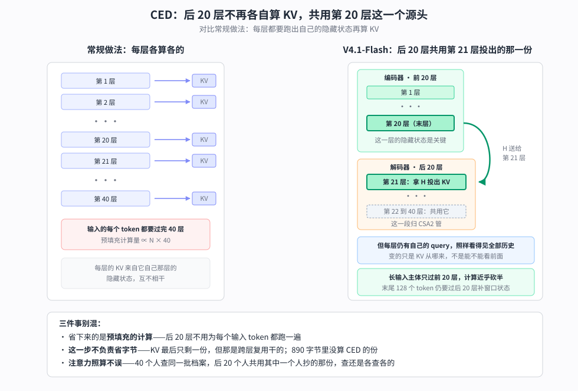
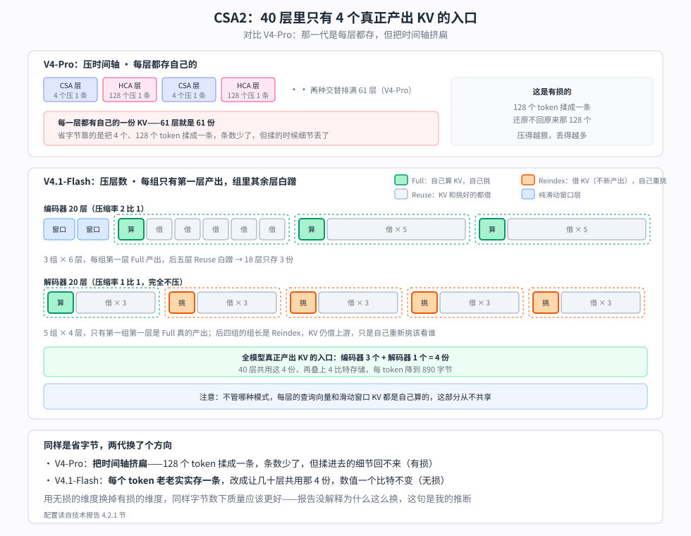
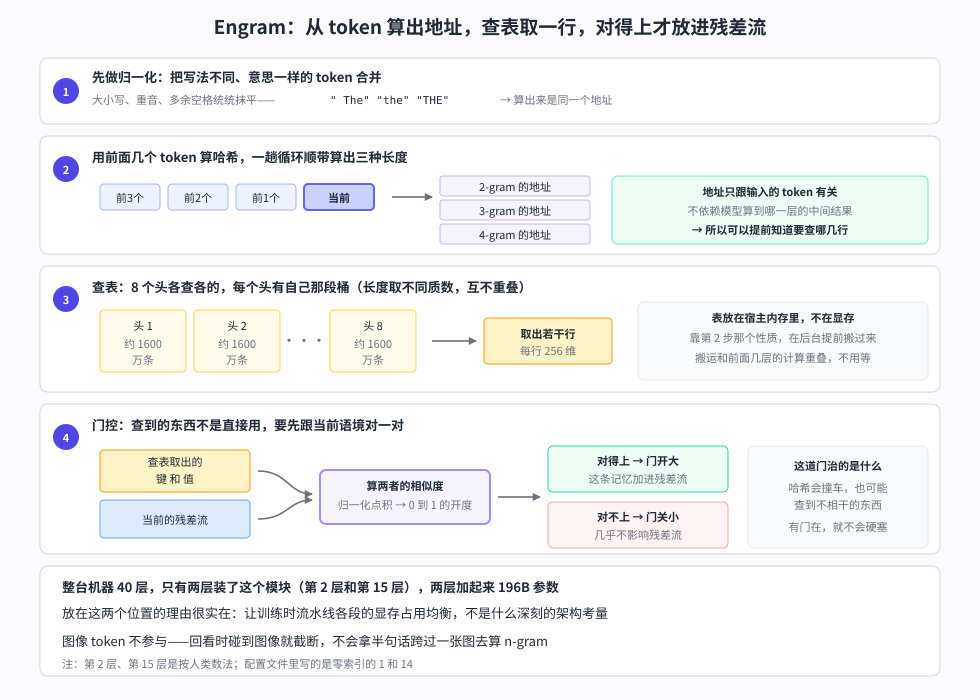

【DeepSeek V4.1-Flash】三个问号一起到期——40 层被切成两半，KV 降到 890 字节

━━━━━━━━━━━━━━━━━━━━

◆ 开篇：三个问号，一起到期

━━━━━━━━━━━━━━━━━━━━

写这个系列有个副作用：每期结尾留下的问号，会一直挂在那里，等一个可能永远不来的答案。

我手里挂着三个。

166 期 https://mp.weixin.qq.com/s/iLObYwtZYqCWwRRYJVcpyA 精读 DeepSeek V4 技术报告时，我专门花了一节论证 Engram 这套查表记忆为什么没能进 V4：那张巨大的记忆表放不进显存，只能放 CPU 内存，走 PCIe 5.0 的带宽是 64GB/s，而显存带宽是 3TB/s——差了将近 50 倍。**结论是一句没什么悬念的话：路子对，工程上还没法装机。**

293 期 https://mp.weixin.qq.com/s/jb-ibVHAG3wKbtoiX5SStA 写 Qwen3.8 的 N-gram 查表时，我回头翻了 49 期 https://mp.weixin.qq.com/s/4DqR-WYNf2ww61MDJVAFZw 结尾自己写的预测，当时写下一句自嘲：**“原厂发了论文，原厂自己没装机。”** 别人把 DeepSeek 的想法用上了，DeepSeek 自己还没用。

292 期 https://mp.weixin.qq.com/s/qGbCm3qJB6SNumftansUtw 读 GLM-5.3-Flash 的 config.json，结论落在两条路线的对垒上：**“一个走线性、一个走压缩，显存这局压缩赢了半子，两条路线谁走得远，得等下一代模型见分晓。”** 同一期里还埋过一句：国内大厂里现在只剩一个还没上线性注意力的，是 DeepSeek 自己。

这次三个问号一起到期。Engram 装机了，196B；线性注意力仍然没上，但压缩又往下推了一层，KV 缓存降到每 token 890 字节；顺带还多出一个结构改动——40 层被切成了两半。

技术报告的标题本身就是一句宣言：**Pushing the Limits of KV Cache Compression**，把 KV 缓存压缩推到极限。这台机器想解决的问题，从标题就写在脸上了。

> 材料来源：技术报告正文（PDF 就放在 Hugging Face 仓库里，文件名 DeepSeek_V41_Tech_Report.pdf）、README 与 config.json 逐字段、仓库自带的推理代码（inference/model.py 与 engram.py）、vLLM 官方 recipes 与 tracking issue。⚠️ 一条口径先说清楚：官方把它称作 **552B 主干**，另列 **196B Engram**；社区常说的约 763B，是把 Engram、投机解码草稿头这些主干之外的模块也算进去的全组件口径。两个数字统计边界不同，不是谁错了。本文讲计算量时用官方主干口径，讲部署容量时按完整权重算。

先交代背景坐标：架构细账在 166 期（V4 技术报告精读）和 168 期 https://mp.weixin.qq.com/s/YqcTnIrGKEYZ2n-sMAelKg （MHA/MLA/DSA/CSA-HCA 这条注意力演化线），上一版的变化记录在 268 期 https://mp.weixin.qq.com/s/SlC6kaPk6eZPSCgSH6duHQ （V4-Flash-0731），同代竞品在 292 期（GLM-5.3-Flash）和 293 期（Qwen3.8-Flash-Next）。**这些都不重讲，这期只讲变化。**

━━━━━━━━━━━━━━━━━━━━

◆ 第一章：40 层被切成两半

━━━━━━━━━━━━━━━━━━━━

先说它要治什么病。报告 2.2 节开头第一句就点了名：

`In agentic workflows, frequent tool calls generate extensive prefill requests, imposing severe computational overhead when KV caches miss.`

智能体干活的时候，每调用一次工具就产生一段新的输入要处理，而这些输入常常没命中缓存。**预填充（prefill，处理输入提示词的阶段）于是成了主要开销。** 这不是泛泛的“输入比输出多”，是一个很具体的场景。

DeepSeek 的处理办法叫 CED（因果编码-解码，Causal Encoder-Decoder）。README 里的一句话描述是：

`a 40-layer Transformer organized as a 20-layer causal encoder followed by a 20-layer decoder`

40 层的 Transformer，前 20 层叫编码器（encoder），后 20 层叫解码器（decoder）。

**这里要先把出处交代清楚：报告明写了这个设计受 YoCo（Sun et al., 2024）启发**，原文是 `inspired by YoCo`。YoCo 的做法是让上半部分的层直接共享下半部分产出的 KV 缓存，从而减少预填充计算；CED 在这个思路上做了一系列结构改进，用报告自己的话说是为了“增强整体 KV 缓存容量和 KV 生成的计算深度”。所以这不是一个从天上掉下来的发明，是一条已有路线上的工程推进。

具体怎么做的，报告给了公式，说人话就是：解码器那 20 层的全局 KV，**不是从各自的隐藏状态算出来的，而是拿第 20 层（编码器末层）的隐藏状态、配一组每层不同的投影权重直接投出来的**。config.json 里对得上：`candidate_source_layer_id: 20` 正指向编码器末层。

于是预填充阶段，长输入的主体只需要跑前 20 层。官方给的激活参数因此是两个数：**预填充每 token 激活 8B，解码每 token 激活 16B。**

这里有个尾巴不能省：后 20 层并非完全不跑，**末尾一个 128 token 的窗口仍要经过它们**，用来补齐滑动窗口的状态。所以报告给的复杂度不是干净的一半，而是 O(NL/2 + n_win×L/2)——序列长度 N 远大于窗口时才约等于 O(NL/2)，**近乎砍掉一半**。

**但有一个地方很容易读岔，得说准：省下来的是预填充的计算，不是 KV 的字节数。** 后半截该存的 KV 一个字节没少，只是不用再跑 20 层去算它。省字节是另一件事，下一章才讲。

还有一件更容易误会的事：**后 20 层照样看得见前面所有 token。** 它们只是不再各自生产一份 KV，注意力本身一点没少算——每层仍有自己的查询向量，拿它去查那份从第 20 层投影下来的 KV。变的是 KV 从哪来，不是能不能往前看。

打个比方：40 个人查同一批档案。原来每个人都先自己抄一份再查，现在后 20 个人共用第 20 个人抄的那份——**查还是各查各的，只是不用各抄一遍。** 而抄档案恰恰是预填充阶段最费工的部分，省掉 20 份抄写，计算量就下来了。

还有一处细节值得记下来，它是后面一整套设计的起因：**只有全局注意力那份 KV 是投影来的，滑动窗口那份仍然每层自己算。** 报告的理由是这样能保住局部 KV 生成的计算深度。代价是预填充时解码器那侧还得额外处理一批 token 来把窗口状态补齐——这个尾巴最后是用一套叫 SWA Bounded Replay 的办法收掉的，第四章再说。

整件事画成图是这样：

────────────────────

💡 此 encoder 非彼 encoder

看到 encoder-decoder 这个词，很容易顺着记忆滑回 2017 年——原版 Transformer 论文里那套翻译模型：编码器双向看完整句英文，解码器逐词吐中文。BERT 是纯编码器，T5 是编码-解码，GPT 是纯解码器，这是大多数人脑子里的分类表。

V4.1 的 encoder 不在这张表上，两个关键特征它一个都不占。

**一是掩码（mask）**：2017 那套的编码器是双向的，看得见整句；V4.1 的**仍然是单向自回归的**，第 n 个 token 看不见第 n+1 个，跟纯解码器模型的约束完全一样。名字里那个 causal（因果）就是在强调这件事。

**二是交叉注意力（cross-attention）**：2017 那套里，解码器靠一条独立的注意力路径去看编码器的输出，那是两个模块之间的通道。V4.1 没有这条路径——后半截拿到的是一份投影出来的 KV，仍然走自己那条常规的自注意力，**不是“去看编码器”，是“用编码器算好的那份 KV”**。

所以整台机器仍然是纯因果语言模型，config 里的类名写得明明白白：`DeepseekV41ForCausalLM`。这带来的都是好处：可以流式预填充，可以复用现有推理框架那套标准 KV 缓存语义，不需要为它发明新的调度模型。**别被 encoder-decoder 这个名字带回 2017 年。**

────────────────────

结构讲完了，接下来是这期真正的主菜——这个改动落到显存上是多少。

━━━━━━━━━━━━━━━━━━━━

◆ 第二章：KV 这笔账，三个维度一起压

━━━━━━━━━━━━━━━━━━━━

先把这一章的主张放在前面：**别家走线性注意力是换一种记法，DeepSeek 是在同一种记法上往死里压。**

报告 2.3 节给了一个很好用的框架：KV 的开销可以沿三个互相独立的维度往下压，三者是相乘的关系。

1.**条目大小**——每个 token 每层存的那条向量本身有多大。GQA 减少 KV 头的数量，MLA（多头潜在注意力，Multi-head Latent Attention）让所有头共享一个小的潜在向量。166 期讲透过：7168 维压到 512 维，每条约 576 字节，光这一步省 96%。

2.**序列维度**——每 m 个 token 压成一条。V4 的 CSA 和 HCA 干的就是这件事，166 期讲过。

3.**层维度**——某些层干脆不存自己的 KV，直接复用别层的。

**V4 吃的是前两个维度，V4.1 的 CSA2 把第三个也吃上了**——而且吃法跟直觉不太一样，这一章后面会看到。报告原话：

`CSA2 exploits the three dimensions jointly: it shares main KV and indexer K across layers and allows layers to reuse Top-K indices, with cache sharing and index reuse decoupled.`

层维度这条路也不是 DeepSeek 首创，报告自己列了三个前人工作：IndexCache 跨层复用 Top-K 索引、YOIO 把稀疏路由算一次给所有层共用、HySparse 让稀疏层复用稠密层的 KV 缓存。CSA2 的说法是，光复用索引省不下主缓存，得两样一起做、而且让两者解耦。

具体到每一层，CSA2 静态分配三种模式之一（训练前定死，不是运行时决定的）：

- **Full**：自己算主 KV、自己算索引器的查询向量，跑一遍索引产出新的 Top-K
- **Reindex**：主 KV 和索引器的键都复用前面层的，但自己重新打分，**产出新的 Top-K**
- **Reuse**：主 KV 和 Top-K 全部复用，连索引器的查询向量都不算

三种模式有个共同点：主查询向量和滑动窗口 KV 都是自己算的，这部分不共享。

报告给的实际排布是：40 层里前 2 层纯滑动窗口；其余 18 个编码器层分 3 组、每组 6 层，第一层 Full、后五层 Reuse；20 个解码器层分 5 组、每组 4 层，第一组是 1 Full 带 3 Reuse，后四组各是 1 Reindex 带 3 Reuse。

读到这里有个地方特别容易绕进去：CSA2 的跨层复用和第一章那个 CED，听起来不都是“后面的层用前面的 KV”吗？

**差别在于传过去的是成品还是原料。**

- **CSA2 传的是成品**——上游某层算好的 KV 张量，下游几层原样拿来用，大家共**用同一份数值**。所以它省的是存储：四层只存一份。
- **CED 传的是原料**——第 20 层的隐藏状态。后面每一层拿到同一份原料，但**各用自己的一组投影权重**算出自己那份 KV，**数值彼此不同**。报告的公式里，源头那项所有层共用，投影权重那项带着层号。所以它省的是计算：后 20 层不必真跑一遍前向去产出自己的隐藏状态。

一句话：**CSA2 让几层共用一份缓存，CED 让几十层共用一个源头。** 前者少存了东西，后者少算了东西，两件事在 V4.1 里是叠着用的——先靠 CED 把后半截的隐藏状态省掉，再靠 CSA2 把这半截里真正需要落盘的 KV 压到每四层一份。

摆完这些还有一个更值得注意的变化，得跟 V4 对着看才看得出来。

V4 在序列维度上压得很狠：CSA 层是 4 个 token 压成一条，HCA 层是 128 个压成一条，两种层交替排下去。**V4.1 反过来了**——18 个编码器层的压缩率只有 m=2，20 个解码器层干脆是 **m=1**，也就是**一个 token 一条，完全不压**。

| | V4（61 层） | V4.1（40 层） |
|---|---|---|
| 序列维度 | CSA 层 4 比 1，HCA 层 128 比 1 | 编码器 2 比 1，解码器 **1 比 1，不压** |
| 层维度 | 每层各存各的 | 40 层里**只有 4 个产出 KV 的入口** |

那它凭什么还能把每 token 压到 890 字节？答案就在下面那一行：18 个编码器层分 3 组、每组只有第一层产出 KV，20 个解码器层分 5 组、每组也只有第一层产出。**40 层加起来只存 4 份**，再叠上 4 比特存储，字节数就下来了。

**策略换了个方向：V4 是“把时间轴挤扁，但每层都得存”，V4.1 是“每个 token 老老实实存一条，但几十层共用几份”。从压时间，换成了压层数。**

两代排法画在一起是这样：

报告没有解释为什么这么换。**我的猜测是**：序列维度压缩是有损的——128 个 token 揉成一条，细节必然丢；而跨层复用是无损的，同一份 KV 被几层共用，数值一个比特都不变。用无损的那个维度去换有损的这个维度，同样的字节数下质量应该更好。**这一段是我的推断，不是报告的说法。**

再叠上第四个东西：**FP4 存储**。README 的原话是：

`Combined with FP4 main KV caching (E2M1 format, one E4M3 scale per 16 channels), these designs reduce the global KV cache footprint to 890 bytes per token — roughly 1/4 of DeepSeek-V4-Flash`

每 token 890 字节，约为 V4-Flash 的四分之一。E2M1 是 4 比特浮点的位宽分配（2 位指数、1 位尾数），每 16 个通道共享一个 E4M3 格式的缩放因子。

**这里有个我自己先读岔了的地方，得写清楚：890 这个数字是 CSA2 跨层复用加 FP4 两件事的结果，CED 不在其中。** 报告里 890 出现两次，措辞都是这两样 combined。CED 省的是预填充计算，不是 KV 字节——第一章那句提醒在这里兑现。至于跨层复用和 FP4 各省了多少，**报告没有拆账，我也不编一个比例出来**。

关于 FP4 还有一条值得单记：**它在这里只省存储，不加速矩阵乘。** 报告说得很明确——读出来先反量化再做注意力计算，所以不需要硬件原生支持 FP4 的矩阵乘法，`preserving compatibility across hardware platforms`，跨硬件平台的兼容性保住了。这句话后面还有故事，第七章再说。

官方自己画了一条历代曲线（报告图 1b）：**V4.1-Flash 每 token 的全局 KV 相对 V4-Flash 降到约 1/4，相对 V1 降到约 1/437。** 逐代的具体字节数报告没给，只给了这两个倍数。

三代摆在一起：

| 模型 | 每 token | 1M 上下文 | 出处 |
|---|---|---|---|
| DeepSeek V4-Flash | — | 6.72 GiB（bf16）/ 3.0 GiB（FP8） | 277 期算过 |
| GLM-5.3-Flash | 约 11 KiB | 11 GiB（bf16） | 292 期算过 |
| **DeepSeek V4.1-Flash** | **890 字节** | **不到 1 GB** | 官方 README |

口径要注明，这张表只适合看数量级，不能当严格同口径的基准：**890 字节是官方的全局 KV 口径，报告里明确写了它包含主 KV 和索引器的 K，但不含每层的滑动窗口 KV**；前两行则是此前按配置逐字段推算的结果，算法在 277 期 https://mp.weixin.qq.com/s/j8Dr2sdRUZIdPfGWr9r5nw 和 292 期里。上下文长度统一按 100 万 token。

现在可以回收 292 期埋的那根桩了。那期的结论是“一个走线性、一个走压缩，显存这局压缩赢了半子”——GLM 用 34 层线性注意力换来的 11 GiB，对上 V4-Flash 全套压缩零件的 6.72 GiB。当时我留了一句“两条路线谁走得远，得等下一代模型见分晓”。

现在下一代来了：**DeepSeek 这次仍然没上线性注意力，走的还是压缩，而且把压缩又往下推了一层。** 890 字节这个数字摆在 11 KiB 旁边，差着一个数量级。

不过话得说完整：这不是“线性注意力输了”的判决书。线性注意力省的是随上下文平方增长的计算量，压缩路线省的是存储；两边解决的不完全是同一个问题，只是显存这个共同的刻度上，压缩这一局又拉开了距离。

━━━━━━━━━━━━━━━━━━━━

◆ 第三章：Engram 装机了

━━━━━━━━━━━━━━━━━━━━

回收第二个问号。

166 期我论证过 Engram 为什么没进 V4：那张记忆表太大，显存放不下，只能放 CPU 内存，而 PCIe 5.0 和显存之间差着将近 50 倍带宽。当时的判断是路子对、工程还没跟上。

这次它进来了。README 原文：

`Engram ... 196B parameters, sparsely accessed via token-based lookup`

196B 参数，按 token 稀疏查表访问。config.json 里的配置全在：

- `engram_layer_ids: [1, 14]`——**只插两层**，注意这是零索引，按人类数法是第 2 和第 15 个 Transformer block
- `engram_num_embeddings: [384006168, 384016682]`——每层约 3.84 亿行
- `engram_head_dim: 256`——每行 256 维
- `engram_max_ngram_size: 4`——查表的键最长到 4 元组
- `engram_vocab_size: 16000000`——1600 万词表

报告里的配置比 config 字段更细：196B 平均分给两个模块，每个模块用 2、3、4 三种长度的 n-gram，8 个哈希头，每种长度总维度 2048，每个头对应一张约 1600 万条的表，**各表长度取不同的质数**。放置位置报告标了 `layers 1 and 14 (zero-indexed)`，理由写得很实在——`to balance memory usage across training pipeline stages`，为了让训练流水线各段的显存占用均衡，不是什么深刻的架构考量。

49 期讲过这套查表的原理——“词典查得到的就查词典，查不到的才动脑子”，把固定搭配、专有名词这类不需要推理的东西从权重里挪进查找表。原理这期不重讲。

**这里要先纠正我自己的一个预期。** 我原以为能在这一代看到 Engram 设计上的大改，实际报告写的是 `We follow the original Engram design`——分词器压缩、多头哈希、上下文感知门控、多分支整合，四样全部沿用原论文，只改了两处：去掉了短因果卷积（收益不值那点复杂度），以及把嵌入表的优化换成动量更新加 Sinkhorn 平衡。**所以那个“查到的东西要先跟当前语境对一下、对得上才让它进残差流”的门控机制，是前身论文里就有的，不是这一代的新发明。**

那 166 期那个 50 倍带宽差，到底是怎么绕过去的？报告只用了一句话，但这句话是整件事的关键：

`During inference, deterministic addressing enables embeddings to be prefetched from host memory via background RDMA transfers`

**表确实放在宿主内存里，走的还是那条慢路。真正的解法是：让它不必等。**

能预取的前提是“确定性寻址”——查表用的哈希 id 是从输入 token 直接算出来的，不依赖模型跑到哪一层的中间结果。**也就是说，下一步要查哪几行，在开算之前就已经知道了。** 于是可以在后台用 RDMA 慢慢搬，第一个模块的搬运还能跟第一个 Transformer block 的计算重叠掉。

166 期那笔带宽估算没有算错，错的是我当时默认了“每次要用的时候现取”。带宽差还在那里，只是被藏到计算后面去了——**这类问题的常见解法从来不是把慢的东西变快，而是让它提前开始。**

从 token 到残差流，整条路画出来是这样：

顺带一提，仓库里那份开源推理脚本（inference/engram.py 和 model.py）用的是另一套更简单的实现：表按行切片分给每张卡，查不到就填 0，最后 all_reduce 汇总。**开源脚本是一份简单的分布式参考实现，报告描述的则是把表放在宿主内存、靠后台 RDMA 预取的部署方案**，这两者别混为一谈。至于 DeepSeek 内部实际跑的是哪一套，公开材料里看不到，我也不替它补圆。

━━━━━━━━━━━━━━━━━━━━

◆ 第四章：还有第二笔账，在硬盘上

━━━━━━━━━━━━━━━━━━━━

890 字节那笔账，说的是常驻显存的那份 KV。报告里还有另一笔，容易被漏掉：**为了下次能接着用而持久化存起来的那份**，放在固态硬盘或者宿主内存里。

这一份降到了 V4-Flash 的约 **1/8**，而且报告把乘法拆得清清楚楚：

`the persistent KV cache no longer stores SWA KV, which almost halves its size, and the global KV retained in it is further compressed to 1/4 of V4's footprint`

**不再存滑动窗口那份 KV，体积差不多减半；剩下的全局 KV 又压到 1/4。二分之一乘四分之一，等于八分之一。**

为什么敢把滑动窗口那份扔掉？报告的理由不是“它不重要”，而是**它的访问模式和持久化这件事根本不匹配**：

`Unlike global KV, which exhibits long-tail reuse, SWA KV is reused only within a narrow, minute-scale window inside an active session and becomes dead once the session ends or the next turn begins.`

全局 KV 是长尾复用——今天存的，过几小时下一轮对话可能还用得上，所以官方给它的保证是至少留 72 小时。滑动窗口那份不一样，它只在一次活跃会话里几分钟的窗口内有用，会话一结束或者下一轮一开始就是死数据。**为死数据付长期存储的成本，不划算。**

扔掉就会有命中不了的时候，这时候靠一套叫 SWA Bounded Replay（有界回放）的办法兜底：不重算全部，**只把提示词最后那一个窗口长度的 token 回放一遍**。依据是前人工作发现滑动窗口的实际有效感受野，远小于理论上那个层数乘窗口的值。

第一章留的那个尾巴也是在这里收掉的：解码器那侧同样只回放最后一个窗口的 token，**报告说这近乎又把总的预填充计算砍掉一半**。

**代价报告自己写明了：重建出来的状态 `not mathematically identical`，不是数学上完全一致的。** 官方给的说法是实验上影响可以忽略，但**没有给量化数字**。这是一个用精确性换成本的交易，不是一个免费的优化——报告在结论那节又提了一次，第八章会再碰到它。

━━━━━━━━━━━━━━━━━━━━

◆ 第五章：代价不是抽象崩了，是整数对不齐

━━━━━━━━━━━━━━━━━━━━

这一章有个反转，是我查资料时被打脸的地方。

我原本的预判很自然：encoder-decoder 这种结构一出来，现有推理框架的 KV 缓存抽象肯定套不上——框架里那套“每层一份 KV、按层分页管理”的模型，跟“后 20 层的 KV 从第 20 层投影出来”根本不是一个形状。我以为这期能写一段“新架构逼着框架重写调度器”的故事。

**结果查下来不是。**

vLLM 在 V4 时代就已经把这个抽象打平了。官方博客里的做法是：把压缩器的状态注册成一种滑动窗口 KV 规格，塞进同一套混合 KV 缓存管理器（hybrid KV cache manager）里。抽象层面它就是又一种 KV 规格，上层的东西一个都不用改——原话是 `prefix caching, disaggregated prefill, CUDA graphs and MTP reuse the same abstraction`：前缀缓存、预填充与解码分离、CUDA 图、多 token 预测，全部复用同一套抽象。

那真正的坑在哪？**最扎眼的那批兼容问题，下沉到了核函数（kernel）和缓存块形状这一层。** 看一个具体报错（vllm#56461）：`DeepseekV4SWACache(..., block_size=32)` 里的块大小是硬编码的 32，而 `deepseek_v4` 这条路径用的是默认的 64；FlashInfer 那边的稀疏 MLA 只提供了 `page_block_size == 64` 的解码核函数，两边一对不上，就报出来一句 `SM120 sparse-MLA has no decode kernel for this shape`——这个形状没有对应的解码核函数。

**新架构的代价不是重写调度器，是一堆 32 对不上 64 的整数。**

这个结论对写业务代码的人其实不陌生：接口设计得好的时候，架构变更的成本会从上层一路下沉到最底层的实现细节，最后表现为一堆边界值和形状不匹配。听起来不如“重构调度器”有戏剧性，但这恰恰说明上面那层抽象设计对了。

支持进度也值得记一笔。vLLM 在发布当天就给出了专用 Docker 镜像和配方，确实算首日（day-0）可运行；**但当时普通的 pip 安装包里并没有这套架构，核心支持的合并要再晚一天**。而且“当天能跑”不等于“打个补丁就完了”——tracking issue（vllm#56400）里写得很清楚：`DeepseekV41ForCausalLM is a distinct architecture from V4 — separate tree, tokenizer mode, parsers and config class`，这是和 V4 并列的另一个架构，要单开一棵模型树，分词器模式、解析器、配置类全部另起一份。SGLang 那边的 PR（#38798）截至写稿还没合并。

────────────────────

💡 激活参数少，不等于放得下

第一章那两个数字——预填充 8B、解码 16B——很容易读出一个错误的推论：“才激活 8B，那小显存机器也能跑吧？”

**我自己就在这上面栽过一次，第一反应就是这句。完全错了。**

激活参数衡量的是每生成一个 token 要过手多少计算和多少权重读取，它管的是算力和带宽。**显存是另一笔开销**：MoE 那 552B 的专家权重必须常驻可寻址的位置，路由随时可能点到任何一个专家；Engram 那 196B 的查找表也必须整个可寻址，查表这件事没法预测下一个 token 要查哪一行。

官方配方给出的完整权重约 511 GB，而 `vram_minimum_gb: 614` 是在这之上再留约 20% 运行余量后的部署预算——**不是说 614 GB 全是静态权重**。顺带一提，552B、约 763B、511 GB、614 GB 这四个数字能同时成立，是因为参数个数和字节数不是一回事：大量权重存成了 4 比特和 8 比特，而最后那个数字还含运行余量。**“激活少”省的是每 token 的运行成本，“装得下”要的是全部权重的落脚地，两者从来不是一回事。**

────────────────────

这个数字摆出来，下一个问题就自然了：那它到底要什么样的机器。

━━━━━━━━━━━━━━━━━━━━

◆ 第六章：Flash 这次不是“小份”了

━━━━━━━━━━━━━━━━━━━━

292 期写 GLM-5.3-Flash 时，我给它的标题是“名字像旗舰的小份”——名字读着保守，架构换得激进。

V4.1-Flash 反过来：名字像小份，硬件要求不像。官方给的验证配置是 **GB200 NVL4 一整个托盘（768GB 显存）跑 TP4（4 路张量并行），或者一个 8 卡 H200 节点**。

这里有个反直觉的地方值得记下来。Engram 那张表，官方的做法是放宿主内存——在显存和内存分离的机器上，这是明摆着的优势：183 GiB 的查找表挪去 CPU 内存，显存压力立刻松一大截。**但在统一内存的机器上，宿主内存本身就是 GPU 的内存池，这条逃生路不存在。** 挪不挪都是那块内存。那些靠统一内存架构吃到 MoE 红利的家用设备，在这一代身上拿不到这份优惠。

268 期结尾我写过一句话：“开源权重加社区工程，等于家用机的黄金时代——这句话每隔几个月要重新验证一次，而每次验证的门槛都比上次低。”

**这次是反的，门槛升上去了。**

不必把这件事读成唱衰。V4-Flash 那一代把家用部署做成了一件普通人够得着的事，是因为它那三个数字（激活 13B、KV 压到 2%、专家权重原生 FP4）恰好把三座山都削平了。V4.1 换了个优化目标：它把 KV 又压低一个数量级，代价是拿一张 196B 的查找表换来的——这张表的落脚地在数据中心里不算事，在书桌上就是一道硬门槛。

同一家公司，同一条 Flash 产品线，上一代和这一代面向的部署场景不一样了。这只是一个需要如实记下来的事实：**这一代 Flash 不是给家用机准备的。**

━━━━━━━━━━━━━━━━━━━━

◆ 第七章：它赌的是还没出现的硬件

━━━━━━━━━━━━━━━━━━━━

这一章的材料是全文最硬的一条，来自 V4 技术报告里 DeepSeek 自己写的一句短板自陈：

`While the peak FLOPs for FP4 × FP8 operations are currently the same as FP8 × FP8 on existing hardware, they can theoretically be implemented to be 1/3 more efficient on future hardware`

翻译成人话：**FP4 在现在的硬件上一点算力收益都没有**——FP4 乘 FP8 的峰值算力和 FP8 乘 FP8 完全一样，省下来的只有显存；算力那份收益，理论上要等下一代硬件才能兑现，而且写的是“理论上可以实现”。

一家公司在自家技术报告里写下这种话，是很少见的坦白。它等于承认：我们现在做的这件事，一半的价值还没到账。

有一条精度要写准。V4 报告里的 FP4 量化感知训练（quantization-aware training，QAT）是放在后训练章节（5.2.1 节）的——所以**不要说成“DeepSeek 用 FP4 做预训练”**，准确的说法是：训练流程里包含了一道量化感知训练，让模型提前适应 4 比特的精度。

V4.1 这次把这道工序延伸到了 KV 缓存本身，报告原话是 `We now extend QAT to the main KV cache`。格式选择也写了理由：四比特的候选里挑了 E2M1 配每 16 通道一个 E4M3 缩放因子，因为动态范围绰绰有余——这个格式能表示到 2688，而训练中实际观测到的最大幅度约 10。另外滑动窗口那份 KV 对量化更敏感，**仍然保留 FP8，没跟着降到 4 比特**。

接下来是国产算力这条线。我只写查到的，查不到的明说没查到。

**V4 技术报告里有一句点名**：`We validated the fine-grained EP scheme on both NVIDIA GPUs and HUAWEI Ascend NPUs platforms`——细粒度专家并行方案在英伟达 GPU 和华为昇腾 NPU 两个平台上都验证过。这是 DeepSeek 官方文档里少见的直接点名国产硬件。

**V4 发布那次（2026 年 4 月）的国产首日适配规模很大**，智源的 FlagOS 一次打通了八款芯片。但有个细节值得记：**它的公开方案里带了一道 FP4 转 BF16 的精度转换**。这说明“能加载低精度权重”和“用原生 FP4 核函数执行”是两回事——不过仅凭这一条转换路径，还不能断言所有已适配的国产芯片都不支持原生 FP4。

**V4.1-Flash 这次**，公开资料里至少能确认两条国产路径：寒武纪发布了基于 vLLM、用 BangC 写稀疏注意力和压缩注意力核函数的适配；vLLM Ascend 那边也已经给出 V4.1-Flash 的实验性部署文档，用的是 W8A8 权重配 INT8 的 Engram 存储，两台 Atlas 800 A3 或者四台 A2。

**但这两条都不等于“原始权重在国产芯片上原生跑完整条 FP4 路径”**——昇腾那份用的是 W8A8，精度路线跟原生 FP4 不是一回事。海光、昆仑芯这些是否完成专项适配，我没找到够硬的公开材料。

DeepSeek 官方公告里，一个国产厂商的名字都没提，只有一句 `We'll work closely with the open-source community on V4.1-Flash inference support`——会和开源社区紧密合作。

把这几条摆在一起，能读出一个略带苦味的形状：一家公司在赌一个还没出现的硬件，而现在唯一能接住这个赌注的硬件，恰好是买不到的那些。

━━━━━━━━━━━━━━━━━━━━

◆ 第八章：报告自己承认的两件事

━━━━━━━━━━━━━━━━━━━━

技术报告最后一节叫 Conclusion, Limitations, and Future Directions，那个 Limitations 写得相当直接，值得原样摆出来。

**第一件：新东西带来的边界，还没摸清楚。**

`Potential selection errors in CSA2 and approximate state reconstruction in SWA Bounded Replay may still cause capability degradation in untested boundary cases.`

点名了两个风险源，正好就是这篇文章第二章和第四章讲的那两样：**CSA2 的 Top-K 可能选错**（该看的历史 token 没选进来），**SWA Bounded Replay 的状态是近似重建的**（第四章那句“不是数学上完全一致”）。报告说内部测了各种边界条件没发现系统性退化，但紧接着补了一句——没有任何有限的测试集能覆盖所有极端输入。他们自己点名的下一步压测方向是长上下文的稀疏检索，和缓存接续边界上的窗口状态重建。

**这是我读到现在觉得最值得记的一段。** 前面那些压缩手段每一样都不是白来的：跨层复用赌的是“别层选出来的 token 我也能用”，有界回放赌的是“有效感受野没那么长”。**这些赌注在日常负载上赢了，但报告没有假装它们在所有情况下都赢。**

**第二件：分数接近不等于能力接近。**

`Although benchmark scores show a narrow margin, this parity does not imply that the model matches the frontier capabilities of leading closed-source systems on complex, high-difficulty reasoning and edge cases.`

跑分表上跟顶级闭源模型差距很小、日常使用体验高度接近，**但在最难的那些任务上差距仍然存在**——这句话是厂商自己写的，而不是哪个评测机构挑出来的。

对照一下 268 期立过的那把尺子（一张跑分表最诚实的信息往往不在数字里，在列的选取里）：这次 DeepSeek 选的对照组全是在役最新款，被碾压的那几行也没删——Terminal-Bench 4.0 上 31.2 对人家 51.8，明晃晃摆在表里。**愿意把这种行留在表里，比任何一行加粗的数字都有说服力。**

━━━━━━━━━━━━━━━━━━━━

◆ 第九章：还没核实到的部分

━━━━━━━━━━━━━━━━━━━━

按 292 期起的规矩，把这期没能钉死的地方列出来。

**训练用什么硬件、多少卡、多少 GPU 小时：报告里没有。** 这条我先在三个网页上没查到，后来把报告正文从头翻了一遍——全文没有出现任何 GPU 型号、卡数或者机时，训练基础设施那一节只讲并行策略和调度机制。不是没查到，是**报告本身就没写**。

**890 字节里各部分各占多少：报告没拆。** 两处提到 890 的措辞完全一样，都是跨层复用加 FP4 两者 combined 的结果，没有细账。

**有界回放的质量损失有多大：报告没给数字。** 只说了“不是数学上完全一致”和“实验上影响可忽略”，具体退化多少没有量化。

**逐代 KV 字节数：只有倍数没有数值。** 图 1b 那条历代曲线给了相对 V4-Flash 约 4 倍、相对 V1 约 437 倍，但各代的绝对字节数没在正文或图注里列出。

**国产芯片的完整适配状态：只能确认两条。** 寒武纪和 vLLM Ascend 各有公开材料，海光、昆仑芯等是否完成 V4.1 专项适配，没找到够硬的公开材料。

**Pro 版有没有计划、什么时候出：官方没说。**

━━━━━━━━━━━━━━━━━━━━

◆ 第十章：技术名词速查

━━━━━━━━━━━━━━━━━━━━

| 术语 | 一句话解释 |
|---|---|
| CED（因果编码-解码，Causal Encoder-Decoder） | 40 层切成前 20 后 20，后半截各层拿第 20 层的隐藏状态、用各自的权重投影出 KV（传原料，省计算，不省 KV 字节）。本期第一章 |
| CSA2 | V4 跨层 KV 共享的新版本，每层静态分到 Full / Reindex / Reuse 三种模式之一，几层共用一份 KV 数值（传成品，省存储）；前代 CSA/HCA 见 166 期 |
| MLA（多头潜在注意力，Multi-head Latent Attention） | 把每层每 token 的 KV 从 7168 维压到 512 维，V2 首创，166 期与 168 期讲过 |
| DSA（DeepSeek 稀疏注意力，DeepSeek Sparse Attention） | 先挑出该看的历史 token 再算注意力，省的是计算不是存储，V3.2 引入，166 期讲过 |
| Engram | 按 token 查表取记忆的模块，这一代 196B、只插两层，前身论文 49 期讲过 |
| mHC（流形约束超连接，Manifold-Constrained Hyper-Connections） | V4 在残差流上的改动，126 期 https://mp.weixin.qq.com/s/iArmZhtv1Q_aobLkEm3BBw 从字节的 HC 讲到过 mHC |
| DSpark | DeepSeek 自家的投机解码方案，草稿头挂在末几层一次猜多个 token，236 期 https://mp.weixin.qq.com/s/fQc0hRxEIZxkPzGTDhj78g 与 268 期讲过 |
| QAT（量化感知训练，quantization-aware training） | 训练流程里让模型提前适应低精度，V4 放在后训练阶段，V4.1 延伸到 KV 缓存 |
| MXFP4 | OCP 标准的 4 比特浮点格式，带分组共享缩放因子 |
| SWA Bounded Replay（有界回放） | 滑动窗口 KV 不再持久化，命中不了就只回放最后一个窗口的 token 重建，近似而非精确，本期第四章 |
| prefill（预填充）/ decode（解码） | 前者处理输入提示词、可并行，后者逐 token 生成；这一代两个阶段的激活参数不同，8B 对 16B |

━━━━━━━━━━━━━━━━━━━━

◆ 参考资料

━━━━━━━━━━━━━━━━━━━━

DeepSeek-AI, DeepSeek-V4.1-Flash Model Card、config.json 与仓库自带推理代码 inference/model.py、inference/engram.py（Hugging Face，2026-09；架构字段、890 字节 KV、Engram 配置与开源实现均读自官方原值）

DeepSeek-AI, DeepSeek-V4 Technical Report（2026；FP4 算力自陈、QAT 章节归属、昇腾平台验证一句）

DeepSeek-AI, DeepSeek-V4.1-Flash: Pushing the Limits of KV Cache Compression（技术报告 PDF 随权重发布于 Hugging Face 仓库，2026-09；CED 与 CSA2 机制、SWA Bounded Replay、FP4 KV 格式选择、Limitations 一节均引自正文）

vLLM Project, DeepSeek-V4.1-Flash Recipes 与 tracking issue #56400、issue #56461（2026-09；编码器半程预填充说明、显存预算、核函数形状报错）

vLLM Project, 官方博客中 V4 混合 KV 缓存管理器一节（2026；压缩器状态注册为滑动窗口 KV 规格）

寒武纪首日适配公告（2026-09-10；基于 vLLM，BangC 核函数）

vLLM Ascend, DeepSeek-V4.1-Flash 部署文档（2026-09；实验性，W8A8 权重配 INT8 Engram 存储）

智源研究院 FlagOS 多芯片适配说明（2026-04；V4 首日八款芯片，含 FP4 转 BF16 精度转换）

━━━━━━━━━━━━━━━━━━━━

**别家换记法，这家在同一种记法上往死里压——条目、序列、层三个维度一起吃完，一个 token 的全局记忆只剩 890 字节。**

**新架构真正的代价，往往不是重写调度器这种有戏剧性的事，而是一堆 32 对不上 64 的整数。**

**它省下的显存今天就能兑现，押注的算力要等下一代硬件——而这句话是这家公司写在自己技术报告里的。**

━━━━━━━━━━━━━━━━━━━━

// 靳岩岩的 AI 学习笔记 × Claude和GPT 的严谨 × Gemini 的浪漫
// 2026年9月14日

━━━━━━━━━━━━━━━━━━━━

【摘要（发布用，不进正文）】

DeepSeek V4.1-Flash 一次回收三个旧问号：Engram 装机了（196B、只插两层），线性注意力仍然没上但压缩又推深一层，KV 降到每 token 890 字节。40 层被切成两半，预填充只跑前半截，计算砍掉近一半。
