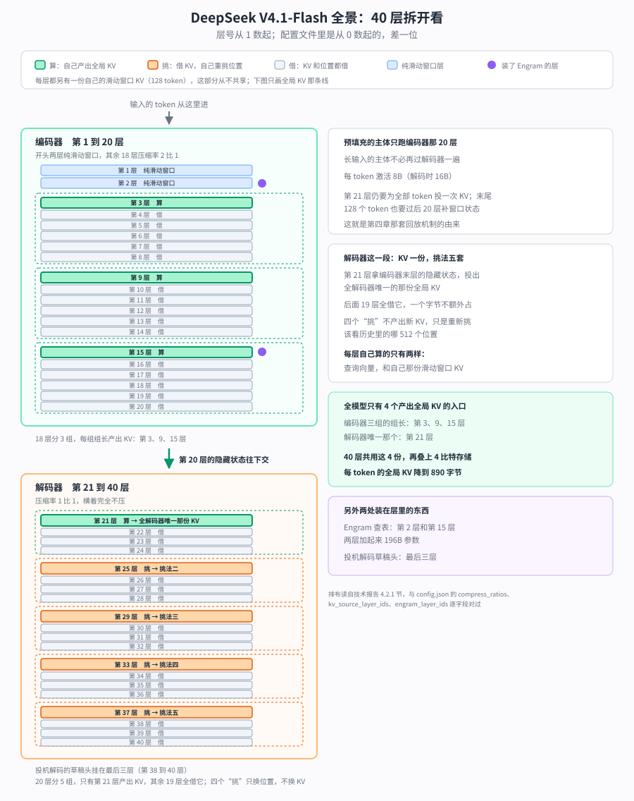
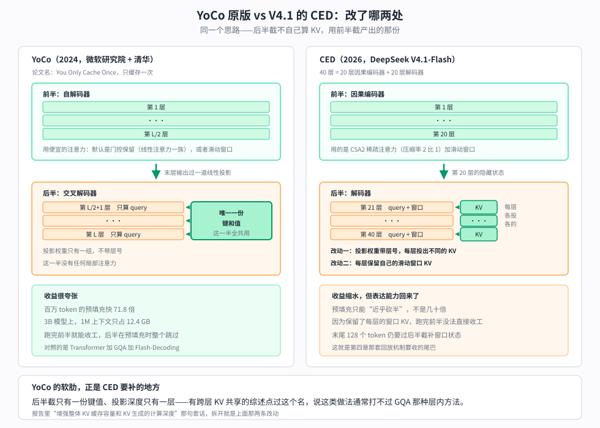
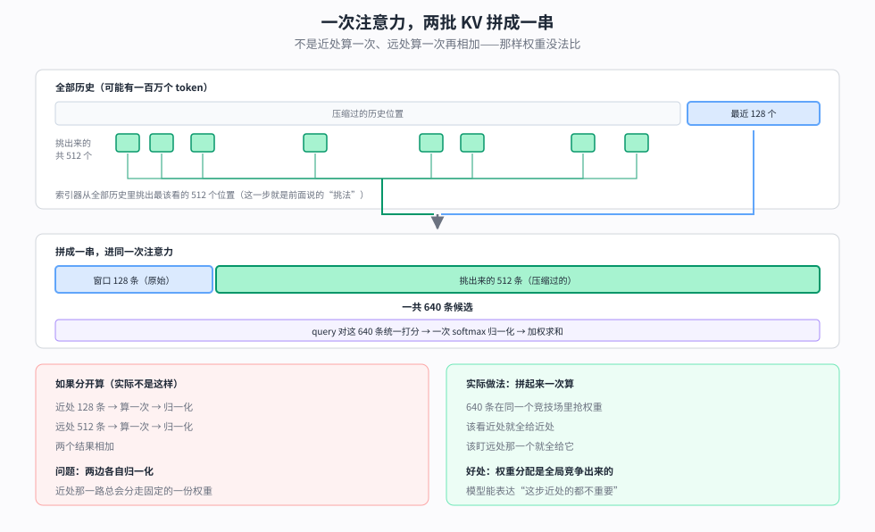
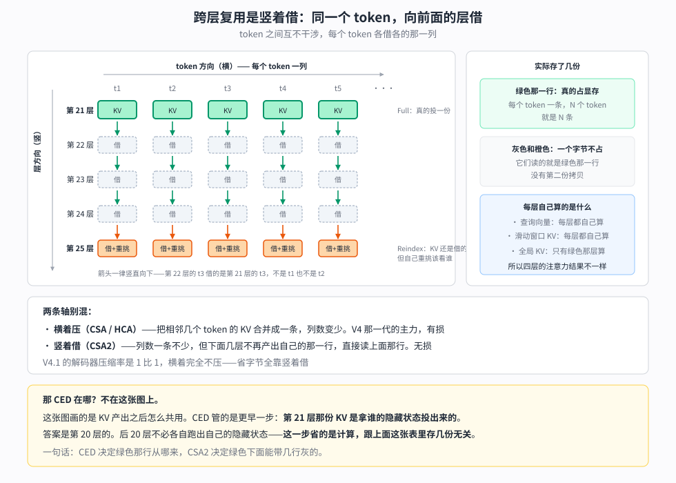
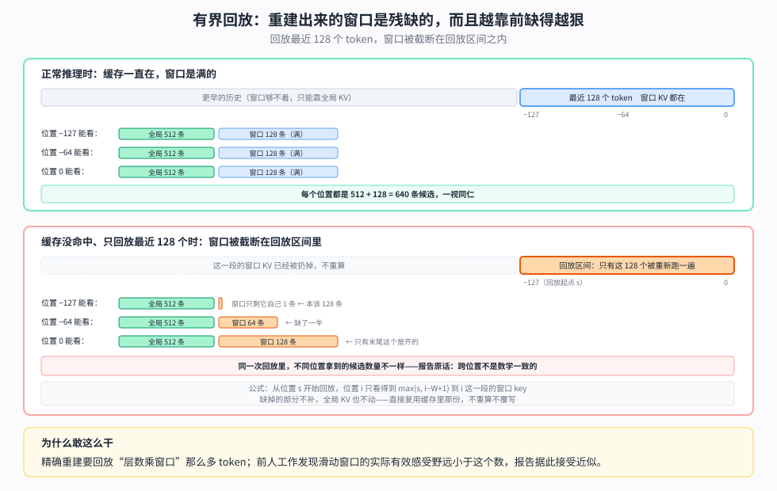

【DeepSeek V4.1-Flash】KV 极限压缩的新架构，40 层被切成两半

━━━━━━━━━━━━━━━━━━━━

◆ 开篇：三个问号，一起到期

━━━━━━━━━━━━━━━━━━━━

写这个系列有个副作用：每期结尾留下的问号，会一直挂在那里，等一个可能永远不来的答案。

我手里挂着三个。

166 期 https://mp.weixin.qq.com/s/iLObYwtZYqCWwRRYJVcpyA 精读 DeepSeek V4 技术报告时，我专门花了一节论证 Engram 这套查表记忆为什么没能进 V4：那张巨大的记忆表放不进显存，只能放 CPU 内存，走 PCIe 5.0 的带宽是 64GB/s，而显存带宽是 3TB/s——差了将近 50 倍。**结论是一句没什么悬念的话：路子对，工程上还没法装机。**

293 期 https://mp.weixin.qq.com/s/jb-ibVHAG3wKbtoiX5SStA 写 Qwen3.8 的 N-gram 查表时，我回头翻了 49 期 https://mp.weixin.qq.com/s/4DqR-WYNf2ww61MDJVAFZw 结尾自己写的预测，当时写下一句自嘲：**“原厂发了论文，原厂自己没装机。”** 别人把 DeepSeek 的想法用上了，DeepSeek 自己还没用。

292 期 https://mp.weixin.qq.com/s/qGbCm3qJB6SNumftansUtw 读 GLM-5.3-Flash 的 config.json，结论落在两条路线的对垒上：**“一个走线性、一个走压缩，显存这局压缩赢了半子，两条路线谁走得远，得等下一代模型见分晓。”** 同一期里还埋过一句：国内大厂里现在只剩一个还没上线性注意力的，是 DeepSeek 自己。

这次三个问号一起到期。Engram 装机了，196B；线性注意力仍然没上，但压缩又往下推了一层，KV 缓存降到每 token 890 字节；顺带还多出一个结构改动——40 层被切成了两半。

技术报告的标题本身就是一句宣言：**Pushing the Limits of KV Cache Compression**，把 KV 缓存压缩推到极限。这台机器想解决的问题，从标题就写在脸上了。

> 材料来源：技术报告正文（PDF 就放在 Hugging Face 仓库里，文件名 DeepSeek_V41_Tech_Report.pdf）、README 与 config.json 逐字段、仓库自带的推理代码（inference/model.py 与 engram.py）、vLLM 官方 recipes 与 tracking issue。⚠️ 一条口径先说清楚：官方把它称作 **552B 主干**，另列 **196B Engram**；社区常说的约 763B，是把 Engram、投机解码草稿头这些主干之外的模块也算进去的全组件口径。两个数字统计边界不同，不是谁错了。本文讲计算量时用官方主干口径，讲部署容量时按完整权重算。

先把整台机器摆出来，后面每一章讲的都是这张图上的某一块：

先交代背景坐标：架构细账在 166 期（V4 技术报告精读）和 168 期 https://mp.weixin.qq.com/s/YqcTnIrGKEYZ2n-sMAelKg （MHA/MLA/DSA/CSA-HCA 这条注意力演化线），上一版的变化记录在 268 期 https://mp.weixin.qq.com/s/SlC6kaPk6eZPSCgSH6duHQ （V4-Flash-0731），同代竞品在 292 期（GLM-5.3-Flash）和 293 期（Qwen3.8-Flash-Next）。**这些都不重讲，这期只讲变化。**

━━━━━━━━━━━━━━━━━━━━

◆ 第一章：40 层被切成两半

━━━━━━━━━━━━━━━━━━━━

先说它要治什么病。报告 2.2 节开头第一句就点了名：

`In agentic workflows, frequent tool calls generate extensive prefill requests, imposing severe computational overhead when KV caches miss.`

智能体干活的时候，每调用一次工具就产生一段新的输入要处理，而这些输入常常没命中缓存。**预填充（prefill，处理输入提示词的阶段）于是成了主要开销。** 这不是泛泛的“输入比输出多”，是一个很具体的场景。

DeepSeek 的处理办法叫 CED（因果编码-解码，Causal Encoder-Decoder）。README 里的一句话描述是：

`a 40-layer Transformer organized as a 20-layer causal encoder followed by a 20-layer decoder`

40 层的 Transformer，前 20 层叫编码器（encoder），后 20 层叫解码器（decoder）。

────────────────────

💡 此 encoder 非彼 encoder

看到 encoder-decoder 这个词，很容易顺着记忆滑回 2017 年——原版 Transformer 论文里那套翻译模型：编码器双向看完整句英文，解码器逐词吐中文。BERT 是纯编码器，T5 是编码-解码，GPT 是纯解码器，这是大多数人脑子里的分类表。

V4.1 的 encoder 不在这张表上，两个关键特征它一个都不占。

**一是掩码（mask）**：2017 那套的编码器是双向的，看得见整句；V4.1 的**仍然是单向自回归的**，第 n 个 token 看不见第 n+1 个，跟纯解码器模型的约束完全一样。名字里那个 causal（因果）就是在强调这件事。

**二是交叉注意力（cross-attention）**：2017 那套里，解码器靠一条独立的注意力路径去看编码器的输出，那是两个模块之间的通道。V4.1 没有这条路径——后半截拿到的是一份投影出来的 KV，仍然走自己那条常规的自注意力，**不是“去看编码器”，是“用编码器算好的那份 KV”**。

所以整台机器仍然是纯因果语言模型，config 里的类名写得明明白白：`DeepseekV41ForCausalLM`。这带来的都是好处：可以流式预填充，可以复用现有推理框架那套标准 KV 缓存语义，不需要为它发明新的调度模型。**别被 encoder-decoder 这个名字带回 2017 年。**

────────────────────

名字的事说完了，来看它实际做了什么。

**先把出处交代清楚：报告明写了这个设计受 YoCo（Sun et al., 2024）启发**，原文是 `inspired by YoCo`。YoCo 的做法是让后半部分的层直接共享前半部分产出的 KV 缓存，从而减少预填充计算；CED 在这个思路上做了一系列结构改进，用报告自己的话说是为了“增强整体 KV 缓存容量和 KV 生成的计算深度”。所以这不是一个从天上掉下来的发明，是一条已有路线上的工程推进。

────────────────────

💡 这套路子是谁先走的

YoCo 这篇论文的名字很直白：You Only Cache Once，只缓存一次。微软研究院和清华的工作，2024 年 5 月放出来，收进了那年的 NeurIPS。

**这个月份值得记一下：MLA 也是 2024 年 5 月，跟着 DeepSeek-V2 一起出来的。** 同一个月，两拨人在回答同一个问题——KV 缓存怎么再压一个数量级——但选的轴不一样。MLA 接着压“一条 KV 里装多少东西”，把 7168 维压到 512 维，走的还是 GQA 那条路，只是走到底了。YoCo 换了条轴：**不动每条有多大，动的是存多少层。**

它的做法是把模型切成两半，前半叫自解码器、后半叫交叉解码器。**前半用的是便宜的注意力**——论文给了两个选项，默认那个是线性注意力一族的门控保留，另一个就是滑动窗口。跑完前半之后，拿最后一层的输出算出一份全局的键和值，**后半所有层共用这一份**，每层只算自己的查询向量。

收益很夸张：KV 缓存的显存复杂度从层数乘长度降到层数加长度，3B 模型上一百万 token 的上下文只占 12.4 GB，同等条件的传统架构要多占 9.4 倍。

预填充那边还有个**单独的机制**，容易跟省显存混为一谈：既然后半截要的只是前半截的输出，**预填充跑到一半就可以直接收工**，后半截整个不用过——而且论文强调这不改变最终输出。百万 token 的预填充快 71.8 倍、512K 从 180 秒降到 6 秒以内，靠的是这一条，不是共享 KV 那一条。

**但这条路两年里基本停在学术层面**，我没查到哪个前沿量产模型公开说自己用了它。有一篇跨层 KV 共享的综述点了它的软肋：这类做法“通常打不过 GQA 这种层内的方法”。

两代摆在一起看，改动就很清楚了：

问题出在哪？**后半截只有一份键和值。** 投影权重只有一组，几十层共用同一份产物，表达能力是被卡死的。而且那份键值就是下半层输出过一道线性投影，**生成深度只有一层**。

CED 改的就是这两处：**每层有自己的投影权重**，各投各的；**每层保留自己的滑动窗口 KV**，不是只靠全局那一路。报告里那句“增强整体 KV 缓存容量和 KV 生成的计算深度”，说的正是这两件事。

代价也很清楚：**CED 等于放弃了那个早退。** 后半截每层都留着自己的窗口 KV，就没法跑完前半直接收工，总得为它再补一段。所以 CED 的预填充只能“近乎砍半”，而不是 YoCo 那种几十倍。第四章那套回放机制，就是来收这个尾巴的。

────────────────────

先把层号对齐，不然后面全乱：**第 1 到 20 层是编码器，第 21 到 40 层是解码器**，本文一律从 1 数起。编码器的末层是第 20 层，解码器的第一层是第 21 层。

具体怎么做的，报告给了公式，说人话就是：解码器那 20 层的全局 KV，**不是从各自的隐藏状态算出来的，而是拿编码器末层的隐藏状态、配一组每层不同的投影权重直接投出来的**。

config.json 里能把这条边界找出来。`compress_ratios` 这个数组逐层写着压缩率：开头两个 0（纯滑动窗口的两层），接着 18 个 2，然后 20 个 1——**2 和 1 的交界处，正是编码器与解码器的分界**。另外 `kv_source_layer_ids` 是 `[2, 8, 14, 20]`，标出了四个真正产出 KV 的层。**注意这些字段用的是从 0 数起的编号**，换算成本文的说法，那四层分别是第 3、9、15、21 层。开头那两个纯滑动窗口的层不产出全局 KV，所以编码器这边是从第 3 层起数、每 6 层一个源头。

于是预填充阶段，长输入的主体只需要跑前 20 层。官方给的激活参数因此是两个数：**预填充每 token 激活 8B，解码每 token 激活 16B。**

这里有个尾巴不能省：后 20 层并非完全不跑，**末尾一个 128 token 的窗口仍要经过它们**，用来补齐滑动窗口的状态。所以报告给的复杂度不是干净的一半，而是 O(NL/2 + n_win×L/2)——序列长度 N 远大于窗口时才约等于 O(NL/2)，**近乎砍掉一半**。

**但有一个地方很容易读岔，得说准：CED 这一步省的是预填充的计算，不是 KV 的字节数。** 后 20 层的全局 KV 最后确实只剩一份，但那是下一章要讲的跨层复用干的；CED 只负责让这些层不必各自跑一遍前向去产出隐藏状态。报告里把两件事分得很清楚，890 字节那个数字也没算 CED 的份。

还有一件更容易误会的事：**后 20 层照样看得见前面所有 token。** 它们只是不再各自生产隐藏状态，注意力本身一点没少算——每层仍有自己的查询向量，拿它去查那份共用的 KV。变的是 KV 从哪来，不是能不能往前看。

打个比方：40 个人查同一批档案。原来每个人都先自己抄一份再查，现在后 20 个人共用一份——**查还是各查各的，只是不用各抄一遍。** 而抄档案恰恰是预填充阶段最费工的部分，省掉那些抄写，计算量就下来了。

还有一处细节值得记下来，它是后面一整套设计的起因：**同一层里有两条注意力路径，而这两条路走的规则不一样。**

| | 全局那条 | 滑动窗口那条 |
|---|---|---|
| 第 22 到 40 层的 KV 从哪来 | 借第 21 层那份 | **每层自己算** |
| 用的是谁的隐藏状态 | 编码器末层那一个 | **各用各的那一层** |
| 预填充时要为谁算 | 不必为每个输入 token 算 | **末尾 128 个 token 要算** |

这张表里第三行那个尾巴——末尾 128 个 token 仍要爬完后 20 层——是后面一整套设计的起因，第四章再回来收它。

整件事画成图是这样：

说到这儿，可以把这一整章压成一句话：

**解码器那 20 层共用第 21 层算出来的那一份全局 KV；因为它们没有自己要算的全局 KV，预填充时就不必为每个输入 token 再跑一遍。**

就这么回事。名字叫得像 2017 年那套编码-解码，公式里带着层号和投影权重，前后还牵出一篇 NeurIPS 论文——但落到这一代的实际配置上，机制就是上面那一句。**注意“不必再跑一遍”不等于“完全不跑”：第 21 层那次投影仍要对全部输入 token 做，只是一次线性投影比跑完一整层便宜得多。**

机制简单，不代表工程上是小改动。vLLM 那边给这台机器单开了一棵模型树——分词器模式、解析器、配置类全部另起一份，原话是“和 V4 是两个不同的架构”。**一句话能说清的机制，落到框架里仍然是从头搭一遍。**

至于“这样为什么还能用”——论文没给理论证明，给的是跑分。第七章会看到，报告自己也把这件事列进了“边界还没摸清”那一栏。

结构讲完了，接下来是这期真正的主菜——这个改动落到显存上是多少。

━━━━━━━━━━━━━━━━━━━━

◆ 第二章：KV 这笔账，三个维度一起压

━━━━━━━━━━━━━━━━━━━━

先把这一章的主张放在前面：**别家走线性注意力是换一种记法，DeepSeek 是在同一种记法上往死里压。**

报告 2.3 节给了一个很好用的框架：KV 的开销可以沿三个互相独立的维度往下压，三者是相乘的关系。

1.**条目大小**——每个 token 每层存的那条向量本身有多大。GQA 减少 KV 头的数量，MLA（多头潜在注意力，Multi-head Latent Attention）让所有头共享一个小的潜在向量。166 期讲透过：7168 维压到 512 维，每条约 576 字节，光这一步省 96%。

2.**序列维度**——每 m 个 token 压成一条。V4 的 CSA 和 HCA 干的就是这件事，166 期讲过。

3.**层维度**——某些层干脆不存自己的 KV，直接复用别层的。

**V4 吃的是前两个维度；V4.1 不是在它基础上再添一个，而是换了一个。** 序列维度这一代基本退出了——解码器压缩率 1 比 1，等于不压，编码器也只有 2 比 1；主力挪到了层维度上。

换句话说，**这一代的注意力回到了 V3.2 那条思路**：像 V3.2 的 DSA 那样，不靠把 token 揉成一条来省，而是把历史原样存着、靠索引器挑出该看的那几百个。这里继承的只是“靠挑”这一条，不是整个排布：V3.2 的 DSA 是纯 Top-K，一次挑 2048 条，**最近的 token 没有任何保底，全靠索引器自己打高分挤进名额**；V4.1 则是挑 512 条、外加一条独立的 128 窗口兜住眼前。CSA2 在这上面加的新东西，是让挑选结果和缓存本身都能跨层复用。报告原话：

`CSA2 exploits the three dimensions jointly: it shares main KV and indexer K across layers and allows layers to reuse Top-K indices, with cache sharing and index reuse decoupled.`

层维度这条路也不是 DeepSeek 首创，报告自己列了三个前人工作：IndexCache 跨层复用 Top-K 索引、YOIO 把稀疏路由算一次给所有层共用、HySparse 让稀疏层复用稠密层的 KV 缓存。CSA2 的说法是，光复用索引省不下主缓存，得两样一起做、而且让两者解耦。

展开讲之前，先把结论摆出来。把解码器那 20 层单拎出来说，其实就两件事。

**一是 KV：** 第 21 层拿编码器末层交出来的隐藏状态投出一份全局 KV，解码器这 20 层全共用它，再没有第二份。

**二是索引：** 不管是 V4 的 CSA/HCA 还是这一代的 CSA2，稀疏注意力都得先挑出该看哪些历史位置，这一步省不掉。V4.1 的做法是每 4 层共享一组挑选结果——20 层分 5 组，每组的组长重挑一次。

**合起来：KV 一份，挑法五套。**

还有一件容易被漏掉的：**每层仍然要算自己的滑动窗口 KV。** 省掉的只是全局那一份，窗口那一份 20 层一层没少，各算各的。这也是后面第四章那套回放机制存在的理由。

下面把这两件事拆开看，先看名词怎么对上去。

具体到每一层，CSA2 静态分配三种模式之一（训练前定死，不是运行时决定的）：

- **Full**：自己算主 KV、自己算索引器的查询向量，跑一遍索引产出新的 Top-K
- **Reindex**：主 KV 和索引器的键都复用前面层的，但自己重新打分，**产出新的 Top-K**
- **Reuse**：主 KV 和 Top-K 全部复用，连索引器的查询向量都不算

三种模式有个共同点：主查询向量和滑动窗口 KV 都是自己算的，这部分不共享。

**有一处特别容易看岔：三种模式里只有 Full 真的产出 KV。** Reindex 听着像做了不少事，但它做的是重新挑该看哪些历史 token，**KV 本身仍然是借上游的**。报告写得很直白：`reuses the most recent available main KV from a preceding layer`。所以数“存了几份 KV”的时候，只该数 Full 层。

那 Reindex 和 Reuse 到底差在哪？把每层要凑齐的几样东西摆开就清楚了：

| | Reindex（重挑） | Reuse（全借） |
|---|---|---|
| 全局 KV | 借上游的 | 借上游的 |
| 索引器的键 | 借上游的 | 借上游的 |
| **该看哪 512 个历史位置** | **自己重新算** | **借上游的** |
| 查询向量、滑动窗口 KV | 自己算 | 自己算 |

**唯一的区别就是第三行。** Reindex 层会拿自己的索引器查询向量，给那批借来的键重新打一遍分、重新排序取前 512——于是它挑出来的位置，跟上游那层挑的可能不一样。Reuse 层连这一步都省，上游看哪 512 个，它就看哪 512 个。

放到解码器 20 层的实际排布上，是这样一条链：

- 第 21 层 Full：投出 KV，挑一次 → **挑法一**
- 第 22 到 24 层 Reuse：借 KV，用挑法一
- 第 25 层 Reindex：借 KV，重挑 → **挑法二**
- 第 26 到 28 层 Reuse：借 KV，用挑法二
- 后面照这个节奏再走三轮，一直到第 40 层

**KV 全程一份，挑法换了五次。**

为什么这么设计？因为不同深度的层关心的东西不一样——浅一些的层可能更在意邻近的词，深一些的层可能要回看很远处的某个关键信息。**KV 可以共用，反正是同一批档案；但“该翻哪几页”不该被锁死。** 每四层放一个 Reindex，就是在“一路到底不换”和“每层都重挑”之间取的折中。

────────────────────

💡 挑出来的 512 条和窗口里的 128 条，是一起算的

讲到这里会冒出一个问题：每层手上有两批东西——滑动窗口里最近的 128 个 token，加上从全部历史里挑出来的 512 个位置。**这两批是分别算注意力再合并，还是一起算？**

仓库自带的推理代码把这件事写得很直白。`model.py` 里那个注意力类，开头的注释一句话交代了做法：两个 KV 来源**拼进同一次稀疏注意力调用**。代码本身也就三行：先取窗口那 128 条，再把挑出来的压缩历史接在后面，位置索引同样接一串，然后调一次注意力。

**所以是一起算，一次 softmax。** 640 条候选（128 加 512）摆在同一个竞技场里，query 对它们统一打分、统一归一化。

**为什么不能分开算？** 假设近处一个注意力、远处一个注意力，最后把两个结果加起来——那就有两次各自独立的归一化，近处那一路无论如何都会分走固定的一份权重。模型没法表达“这一步我应该死盯远处那个关键信息，近处这些都不重要”。拼在一起，权重分配才是全局竞争出来的。

还有个细节值得记：**这两批 KV 的来历并不一样。** 窗口那 128 条是原始未压缩的，历史那 512 条是压缩过的；在解码器里前者每层自己算、后者全层共用。**精度不同、来源不同的两批东西，就这么拼在一起进了同一次 softmax。**

────────────────────

还有一处很多人会绕进去：CSA2 的跨层复用和第一章那个 CED，听起来不都是“后面的层用前面的 KV”吗？

**两者省的根本不是同一样东西：**

- **CSA2 让第 22 到 40 层不必存 KV** —— 省的是**显存**
- **CED 让第 22 到 40 层不必在预填充时跑** —— 省的是**计算**

这两件事是可以分开的。假设只有 CSA2 没有 CED：后面那些层照样可以借第 21 层的 KV，显存一样省下来了，**但它们在预填充时还是得跑**——每层仍要算自己的查询向量、自己的滑动窗口 KV、自己那一遍 MoE，这些跟 KV 共不共享没有关系。预填充还是 40 层。

CED 做的是另一件事：**让这些层在预填充阶段整个跳过。** 能跳过的前提是它们在这个阶段没有任何后续必需的产出——而这一点，正是因为它们的全局 KV 不用自己算。

所以这一代的实际分工很简单：**CED 只经手了第 21 层那一次投影，CSA2 经手了其余所有层的共用。**

跨层复用到底是在跟谁借，画成矩阵最清楚：

这张图要看的是**箭头一律竖直向下**：第 22 层的第三个 token 借的是第 21 层的第三个 token，跟第一个、第二个 token 没有关系。**每个 token 各借各的那一列，token 之间互不干涉。**

另外两件事也在图里标了出来：

- **只有绿色那一行真的占显存。** 下面几行灰的读的就是绿色那一行，没有第二份拷贝——这就是“省存储”的字面意思。
- **但这几层的注意力结果并不相同。** 查询向量和滑动窗口 KV 每层都是自己算的，所以同一份全局 KV 在不同层里被问的问题不一样，出来的答案也不一样。

前面说的那个“换了一个维度”，跟上一代的旗舰 V4-Pro 摆在一起看最清楚。

| | V4-Pro（61 层） | V4.1-Flash（40 层） |
|---|---|---|
| 序列维度 | CSA 层 4 比 1，HCA 层 128 比 1 | 编码器 2 比 1，解码器 **1 比 1，不压** |
| 层维度 | 每层各存各的 | 40 层里**只有 4 个产出 KV 的入口** |

**V4-Pro 是“把时间轴挤扁，但每层都得存”，V4.1-Flash 是“每个 token 老老实实存一条，但几十层共用几份”。**

两代排法画在一起是这样：

报告没有解释为什么这么换。**我的猜测是**：序列维度压缩是有损的——128 个 token 揉成一条，细节必然丢；而跨层复用是无损的，同一份 KV 被几层共用，数值一个比特都不变。用无损的那个维度去换有损的这个维度，同样的字节数下质量应该更好。**这一段是我的推断，不是报告的说法。**

再叠上第四个东西：**FP4 存储**。README 的原话是：

`Combined with FP4 main KV caching (E2M1 format, one E4M3 scale per 16 channels), these designs reduce the global KV cache footprint to 890 bytes per token — roughly 1/4 of DeepSeek-V4-Flash`

每 token 890 字节，约为 V4-Flash 的四分之一。E2M1 是 4 比特浮点的位宽分配（2 位指数、1 位尾数），每 16 个通道共享一个 E4M3 格式的缩放因子。

**这里有个我自己先读岔了的地方，得写清楚：890 这个数字是 CSA2 跨层复用加 FP4 两件事的结果，CED 不在其中。** 报告里 890 出现两次，措辞都是这两样 combined。CED 省的是预填充计算，不是 KV 字节——第一章那句提醒在这里兑现。至于跨层复用和 FP4 各省了多少，**报告没有拆账，我也不编一个比例出来**。

关于 FP4 还有一条值得单记：**它在这里只省存储，不加速矩阵乘。** 报告说得很明确——读出来先反量化再做注意力计算，所以不需要硬件原生支持 FP4 的矩阵乘法，`preserving compatibility across hardware platforms`，跨硬件平台的兼容性保住了。这句话后面还有故事，第七章再说。

官方自己画了一条历代曲线（报告图 1b）：**V4.1-Flash 每 token 的全局 KV 相对 V4-Flash 降到约 1/4，相对 V1 降到约 1/437。** 逐代的具体字节数报告没给，只给了这两个倍数。

三代摆在一起：

| 模型 | 每 token | 1M 上下文 | 出处 |
|---|---|---|---|
| DeepSeek V4-Flash | — | 6.72 GiB（bf16）/ 3.0 GiB（FP8） | 277 期算过 |
| GLM-5.3-Flash | 约 11 KiB | 11 GiB（bf16） | 292 期算过 |
| **DeepSeek V4.1-Flash** | **890 字节** | **不到 1 GB** | 官方 README |

口径要注明，这张表只适合看数量级，不能当严格同口径的基准：**890 字节是官方的全局 KV 口径，报告里明确写了它包含主 KV 和索引器的 K，但不含每层的滑动窗口 KV**；前两行则是此前按配置逐字段推算的结果，算法在 277 期 https://mp.weixin.qq.com/s/j8Dr2sdRUZIdPfGWr9r5nw 和 292 期里。上下文长度统一按 100 万 token。

现在可以回收 292 期埋的那根桩了。那期的结论是“一个走线性、一个走压缩，显存这局压缩赢了半子”——GLM 用 34 层线性注意力换来的 11 GiB，对上 V4-Flash 全套压缩零件的 6.72 GiB。当时我留了一句“两条路线谁走得远，得等下一代模型见分晓”。

现在下一代来了：**DeepSeek 这次仍然没上线性注意力，走的还是压缩，而且把压缩又往下推了一层。** 890 字节这个数字摆在 11 KiB 旁边，差着一个数量级。

不过话得说完整：这不是“线性注意力输了”的判决书。线性注意力省的是随上下文平方增长的计算量，压缩路线省的是存储；两边解决的不完全是同一个问题，只是显存这个共同的刻度上，压缩这一局又拉开了距离。

还有一句得提前说在这儿，免得前面几章读起来像一路唱好：**这些手段没有一样是白来的。** 跨层复用赌的是“上游那层挑出来的位置，我这层也够用”；后面第四章那套回放机制赌的是“滑动窗口的实际有效范围没有理论上那么长”。**赌注在日常负载上都赢了，但报告自己在结论那一节留了话**——哪些边界还没摸清楚，它写得比我能写的更直接，第七章会原样摆出来。

━━━━━━━━━━━━━━━━━━━━

◆ 第三章：Engram 装机了

━━━━━━━━━━━━━━━━━━━━

回收第二个问号。

166 期我论证过 Engram 为什么没进 V4：那张记忆表太大，显存放不下，只能放 CPU 内存，而 PCIe 5.0 和显存之间差着将近 50 倍带宽。当时的判断是路子对、工程还没跟上。

这次它进来了。README 原文：

`Engram ... 196B parameters, sparsely accessed via token-based lookup`

196B 参数，按 token 稀疏查表访问。config.json 里的配置全在：

- `engram_layer_ids: [1, 14]`——**只插两层**，注意这是零索引，按人类数法是第 2 和第 15 个 Transformer block
- `engram_num_embeddings: [384006168, 384016682]`——每层约 3.84 亿行
- `engram_head_dim: 256`——每行 256 维
- `engram_max_ngram_size: 4`——查表的键最长到 4 元组
- `engram_vocab_size: 16000000`——1600 万词表

报告里的配置比 config 字段更细：196B 平均分给两个模块，每个模块用 2、3、4 三种长度的 n-gram，8 个哈希头，每种长度总维度 2048，每个头对应一张约 1600 万条的表，**各表长度取不同的质数**。放置位置报告标了 `layers 1 and 14 (zero-indexed)`，理由写得很实在——`to balance memory usage across training pipeline stages`，为了让训练流水线各段的显存占用均衡，不是什么深刻的架构考量。

49 期讲过这套查表的原理——“词典查得到的就查词典，查不到的才动脑子”，把固定搭配、专有名词这类不需要推理的东西从权重里挪进查找表。原理这期不重讲。

**这里要先纠正我自己的一个预期。** 我原以为能在这一代看到 Engram 设计上的大改，实际报告写的是 `We follow the original Engram design`——分词器压缩、多头哈希、上下文感知门控、多分支整合，四样全部沿用原论文，只改了两处：去掉了短因果卷积（收益不值那点复杂度），以及把嵌入表的优化换成动量更新加 Sinkhorn 平衡。**所以那个“查到的东西要先跟当前语境对一下、对得上才让它进残差流”的门控机制，是前身论文里就有的，不是这一代的新发明。**

那 166 期那个 50 倍带宽差，到底是怎么绕过去的？报告只用了一句话，但这句话是整件事的关键：

`During inference, deterministic addressing enables embeddings to be prefetched from host memory via background RDMA transfers`

**表确实放在宿主内存里，走的还是那条慢路。真正的解法是：让它不必等。**

能预取的前提是“确定性寻址”——查表用的哈希 id 是从输入 token 直接算出来的，不依赖模型跑到哪一层的中间结果。**也就是说，下一步要查哪几行，在开算之前就已经知道了。** 于是可以在后台用 RDMA 慢慢搬，第一个模块的搬运还能跟第一个 Transformer block 的计算重叠掉。

166 期那笔带宽估算没有算错，错的是我当时默认了“每次要用的时候现取”。带宽差还在那里，只是被藏到计算后面去了——**这类问题的常见解法从来不是把慢的东西变快，而是让它提前开始。**

从 token 到残差流，整条路画出来是这样：

顺带一提，仓库里那份开源推理脚本（inference/engram.py 和 model.py）用的是另一套更简单的实现：表按行切片分给每张卡，查不到就填 0，最后 all_reduce 汇总。**开源脚本是一份简单的分布式参考实现，报告描述的则是把表放在宿主内存、靠后台 RDMA 预取的部署方案**，这两者别混为一谈。至于 DeepSeek 内部实际跑的是哪一套，公开材料里看不到，我也不替它补圆。

────────────────────

💡 顺带看一眼视觉塔

这台机器是带视觉的，config 里有一整套 `vision_config`：32 层、隐藏维 1024、16 个注意力头、图像切块 14×14，加一个两层的 MLP 投影器接到语言主干上。**算下来不到 5 亿参数**——挂在一台 552B 的机器旁边，比例大概是千分之一。

这个量级前两期都数过：292 期 GLM-5.3-Flash 的视觉塔连投影模块约 0.5B，293 期 Qwen3.8 那边约 0.4B。**三家撞在同一个尺寸上。**

不一样的地方在来历。Qwen 那台的隐藏维是 1152，一眼能认出是 SigLIP-So400m 的形状，拿的是现成货架上的编码器尺寸；**这台是从零训的**，报告写的是 trained from scratch，配 2D 旋转位置编码和 3×3 的像素反混洗做下采样。而且预训练那 45T 语料本身就是多模态的，**不是先把语言训好再贴一双眼睛上去。**

不过“从零训”只说明它没照搬别人的编码器，**说明不了训练配方**——图文是怎么混进那 45T 里的、什么阶段开始混，报告没写，各家也都不公开。

────────────────────

Engram 这一章就到这儿。下一章回到 KV，还有一笔账没算。

━━━━━━━━━━━━━━━━━━━━

◆ 第四章：还有第二笔账，在硬盘上

━━━━━━━━━━━━━━━━━━━━

进这一章之前，得先把一件容易想岔的事说死：**全局 KV 和窗口 KV 不是一份东西的两个阶段，是并存的两份。**

一个 token 流过来的时候，同时产生两批东西——第 21 层为它投一条全局 KV，追加进全局缓存；后 20 层各自为它算一条窗口 KV，写进各自那个 128 格的环形缓冲。**从生成那一刻起，这两批就各存各的，互不转化。**

过了 128 步，窗口里那几条被新 token 覆盖掉，没了；**而全局缓存里那一条原封不动，一直躺到会话结束。** 所以不存在“滑出窗口之后再转进长期存储”这回事——它一开始就在长期存储里。

反过来也成立：**最近这 128 个 token，在全局 KV 里同样有自己的一条。** 它们是两边都有的，只是精度和用法不同——全局那份是压到 4 比特的，供索引器挑选；窗口那份是原始精度，每层各算各的。上一章那个灯泡块说的 640 条候选就是这么来的：512 条挑出来的加 128 条窗口的，**这两批里出现同一个位置是完全可能的，报告也没说要去重。**

正因为两边都有，一个 token 滑出窗口的时候才不会有断层——**它只是从“两条路都能看见”变成“只剩全局那条路能看见”。**

技术上，窗口那份 KV 完全可以照着全局那份的办法来——同样拿编码器末层的隐藏状态，配一组每层不同的权重投出来。**报告选择不这么做**，给的理由是这样能保住局部 KV 生成的计算深度：从同一个隐藏状态投出去的东西，不管投多少份，都只隔着一次线性变换；而每层自己算的那份，是真的过了中间那些层的加工。**换句话说，遥远的历史可以隔着二十层去看，眼前这一百多个 token 不行。**

这个判断合不合理，报告没有给对照实验——把窗口 KV 也改成投影会掉多少分，没有数字。代价倒是很明确：**正因为窗口这条路没走捷径，预填充才没法在编码器末层干净地收工。** 末尾那 128 个 token 仍要老老实实爬完后 20 层，把每层的窗口缓存填上。这一章后半要讲的那套回放机制，收的就是这个尾巴。

两份 KV 的分野，也正好解释了这一章开头那笔账。890 字节说的是常驻显存的那份全局 KV。报告里还有另一笔，容易被漏掉：**为了下次能接着用而持久化存起来的那份**，放在固态硬盘或者宿主内存里。

这一份降到了 V4-Flash 的约 **1/8**，而且报告把乘法拆得清清楚楚：

`the persistent KV cache no longer stores SWA KV, which almost halves its size, and the global KV retained in it is further compressed to 1/4 of V4's footprint`

**不再存滑动窗口那份 KV，体积差不多减半；剩下的全局 KV 又压到 1/4。二分之一乘四分之一，等于八分之一。**

为什么敢把滑动窗口那份扔掉？报告的理由不是“它不重要”，而是**它的访问模式和持久化这件事根本不匹配**：

`Unlike global KV, which exhibits long-tail reuse, SWA KV is reused only within a narrow, minute-scale window inside an active session and becomes dead once the session ends or the next turn begins.`

全局 KV 是长尾复用——今天存的，过几小时下一轮对话可能还用得上，所以官方给它的保证是至少留 72 小时。滑动窗口那份不一样，它只在一次活跃会话里几分钟的窗口内有用，会话一结束或者下一轮一开始就是死数据。**为死数据付长期存储的成本，不划算。**

报告还给了一个更实在的理由：**窗口那份 KV 是不压缩的。** 全局 KV 已经压到 4 比特，它还保着 8 比特；即便 V4 那代已经只在提示词末尾和输出末尾两个位置上存，**多轮短对话的场景下开销依然很大，占到持久缓存将近一半的容量。**

这笔账不只是硬盘空间的事，它还牵动部署架构。KV 在存储和推理引擎之间怎么搬，107 期 https://mp.weixin.qq.com/s/Np4jMAm5wUHNbPo6L8nReA 讲过 DeepSeek 的 DualPath——预填充引擎和磁盘是绑在一条路上的，那条路一堵，整个流水线都得等。**每多存一样东西，就多一份要搬的量。** 所以“存不存窗口 KV”这个决定，落到线上是在给整条数据通路减负。

扔掉就会有命中不了的时候，这时候靠一套叫 SWA Bounded Replay（有界回放）的办法兜底。

**先说为什么精确重建很贵。** 滑动窗口的依赖会跨层累积：某一层的一个 token 看最近 128 个，而那 128 个在下一层又各自看了自己的最近 128 个。一层层追下去，要精确重建所有层的窗口状态，得回放“层数乘窗口”那么多 token。

有界回放不追这条链：**只回放最近 128 个，并且把窗口直接截断在回放区间里。** 报告给了公式——从位置 s 开始回放，位置 i 只能看到 max(s, i−W+1) 到 i 这一段。

落到实处是这样：**回放段最开头那个 token，本该有 128 个邻居，现在一个都不剩**，它能看的就只有索引器挑出来的那 512 个全局位置；越往后缺得越少，到最末尾才补齐。**同一次回放里，不同位置拿到的上下文厚度是不一样的**——报告那句“跨位置不是数学一致的”，说的就是这件事。

正常推理和回放摆在一起看，差别就很直观了：

缺掉的那部分不补，也没有拿全局 KV 去顶替：报告明写回放只重新生成窗口 KV，**全局 KV 直接复用缓存里那份，不重算也不覆写**。但从效果上说，窗口那边少了多少候选，权重就自然落到全局那 512 个上——**它就是接受了这个近似**。

之所以敢接受，依据是前人工作发现滑动窗口的实际有效感受野远小于理论上那个层数乘窗口的值——那些隔着好几层才传过来的影响，本来就很弱。

第一章留的那个尾巴也是在这里收掉的：解码器那侧同样只回放最后一个窗口的 token，**报告说这是在编码器已经砍掉的那一半之上，把总的预填充计算又砍掉将近一半**。

**代价报告自己写明了：重建出来的状态 `not mathematically identical`，不是数学上完全一致的。** 官方给的说法是实验上影响可以忽略，但**没有给量化数字**。这是一个用精确性换成本的交易，不是一个免费的优化——报告在结论那节又提了一次，第七章会再碰到它。

━━━━━━━━━━━━━━━━━━━━

◆ 第五章：Flash 这次不是“小份”了

━━━━━━━━━━━━━━━━━━━━

先说能不能用上。vLLM 在发布当天就给出了专用 Docker 镜像和配方，算是首日可运行；**但当时普通的 pip 安装包里并没有这套架构**，核心支持的合并要再晚一天。另一个常用框架 SGLang 的适配，截至写稿还没合并。

再说要什么样的机器。292 期写 GLM-5.3-Flash 时，我给它的标题是“名字像旗舰的小份”——名字读着保守，架构换得激进。

V4.1-Flash 反过来：名字像小份，硬件要求不像。官方给的验证配置是 **GB200 NVL4 一整个托盘（768GB 显存）跑 TP4（4 路张量并行），或者一个 8 卡 H200 节点**。

顺带把几个数字的关系理一下，免得看着打架：官方配方给的完整权重约 511 GB，而显存门槛写的是 614 GB——**后者是在前者之上再留约两成运行余量**，不是说 614 GB 全是静态权重。至于 552B、约 763B 这些参数量跟 GB 数对不上，是因为参数个数和字节数本来就不是一回事：**大量权重存成了 4 比特和 8 比特。**

顺带记一下量级：上一代 V4-Flash 是 284B，这一代主干 552B，另挂 196B 的 Engram——**名字没变，机器大了一倍半还多。**

这里有个反直觉的地方值得记下来。Engram 那张表，官方的做法是放宿主内存——在显存和内存分离的机器上，这是明摆着的优势：183 GiB 的查找表挪去 CPU 内存，显存压力立刻松一大截。**但在统一内存的机器上，宿主内存本身就是 GPU 的内存池，这条逃生路不存在。** 挪不挪都是那块内存。那些靠统一内存架构吃到 MoE 红利的家用设备，在这一代身上拿不到这份优惠。

268 期结尾我写过一句话：“开源权重加社区工程，等于家用机的黄金时代——这句话每隔几个月要重新验证一次，而每次验证的门槛都比上次低。”

**这次是反的，门槛升上去了。**

不必把这件事读成唱衰。V4-Flash 那一代把家用部署做成了一件普通人够得着的事，是因为它那三个数字（激活 13B、KV 压到 2%、专家权重原生 FP4）恰好把三座山都削平了。V4.1 换了个优化目标：它把 KV 又压低一个数量级，代价是拿一张 196B 的查找表换来的——这张表的落脚地在数据中心里不算事，在书桌上就是一道硬门槛。

同一家公司，同一条 Flash 产品线，上一代和这一代面向的部署场景不一样了。这只是一个需要如实记下来的事实：**这一代 Flash 不是给家用机准备的。**

门槛摆在这儿了，接下来是另一个问题：这么设计，图的是什么。

━━━━━━━━━━━━━━━━━━━━

◆ 第六章：它赌的是还没出现的硬件

━━━━━━━━━━━━━━━━━━━━

这一章的材料是全文最硬的一条，来自 V4 技术报告里 DeepSeek 自己写的一句短板自陈：

`While the peak FLOPs for FP4 × FP8 operations are currently the same as FP8 × FP8 on existing hardware, they can theoretically be implemented to be 1/3 more efficient on future hardware`

翻译成人话：**FP4 在现在的硬件上一点算力收益都没有**，省下来的只有显存；算力那份收益要等下一代硬件，而且写的是“理论上可以实现”。**自家报告里写这种话，等于承认这件事一半的价值还没到账。**

（一处措辞要写准：这道量化感知训练在 V4 报告里是放在后训练章节的，**不是“用 FP4 做预训练”**。）

V4.1 这次把这道工序延伸到了 KV 缓存本身，报告原话是 `We now extend QAT to the main KV cache`。格式选择也写了理由：四比特的候选里挑了 E2M1 配每 16 通道一个 E4M3 缩放因子，因为动态范围绰绰有余——这个格式能表示到 2688，而训练中实际观测到的最大幅度约 10。另外滑动窗口那份 KV 对量化更敏感，**仍然保留 FP8，没跟着降到 4 比特**。

顺带把 FP4 到底用在哪儿列清楚，免得以为满机器都是它：**整台机器的默认精度是 FP8**（config 里 `quant_method` 写的就是 fp8），FP4 只有三处——**MoE 的专家权重**（`expert_dtype` 单独标出来的那个例外）、**主 KV 缓存**、**索引器的查询和键**。剩下的注意力投影、共享专家、各种 norm，以及 Engram 那张 196B 的表，全都是 FP8。**而这三处里，只有索引器那条是真在 FP4 上做运算**（报告写的是加速索引计算），专家权重和主 KV 都是存成 FP4、算之前先还原。

FP4 这条路上还有一个配套设计，报告写在 2.4.4 节：**KV 是读出来先反量化再做注意力计算的，所以不需要硬件原生支持 FP4 的矩阵乘法**，原话是这样保住了跨硬件平台的兼容性。

换句话说，这个格式是特意留了口子的——**没有原生 FP4 的卡也能跑，只是跑的不是那条最省的路。**

这个口子有多必要，看国产这边的落地就知道了。V4 发布那次，智源的 FlagOS 一次打通八款国产芯片，方案里带着一道 **FP4 转 BF16 的精度转换**。V4.1-Flash 这次，寒武纪的适配基于 vLLM、用 BangC 重写了稀疏和压缩注意力的核函数；vLLM Ascend 那份实验性部署文档，用的是 **W8A8 权重配 INT8 的 Engram**，两台 Atlas 800 A3 或者四台 A2。

**三家的方案里，没有一条走的是原生 FP4。**

DeepSeek 官方公告里一个国产厂商的名字都没提，只有一句 `We'll work closely with the open-source community on V4.1-Flash inference support`。倒是 V4 那份技术报告里有过一次直接点名：`We validated the fine-grained EP scheme on both NVIDIA GPUs and HUAWEI Ascend NPUs platforms`——细粒度专家并行在英伟达和昇腾两个平台上都验证过。

把这几条摆在一起，能读出一个略带苦味的形状：一家公司在赌一个还没出现的硬件，而现在唯一能接住这个赌注的硬件，恰好是买不到的那些。

━━━━━━━━━━━━━━━━━━━━

◆ 第七章：报告自己承认的两件事

━━━━━━━━━━━━━━━━━━━━

技术报告最后一节叫 Conclusion, Limitations, and Future Directions，那个 Limitations 写得相当直接，值得原样摆出来。

**第一件：新东西带来的边界，还没摸清楚。**

`Potential selection errors in CSA2 and approximate state reconstruction in SWA Bounded Replay may still cause capability degradation in untested boundary cases.`

点名了两个风险源，正好就是这篇文章第二章和第四章讲的那两样：**CSA2 的 Top-K 可能选错**（该看的历史 token 没选进来），**SWA Bounded Replay 的状态是近似重建的**（第四章那句“不是数学上完全一致”）。报告说内部测了各种边界条件没发现系统性退化，但紧接着补了一句——没有任何有限的测试集能覆盖所有极端输入。他们自己点名的下一步压测方向是长上下文的稀疏检索，和缓存接续边界上的窗口状态重建。

**这是我读到现在觉得最值得记的一段。** 前面那些压缩手段每一样都不是白来的：跨层复用赌的是“别层选出来的 token 我也能用”，有界回放赌的是“有效感受野没那么长”。**这些赌注在日常负载上赢了，但报告没有假装它们在所有情况下都赢。**

**第二件：分数接近不等于能力接近。**

`Although benchmark scores show a narrow margin, this parity does not imply that the model matches the frontier capabilities of leading closed-source systems on complex, high-difficulty reasoning and edge cases.`

跑分表上跟顶级闭源模型差距很小、日常使用体验高度接近，**但在最难的那些任务上差距仍然存在**——这句话是厂商自己写的，而不是哪个评测机构挑出来的。

对照一下 268 期立过的那把尺子（一张跑分表最诚实的信息往往不在数字里，在列的选取里）：这次 DeepSeek 选的对照组全是在役最新款，被碾压的那几行也没删——Terminal-Bench 4.0 上 31.2 对人家 51.8，明晃晃摆在表里。**愿意把这种行留在表里，比任何一行加粗的数字都有说服力。**

━━━━━━━━━━━━━━━━━━━━

◆ 第八章：发布之后那两天

━━━━━━━━━━━━━━━━━━━━

上面那张跑分表，其实有一个我一开始没读出来的用途。

发布当天，官方同时公告了一件事：**新一代的 Flash，要去顶替上一代的 Pro。** 原文是这么写的：

`Starting September 14, 2026: all deepseek-v4-pro requests will route to V4.1-Flash at V4.1-Flash rates. This will continue until V4.1-Pro launches.`

9 月 14 日起，所有发给 V4-Pro 的请求按 V4.1-Flash 的费率路由过去，一直到 V4.1-Pro 上线为止。给的理由是多方测试显示 V4.1-Flash 在性能、成本、速度和总耗时上都领先 V4-Pro，**所以“正在淘汰 V4-Pro”**。

**注意这是跨代顶替**：552B 的新一代小份，去接上一代大份的活，激活参数只有对方的四分之一。它凭的不是参数量，是这一代新添的那套零件。前面那张把 V4-Pro 摆成固定一列的跑分表，到这儿才显出用意——**它不是横向对照，是这个决定的论证材料。**

**然后过了大约一天，官方改口了。** API 更新日志里一句话：

`In response to user demand, we have decided to continue providing API services for DeepSeek V4 Pro after September 14, 2026, with the billing method remaining unchanged.`

应用户需求，9 月 14 日之后继续提供 V4-Pro 的 API 服务，计费方式不变。

**理由就这四个字：应用户需求。** 官方没说是什么需求，没说哪一类任务不够用，也没说跑分领先和实际不够用之间差在哪。我也不打算替它编一个——**这一节只摆时间线，不猜动机。**

有一条同期材料可以放在旁边，但**它的出处等级要先交代清楚**：9 月 9 日科技媒体虎嗅发过一篇实测稿，跑了 14 组任务、消耗约 3 亿 token。**这是媒体评测，不是评测机构的结果，方法细节也没有公开到可复现的程度**；而且它的对照组是**上一代的 V4-Flash，不是 V4-Pro**。

它记到的现象有两类：一是同样的任务多烧了约三成 token，成本不降反升；二是长上下文里出现自相矛盾——小说任务前后两章记的挥剑次数对不上，财报任务同一份文档里给出 15.1% 和 17.8% 两个数。

**这只能当一条旁证，不能当那次改口的原因。** 对照组不同、方法不可复现，两条都不够格当因果证据。

不过把它和第七章那段 Limitations 摆在一起读，确实有点意思。报告自己点名的两个风险是“CSA2 的选择可能出错”和“有界回放是近似重建”，而这篇稿子记到的现象是“长文档里前后对不上”。**官方写在报告里的未测边界，和用户在生产里撞到的墙，是不是同一堵——公开材料到这儿就接不上了。**

━━━━━━━━━━━━━━━━━━━━

◆ 第九章：技术名词速查

━━━━━━━━━━━━━━━━━━━━

| 术语 | 一句话解释 |
|---|---|
| CED（因果编码-解码，Causal Encoder-Decoder） | 40 层切成前 20 后 20，后 20 层的全局 KV 不用自己算，于是预填充时不必为每个输入 token 跑它们。**省的是计算，不是 KV 字节。** 本期第一章 |
| CSA2 | V4 跨层 KV 共享的新版本，每层静态分到 Full / Reindex / Reuse 三种模式之一，几层共用一份 KV 数值。**省的是显存。** 前代 CSA/HCA 见 166 期 |
| MLA（多头潜在注意力，Multi-head Latent Attention） | 把每层每 token 的 KV 从 7168 维压到 512 维，V2 首创，166 期与 168 期讲过 |
| DSA（DeepSeek 稀疏注意力，DeepSeek Sparse Attention） | 先挑出该看的历史 token 再算注意力，省的是计算不是存储，V3.2 引入，166 期讲过 |
| Engram | 按 token 查表取记忆的模块，这一代 196B、只插两层，前身论文 49 期讲过 |
| mHC（流形约束超连接，Manifold-Constrained Hyper-Connections） | V4 在残差流上的改动，126 期 https://mp.weixin.qq.com/s/iArmZhtv1Q_aobLkEm3BBw 从字节的 HC 讲到过 mHC |
| DSpark | DeepSeek 自家的投机解码方案，草稿头挂在末几层一次猜多个 token，236 期 https://mp.weixin.qq.com/s/fQc0hRxEIZxkPzGTDhj78g 与 268 期讲过 |
| QAT（量化感知训练，quantization-aware training） | 训练流程里让模型提前适应低精度，V4 放在后训练阶段，V4.1 延伸到 KV 缓存 |
| MXFP4 | OCP 标准的 4 比特浮点格式，带分组共享缩放因子 |
| SWA Bounded Replay（有界回放） | 滑动窗口 KV 不再持久化，命中不了就只回放最后一个窗口的 token 重建，近似而非精确，本期第四章 |
| prefill（预填充）/ decode（解码） | 前者处理输入提示词、可并行，后者逐 token 生成；这一代两个阶段的激活参数不同，8B 对 16B |

━━━━━━━━━━━━━━━━━━━━

◆ 参考资料

━━━━━━━━━━━━━━━━━━━━

DeepSeek-AI, DeepSeek-V4.1-Flash Model Card、config.json 与仓库自带推理代码 inference/model.py、inference/engram.py（Hugging Face，2026-09；架构字段、890 字节 KV、Engram 配置与开源实现均读自官方原值）

DeepSeek-AI, DeepSeek-V4 Technical Report（2026；FP4 算力自陈、QAT 章节归属、昇腾平台验证一句）

DeepSeek-AI, DeepSeek-V4.1-Flash: Pushing the Limits of KV Cache Compression（技术报告 PDF 随权重发布于 Hugging Face 仓库，2026-09；CED 与 CSA2 机制、SWA Bounded Replay、FP4 KV 格式选择、Limitations 一节均引自正文）

vLLM Project, DeepSeek-V4.1-Flash Recipes 与 tracking issue #56400（2026-09；编码器半程预填充说明、显存预算、独立模型树的说明）

vLLM Project, 官方博客中 V4 混合 KV 缓存管理器一节（2026；压缩器状态注册为滑动窗口 KV 规格）

DeepSeek-AI, DeepSeek-V4.1-Flash 发布公告与 API 更新日志（官方，2026-09-10 与 09-11；V4-Pro 请求路由公告及次日的继续提供声明）

虎嗅, DeepSeek V4.1 Flash 实测：花 3 亿 token、14 组任务（科技媒体评测，2026-09-09；token 消耗、长上下文一致性、总耗时。⚠️ 媒体评测非评测机构，方法不可复现；对照组是上一代 V4-Flash，不是 V4-Pro）

寒武纪首日适配公告（2026-09-10；基于 vLLM，BangC 核函数）

vLLM Ascend, DeepSeek-V4.1-Flash 部署文档（2026-09；实验性，W8A8 权重配 INT8 Engram 存储）

智源研究院 FlagOS 多芯片适配说明（2026-04；V4 首日八款芯片，含 FP4 转 BF16 精度转换）

━━━━━━━━━━━━━━━━━━━━

**别家换记法，这家在同一种记法上往死里压——条目、序列、层三个维度一起吃完，一个 token 的全局记忆只剩 890 字节。**

**一句话能说清的机制，落到推理框架里仍然是从头搭一棵树——机制简单，不等于工程量小。**

**省是真省，但没一样是白来的：跨层复用赌上游挑得准，有界回放赌感受野没那么长——赌注在日常负载上赢了，报告自己没说在所有情况下都赢。**

━━━━━━━━━━━━━━━━━━━━

// 靳岩岩的 AI 学习笔记 × Claude和GPT 的严谨 × Gemini 的浪漫
// 2026年9月14日

━━━━━━━━━━━━━━━━━━━━

【摘要（发布用，不进正文）】

把 KV 压缩推到极限：每 token 890 字节，是上一代的四分之一。40 层切成两半，后半截的 KV 全共用一份，预填充只跑前半截。196B 的 Engram 也装机了。别被 encoder-decoder 骗回 2017 年。
