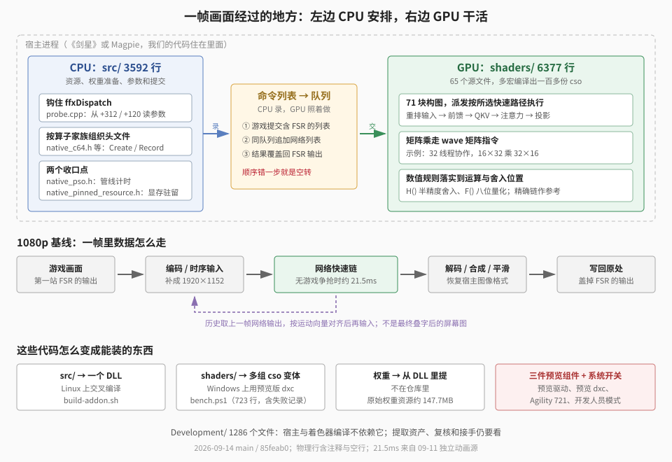

【DLSS5】如何把 DLSS 5 在 AMD RDNA4 上实现

━━━━━━━━━━━━━━━━━━━━

◆ 开篇：主体不到一万行

━━━━━━━━━━━━━━━━━━━━

前面几期讲的都是“这张网络长什么样”：297 期（ https://mp.weixin.qq.com/s/Eq2IDP5QvFPGToQuCsBLRw ）把模型从 DLL 里挖出来，298 期（ https://mp.weixin.qq.com/s/Dwb7f-xGARXungO-8MXcsQ ）讲每个块内部什么结构，304 期（ https://mp.weixin.qq.com/s/v3_KM8zqCg8bp01GglFvxQ ）讲怎么从 2 帧优化到 28 帧。

这期换个切法。挖网络只是前半截，后半截是把它变成一个能装进游戏的东西——**这个东西作为一份代码，是什么形状**。

先报家底。仓库公开在 https://github.com/lmxxf/dlss5-on-amd-9070xt-porting ，根目录是能编出成品的那份：

| 目录 | 内容 | 规模 |
|---|---|---|
| src/ | 宿主代码：插件、测试台、网络每一段的驱动 | 45 个文件，3592 行 |
| shaders/ | 计算着色器，网络的实际运算都在这 | 65 个文件，6377 行 |
| scripts/ | 交叉编译、着色器编译、部署、发包及说明 | 13 个文件，1271 行 |
| tools/ | 两个 Python 脚本：算信噪比、分析闪烁 | 89 行 |

宿主加着色器 **9969 行**，四个目录合起来 **11329 行**。数的是 Git 跟踪文件的物理行，含注释和空行；这个项目里有些函数整段挤在一行，所以行数只说明体量。

而旁边的 Development 目录有 **1286 个文件**——逆向笔记、逐块的参考实现、几十层嵌套的实验脚本、每一天的状态日志。编译宿主和着色器用不到它；但要从原始 DLL 重新做出权重资产、复查逆向证据，脚本还得回这里找。

**成品是过程的零头。** 这个比例我觉得值得先摆在这儿：真正花掉两周的不是写这一万行，是把这一万行试出来。

这两个目录的分工，是这套东西最要紧的一条线：



`src/` 那 3592 行是 CPU 侧，主要干指挥：待会儿用哪个程序、输入在哪块显存、开多少个线程组。初始化时它也做浮点运算——展开权重、重排布局、算缩放系数——但每帧网络的矩阵乘和注意力全交给 GPU。安排录成一张清单（命令列表），提交到队列，GPU 再把 `shaders/` 里的计算分给一批批线程。

**耗时几乎全在 GPU 那边。** 9 月 11 日用一个没有游戏抢 GPU 的 1080p 动画窗口测 Magpie，网络 GPU 时间约 **21.5 毫秒**；进了真实游戏，还要和游戏渲染分同一张卡。

下面七章，按目录走一遍。

━━━━━━━━━━━━━━━━━━━━

◆ 第一章：一帧画面是怎么被截走的

━━━━━━━━━━━━━━━━━━━━

要给一个不开源的游戏加东西，第一个问题是：**你的代码凭什么会被执行。**

游戏不认识我们，也不会调用我们。能用的只有一条路：游戏加载的某个 DLL，被我们换成自己的。

用的是 ReShade——一个成熟的第三方注入框架，把自己伪装成系统的 d3d12.dll 放进游戏目录，游戏启动时就会加载它，它再加载我们的插件。这一段不是我们发明的，照着用就行。

真正的活是接下来这步：**在游戏画一帧的过程里，找到一个位置把画面接过来。**

《剑星》用 AMD 的 FSR 做超分辨率。FSR 是一个 DLL，游戏每帧调用它一次，把这一帧的低分辨率画面、深度、运动向量交给它，它返回一张放大的图。这个调用叫 ffxDispatch。

我们钩住它——用 MinHook 把这个函数的入口改写成跳到我们的函数。于是每帧游戏调 FSR，实际先进我们这儿。

关键在于接下来怎么做。**不是拦截，是尾随**：

```cpp
// 先让原来的 FSR 跑完，我们再接着干
auto result = original(context, h);
```

先调用原函数，让 FSR 在游戏自己那条命令列表上把活干完；等它录完，我们再往同一条队列后面追加自己的一串计算，最后把神经网络的结果覆盖到 FSR 的输出上。

为什么非得这个顺序？因为 FSR 的输出就是我们的输入之一，也是我们最终要写回的那块显存。抢在它前面，写进去的东西下一秒就被它盖掉了。

这也解释了系列里提过的一次翻车：301 期（ https://mp.weixin.qq.com/s/YFF4EXu5XpD_FR-jdCGSsw ）那次“跑通了但结果是错的”，根子就在提交顺序上——命令录进了一条根本没提交的列表，画面上看到的一直是原生 FSR。**在别人的渲染流程里插队，顺序错一步，整件事就是空转，而且屏幕上完全看不出来。**

━━━━━━━━━━━━━━━━━━━━

◆ 第二章：四个数字

━━━━━━━━━━━━━━━━━━━━

钩住了函数，下一个问题更原始：**参数在哪儿。**

正常调一个库函数，你有它的头文件，知道第一个参数是什么类型、结构体里有哪些字段。我们当时没查——手边只有一个指针，直接把那块内存量了。

于是代码长这样：

```cpp
// 输出贴图在 +312
ReadProcessMemory(GetCurrentProcess(), (const char*)h + 312, &output, sizeof(output), &n);
// 运动向量在 +120，缩放在 +360，reset 标志在 +408
ReadProcessMemory(GetCurrentProcess(), (const char*)h + 120, &motion, sizeof(motion), &a);
ReadProcessMemory(GetCurrentProcess(), (const char*)h + 360, mvscale, 16, &b);
ReadProcessMemory(GetCurrentProcess(), (const char*)h + 408, &reset, 1, &d);
```

**312、120、360、408 —— 全是硬编码的字节偏移。** 从那个指针往后数多少个字节，就是我们要的东西。

这四个数字是怎么来的：把整块内存打印出来，对着游戏里能观察到的现象一个一个认。这个位置存着一个指针、指向的资源是 1920×1080 的 RGBA16F，那它多半是输出贴图；那个位置是 1284×724 的两通道浮点，那是运动向量；某个字节在切场景时从 0 变 1，那是 reset 标志。

写这篇的时候我回头查了一下——**这个结构 AMD 其实是公开的**，FSR 3.1 集成文档里有完整定义。把两边摆一起对，量出来的和写下来的一个不差：

| 偏移 | 官方字段名 | 我们拿它干什么 |
|---|---|---|
| +16 | commandList | 游戏这一帧的命令列表 |
| +24 | color | 不用 |
| +72 | depth | 不用 |
| +120 | motionVectors | 把上一帧的网络输出对齐到这一帧 |
| +168 | exposure | 不用 |
| +216 | reactive | 不用 |
| +264 | transparencyAndComposition | 不用 |
| +312 | output | 既是输入，也是最终要写回的地方 |
| +360 | jitterOffset | 两个 float，摄像机的亚像素抖动 |
| +368 | motionVectorScale | 两个 float，把运动向量换算成像素 |
| +376、+384 | renderSize、upscaleSize | 渲染尺寸与输出尺寸 |
| +408 | reset | 切场景时丢掉历史 |

偏移是这么来的：头部 16 字节，加一个 8 字节的命令列表指针，然后七个资源描述各占 48 字节一路排下去——24、72、120、168、216、264、312，正好是 `24 + 48n`。

**那既然公开，当初为什么不查？** 一半是当时没想到去查，一半是查了也还得验：游戏带的是 AMD 预编译签名的 DLL，版本和文档能不能对上不好说，中间哪个字段多一个少一个，后面全部错位。而量出来的东西验的是手里这个二进制。

有个地方尤其能说明这点：`+392` 那个开关是个 `bool`，本身只占 1 字节，但后面跟着浮点数，编译器会补 3 个字节对齐。要是照着文档一个字段一个字段往下加、忘了这条对齐规则，reset 就会算到 +405 上去，读出来是垃圾。**量不需要你把编译器的每条规矩都想对，只要现象对得上。**

这几个数字后来还救过一次场。Magpie 那条路子（不改游戏、抓窗口来处理）跑起来之后画面一直闪色块，查下来是运动向量的**单位**不一样：《剑星》给的是按尺寸归一化的位移，Magpie 给的是像素位移，我们代码里写死按归一化值乘 1920——放大了一千九百倍，历史全错。修法就是别写死，老老实实认 `motionVectorScale`，再结合渲染尺寸和网络尺寸换算。

写这篇时顺手又翻了一遍源码，翻出一处矛盾：那次是从 `+360` 一口气读回四个浮点数，日志里把前两个印成 jitter、后两个印成 mvscale，可真正赋给运动缩放的代码取的是**前两个**。按公开布局，该取后两个，或者干脆从 `+368` 单独读。**代码和它自己的日志打架，而画面看着一直是对的。** 这行下标在现装版本上到底怎么走，得再抓一帧现场参数才算数。

**从二进制往回摸，代码里就会长出这样的数字。** 注释要写清它们是什么、怎么认出来的；等找到公开结构，还得把数字、注释和真正取值的那一行重新对一遍。

━━━━━━━━━━━━━━━━━━━━

◆ 第三章：网络是怎么变成目录的

━━━━━━━━━━━━━━━━━━━━

拿到画面之后，轮到网络本身。

src 目录里 45 个文件，一眼扫过去就能看出组织方式：

```
native_preblock_runtime.h    第 0 块，全分辨率入口
native_c32_stage.h           32 通道的块
native_c64.h                 64 / 128 / 256 通道的块（同一份代码）
native_split.h               512 通道的块
native_vit_linear.h          ViT 的线性层
native_vit_qkv.h             ViT 的 QKV 投影与归一化
native_vit_attention.h       ViT 的注意力计算
native_post70.h              第 70 块和 RGB 头
```

网络有 71 块，通道数一路从 32 到 1024。代码按算子家族复用：64、128、256 共用一份驱动，ViT 拆成线性层、QKV 和注意力几份。**这不是先设计好的分层，是照着被逆向对象的形状长出来的。**

一个块对外就三件事：

```cpp
struct NativeC64 {
  void Create(ID3D12Device* d, ID3D12Resource* src, UINT width, UINT height,
              const std::vector<float>& fw, const std::vector<float>& aw, ...);
  void Record(ID3D12GraphicsCommandList* c, ...);
  ID3D12Resource* Output() const { return result[2]; }
};
```

Create 建资源、读权重、编译着色器；Record 把这一块要跑的几个计算按顺序录进命令列表；Output 给出结果的显存地址，交给下一块当输入。整网就是七十一次 Record 串起来。

Create 里有一个细节我觉得值得单说。它开头是一长串这样的检查：

```cpp
if (use_wave_contract && !use_wave)
    throw std::runtime_error("wave contract requires wave expand");
if (use_matrix_qkv && !pack_input)
    throw std::runtime_error("matrix QKV requires packed matrix mode");
if (width % 8 || height % 8 || (channels != 64 && channels != 128 && channels != 256))
    throw std::runtime_error("...");
```

每一条都是“这两个开关不能这么搭配”。因为快速版一路做下来，同一个块攒了三十多个布尔开关：用不用矩阵指令、输入是 8 位还是 16 位、前馈要不要并进注意力、权重是不是瓦片布局……组合起来是天文数字，其中绝大多数是无意义的。

**把非法组合写成启动时就抛异常，比写进文档管用。** 试到第三十刀的时候，开关之间的依赖早就没人记得住了，只有这些 throw 还记得。

━━━━━━━━━━━━━━━━━━━━

◆ 第四章：两个所有东西都得过一遍的地方

━━━━━━━━━━━━━━━━━━━━

45 个文件里有两个特别小，但每一处代码都得从它们身上过。

**第一个是 native_pinned_resource.h。** 它包着 D3D12 的“建一块显存”这个调用：

```cpp
inline HRESULT NativeCreateCommittedResource(...) {
  HRESULT hr = d->CreateCommittedResource(...);
  // 大于 32MB 的显存记下来，之后可以周期性地叫回显存
  // 并给它一个驻留优先级
  ...
}
```

文件头上那段注释是后来补的，起因是这么一场故障：9070 XT 有 16GB 显存，《剑星》自己要 13.3GB，网络最初要 4.8GB——加起来超了。超了之后现象很怪：玩着玩着突然从 29 帧掉到 21 帧，而且不会自己回来。查了一晚上才确定，被挤到系统内存的字节数和帧率是反着走的：挤走 399MB 掉到 20 帧，523MB 掉到 16 帧，737MB 掉到 12 帧。网络每帧都要读这些缓冲，一旦它们住到系统内存，就得走 PCIe。

注释最初写得挺乐观：把优先级提高，系统就会先去挤游戏的贴图。后来的记录补了一句更准的：**光设优先级挡不住驱逐。** 它只影响系统挑谁下手，不是一份显存保留承诺；`MakeResident` 也不保证从此不被再挤走。

真正管用的是一起省：网络显存从 6.8GB 压到 3.1GB，游戏侧把贴图从「非常高」降到「高」或者限制贴图池，再配上驻留优先级和每 60 帧一次的 `MakeResident`。这个小文件就是后两件事的落点——**因为建显存这件事收在同一个入口，策略才能集中加。**

**第二个是 native_pso.h。** 它包着“建一个计算管线”这个调用，干的事只有一件：数一下建了几个、一共花了多少毫秒。

这个也是事后加的。插件装进 Magpie 之后，从启动到画面开始变化要等二十多秒，网友反馈里排第一的就是这个。查的办法就是让每个环节自己报时间，结果发现三个大头：一千多次管线创建其实只要 0.3 秒（驱动有缓存），真正慢的是权重上传每张都单独等一次 GPU、六个运行时编译的着色器每次进程都重编一遍、16 位权重展开成 32 位是单线程。逐个修完，二十多秒变成 3.4 秒。

**两个文件加起来不到六十行，但它们是整个项目里我最愿意推荐的写法**：凡是“所有人都要调一次”的系统 API，别直接调，包一层。包的时候不用想清楚将来要在里面干什么——将来自然会有事要干，而那时候你只需要改一个地方。

━━━━━━━━━━━━━━━━━━━━

◆ 第五章：一个完整的计算核长什么样

━━━━━━━━━━━━━━━━━━━━

shaders 目录 65 个文件、6377 行，是网络真正干活的地方。贴一个完整的给大家看看：`native_wave_qkv.hlsl`，全网络最常用的一种计算——注意力前面那个 QKV 投影，把每个位置的 64 个通道乘一个矩阵变成 192 个。

```hlsl
#include <dx/linalg.h>

// 输入：每个位置 64 个通道，已经量化成 8 位，一个位置挨着一个位置排
// 权重：[192][64] 的矩阵，也是 8 位。192 = Q、K、V 各 64
ByteAddressBuffer input:register(t0), weights:register(t1);
RWStructuredBuffer<float> output:register(u0);
cbuffer Geometry:register(b0){ uint width; uint height; }

// 三种矩阵瓦片的类型。前两个数是行数和列数，MatrixUse 说明它在乘法里的角色，
// Wave 表示这块矩阵由一组 32 个线程共同持有，不属于某一个线程
using A = dx::linalg::Matrix<ComponentType::F8_E4M3FN, 16, 32, MatrixUse::A,           MatrixScope::Wave>;
using B = dx::linalg::Matrix<ComponentType::F8_E4M3FN, 32, 16, MatrixUse::B,           MatrixScope::Wave>;
using C = dx::linalg::Matrix<ComponentType::F32,       16, 16, MatrixUse::Accumulator, MatrixScope::Wave>;

[WaveSize(32)]          // 这个核按 32 线程一组执行
[numthreads(32,1,1)]    // 一个线程组就是一组，不多不少
void main(uint3 gid : SV_GroupID) {
  // 宿主是这么派发的：x 方向 = 像素数 / 16，y 方向 = 192 / 64 = 3
  // 所以 gid.x 是「第几批 16 个位置」，gid.y 是「第几批 64 个输出列」
  if (gid.x * 16 >= width * height) return;

  C acc[4];                                  // 四个 16×16 累加器，凑满 64 个输出列
  for (uint g = 0; g < 64/32; g++) {         // 64 个输入通道，一次吃 32 个，分两轮
    // 把 16 个位置 × 32 个通道一次性搬进这 32 个线程的寄存器。
    // 参数依次是：源缓冲、起始字节、行跨度（字节）、布局、对齐承诺（字节）
    // 每个 E4M3 元素占 1 字节；最后那个 16 是对齐，不是元素位数
    A a = A::Load(input, gid.x*16*64 + g*32, 64, MatrixLayout::RowMajor, 16);

    for (uint n = 0; n < 4; n++) {
      uint col = (gid.y*4 + n) * 16;         // 这一块负责输出的哪 16 列
      // 权重按列主序读，等于顺手做了转置
      B b = B::Load(weights, col*64 + g*32, 64, MatrixLayout::ColMajor, 16);

      // 一次调用算完 16×32 乘 32×16；拆成几条机器指令是编译器和驱动的事
      // 第一轮直接赋值，第二轮往上累加
      if (g == 0) acc[n] = Multiply<ComponentType::F32>(a, b);
      else        acc[n].MultiplyAccumulate(a, b);
    }
  }

  for (uint n = 0; n < 4; n++) {
    uint col = (gid.y*4+n)*16;
    uint part = col/64, row = col%64;        // part：0=Q 1=K 2=V；row：在这一份里的第几列
    for (uint i = 0; i < acc[n].Length(); i++) {
      // 关键：我手里攥着第 i 个数，但它在矩阵的第几行第几列，得问硬件
      uint2 rc = acc[n].GetCoordinate(i);    // rc.x = 第几个位置，rc.y = 第几列
      // 写出去之前做一次半精度舍入，对齐原版的数值行为
      output[((gid.x*16+rc.x)*3 + part)*64 + row + rc.y] = H(acc[n].Get(i));
    }
  }
}
```

四十来行，网络里一整层的矩阵乘就做完了。这就是上文 304 期说的那个“矩阵指令”在源码里的样子：一条 `Multiply` 顶原来几十次乘加。

真正跟平常写代码不一样的是最后那个循环。**在这套接口里，矩阵不归任何一个线程所有，是一组 32 个线程合伙攥着的**——你手里有几个数，但它们在矩阵的第几行第几列，你不知道，得开口问：

```cpp
uint2 rc = acc[n].GetCoordinate(i);   // 我手里这第 i 个数，究竟是第几行第几列？
```

写惯普通代码的人第一次看到这个会愣一下：你连自己在算什么都不知道。

这个设计不是为了绕人。**瓦片在寄存器里到底怎么摆，是硬件说了算的，而且各家不一样**——接口把它藏起来，同一份源码才能在不同架构上编出各自最优的排布。代价是你失去了这一层的控制权：加载和乘法怎么重叠、寄存器怎么分配，全归编译器管，调不动。好处是代码能这么短。

────────────────────

💡 一个“块”和一个“核”不是一回事

网络有 71 块（block），每块相当于通常说的一层 Transformer：前馈加注意力。但一个块跑起来要派发好几个计算核（kernel），比如重排输入一个、前馈展开一个、收缩一个、QKV 一个、注意力一个、投影一个。

而 65 个着色器文件也不等于 65 个核：同一个文件用不同的编译宏能编出好几个变体，构建清单上是一百多份 `.cso`，另有六个在运行时才编译。编出来、建了管线，也不等于这一帧一定会派发它。上面那个文件，64 / 128 / 256 三个通道数各编一份，是靠文件开头 `#define MATRIX_CHANNELS 64` 那个可被覆盖的宏。

────────────────────

`native_wave_qkv.hlsl` 最后一行有个 `H()`，我一直没解释。它值得单开一章。

━━━━━━━━━━━━━━━━━━━━

◆ 第六章：那个叫 H 的函数

━━━━━━━━━━━━━━━━━━━━

`native_wave_qkv.hlsl` 写出结果前调的那个 `H()`，不是它自己的函数——65 个着色器里有 37 个各自带着一份同样的定义，全部调用加起来五百多次。它是整个项目里最能说明“逐位一致到底靠什么撑住”的东西。

它长这样：

```hlsl
float H(float v) {
  uint b = asuint(v), sg = b & 0x80000000u, a = b & 0x7fffffffu;
  if (a >= 0x7f800000u) return v;                          // 无穷和 NaN 原样返回
  if (a <  0x38800000u)                                    // 次正规数单独算
    return (sg ? -1 : 1) * round(abs(v) * 16777216.0) * 5.9604644775390625e-8;
  uint r = (a + 0xfffu + ((a >> 13) & 1u)) & 0xffffe000u;   // 就近舍入、平局取偶
  return asfloat(sg | (r >= 0x47800000u ? 0x7f800000u : r));
}
```

它干的事，一句话说完：**把一个 32 位浮点数舍入到 16 位浮点的精度上，但结果仍然用 32 位存着。**

为什么要手写？HLSL 里明明有现成的 `f32tof16`。

因为这张卡上的 `f32tof16` 是**朝零截断**的，不是四舍五入。我们拿 2048 个样本探过，1536 个和标准的“就近舍入、平局取偶”对不上。而 NVIDIA 原版网络里每做完 32 项乘加就舍入一次，用的是就近舍入。差一个最低位，跑七十一块下来就是另一张图。

所以只能自己写。中间那行是全函数的核心：

```
uint r = (a + 0xfffu + ((a >> 13) & 1u)) & 0xffffe000u;
```

32 位浮点的尾数有 23 位，16 位浮点只有 10 位，要扔掉低 13 位。`+0xfff` 是加上“半个最低位减一”，`+((a>>13)&1)` 是当结果正好卡在两个可表示数中间时，往偶数那边靠。最后 `& 0xffffe000` 把低 13 位抹平。三个操作合起来就是一次标准的就近舍入，纯位运算，没有分支。

同一个目录下还有一个 `F()`，做的是同样的事，只不过目标是 8 位浮点（E4M3：1 位符号、4 位指数、3 位尾数，最大 448）。

**这两个函数是“逐位一致”这四个字的全部内容。** 上文 304 期说过逐位一致是构造出来的不是测出来的——构造的成分就在这儿：只要每个元素经过同样顺序的乘加、同样次数的 H 和 F，输出一致就是必然的。

再看一个更离谱的。注意力里的 softmax 要算指数，原版用的不是指数函数：

```hlsl
float fast_exp(float x) {
  float a = clamp(H(x * 0.044921875 + 1.30078125), 1.03125, 1.5693359375);
  uint b = f32tof16(a);
  return f16tof32(((b << 5) + 0x8000u) & 65535u);
}
```

把输入做一次线性变换、夹到一个很窄的区间、转成 16 位浮点、**把这 16 个二进制位左移 5 位再加一个常数**、再当成 16 位浮点读回来。

这是在利用浮点数的位布局本身：指数部分在高位，一个数的二进制表示左移，约等于它的指数增加——**位移就成了廉价的指数运算**。代价是只在那个窄区间里成立，所以前面要 clamp。这是从原版反汇编里一位一位对出来的，我们只是照抄。

────────────────────

💡 硬件转换不饱和，会让画面出黑块

后来加了硬件的 8 位转换指令来替代软件的 F()，快很多。但埋了个雷：`Cast<F8_E4M3FN>` 遇到超过 ±448 的数**不是夹到 448，是变成 NaN**。

一个 NaN 进了注意力，会顺着那个 8×8 窗口扩散成一整块；最后 RGB 头一 clamp，NaN 变 0——屏幕上就是亮部皮肤上一块块乱跳的黑方块。

根因找了一天多，修法只有一行：转换之前先 clamp 到 ±448。NVIDIA 那边没这问题，因为它的硬件转换天然饱和。

```hlsl
#define SAT8(m) for(uint i=0;i<(m).Length();i++) \
                  (m).Set(i, clamp((m).Get(i), -448.0, 448.0))
```

全仓的硬件 E4M3 转换过了一遍：可能吃到无界值的加饱和，已经量化过、明确有界的不动。参考用例上输出一位没变，因为那里本来就没有超过 448 的值；把出事的那一帧真实画面重放，RGB 头的 NaN 才从 25920 个压到 0。**旧用例没踩到的边界，真实游戏替我们补上了。**

────────────────────

代码部分讲完了。下面是另一半：这些代码要跑起来，机器上得先有什么。

━━━━━━━━━━━━━━━━━━━━

◆ 第七章：要自己复现，得先准备什么

━━━━━━━━━━━━━━━━━━━━

这一章写给想动手的人。先说结论：**四样必需品里有三样是预览版或实验状态**，这件事目前只能在这个窗口期做成。

**一、显卡驱动得是预览版。** AMD 的正式驱动（26.8.1 那一支）只支持到 Shader Model 6.9，矩阵接口不开放。要用的是 Adrenalin 26.10.07.02 RC7 那个带 Agility SDK 的版本。这里有个坑：Windows Update 会在系统更新时顺手把预览驱动换成正式驱动，换完之后每一个着色器都建不出来。防它要改组策略。

**二、着色器编译器得是预览版 DXC。** 微软 DirectX 编译器的 preview 发布里才有 `dx/linalg.h`，也就是第五章那套矩阵类型。正式版没有。

**三、D3D12 运行时得是 1.721 预览版**，作为一个文件夹放在游戏目录里，程序启动时切过去。

**四、Windows 开发人员模式必须打开。** 因为要调 `D3D12EnableExperimentalFeatures` 打开实验着色器模型，这个调用只在开发人员模式下成功。这条我们自己吃过亏：网友反馈“装了没效果”，查了半天是这个，而当时任何文档里都没写。

编译本身分两半。宿主代码在 Linux 上交叉编译成 Windows 的 DLL：

```bash
x86_64-w64-mingw32-g++ -std=c++17 -O2 -shared -static \
  -DNATIVE_ORDER_NEURAL \
  src/native_submission_order_probe.cpp minhook的几个.o \
  -o native-game.addon64 -ld3d12 -ldxgi -ld3dcompiler -ldxguid
```

这条命令本身不难，难的是环境差异。构建脚本里有一整段是处理老版本 mingw 的：

```bash
# Ubuntu 22.04 上是 gcc 10、win32 线程模型，std::mutex 根本没有，
# 得换成 -posix 那个变体；d3d12.h 里也缺 ID3D12SDKConfiguration，
# 得单独把新头文件拉进来
if [ "$gcc_major" -lt 13 ] && "$cxx" -v 2>&1 | grep -q "Thread model: win32"; then
  ...
fi
```

这段不是先想到的，是我在自己笔记本上照着文档编了一遍、编不过，一条一条补出来的。**打标签之前的最后一道验收就是这个：换一台干净机器，按文档从头编一遍。** 那台笔记本比任何自检脚本都真——第一次跑就抓出仓库里少了 10 个着色器源文件、3 个从来没进过构建脚本的手工产物。

着色器那半在 Windows 上编。9 月 10 日那次从零验收编出 179 个产物，后来又加过变体。入口是 `compile-shaders.ps1`，底下那个 `bench.ps1` 在这份快照里 723 行、73794 字节，因为它是从几十层嵌套的实验脚本拍平来的，而且每一刀的注释都留着：

```powershell
# NULL RESULT（保持关闭）：ViT 的前馈展开和收缩合成一个核、中间层放共享内存。
# 逐位相同，但每块 0.35-0.39 毫秒，原来是 0.08+0.10——慢了一倍。
# 20-40 个组 × 16 个 wave，摊到 256 个 SIMD 上每个不到两条，每步又都是依赖链，
# 延迟藏不住。把权重流量减半（32 个 token 一组）数字纹丝不动，所以不是带宽问题。
$env:DLSS5_BUILD_VIT_FUSED_FFN='0'
```

────────────────────

💡 失败的刀留在构建脚本里当注释

这个 723 行的脚本里，有 65 处标着 FAST PATH（做了、有效、开着）、3 处标着 NULL RESULT（做了、没用、关着但代码留着）、1 处标着 FIX（修 bug 的）。

一般人的习惯是把没用的东西删掉。我们反过来：**留着，并且把“为什么没用”写在开关旁边。**

好处是过了一周再看，不会有人重新想到同一个主意再做一遍——那三条 NULL RESULT，每一条当时都花了半天到一天。坏处是脚本变得很长。

这个取舍对 AI 协作尤其划算：换一个会话、换一个模型来接手，它读到这个脚本就知道哪些路已经走过、为什么是死路。**注释在这里不是给人看的文档，是给下一个接班的写的路标。**

────────────────────

七章走完了。最后说说我写这篇的真实想法。

━━━━━━━━━━━━━━━━━━━━

◆ 结尾：这套东西现在你带着 AI 也能做

━━━━━━━━━━━━━━━━━━━━

回头看这一万行，真正“难”的部分其实不多。

矩阵乘的写法，照着微软的预览文档抄。钩函数，MinHook 的用法十分钟看完。D3D12 那套建资源、录命令、提交队列，是有文档的标准流程。

难的是三件很笨的事：**在没有文档的接口上数字节；把七十一块的数值行为一位一位对齐；每改一刀都量一遍，并且承认大部分刀是白改的。**

这三件事都不需要天才，需要的是有人陪着你一直干。两周里的绝大部分时间，我做的事就三样：进游戏看画面、看帧率、在岔路口拍板说往哪边走。剩下的是 AI 在干——写核、改核、量、发现方向不对、回滚、换一条路。

所以仓库里那 1286 个过程文件没有删。它们编译用不到，但如果你想接着做，**把 Development 目录丢给你自己的 AI，它就有了完整的上下文**：每一天做了什么、哪些路是死路、每个数字是怎么量出来的、哪些结论后来被推翻了。这比我在这儿写七章管用得多。

**照这七章的路子走，基本就能把 DLSS 5 搬到 AMD RDNA4 的卡上了。** 钩住上采样那个调用、把参数从内存里量出来、一块网络一个头文件、矩阵乘换成 wave 矩阵指令、舍入函数手写对齐、最后拿精确链当裁判——就这些。看着挺麻烦，写出来一万行，两周。

门槛倒是真的：预览驱动、预览编译器、还得自己手里有那个 DLL。但那是能不能开工的问题，不是难不难的问题。

拆开来看，一个闭源的商业神经渲染器也就是矩阵乘、注意力、几个手写的舍入函数。下次再碰上什么看着做不了的事，先问问你的 AI 能不能做。

━━━━━━━━━━━━━━━━━━━━

◆ 参考资料

━━━━━━━━━━━━━━━━━━━━

本文的代码、行数、文件数固定到项目仓库 main 分支 85feab0 这个快照（2026-09-14，0.15 发布之后，讲的是 1080p 这条链）；行数按 Git 跟踪文件的物理行数计。工程结论出自仓库 Development/DevHistory.md 的时间线，后来的翻案以时间线为准。

AMD GPUOpen, FidelityFX API Integration Overview, FSR 3.1.0 Release API Version（2024-07；第二章 ffxDispatch 声明与 ffxDispatchDescUpscale 完整字段表的依据，结构定义在第 15 页）

Microsoft, HLSL Linear Algebra Matrix 提案 0035；DXC v1.10.2605.24 附带的 dx/linalg.h（第五章矩阵类型与 Load 参数的依据。这一版 Load 是五个参数，末位是字节对齐）

Microsoft, Announcing Agility SDK 1.721 preview and more Shader Model 6.10 features（DevBlogs，2026；第七章预览组件来源的依据）

Microsoft, Direct3D 12 Residency 文档，ID3D12Device1::SetResidencyPriority（第四章驻留优先级的依据）

NVIDIA, CUDA Math API 的 __nv_fp8_e4m3 类型与 FP8 转换模式说明（第六章 E4M3 编码、饱和与非饱和转换的依据；软件 H 与位映射指数的写法出自本项目源码和逆向对照记录）

━━━━━━━━━━━━━━━━━━━━

在没有文档的接口上工作，代码里就会长出 312、120、408 这样的数字；它们不好看，也不可能好看，能做的只是把每个数字旁边的注释写清楚。

凡是所有人都要调一次的系统 API，先包一层——包的时候不用想清楚将来干什么，将来自然会有事要干，那时候你只需要改一个地方。

难的不是矩阵乘怎么写，是在没有文档的接口上数字节、把七十一块的数值一位一位对齐、以及承认大部分刀是白改的。

━━━━━━━━━━━━━━━━━━━━

// 靳岩岩的 AI 学习笔记 × Claude和GPT 的严谨 × Gemini 的浪漫
// 2026年9月15日

━━━━━━━━━━━━━━━━━━━━

【摘要（发布用，不进正文）】

挖完网络结构之后，把 DLSS 5 搬上 A 卡的后半截：宿主 3592 行、着色器 6377 行，旁边 1286 个过程文件。钩住 FSR 的调用、在二进制里数字节、按算子家族分头文件、手写的半精度舍入，以及复现要备的四样预览组件。
