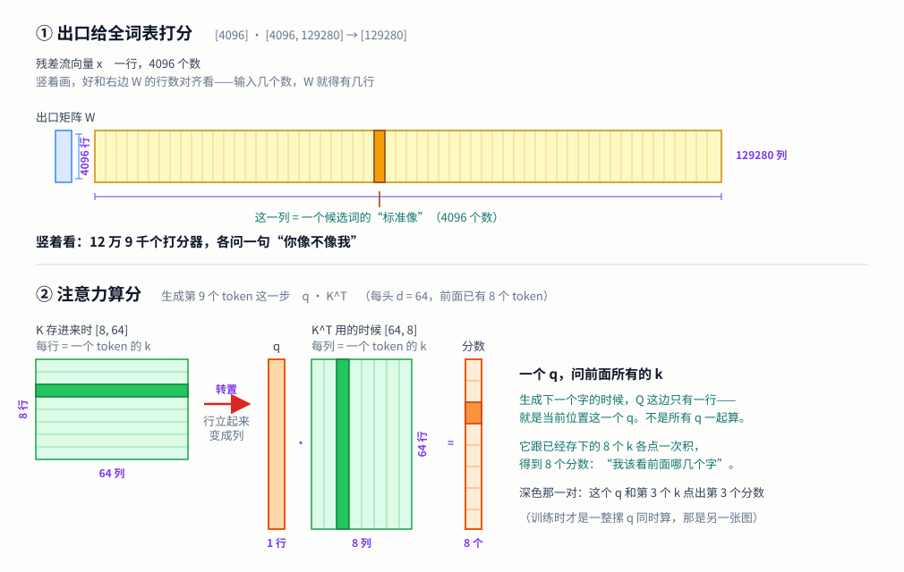

【老靳学线代】第三期：线性无关与秩——菜单四千行，真菜有几道

━━━━━━━━━━━━━━━━━━━━

◆ 先还一笔账：这个系列就是为它立项的

━━━━━━━━━━━━━━━━━━━━

这个系列从第一期（总第 267 期 https://mp.weixin.qq.com/s/mFRQl-5qUstz7fbZ0tvpvQ ）的向量与点积起步，第二期（总第 273 期 https://mp.weixin.qq.com/s/iT0_PbnghTDiVaohrFWLFg ）结尾埋了个钩子：点菜点得好好的，为什么信息会压缩、会丢、会只剩几个方向？这期兑现。

动笔前先坦白一件事。这个系列立项的起因，就是"秩"这个概念——我用了两年 AI，看了无数遍 "low-rank"、"LoRA"、"MLA 低秩压缩"，脑子里对秩的印象一直是个模糊的 **"某个方向上的强度"**。前阵子被人问住了才发现：错得离谱。**秩数的是方向的"个数"，不是任何东西的"强度"**——强度是另一个概念（奇异值）的事，那是第八期的主菜。两个概念在我脑子里糊成一团浆用了两年。

所以这期是还愿。用第二期的点菜读法从头捋一遍：先搞清"一摞向量里谁是多余的"（线性无关），再数清"一张矩阵里到底有几道真菜"（秩）。

━━━━━━━━━━━━━━━━━━━━

◆ 话题 1：线性相关——菜单里的回声

━━━━━━━━━━━━━━━━━━━━

第二期给了同一次矩阵乘法的两种读法。这两种最容易绕晕，先花一分钟把它们摆平——**分野就一句话：你把 W 里的向量看成横着的还是竖着的。**

拿个最小的例子，3 维进、2 维出：

```
x = (2, 0, 1)

        ┌ 1   4 ┐
W  =    │ 3   5 │      形状 [3, 2]
        └ 2   6 ┘
```

**读法一：按行点菜**（横着看 W）

W 横过来是 3 行：(1, 4)、(3, 5)、(2, 6)。**每一行是一道菜**，行数必须等于 x 的分量个数——x 有三个分量，就正好三道菜可点。x 的每个分量是点这道菜的份数：

```
2 份第一行 + 0 份第二行 + 1 份第三行
= 2×(1, 4) + 0×(3, 5) + 1×(2, 6)
= (2, 8) + (0, 0) + (2, 6)
= (4, 14)
```

**输出是 W 的行拼出来的**——这是行视角的全部要点。

**读法二：逐列点积**（竖着看 W）

W 竖过来是 2 列：(1, 3, 2) 和 (4, 5, 6)。**每一列是一个打分器**，列数等于输出的维数——两列，就输出两个数。每个数是 x 和那一列点一次积：

```
第 1 个分量 = (2, 0, 1)·(1, 3, 2) = 2 + 0 + 2 = 4
第 2 个分量 = (2, 0, 1)·(4, 5, 6) = 8 + 0 + 6 = 14
```

结果 (4, 14)，跟上面一模一样。这就是上学时背的"行乘列"口诀。

────────────────────

同一张 W，横竖两副面孔：

| | 向量的朝向 | 有几个 | 每个是什么 | 决定 |
|---|---|---|---|---|
| **按行点菜** | 横（行） | 3 个，等于**输入**维数 | 一道菜 | 输出**由谁拼成** |
| **逐列点积** | 竖（列） | 2 个，等于**输出**维数 | 一个打分器 | 输出的**每个数怎么来** |

两种都对，算出的答案永远相同。那口诀背了这么多年不是白背的——经典 Transformer 里两处每次推理必跑的计算，都得竖着读。

────────────────────

💡 列视角在经典 Transformer 里：lm_head 和 attention



**一、出口给全词表打分（lm_head）**

模型每吐一个字，最后一步是拿当前的残差流向量去给全词表打分。V4 Flash 的出口矩阵形状是 [4096, 129280]（第二期算过这笔账）：进来一个 4096 维向量，出去 129280 个分数，每个候选词一个。

这时候横着看毫无画面感——W 有 4096 行，"4096 道菜加权求和"说的是实话，但读者只会更晕。

竖着看就通了：**129280 列，每一列是一个候选词的"标准像"**（"苹果"长什么样、"的"长什么样，各是一个 4096 维向量）。输出的第 j 个分数，就是当前状态和第 j 个词的标准像点一次积——第一期说过点积量的是对齐程度，所以：

**给全词表打分 = 十二万九千次"你像不像这个词"，一次矩阵乘打包算完。**

**二、注意力算分（Q · Kᵀ）**

那个转置符号常被当成语法噪音跳过去，其实它正是两种视角的交接点。

K 存进来的时候是 `[seq, d]`——**横着**，每行一个 token 的 k 向量，和"张量每行一个 token"的约定一致。但打分要拿每个 k 当打分器用，**打分器得是列**。所以转置一下变成 `[d, seq]`：**刚才的每一行，立起来成了每一列**。

于是 Q · Kᵀ 是标准的列视角：分数矩阵第 i 行第 j 列 = qᵢ · kⱼ，问的是"第 i 个 token 和第 j 个 token 有多对齐"。

**转置的存在本身就是信号**——存的时候按行，用的时候按列，中间翻一下。lm_head 那张出厂就是竖着存的，所以它不用转置。同一件事的两种写法。

顺带说清那个常跟 Q · Kᵀ 连着念的 ÷√d：它**和横竖无关**。d 维两个向量点积是 d 项求和，d 越大结果摊得越开，softmax 前分数拉太狠就会饱和、梯度几乎没了。除以 √d 是把数值拽回正常范围的补丁，哪种视角都得除。

────────────────────

**行视角的主场：追问信息去了哪**

上面两处有个共同点：**输出的每一位各有各的含义**（第 j 个词的分数、第 j 个 token 的相关度），一位一位地问最省事，列视角天然好懂。

反过来，只要问题变成"输出还剩多少自由度""哪些方向丢了""能不能压小"，列视角立刻失语——它一次只说一个分量，说不出整体形状。这时必须横过来：**输出永远是 W 的行拼出来的，那 4096 行里有多少道不重样的真菜，输出就最多有多宽。**

这句话就是秩。

────────────────────

**所以这期从头到尾只用行视角。** 原因很实在：秩这件事，只有横着看才看得见——"输出住在 W 的行张成的空间里"是本期的立足点，而竖着看是读不出这句话的。所以下面再说"W 是菜单，每行是一道菜"，指的都是横向的行。

脑子里要是还挂着课本的行乘列口诀，请先把它按住。

现在盯着菜单本身看，问一个新问题：**这些菜里，有没有哪道是多余的？**

"多余"的意思很具体：**某道菜能用其他菜按配方调出来**。比如菜单上有 (1, 0)、(0, 1)，又来了一道 (2, 3)——多余，因为 2 份第一道加 3 份第二道就是它。它不提供任何新东西，是前两道菜的**回声**。

术语对照：一组向量，如果谁也调不出谁，叫**线性无关**（各自独立，人人有用）；只要有一个能被其他的调出来，整组就叫**线性相关**（有回声混在里面）。

────────────────────

💡 手算一：找出隐藏的回声

三个三维向量：u = (1, 2, 0)，v = (0, 1, 1)，w = (1, 3, 1)。它们线性无关吗？

肉眼先扫一遍有没有简单配方——u 和 v 各来一份试试：

(1, 2, 0) + (0, 1, 1) = (1, 3, 1) = w

抓到了：**w = u + v**，一份不多一份不少。w 是回声，这组线性相关。

配方不总是这么好找（这题是我出的，当然好找），通用办法是解方程（消元），大学课本的主战场，这里不展开——本系列只要求你**认得出这件事在问什么**：有没有人是别人调出来的。

────────────────────

回声的几何画面比代数更直观。u 和 v 两个向量，能配出的所有组合（a 份 u + b 份 v，a、b 随便取）铺出来是一张**过原点的平面**——二维的。w 既然是 u + v，它就躺在这张平面里。三个向量，看着是三条汉子，实际挤在同一张平面上——**它们撑不起三维空间，只撑得起二维**。

"撑起"这个词值得记住：一组向量的所有配方组合能铺满的那个空间，教科书叫**张成的空间**（span）。回声不改变张成的空间——把 w 从菜单上划掉，能配出的东西一样不少。

**独立方向的个数，才是一组向量真正的身家。** 数它的时候，回声不算数。

━━━━━━━━━━━━━━━━━━━━

◆ 话题 2：秩——数一数真菜有几道

━━━━━━━━━━━━━━━━━━━━

把上面的问题从"一组向量"搬到"一张矩阵"，就是秩：

**矩阵的秩 = 它的行里独立方向的个数 = 划掉所有回声后，剩下的真菜道数。**

这个数直接决定矩阵作为"变换"的本事。回忆第二期：x · W 的输出是 W 各行的加权组合——**输出永远住在"W 的行张成的空间"里**。W 有 4096 行，但如果真菜只有 500 道，那不管 x 怎么点菜，输出都被关在一个 500 维的子空间里，剩下 3596 个维度一辈子去不了。

**菜单的厚度是它的排场，秩才是它的实力。**

────────────────────

💡 手算二：求一张 3×3 矩阵的秩

W 的三行是 (1, 0, 2)、(0, 1, 1)、(1, 1, 3)。求秩。

老套路，先扫简单配方：第一行加第二行 = (1, 1, 3) = 第三行。第三行是回声，划掉。

剩下 (1, 0, 2) 和 (0, 1, 1)——这俩谁也调不出谁（一个第二分量是 0，一个第一分量是 0，配比无从下手），独立。

**秩 = 2。** 这张 3×3 矩阵看着是三维变换的排场，实际上把整个三维空间拍进了一张二维平面里——有一个维度的信息，进去就出不来了。

（"拍扁之后找不回来"是第十期"矩阵的病"的主菜，这里先见一面。）

────────────────────

再钉一遍我错了两年的那件事，这回用数字钉：

秩只**数个数**，不管强弱。菜单上一道菜是 (1000, 0, 0)，另一道是 (0, 0.001, 0)——一道浓一道淡，但都是独立方向，秩照样是 2。**"每个方向有多浓"是奇异值的账本**，第八期开讲。预习一句就够：SVD 干的事，就是把"方向的个数"（秩）和"每个方向的强度"（奇异值）彻底分家——而我当年是把两本账记成了一本。

━━━━━━━━━━━━━━━━━━━━

◆ 一个有趣的知识点：低秩从不自然发生

━━━━━━━━━━━━━━━━━━━━

学到这里可以问一个更有意思的问题：**什么样的矩阵会是低秩的？**

答案有点反直觉：**随机的矩阵几乎必然满秩。** 想想手算一里回声出现的条件——w 必须**恰好**等于 u + v，一个分量都不能差。要是往三维空间里随机撒三个向量，恰好有一个掉在另外两个张成的平面上？概率是零，跟往地板上扔硬币恰好立住差不多。方向的独立是常态，回声是奇迹。

所以在真实世界里遇到低秩矩阵，只有两种可能：**有人故意造的，或者有股力量把它压成这样的。** 大模型里两种都有，而且都是主角。

**故意造的：LoRA 和 MLA。**

LoRA 微调的完整逻辑现在能一眼看穿了。全量微调要动整张 [4096, 4096] 的权重（一千六百多万个数）；LoRA 说不必，改动量写成两张小矩阵的接力：

```
ΔW = A · B      A 是 [4096, 8]，B 是 [8, 4096]
```

用点菜读法看 B：它只有 **8 行菜**。任何向量过 ΔW，先被 A 配成 8 个数，再拿这 8 个数去点 B 的 8 行——**输出永远是那 8 行的组合，一步都逃不出这个 8 维小房间**。ΔW 名义上是 [4096, 4096] 的大块头，秩最多是 8。r = 8 这个超参数，字面意思就是"只许你在 8 个新方向上动"。

MLA 是同一招用在注意力上。第二期记过 V4 Flash 的形状账：k、v 走 [4096] @ [4096, 512] 进一个 512 维压缩包。现在能说清这在干什么了：**故意把 K、V 关进一个秩不超过 512 的房间**——原本 4096 维的表达，强制只留 512 个方向。

反向投影一下（系列固定动作）：为什么敢这么砍？KV cache 是推理显存的头号大户（第 168 期 https://mp.weixin.qq.com/s/YqcTnIrGKEYZ2n-sMAelKg 算过这笔账），把每条 KV 从几千维压到 512 维，显存直接省一个数量级——这是动机。而敢下手的底气是个实验事实：**K、V 里的信息本来就没占满 4096 维**，真菜远比菜单薄，大量维度是回声和空转。故意造低秩，砍掉的主要是本来就冗余的部分。当然天下没有白省的显存——秩砍到 512，表达力的天花板也钉死在 512，这就是"低秩"这三个字的完整价格。

**被压出来的：表征坍缩。**

另一种低秩没人下令，是训练自己长出来的。一个 4096 维的表示空间，训着训着，向量们越挤越近、方向越用越少——名义 4096 维，实际有效方向只剩几百个甚至几十个。这就是**表征坍缩**：菜单没变薄，菜谱越来越雷同，新菜全是旧菜的回声。它是好是坏、怎么测量（"有效秩"怎么定义），是第九期 PCA 那边的地盘，这里只把名字挂上。

两种低秩，一句话分野：**LoRA 和 MLA 是精打细算——知道真菜不多，主动把菜单裁薄省成本；表征坍缩是家道中落——菜单还是那么厚，后厨已经只会做那几道菜了。**

━━━━━━━━━━━━━━━━━━━━

◆ 本期小结

━━━━━━━━━━━━━━━━━━━━

- **线性相关 = 菜单里有回声**：某道菜能被其他菜按配方调出来，它就不提供新东西；划掉回声，能配出的空间一样大
- **秩 = 真菜的道数**：矩阵的行里独立方向的个数；输出永远住在行张成的空间里，秩就是这个空间的维度
- **秩数个数，不数强弱**：(1000, 0, 0) 和 (0, 0.001, 0) 一浓一淡，都算一个方向——"强度"是奇异值的账，第八期分家
- **低秩从不自然发生**：随机矩阵几乎必然满秩；真实世界的低秩要么是故意设计（LoRA 的 r = 8、MLA 的 512 维压缩包），要么是被训练压出来的（表征坍缩）

三期下来：token 是行向量（第一期），过层是点菜（第二期），这期知道了菜单有厚薄之分——排场归排场，实力看秩。

━━━━━━━━━━━━━━━━━━━━

◆ 技术名词速查

━━━━━━━━━━━━━━━━━━━━

| 术语 | 一句话解释 |
|------|-----------|
| 线性相关 / 无关 | 有菜能被其他菜调出来 = 相关（有回声）；谁也调不出谁 = 无关 |
| 张成的空间（span） | 一组向量所有配方组合能铺满的空间；回声不改变它 |
| 秩（rank） | 矩阵行里独立方向的个数 = 划掉回声后的真菜道数 |
| 满秩 | 秩 = 行列数里较小的那个，一道回声都没有；随机矩阵几乎必然满秩 |
| 低秩（low-rank） | 秩远小于矩阵尺寸；要么故意设计，要么被训练压出来 |
| LoRA 的 r | ΔW = A · B 中间的接口宽度；改动量的秩上限——只许在 r 个新方向上动 |
| MLA 压缩包 | V4 Flash 把 K、V 关进 512 维——故意造的低秩，拿表达力天花板换显存 |
| 表征坍缩 | 训练把表示空间的有效方向越用越少；菜单没变薄，后厨只会几道菜了 |

━━━━━━━━━━━━━━━━━━━━

**菜单的厚度是排场，秩才是实力——4096 行菜单，真菜可能只有 500 道。**

**秩数的是方向的个数，不是强度——我把这两本账记混了两年，这个系列就是为还这笔账开的。**

**随机的世界里人人满秩，回声是奇迹——所以遇到低秩，要么有人精打细算，要么后厨家道中落。**

━━━━━━━━━━━━━━━━━━━━

// 靳岩岩的 AI 学习笔记 × Claude 的严谨 × Gemini 的浪漫
// （发布日期待定）
