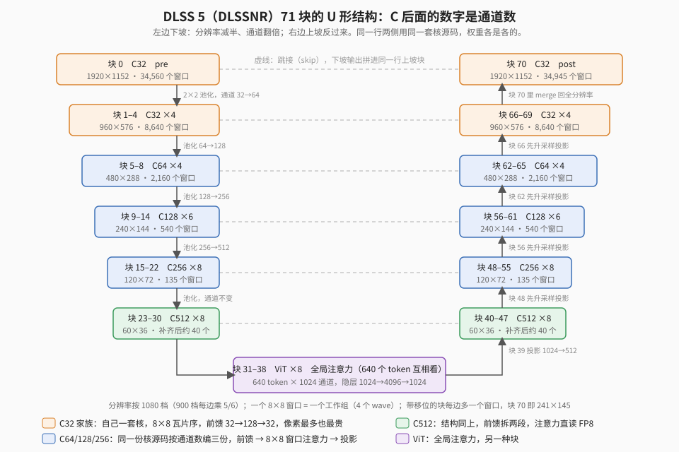

【DLSS5】9070 XT 的算力到底花在哪儿了：三层账本，和最后这 7%

━━━━━━━━━━━━━━━━━━━━

◆ 开篇：换完接口之后，剩下的问题

━━━━━━━━━━━━━━━━━━━━

313 期（ https://mp.weixin.qq.com/s/W4kBSWorQrlq98jSOBbxZg ）讲到网络从 DirectX 搬到 HIP，同条件一帧从 16.8 毫秒到 15.5，《剑星》900P 里 52 帧。那篇收在一句话上：接口换完只是拿到了一套新工具，速度还得自己找。

新工具最大的好处是能看汇编了。于是一个老问题重新摆上桌：9 月 12 日我们算过一笔，这张卡的矩阵单元我们只吃到峰值的 13% 左右，当时的判断是差距四分之三在软件。**剩下那八成多，是硬件必须付的，还是我们浪费的？** 如果全是浪费，那就还有好几倍的空间；如果大部分是必须付的，就该知道到底哪一格是“必要损失”，哪一格能拿回来。

这期就是这笔账。从 9 月 21 日到 23 日，两个 AI 轮班（前一半是 Codex，额度用尽后 Claude 接手），先量后改。结论先说：**必要损失大约占七到八成，能拿回来的我们拿回来了 7%，剩下的要么改算法，要么认了。** 中间量出来的三层账本，比结论本身有意思。

顺便交代一下版本：第三章固定尺寸那一刀在 0.28 里，第六章的六刀都在 0.29 里，三个包的链接在仓库首页。《剑星》900P 简单场景已经能摸到 60 帧，有网友把画质开到最低，报了 73。

━━━━━━━━━━━━━━━━━━━━

◆ 第一章：先把尺子校准

━━━━━━━━━━━━━━━━━━━━

要算“用了多少算力”，得先确定分子和分母各是什么。这一步我们踩了三个坑，每个都值得记。

**第一个坑：峰值是在什么频率下测的。** 我们写了个小程序，数据先进寄存器再反复算，尽量不碰显存。RX 9070 XT 实测：FP8 稠密矩阵约 405 TFLOPS，FP16 矩阵约 204，FP32 双发射约 49.9。TFLOPS 是每秒万亿次浮点运算。这些数接近理论上限，说明**卡本身能跑满**——但测的时候核心频率在 3.1 GHz 以上，而跑真实网络时整网在 2.7 GHz 多，ViT 那段大矩阵单独压测时更只有 2.5 GHz 上下。同一张卡，分母先要按频率折一遍：对那段 ViT 核来说，参考上限是 320 多 TFLOPS，不是 405。频率这件事早就坑过我们一回：9 月 10 日家里停电，机器重启，同一条链什么都没改，从 36 毫秒变成 24.4——之前几天 GPU 一直卡在降频态，一毫秒一毫秒扣出来的收益有一半是时钟噪声。

**第二个坑：测量本身会拖慢程序。** 一帧 234 次 GPU 调用，给每次前后都放计时标记，18.3 毫秒的回放变成 28.8。数字是对的，但已经不是原来的程序。后来改成每帧只放几个标记、分批测累计时间再相减，有标记和无标记的整网时间才对得上。另一次混合图形接口和 HIP 的性能捕获，甚至改变了输出，那批数据整个作废。**测出一个数，先问测量把程序改了没有。**

**第三个坑：分母里装了什么。** 之前那个“55 TFLOPS 有效吞吐”，是拿主矩阵的运算量除以整网时间，分母里塞着读取、格式转换、归一化、残差、同步、写出——全部非矩阵的活。405 除以 55 得不出“还有七倍空间”。

校准之后，能说的口径是这样：ViT 那段真实的大矩阵核，有效吞吐约 150 TFLOPS，对折算后的上限是 45% 左右；整网按主矩阵算，落在 15% 到 35% 之间，具体看哪一段。

这个区间正不正常，可以对照训练圈的说法。PaLM 那篇论文（2022）提出了 MFU，模型算力利用率：观测到的吞吐除以硬件峰值理论上能达到的吞吐，PaLM 540B 在 6144 块 TPU v4 上是 46.2%。但那是 K 上千、batch 上万的大矩阵训练；我们这张网的大头是 32 通道的外层小矩阵加大量转换和同步，是高分辨率、小通道的视觉网络推理，每搬一次数据只做很少的乘法，天生吃不满矩阵单元。**拿 40% 当靶子，口径就错了。** 13% 不是丢人的数，问题是它由什么组成。

━━━━━━━━━━━━━━━━━━━━

◆ 第二章：第一层账——整网哪一段贵

━━━━━━━━━━━━━━━━━━━━

先按网络区段分。冻结一帧真实输入，关掉自适应复用和历史，分批交错对照：

| 区段 | 900P（ms） | 1080P（ms） | 1080P 占比 |
|---|---:|---:|---:|
| C32 | 4.405 | 6.444 | 35% |
| C64 | 1.615 | 2.363 | 13% |
| C128 | 1.541 | 2.214 | 12% |
| C256 | 1.670 | 2.254 | 12% |
| C512 | 1.760 | 2.179 | 12% |
| ViT | 1.488 | 2.471 | 14% |
| 过渡 | 0.084 | 0.206 | 1% |

C32 后面的数字是特征通道数，可以理解成每个像素位置带着多少个数往下算。C32 通道最少，却占 35%——它在最外层，处理的位置最多，一帧只调 11 次，但块 0 和块 70 每次都是三万四千多个 8×8 窗口，其余几块也各有八千多。C512 调 92 次反而便宜。**只数调用次数会把重点找偏。**

这层账回答“往哪看”，回答不了“为什么慢”。于是分两头往下挖：ViT 的大矩阵，和 C32 的小矩阵。

━━━━━━━━━━━━━━━━━━━━

◆ 第三章：ViT 的大矩阵——喂不饱，不是算不动

━━━━━━━━━━━━━━━━━━━━

ViT 前馈网络是整张网里最像“标准矩阵乘”的地方：每个位置 1024 个特征展开到 4096，激活，再收缩回 1024。两个算子运算量相同，1080P 下一个 57 微秒，一个 36。差在哪？

**第一个原因追到了编译后的循环。** 展开核接的是运行时传入的矩阵尺寸，编译器看到两个变量，生成的循环每轮读一小批、做 4 条矩阵指令、回去算地址。把尺寸写成编译期常量，编译器自动展开四份：一次提前发更多读取，然后连做 16 条矩阵指令。计算总量和累加顺序都没变，57 微秒变 36。反过来禁止收缩核展开，36 变 77。这条能正反复现，改进整网 1.7%——局部快三成，整网只有百分之一点几，因为一帧只有 8 次。

**接着问：展开之后为什么还停在 150 TFLOPS？** 是四条累加链互相等，还是数据送不过来？做了两个对照。操作数留在寄存器里反复算同样多的矩阵指令：338 TFLOPS。同一份机器码，只让权重反复读同一小片：36 微秒降到 22。**不是算不动，是喂不饱。** 其实 9 月 12 日就撞见过同一件事：C512 段的前馈矩阵原来声明成 FP16，只能用 FP16 矩阵那一档（204 TFLOPS），改成 FP8 就换到了 405 那一档，输出逐位相同，矩阵指令快了一倍，核却一点没快——矩阵单元本来就在等搬运，换到更快的档，它只是等得更快。

────────────────────

💡 数据从哪儿喂上来：9070 XT 的存储层次

后面几段会反复提到 L0、L2，先把这张卡从近到远的几层摆出来：

| 层 | 在哪儿 | 大小 | 说明 |
|---|---|---|---|
| 寄存器 | 每个 wave 自己的 | 最小 | 最快，矩阵指令的操作数就在这儿 |
| 共享内存（LDS） | 每个计算单元一块，工作组内共享 | 64 KB | 程序自己决定放什么 |
| L0 | 每个计算单元一份 | 几十 KB | 离计算单元最近的缓存，硬件自动管；AMD 的叫法，相当于 NVIDIA 的 L1 |
| L2 | 全卡共享 | 8 MB | 所有计算单元都从这儿取 |
| Infinity Cache | 全卡共享 | 64 MB | L2 没命中再来这儿 |
| 显存（GDDR6） | 板上 | 16 GB | 最慢，640 GB/s |

越往下越大、越慢。权重一共一百多兆，住在显存里，用到的那部分被一层层往上搬，搬到寄存器才能喂给矩阵单元。

────────────────────

再往下就怪了。把权重的访问范围从 64 KiB 逐级放大到 4 MiB，耗时不是单调上升：256 KiB 那一档 48.8 微秒，比 4 MiB 的 36.3 还慢，四个计时槽都复现。给权重块之间隔 256 字节的空隙，256 KiB 那档就回到 22。用 AMD 官方的性能分析工具 RGP（Radeon GPU Profiler，相当于 NVIDIA 的 Nsight）读芯片里的硬件计数器，L2 命中率前后都是 99.97%，但内存单元停顿从 39.5% 降到 18.8%。**命中了，只说明找到了数据，不等于立刻送到计算单元。** 真实展开核接上计数器：L0 只命中 58%，四成多的请求要往下走到 L2；L2 把它们接住了 99.95%，几乎不用去显存——可内存单元停顿仍有 68%。数据一直都在 L2 里，卡的是从 L2 送上来的那段路。

这一层我们把请求数算回来了：按每条读取指令触及多少个 128 字节区域计数，64 次调用合计 262,144,000 个请求，和捕获的计数器完全一致。摊到一次核，逻辑读 200 MiB，请求覆盖 480 MiB——**这不是从显存搬了 480 MiB**，是请求这个动作的账。把读取指令加宽到 128 位，L0 请求少了三分之一，L2 请求只少 9%：删掉的大多本来就能在 L0 找到。

再往下是 AMD 不公开的部分：L0 的服务、地址到 bank 的映射。我们量到了“数据在缓存里但送得慢”这一层，就停在 RGP 计数器分不出的地方。这是这期第一格**必要损失**：不是我们的程序写坏了，是这个尺寸的矩阵在这套缓存上就得排队。

━━━━━━━━━━━━━━━━━━━━

◆ 第四章：第二层账——C32 里一个 wave 的一生

━━━━━━━━━━━━━━━━━━━━

C32 占 35%，它的一个核里融合了前馈网络、QKV、注意力、投影和输出，一个 128 线程的工作组（4 个 wave）处理一个 8×8 窗口。静态数指令没用——指令条数不等于时间——得按管线折成周期，再和实测对账。

────────────────────

💡 一个 wave 是什么：32 个人听同一个口令

写 GPU 程序时，写的是一个线程的代码：“我是第几号线程，读第几号数据，算完写回去。”启动时再说一声“128 个线程一组，开几万组”。

硬件把每 32 个相邻的线程捆成一个 wave。这 32 个线程共用一个指令指针，永远在同一时刻执行同一条指令，只是每个线程有自己的寄存器、算自己的数据。像做广播体操：一个口令，32 个人同时做同一个动作，各用各的身体。

口令只有一个，所以怕分叉。代码里一个 `if`，要是一半线程走 if、一半走 else，这个 wave 两段都得执行一遍，执行其中一段时另一半人站着等。9 月 17 日单是把格式转换函数里的分支改成不分叉的写法，整网就省了 0.19 毫秒。

矩阵指令是整个 wave 合伙做的：一个 16×16 的矩阵块分散在 32 个线程的寄存器里，一条指令下去，32 个人合力算完一块。所以 C32 的一个工作组是 4 个 wave、管一个 8×8 窗口的 64 个位置，每个 wave 管 16 个；四个 wave 之间靠共享内存交换数据、靠栅栏对齐步调。

NVIDIA 把这 32 个一捆叫 warp，AMD 叫 wave（wavefront 的简称）。

────────────────────

先算静态预算。矩阵指令一条要几个周期，不查资料，拿本机测出来的 405 / 204 TFLOPS 反推：FP8 一条约 16 个周期，FP16 约 32。post 核 900P 有 97,284 个 wave，每个动态执行约 2,270 条普通向量指令、70 条矩阵指令、465 条共享内存指令、122 条显存读写。折算：矩阵 0.15 毫秒、向量 0.28、共享内存 0.26、显存 0.18，四项相加 0.87，实测 1.0。**四条管线本该同时干活，加起来却接近实测，说明它们基本在轮流干。矩阵单元真正需要的时间只占这个核的 15%。**

静态账有个问题：它不知道 wave 在哪一步等。于是做了动态的——在核里每个阶段边界读一次硬件周期计数器，每个 wave 记 10 个时间戳加 barrier 等待，写到显存，跑 8 帧回收。这是这期最值钱的一张表，C32 十个核按 wave 加权：

| 阶段 | 占 wave 时间 |
|---|---:|
| 输入 staging（读 16 行、转 FP8、写共享内存） | 30.7% |
| 前馈网络（展开、激活、收缩） | 26.1% |
| QKV（三个投影加归一化） | 10.8% |
| 注意力（分数、softmax、AV） | 11.8% |
| 投影 | 7.9% |
| 尾部（残差、输出） | 8.8% |
| 其中 barrier 等待 | 8.7% |

最意外的是 staging：把 16 行输入搬进来、转成 FP8、按字节写进共享内存，比前馈网络还贵，是矩阵时间的 7 倍。post 核每个 wave 活 23,600 个周期，其中矩阵指令大约 1,100 个。

同样的打点搬到 C64 到 C256 的注意力核和 C256 的前馈核上，形状类似：矩阵 5% 到 15%，其余是取数排队、共享内存中转、barrier。**这张网的 wave 一辈子里八成以上的时间在搬数据、等同伴、等队列。** 这不是某一处的 bug，是这种“每个窗口一组、组内四个 wave 靠共享内存交换”的结构本身。

━━━━━━━━━━━━━━━━━━━━

◆ 第五章：第三层账——一次 launch 里发生了什么

━━━━━━━━━━━━━━━━━━━━

核内的账是每个 wave 自己的。还有一层：一次 GPU 调用（launch）发出几万个工作组，硬件怎么把它们铺到 64 个计算单元上，铺得满不满，最后有没有空转。

先交代这张卡的层级。64 个计算单元（compute unit，CU）两两配成一对，叫 WGP（工作组处理器，work group processor），共 32 个。每个计算单元里有 2 个 SIMD32：SIMD 是单指令多数据（single instruction, multiple data）的执行单元，每个周期发一条指令，32 个车道同时对 32 份数据执行，正好跑一个 wave。全卡 128 个 SIMD、4096 个车道，就是规格表上那 4096 个流处理器。一个 SIMD 上可以同时挂好几个 wave，这个 wave 在等数据，下一个周期就切去跑另一个——同时挂着几个，就叫驻留几个。

办法是在每个 wave 进出时再记两个 64 位的实时戳（100 MHz 的实时计数器，不随核心频率变），再读一个硬件 ID 寄存器，记下它落在哪个 SIMD 上。这样能画出整个 launch 的并发曲线，还能直接数每个 SIMD 上同时住着几个 wave。

先纠一个错：**全卡是 128 个 SIMD**。309 期（ https://mp.weixin.qq.com/s/mvUDHC6kLqqCKIag8VIERA ）讲 ViT 合核为什么慢时，写的是“摊到 256 个 SIMD 上”，按 256 算是错的，应该是 128。真数出来：

| 核 | 每组共享内存 | 实测每 SIMD 驻留 | 上限来自 |
|---|---:|---:|---|
| C32 chain 等七核 | 15,360 B | 8 个 wave | 共享内存：4 组 × 15,360 = 61,440 ≤ 64 KB |
| C32 mapped / post 三核 | 19,712 B | 6 个 wave | 共享内存：第 4 组放不下 |
| C256 前馈 | 21,568 B | 12 个 wave | 寄存器 |
| C256 注意力（寄存器版） | 25,856 B | 12 个 wave | 寄存器 |

C32 在 CU 模式下每个计算单元只有 64 KB 共享内存，15,360 × 4 刚好塞满。所以 C32 的驻留贴着共享内存上限，稳态并发达到上限的 96%，一次 launch 的爬坡和尾巴合起来只占 1%——**C32 的缺口全在核内，不在调度。**

但 C256 注意力那边看到了一笔新账：每次 launch 只有 104 到 160 个组，硬件同时能住 96 个，也就是两轮多一点，最后半轮全网空转，**尾巴占 launch 时长 25% 到 37%**，一帧 14 次约 0.15 毫秒。这是结构税：投影要用到全部 8 个头的注意力输出，组分不开；同一条 stream 里相邻两次调用也不重叠，因为每一步都依赖上一步。第二格必要损失。

━━━━━━━━━━━━━━━━━━━━

◆ 第六章：能拿回来的——六刀，全部逐位相同

━━━━━━━━━━━━━━━━━━━━

有了三层账，改起来就有方向了。约束只有一条：**输出每一位都不能变。** 不是为了洁癖，是为了不用人眼判画质——逐位相同的改动，回归只要比 hash。这一节六刀，每刀都过了 12 帧 RGB 逐位比对加千帧计时的回归。

**第一刀：栅栏作用域，−1.3%。** C32 每个阶段之间要同步一次，让四个 wave 看到彼此写进共享内存的数据。源码用的是“工作组作用域”的内存栅栏，编译器按内存模型给了保险：一个工作组可能跨两个计算单元，各有各的 L0，要保证全局内存一致就得把 L0 整个作废（一条 `global_inv`），还要先等所有在路上的显存读取回来。post 核每个 wave 做 16 次。可这些栅栏只保护共享内存，权重一共 35 KB，本该一直待在 L0 里——之前捕获到 post 的 L0 命中只有 71.6%，原因就在这。把栅栏限定到共享内存地址空间，`global_inv` 全没了。推到全网四个模块：−0.23 毫秒。这一步之后，事后又逐处审了每一个栅栏点，确认没有一处在同步全局内存。

**第二刀：CU 模式，只对 C32，−0.9%。** 把核编译成“工作组固定在一个计算单元”的模式，C32 再省 0.13 到 0.17 毫秒。但推到全模块反而慢：C256 那些 256 到 512 线程的工作组，CU 模式把 8 到 16 个 wave 挤进一个计算单元。按工作组大小逐核试了一遍，只有 C32 赚——它是 4 个 wave 靠共享内存密集交换、权重常驻 L0 的结构特性，不是“128 线程就赚”。两刀合起来（C32 用 CU 模式、其余只改栅栏）−0.41 / −0.28 毫秒，约 2.2%。

**第三刀：折叠前馈网络，−0.5%。** C32 前馈的展开结果原来写进共享内存，再读回来做收缩。RDNA4 的 WMMA 指令 A、B 两个操作数的寄存器布局是一样的，**把两个操作数对调，得到的就是结果的精确转置**——每个 lane 手里正好是收缩需要的那一行。hidden 激活留在寄存器，打包成 FP8 直接喂收缩，共享内存往返和中间那次同步都省了。这个“对调即转置”后来又用了三次。

**第四刀：字节链和向量化 staging，−1.3%。** staging 占 30% 那张表的直接后果。链式调用的生产者原来写 f16，消费者读回来再转 FP8；改成生产者按消费者完全相同的表达式直接写 FP8 字节，消费者读一个字节。然后把 16 条单字节读并成 1 条 128 位读，16 条共享内存字节写并成 2 条。前一半几乎没收益，后一半才有：**排队按请求数计，不按字节数。**

**第五刀：注意力寄存器化，只在 C64 到 C256，−1.0%。** 注意力的指数和概率原来经共享内存中转，同样用“对调即转置”留在寄存器。这一刀在 C32 上试过，逐位相同，共享内存少 77 条、barrier 少 4 个，但寄存器从 158 涨到 226，净收益只有 0.04 毫秒上下、和噪声交叠，不采用；在 C64 到 C256 三个注意力核上却一共 −0.17 毫秒，因为这些核的驻留被共享内存卡着——C256 那个每组 59.6 KB，改完降到 25.9 KB，驻留档从 8 升到 12。**同一个改法在不同核上赚不赚，取决于那个核的驻留被什么卡住。**

**第六刀：前馈尾段转置，−1.7%。** C256 前馈的投影和 QKV 输出原来是“lane = 列”的布局，每个 lane 写 24 条单字节；操作数对调转置之后，每个 lane 持一行 8 个连续列，编译器自己把字节写并成 8 字节写，指令 2,207 条变 1,995，全局写 38 条变 10。这刀比事前估的大三倍，也改口了一条规则：9 月 22 日在 C512 上把 64 条标量写并成 3 条向量写反而慢了，当时总结成“排队按指令 × 触及缓存行数算”；这次触及的缓存行数前后一样（都是 48），指令数 24 变 3，却赚了。所以**读写成本是指令数加触及行数两项相加**：C512 那次是行数从 1 涨到 32 压过了指令项。

另外还有一个小的：C32 三个核多带 4,352 字节的输入副本，让它别名到生命期不交叠的另一块共享内存上，驻留 6 变 8，−0.5%。加 33% 的驻留只换来 4%，反过来说明那三个核在 6 个 wave 时延迟已经盖住大半。

六刀加上这个小的，约 7%。装机版从上文 313 期的 15.5 毫秒（当时的 1024 行工作区）到现在，900P 一帧约 12.0 毫秒。

━━━━━━━━━━━━━━━━━━━━

◆ 第七章：拿不回来的，和为什么

━━━━━━━━━━━━━━━━━━━━

这几天试了大约二十个改法，采用六个。没采用的每一个都有“为什么不赚”的记录，它们比赚的更能说明边界在哪。

- **提高驻留不一定快。** C256 前馈把寄存器从 102 封到 96，驻留 12 变 16，但溢出了 9 个寄存器到显存，整网反而 +0.06 毫秒。C32 那次别名也只换了 4%。**驻留只在它是当前瓶颈时值钱。**
- **提前读也不一定快。** 注意力的残差特征读原来在最后一个同步之后才发，旧的阶段账说它占 21%。提到核入口去读，逐位相同，反而慢 0.1 毫秒：寄存器版驻留翻倍之后那段延迟已经被盖住了，提前发的读跟入口的 staging 抢队列。**阶段账要在当前驻留下重打，旧版本的份额不能沿用。**
- **转置并宽只对“展开的多条窄写”有效。** 把第六刀搬到注意力投影输出上，那里原版是个运行时滚动循环，静态只有 2 条写；转置后编译器展开成 8 条写加地址算术，C256 还多了 20 个寄存器掉一档驻留，慢 0.1 毫秒。
- **删同步不一定快。** C256 前馈的 8 个 barrier 里 4 个真依赖，另两对能合并，但合并要把共享内存翻倍，驻留从 12 掉到 10，抵消了。
- **核太小的改动整网看不见。** ViT 注意力的寄存器化逐位相同，收益不到 0.03 毫秒。
- **有的收益要重编游戏侧。** C256 权重片段读 8 字节并成 16 字节，−0.03 毫秒，打包器在宿主程序里，攒着等下次重编。

还有一类是**放弃逐位能换到什么**。用消融的办法（故意破坏输出只看时间）给上界：C256 前馈那两个 barrier 加 128 线程串行算平方和的归一化交换，值 1.5%。真做了一版：每个 wave 自己管一个头的 32 列，平方和在 wave 内算完，不碰共享内存不用 barrier——求和从 32 项顺序变成两个 16 项部分和相加，只在开方前重结合。拿到 1.1%，12 帧 RGB 逐像素对照：平均差 4×10⁻⁴（约 0.1 个灰阶），PSNR 58 dB，1.4% 的像素差超过一个 8 位灰阶，个别边缘像素差到 0.17。数值上是看不出的量级，但那几个点在游戏里会不会闪，只有眼睛能判。**这一刀留成开关，默认关。** 放弃逐位的全部空间大概就是这个数量级，不是之前估的 3% 到 5%——那个估计里有一半其实是逐位能保住的，第六刀已经拿了。

━━━━━━━━━━━━━━━━━━━━

◆ 第八章：把账合上

━━━━━━━━━━━━━━━━━━━━

回到开篇的问题：八成多的差距，哪些是必须付的？

按三层账本粗分，不画饼图，因为这些机制互相重叠，加不成 100%：

**必要损失，大约七到八成。** 第一格是算法自带的非矩阵工作：每一块之间 FP8 的量化和反量化、归一化、激活、残差，这些在 NVIDIA 的卡上同样要做，只是它的张量核旁边有异步搬运把等待藏掉。第二格是这张网的形状税：8×8 窗口注意力决定了工作组小、组内靠共享内存交换、每阶段要同步；32 通道的外层矩阵太小，矩阵指令和它两边的搬运比是 1 比 6。第三格是硬件的供数税：数据在 L2 里，送到计算单元还得排队，这一层在 RGP 计数器分辨率之下，AMD 不公开。第四格是调度的结构税：一个 launch 组数不够整轮，最后半轮空转。

**已经拿回来的，7%。** 全是“实现付的保险费”：编译器按内存模型给的 L0 作废、共享内存的多余往返、窄写、不合适的驻留档。

**还能拿的，1% 上下，代价是逐位。** 留成开关。

用文献的话说一遍。Roofline 模型（Williams、Waterman、Patterson，2009）把一个核的上限画成两条线：算术强度低时受带宽限制，高时受峰值限制。我们这张网的核在 Roofline 上不在任何一条屋顶下面——它既没吃满带宽（L2 命中 99.9%），也没吃满算力（矩阵 15%），卡在两者之间的延迟和发射上。Hong 和 Kim 2009 年那个分析模型说得更准：GPU 靠多个 wave 轮流上场来掩盖内存延迟，掩盖得住不住取决于“内存并行度”和“计算并行度”哪个先见底。C32 就是前者见底：四条管线轮流干，wave 大部分时间在等。分层 Roofline（Yang、Williams 等，2019 起）把各级缓存和显存分开画，能看到“L2 命中但 L0 服务卡”这一层的存在，但也画不出它的原因。我们的方法更像 Jia 等人 2018 年剖析 Volta 那篇：厂商不公开，就用受控的小程序一个变量一个变量地量。量到最后剩一块黑箱，那块就是必要损失里最说不清的部分。

所以 9 月 12 日那个“13%”没错，错的是跟着它的那句“四分之三在软件”。软件里能动的那部分，动完是 7%；剩下的在网络形状和硬件里。

━━━━━━━━━━━━━━━━━━━━

◆ 收尾

━━━━━━━━━━━━━━━━━━━━

三天里最有用的不是六刀，是三张表：整网分段、每个 wave 的阶段、每次 launch 的驻留。第一张告诉你往哪看，第二张告诉你 wave 在等什么，第三张告诉你硬件铺满了没有。有了这三张，每个改法在动手前就能猜对大半会不会赚，猜错的那几次也知道错在哪一层。

9 月 12 日，DirectX 版五条优化线两天里先后证伪，我们一度认定“这条路到头了”；后来换了工具又走了 7.5%，这期又走了 7%。每次到头都是在当时的分辨率下到头。下一层分辨率在 AMD 手里。

仓库还是那个： https://github.com/lmxxf/dlss5-on-amd-9070xt-porting ，这期所有实验的原始数据在 Development/results/ 下按名字加日期归档，每个都有自己的 README，包括没采用的；工作组织方式写在首页“现在的包怎么编”那节。

━━━━━━━━━━━━━━━━━━━━

◆ 参考资料

━━━━━━━━━━━━━━━━━━━━

项目 Development/DevHistory.md 与 Development/results/，2026 年 9 月 21 日到 23 日的记录。整网数字为 RX 9070 XT 上冻结输入的离线回放，每测试 8 个计时槽各 160 帧交错对照，输出逐位校验；生产候选另做 12 帧 RGB hash 与 1000 帧计时回归。游戏帧率为实机观察。

Williams, S., Waterman, A., Patterson, D. Roofline: An Insightful Visual Performance Model for Multicore Architectures. Communications of the ACM, 52(4), 2009.

Yang, C., Kurth, T., Williams, S. Hierarchical Roofline Analysis for GPUs: Accelerating Performance Optimization for the NERSC-9 Perlmutter System. Concurrency and Computation: Practice and Experience, 2019.

Hong, S., Kim, H. An Analytical Model for a GPU Architecture with Memory-level and Thread-level Parallelism Awareness. ISCA 2009.

Jia, Z., Maggioni, M., Staiger, B., Scarpazza, D. P. Dissecting the NVIDIA Volta GPU Architecture via Microbenchmarking. arXiv:1804.06826, 2018.

Chowdhery, A. 等. PaLM: Scaling Language Modeling with Pathways. arXiv:2204.02311, 2022（MFU 的定义与 46.2% 的出处）。

AMD, RDNA4 Instruction Set Architecture Reference Guide（2025；WMMA 操作数布局、`s_getreg` 硬件 ID、`global_inv` 语义的依据）。

━━━━━━━━━━━━━━━━━━━━

测出一个数，先问测量把程序改了没有；算一个利用率，先问分母里装了什么。

wave 一辈子里八成时间在搬数据、等同伴、等队列；矩阵指令只是它做的事里最不费时间的那件。

同一个改法赚不赚，看那个核当下被什么卡住；驻留只在它是瓶颈时值钱；读写成本是指令数加触及的缓存行数。

━━━━━━━━━━━━━━━━━━━━

// 靳岩岩的 AI 学习笔记 × Claude 的文笔 × GPT 的严谨 × Gemini 的浪漫
// 2026年9月24日

━━━━━━━━━━━━━━━━━━━━

【摘要（发布用，不进正文）】

换到 HIP 之后，9070 XT 的矩阵单元只吃到峰值一成多——剩下的是浪费还是必付？三天量了三层账本：整网分段、每个 wave 的阶段、每次 launch 的驻留。答案：wave 八成时间在搬数据和等待，必要损失七到八成；能拿的六刀全逐位相同，共 7%，《剑星》900P 到 60 帧。剩下的要么放弃逐位换 1%，要么在 AMD 不公开的那层里。
