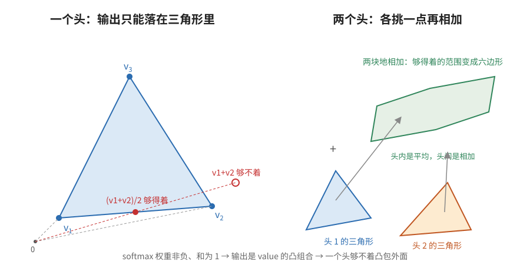

【多头注意力】为什么非得多个头——一个头只会平均，不会相加

━━━━━━━━━━━━━━━━━━━━

◆ 开篇：实验证明了分工，没证明为什么要分

━━━━━━━━━━━━━━━━━━━━

134 期（ https://mp.weixin.qq.com/s/t52Qtfwp-T5dRwy4_8spKw ）讲过多头注意力的七年：2019 年看注意力热力图说“这个头管语法”，是看图说话；到 2026 年改两三个头的旋钮就能让模型满嘴颜色，是因果干预。那期的结论是分工确实存在，而且比当年瞎编的还清楚。

可那一整期都是实验。它回答的是“头之间有没有分工”，没回答另一个更根本的问题：**为什么非得多个头？**

这个问题有一个让人不舒服的地方。GPT-3 的隐藏维度是 12288，切成 96 个头，每个头 128 维。可你也可以不切，就一个 12288 维的大头。两种做法算注意力分数的计算量一模一样，参数量也一样，都是把 12288 维的向量投影一遍再两两做点积。**切成 96 份，到底多买到了什么？**

这问题我早上想到的，让 Claude 别引实验，用本科线性代数说明一下。它给了三条，第一条它说是自己顺着公式推的（后来查出来一半有人写过，后面会说），第二条是一篇 2020 年的定理，第三条是教科书常识。下面按这个顺序讲。数学只到大一水平：向量、点积、凸组合、矩阵的秩。

━━━━━━━━━━━━━━━━━━━━

◆ 第一章：一个头的输出，画在纸上是哪块地方

━━━━━━━━━━━━━━━━━━━━

先把一个头做的事写成公式。序列里有 n 个 token，每个 token 有一个 value 向量 v₁, v₂, …, vₙ。第 i 个位置的注意力输出是：

out_i = a_i1·v₁ + a_i2·v₂ + … + a_in·vₙ

其中 a_ij 是 softmax 算出来的注意力权重。softmax 的定义保证了两件事：每个 a_ij ≥ 0，并且 a_i1 + a_i2 + … + a_in = 1。

数学上，一组非负、和为 1 的系数乘上一组向量再加起来，叫 **凸组合** （convex combination）。凸组合的结果落在哪儿，有一个非常直观的几何答案：**落在这些向量端点撑起来的那个多面体内部**，术语叫凸包（convex hull）。

拿三个 value 向量举例。三个点撑起一个三角形。不管 softmax 把权重怎么分，输出永远在这个三角形里面，或者边上。全给 v₁，输出就是顶点 v₁；给 v₁ 和 v₂ 各一半，输出是那条边的中点；三个各三分之一，输出是重心。**三角形外面的任何一个点，一个头无论怎么调都够不着。**

这条约束躲不掉。注意力算完还要乘一个输出矩阵 W_O，可 W_O 是线性变换，线性变换把三角形映成另一个三角形（或者压扁成线段），映过去的点还在映过去的三角形里。凸包过了线性层还是凸包。

到这里还没说到多头。先记住这个形状：**一个头的输出，就是在 value 向量撑起来的那块地里挑一个点。**

────────────────────

💡 同一个凸组合，在 DeepSeek V4 里被嫌管得太松

“权重非负、和为 1”这条约束，在模型里不止注意力这一处露头。244 期（ https://mp.weixin.qq.com/s/IpmdCFVbfZwVwmQno815LA ）讲过 V4 的 mHC：每层带着 4 份残差流副本，出口有一块 4×4 的 comb 矩阵决定旧副本怎么串成新副本。那块矩阵也是 softmax 起手，每行和为 1，所以每份新副本是 4 份旧副本的凸组合，落在它们撑起的那个四面体里。**跟这一章说的是同一件事，只是把 n 个 value 换成了 4 份副本。**

有意思的是两边接下来往相反方向走。mHC 嫌 softmax 管得太松：行和为 1 只管住了每份新副本的总输入，没管住旧副本被抄送了几次，某一份可能被四份新副本反复吸收，另一份没人理。于是 V4 加了 Sinkhorn 迭代，把列也摁到和为 1。注意力这边的麻烦正好反过来，是嫌 softmax 管得太紧，下一章说。

────────────────────

太紧在哪，拿一个具体任务一看就清楚了。

━━━━━━━━━━━━━━━━━━━━

◆ 第二章：平均和相加，差在哪

━━━━━━━━━━━━━━━━━━━━

现在设想一个具体任务。当前位置要把两个地方的信息都拿过来，比如句子的主语 a 和前一个词 b，两个都得要。

一个头想同时看 a 和 b，只能把权重分给两边：一半给 a，一半给 b，输出是 (v_a + v_b) / 2。这是**中点**，不是 v_a + v_b 那个**和**。

你可能说，中点乘个 2 不就是和了吗？让 W_O 放大两倍不就行了。可以，但 W_O 是训好就固定的。同一个头，遇到句子里只有 a 没有 b 的时候，权重全给 a，输出是 v_a，再被 W_O 放大两倍就成了 2·v_a。有 b 的时候尺度对，没 b 的时候尺度错。**softmax 归一化把“这次看到了几个东西”这个数抹掉了。**

再换个例子更清楚：句子里有两个一模一样的 a。一个头看它们，权重各一半，输出是 (v_a + v_a) / 2 = v_a，跟只看到一个 a 完全一样。看到一个和看到两个，一个头分不出来。

把这件事写成一句话：一个头的输出，是“它看的那些 token”的**加权平均**，永远不是**求和**。平均有两个性质，求和都没有：

- 看一份和看两份相同的，平均值不变
- 看 a 和 b，平均值一定落在 v_a 到 v_b 的连线上

而 v_a + v_b 这个点，除非退化情况，不在 v_a 到 v_b 的线段上。所以**单头做不了求和，这是能证的，不是经验。**

多头怎么破这个局。h 个头，每个头有自己的 softmax，各自在自己的三角形里挑一个点。然后把 h 个点拼起来乘 W_O。拼接再乘矩阵，等价于每个头的输出各乘一块矩阵再加起来：

out = W_O¹·(头 1 挑的点) + W_O²·(头 2 挑的点) + … + W_Oʰ·(头 h 挑的点)

**头内是平均，头间是相加。** 头 1 可以把权重全给主语 a，头 2 可以把权重全给前一个词 b，两个点相加，v_a 和 v_b 都完整地进了残差流，谁也没被谁稀释。句子里没有 b 的时候，头 2 看别的，头 1 照旧，尺度不乱。

几何上，一个三角形里的点集是那个三角形；两个三角形里各挑一点相加，得到的点集是两个三角形的“闵可夫斯基和”（Minkowski sum），是一块更大的地。h 个头就是 h 块地相加。

所以多头买到的东西可以说得很具体：**h 个互相独立的指针**。每个指针指向序列里的一处（或者一小片），指到的东西以相加的方式汇总，不是以平均的方式汇总。一个 12288 维的大头再宽，也只有一个指针。

这段推导，Claude 一开始说是它自己顺着公式推的，我让它去查有没有人写过。查回来的结果：**几何那一半早有人写成了命题。** 2025 年 10 月的一篇论文《Into the Rabbit Hull》（Fel 等，ICLR 2026）第一条命题就是“多头注意力的输出落在各头凸包经 W_O 投影后的闵可夫斯基和里”，原话是 multi-head attention produces sums of convex mixtures，多头注意力产生的是凸混合的和。更早的 Sanford、Hsu、Telgarsky 2023 年那篇 Transformer 表达力论文，也是从“自注意力输出是 value 各行的凸组合”起手，并且直接把多头定义为各头输出相加。所以“头内平均、头间相加”不是新发现，是写在论文里、只是没人拿来回答“为什么要多头”的一条几何事实。

从“闵可夫斯基和”走到“h 个指针”这一步，没找到原话，算我们的推论。最接近的严格旁证有两篇：Yu 等 2025 年（ICLR 2026）证明要同时取回 D 个不同位置的值，D 个头一头一个就够，头数不够时参数量随精度指数爆炸，论文里的说法是“头可以各自专管一个坐标”；Rajaraman 等 2026 年 9 月的预印本证明单层 k 个头恰好能算 k 位的奇偶校验，k+1 位就不行，而且嵌入维度和数值精度无限大也补不上。**头数是一种维度换不来的资源**，这句是他们证的。

────────────────────

💡 为什么 Transformer 数数这么费劲

“我前面出现了几个 the”这类题，大模型一直答得不好。上面的推导给了一半解释：一个头的注意力输出对“看到几份”不敏感，看到一个 the 和看到十个 the，平均下来一样。2024 年那篇《Transformers need glasses!》把这条证成了命题：不带位置编码的 Transformer，内部表示只依赖两种 token 的比例，“10”和“1100”表示相同，原话是“归一化和计数所需要的无界性对着干”。

但要说准一点：计数信息没有丢，是被压扁了。Yehudai 等 2024 年《When Can Transformers Count to n?》算得很细：softmax 让每个相同的 token 分到约 1/c 的权重，数量 c 变成了一个 1/c 的幅值藏在输出里，注意力自己读不出来，得靠后面的 MLP 做一次“求倒数”才能恢复。他们证明了嵌入维度不小于词表大小时，一层一头加一个 MLP 就能完美计数。所以准确的说法是：**注意力算子只看比例，数量得靠别的零件从比例里反演出来。** 词表比嵌入维大的时候，这条反演路数值上会不稳，这是大模型数数差的另一半原因。

────────────────────

指针数说完了，下一个问题是每根指针要多粗。

━━━━━━━━━━━━━━━━━━━━

◆ 第三章：一个头要多少维才够用

━━━━━━━━━━━━━━━━━━━━

第二章说多头买到的是指针数。那反过来问：每根指针要多粗？也就是每个头的维度 d_head 要多大才够用？这一章有一篇现成的定理。

先看一个头怎么决定“谁看谁”。注意力分数矩阵是 Q·Kᵀ，把 Q = X·W_Q 和 K = X·W_K 代进去：

Q·Kᵀ = X · (W_Q·W_Kᵀ) · Xᵀ

中间那块 W_Q·W_Kᵀ 是个 d×d 的方阵，看着很大，但它是两个 d×d_head 的矩阵乘出来的，**秩最多是 d_head**。也就是说，一个头能表达的“谁和谁匹配”的规则，本质上是一个秩不超过 d_head 的双线性形式。d_head 是 128，这个规则就只有 128 个自由方向，剩下的 12160 个方向它看不见。

秩不够会怎样？2020 年的一篇论文《Low-Rank Bottleneck in Multi-head Attention Models》（Bhojanapalli 等，ICML 2020）把这件事写成了定理。设序列长度是 n，头的投影维度是 d_head。定理说：**只要 d_head ≥ n，随便给一个 n×n 的注意力模式（每行非负、和为 1、元素全正），都存在一组 W_Q、W_K 能把它精确表示出来；而 d_head < n 时，存在表示不了的模式。** 证明的核心就是上面那条秩的链：分数矩阵的秩不超过 d_head，n×n 的目标模式取对数后一般是满秩的，秩不够就凑不出来。反例小到可以手算：d_head = 1、n = 2，分数矩阵有一列恒为零，softmax 之后那一列只能是 (0.5, 0.5)，别的比例都表示不了。

这条定理给了“头要多粗”一个下限：**粗到序列长度那么多维就够表示任意模式了。** 论文当年建议 d_head 取序列长度，BERT 实验取 128，因为当时预训练大多用 128 长的序列。他们还给了一个反向证据：BERT_LARGE 隐藏维度 1024，按标准做法切 8 头是 128 维，切 16 头是 64 维，切 32 头是 32 维。8 头以上性能单调下降，8 头正好卡在 d_head = 128 = 序列长度这条线上。

论文提的修法也简单：**别让 d_head 跟着 d/h 走，把它解耦出来单独定。** 头数可以多，但每个头别切薄。他们用隐藏维度 512、每头 128 维、32 个头，SQuAD 成绩超过了隐藏维度 1024 的 BERT_LARGE。

有意思的是，这个修法后来成了工业界的默认做法，只是没人再提这篇论文。看一眼各家的配置文件：

| 模型 | 隐藏维度 d | 头数 h | d_head | h × d_head |
|---|---|---|---|---|
| GPT-3 175B | 12288 | 96 | 128 | 12288 |
| Llama 3.1 405B | 16384 | 128 | 128 | 16384 |
| Qwen3-32B | 5120 | 64 | 128 | 8192 |
| Qwen3-235B | 4096 | 64 | 128 | 8192 |
| GLM-4.5 | 5120 | 96 | 128 | 12288 |
| DeepSeek-V3 / Kimi K2 | 7168 | 128 / 64 | 192（含 64 维 RoPE） | 见注 |
| GLM-5 | 6144 | 64 | 256（含 64 维 RoPE） | 见注 |
| Qwen3-Next（全注意力层） | 2048 | 16 | 256 | 4096 |

（数据来自各家官方论文表格或 HuggingFace 上的 config.json；MLA 类模型的 Q/K 维度是内容部分加旋转位置编码部分，V 另算，一行写不下，只列 Q/K。）

两个规律。第一，**d_head 从 GPT-3 的 1.3B 版本起就停在 128，隐藏维度从 2048 涨到 16384，涨的是头数。** 128 是地板，新架构往上走到 192、256，没有往下走的。第二，**h × d_head 已经不等于 d 了**：Qwen3-32B 是 8192 对 5120，GLM-4.5 是 12288 对 5120。头的总宽度比隐藏维度还宽。这正是 2020 年那篇论文说的“解耦”，只是工业界自己走到了这一步。

回到开篇那个问题：一个 12288 维的大头和 96 个 128 维的头，计算量一样，为什么切？现在可以答一半了。算注意力分数的开销是 n²·d，跟切不切无关，**多头在计算上是免费的**；切了之后，每个头的匹配规则从秩 12288 降到秩 128，但按定理，128 够表示序列长度以内的任意模式，损失的表达力是“过剩的精细度”。换来的是第二章说的 96 根独立指针。 **用过剩的精细度换指针数，这笔交换在计算上不花钱。**

────────────────────

💡 “头能砍”和“头不能薄”不矛盾

上文 134 期讲砍头实验：训完的模型砍掉 20% 到 40% 的头，性能不掉。这期讲头的维度不能小于序列长度。两条放一起像是打架，其实说的是两回事。砍头实验砍的是**头数**，说明训完之后很多指针是冗余的，推理时用不着；低秩定理限制的是**每根指针的粗细**，薄了连训练时都表达不了想要的模式。2019 年砍头那两篇论文（Michel 等的《Are Sixteen Heads Really Better than One?》和 Voita 等的《Specialized Heads Do the Heavy Lifting》）自己就写了：推理时能砍，训练时仍然需要多头。头数是训练动态的需要，头维度是表达能力的需要。

────────────────────

前三章讲的都是“多头能干什么”，还剩一个问题：这些头的分工是谁分的。

━━━━━━━━━━━━━━━━━━━━

◆ 第四章：分工是谁分的

━━━━━━━━━━━━━━━━━━━━

上文 134 期留了一个尾巴：头之间的分工不是谁分配的，是随机初始化把它们扔在流形的不同地方，梯度下降让各自就地深耕。那期讲的是故事，这里补上能证的那一半和一个数字。

能证的那一半：**如果 h 个头的初始权重完全相同，它们的梯度也完全相同，训练多久都一样。** 理由很简单，梯度是权重和数据的函数，输入一样、权重一样，算出来的梯度就一样，更新完还一样。h 个相同的头，等于一个头的输出乘以 h，多头白切了。所以多头的价值百分之百押在初始化把它们分开这件事上。

随机初始化能把它们分多开？两个独立的 d 维随机向量，夹角余弦的期望是 0，标准差约为 1/√d。d_head = 128 时是 ±0.09，也就是说**出厂时各头之间就近乎正交**。梯度下降从近乎正交的起点各滚各的，滚到不同的谷底，就是上文 134 期那个吃鸡跳伞。那期用的是比喻，这条是比喻背后那个方差。

━━━━━━━━━━━━━━━━━━━━

◆ 第五章：数学能证的，和只能靠实验的

━━━━━━━━━━━━━━━━━━━━

把三条合起来：softmax 是个只会平均的器官，多头把 h 个平均器并联起来做加法（第二章）；每个平均器只需要一百来维就够挑人了（第三章）；并联起来的器官因为随机初始化天然不重叠（第四章）。这就是“为什么非得多个头”的数学版答案。

但要老实说清楚数学证到了哪一步。第二章和第三章证的是：**同样的参数量，一个大头和 h 个小头是两种不同的函数类**。大头有它独有的东西，一个秩为 d 的匹配规则，能用极精细的标准挑人；小头们有它们独有的东西，h 个独立指针。谁更值钱，数学给不出来。语言任务里“同时看几个地方”比“用一个极精细的规则看一个地方”值钱，这是训练出来才知道的。

“指针”这个说法也有边界。Rajaraman 那篇证的是头数换不来，但 Sanford 那篇 2023 年的定理里，算三元匹配这类任务需要的资源是头数、嵌入维度、数值精度三者的乘积，三者可以互换。也就是说，头数在有些任务上是硬资源，在另一些任务上能拿维度和精度顶替。“一头一根指针”是个好用的直觉，不是普适的硬边界。

为什么是 96 个头不是 32 个，为什么 d_head 停在 128 而不是 64 或 256，也是实验答案。上文 134 期讲的砍头实验说砍掉 20% 到 40% 的头性能不掉，说明工业界的头数是往多了配的，宁可冗余。这一点数学同样只能解释“为什么冗余无害”（相邻谷底画了重复的地图），解释不了“为什么要配这么多”。

所以这期跟上文 134 期正好是一对：那期讲实验证明了头在分工，这期讲数学说明了为什么非得分。两边合起来才是完整的答案，缺一边都是半截。

━━━━━━━━━━━━━━━━━━━━

◆ 参考资料

━━━━━━━━━━━━━━━━━━━━

Bhojanapalli et al., Low-Rank Bottleneck in Multi-head Attention Models, arXiv:2002.07028（ICML 2020；Theorem 1：d_head ≥ n 可表示任意全正随机矩阵，d_head < n 存在表示不了的；提出头维度与 d/h 解耦，BERT 实验 d=512、d_head=128、32 头 SQuAD F1 90.95 超过 BERT_LARGE 的 90.89）

Fel et al., Into the Rabbit Hull: From Task-Relevant Concepts in DINO to Minkowski Geometry, arXiv:2510.08638（ICLR 2026；Proposition 1：多头输出落在各头凸包经 W_O 投影后的 Minkowski 和里）

Sanford, Hsu, Telgarsky, Representational Strengths and Limitations of Transformers, arXiv:2306.02896（NeurIPS 2023；自注意力输出是 value 各行的凸组合，多头定义为各头相加；Theorem 7：单层多头算 Match3 需 m·p·H ≳ N/log log N，头数、维度、精度可互换）

Yu et al., The Effect of Attention Head Count on Transformer Approximation, arXiv:2510.06662（ICLR 2026；D 个目标 D 个头一头一个即可高效逼近，头数不足则参数量随精度指数增长）

Rajaraman, Sundaram, Tesfaye, The Head Complexity of Boolean Functions in Single-Layer Attention, arXiv:2609.04046（2026-09 预印本；单层 k 头恰能算 k 位 parity、算不了 k+1 位，嵌入维度与精度无限亦然）

Barbero et al., Transformers need glasses! Information over-squashing in language tasks, arXiv:2406.04267（NeurIPS 2024；Proposition 6.1：无位置编码的因果 Transformer 不能计数，表示只依赖两类 token 的比例）

Yehudai et al., When Can Transformers Count to n?, arXiv:2407.15160（ICLR 2025；softmax 归一化把计数压成 1/c 需 MLP 反演；d ≥ 词表时一层一头加 MLP 可完美计数）

Michel, Levy, Neubig, Are Sixteen Heads Really Better than One?, arXiv:1905.10650（NeurIPS 2019；推理时大量头可砍，部分层可减到单头，训练动态仍需多头）

Voita et al., Analyzing Multi-Head Self-Attention: Specialized Heads Do the Heavy Lifting, the Rest Can Be Pruned, arXiv:1905.09418（ACL 2019；En-Ru 48 个编码器头剪掉 38 个只掉 0.15 BLEU）

各家头维度数据：GPT-3 论文 Table 2.1（arXiv:2005.14165）、Llama 3 论文 Table 3（arXiv:2407.21783）、HuggingFace 上 Qwen3 / Qwen3-Next / GLM-4.5 / GLM-5 / DeepSeek-V3 / Kimi-K2 的 config.json

━━━━━━━━━━━━━━━━━━━━

一个头的输出永远在它看过的那些点撑起来的三角形里，三角形外面的东西它够不着。

头内是平均，头间是相加；多头买到的不是更宽的视野，是更多的指针。

分工不是学出来的，是随机初始化送的：128 维里两个随机向量的夹角余弦标准差只有 0.09。

━━━━━━━━━━━━━━━━━━━━

// 靳岩岩的 AI 学习笔记 × Claude和GPT 的严谨 × Gemini 的浪漫
// 2026年9月16日

━━━━━━━━━━━━━━━━━━━━

【摘要（发布用，不进正文）】

134 期用实验证明了注意力头在分工，这期用大一数学说明为什么非得分：一个头的输出是加权平均，永远落在 value 的凸包里，做不了求和；多头把 h 个平均器并联成加法器，买到的是 h 个独立指针。
