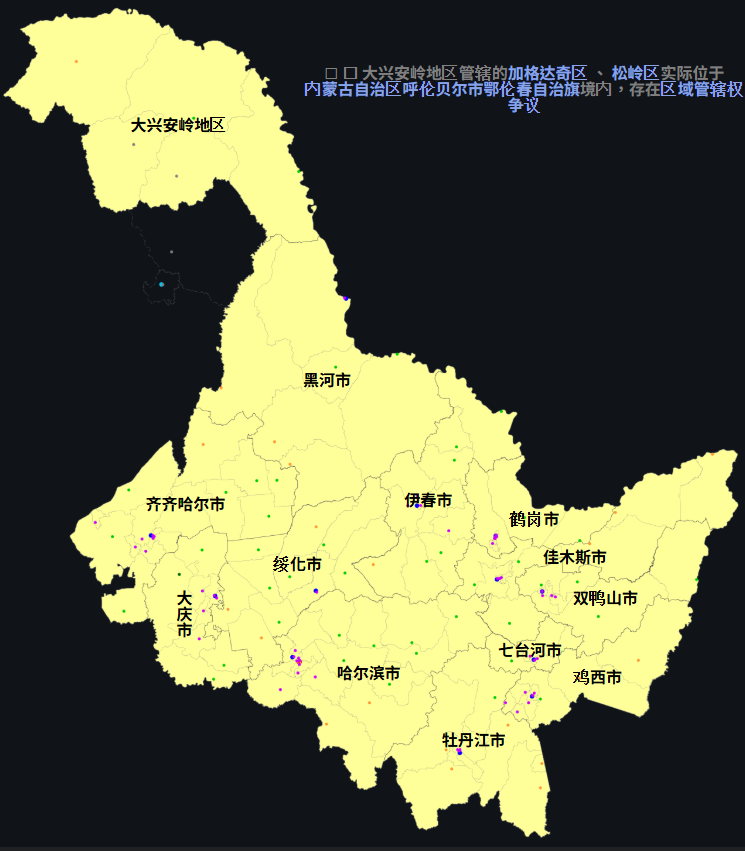

【旅行杂谈】黑龙江的城市都是怎么来的

━━━━━━━━━━━━━━━━━━━━

◆ 一半以上是 20 世纪才有的

━━━━━━━━━━━━━━━━━━━━

齐齐哈尔已经到了，接下来往黑河走，再往后大概是伊春、鹤岗、佳木斯或七台河、牡丹江，最后哈尔滨，路线还没定死。

开了两天车，有个直觉：这地方的城市，哪儿哪儿都是后来才有的。

看地图。黑龙江一共 13 个地级行政区：12 个地级市，加一个大兴安岭地区。把它们的中心城市一个个查下来，1900 年以前就成形的只有三个：齐齐哈尔、绥化、佳木斯。哈尔滨算半个，1898 年才开始。剩下的一半以上，都是 20 世纪才有的，有几座比新中国还年轻。

按来历排一排，大致是三拨，中间隔着一段一百六十年的空档。

━━━━━━━━━━━━━━━━━━━━

◆ 第一拨：清前期的边防城

━━━━━━━━━━━━━━━━━━━━

最早的一拨是十七世纪末清朝在黑龙江一线修的城。

1683 年，清朝设黑龙江将军，驻瑷珲；瑷珲旧城在黑龙江左岸（北岸），1685 年又在右岸（南岸）筑了新城。1690 年，将军移驻墨尔根，就是今天的嫩江市。1691 年筑齐齐哈尔城，1699 年将军再移到这里，从此扎下来。

时间上夹着一件事：1689 年，清朝和俄国签了《尼布楚条约》。条约前后，清廷在黑龙江一线接连筑城、设驿站、派兵驻防。这几座城的身份很清楚，是军城：先有将军衙门和驻防兵，后有市面。

326 期写过齐齐哈尔这座木城，这里不重复。说一下黑河。

今天的黑河市，可以看成瑷珲的接班人。1900 年庚子之变，俄军越江，瑷珲城被焚。之后对岸布拉戈维申斯克对面的黑河镇起来了，1909 年设黑河府。瑷珲这个名字后来留成了县名、区名，城的位置交给了黑河。所以黑河的成形年份要写“1900 年后”：它继承的是一座 1683 年的军城，但本身是 20 世纪的口岸城。

墨尔根今天是嫩江市，县级市，不在 13 个地级行政区里。三座边防城，一座当了省城又让位，一座被烧了换了个地方接班，一座降成了县级市。

━━━━━━━━━━━━━━━━━━━━

◆ 一百六十年没长出新城

━━━━━━━━━━━━━━━━━━━━

从 1700 年前后到 1860 年，黑龙江基本没有长出新的城。

原因是封禁。清朝把东北当“龙兴之地”，限制关内汉人出关垦荒。具体的工程是柳条边：一道土堤加壕沟、上面插柳条的界线，1638 年开始修，到 1681 年修完。柳条边以北、以东，大体就是封禁区。

封禁之下，这片地方的人口主要是驻防八旗、驿站人员，和本来就住在这里的达斡尔、鄂温克、鄂伦春、赫哲等族。人少，没有成规模的农业，也就长不出靠农业养活的城镇。军城有了，市镇没有。

这一百六十年空着，不是因为地不好。下一拨城一开禁就冒出来了。

━━━━━━━━━━━━━━━━━━━━

◆ 第二拨：开禁移民和铁路

━━━━━━━━━━━━━━━━━━━━

1860 年前后，局面变了。1858 年《瑷珲条约》、1860 年《北京条约》之后，黑龙江以北、乌苏里江以东的土地划给了俄国。边境往南压了，边内的地空着，清廷开始放荒招垦，往这里填人。

绥化是第一批。1862 年放荒招垦，聚出一个镇子叫北团林子；1885 年设绥化厅。它是 13 个里唯一一座纯粹靠种地长出来的城：没有驻防，没有铁路，就是开荒的人多了，集市变成镇，镇变成厅。

佳木斯是 1888 年。当时依兰副都统在松花江下游设了个东兴镇，这是设治的开始。“佳木斯”一说是满语“驿丞村”，即驿站官员住的屯子。它占着松花江航运的位置，后来成了江港，1937 年设市。

然后是铁路。325 期 https://mp.weixin.qq.com/s/Yzczhxvxh2idMq8dgK7C9Q 捋过中东铁路，俄国人在东北画了个 T。T 的交叉点在哈尔滨：1898 年 6 月 9 日，中东铁路工程局落脚这里，哈尔滨从此开始长成一座城。名字的来历说法很多，一说是“晒网场”，一说是“天鹅”，没有定论。

牡丹江是铁路东段上的站。1901 到 1903 年中东铁路修过这里时，这地方叫黄花甸子，据说只有四五户人家。车站一立，人就聚过来了，1937 年伪满设市。“牡丹江”这个名字跟牡丹没关系，一说来自满语，意思是“弯曲的江”。

这一拨四座城，两座靠移民垦荒，两座靠铁路。它们有一个共同点：都不是军城，是人和货自己流过来，聚成的城。

━━━━━━━━━━━━━━━━━━━━

◆ 第三拨：煤、木头、石油

━━━━━━━━━━━━━━━━━━━━

剩下的七座，全是资源城，时间从民国一直拉到新中国，跨了伪满。

先是煤，四座。

鹤岗：1914 年发现煤，1918 年开采。1945 年设兴山市，1949 年改名鹤岗。

鸡西：1930 年代滴道煤矿开起来。名字一说是鸡冠山以西。1956 年设市。

双鸭山：1947 年成立矿务局时开始用这个名字，据说是附近两座山峰像卧着的鸭子。1956 年设市。

七台河：原来是勃利煤田的一部分，1958 年开发。1965 年设特区，1970 年改县级市，1983 年升为省辖市。

然后是木头，两座。

伊春：五十年代初大规模开发林区，1952 年设伊春县，当时人口约 7.5 万，1957 年设市。名字取自伊春河。

加格达奇：1964 年大兴安岭林区开发会战时建起来的。“加格达奇”据说是鄂伦春语，意思是“樟子松生长的地方”。这座城有个特别的地方：土地属于内蒙古鄂伦春自治旗，行政上归黑龙江的大兴安岭地区管。人归黑龙江，地归内蒙古，叫“人地两分”，到现在没解决。

最后是石油，一座。

大庆：1959 年 9 月 26 日，松基三井出油，大庆油田就从这口井算起。随后几万人的石油会战开进来，城市是跟着油田长出来的。1979 年，安达市改名大庆市。

这七座城的共同点是先有矿、有林、有井，再有人，最后才设市。设市的年份大多在 1956 年以后，比成形晚十几二十年。

━━━━━━━━━━━━━━━━━━━━

◆ 这片地方以前没有城吗

━━━━━━━━━━━━━━━━━━━━

当然有，而且不小。只是没传下来。

────────────────────

💡 古城为什么断档

黑龙江历史上有两座大都城，都在今天的地界上，都被人为毁掉了。

一座是渤海国的上京龙泉府，在今天牡丹江市下辖的宁安市渤海镇。渤海国 926 年被契丹所灭。928 年，辽太宗把渤海遗民大批南迁，城被焚。人迁走了，城烧了，地方就空了。

另一座是金朝的上京会宁府，在今天哈尔滨阿城区。1153 年海陵王把都城迁到燕京，就是今天的北京。1157 年，他下令毁掉上京的宫殿、宗庙，把城址铲平改成耕地。后来金世宗部分重建过，但都城的地位没有回来。

两座城的断法一样：不是自己衰落的，是政权下令迁人、毁城。人口被抽走以后，这片地方长时间没有能撑起大城的人口基数，再到清朝封禁一压，就一直空到了 19 世纪。

────────────────────

所以今天黑龙江地级市的名单里，没有一座能把城史接到渤海或者金。上京龙泉府和金上京都成了遗址，旁边的牡丹江和哈尔滨，是一千年后靠铁路另起的炉灶。

━━━━━━━━━━━━━━━━━━━━

◆ 一张表

━━━━━━━━━━━━━━━━━━━━

13 个地级行政区中心城市，按成形年份排：

齐齐哈尔｜1691｜清代军城，1699 黑龙江将军移驻
绥化｜1862｜放荒招垦，1885 设绥化厅
佳木斯｜1888｜设东兴镇，松花江江港
哈尔滨｜1898｜中东铁路工程局落脚，T 字交叉点
黑河｜1900 后｜接替被焚的瑷珲，对俄口岸
牡丹江｜1901 到 1903｜中东铁路东段车站，原名黄花甸子
鹤岗｜1914 到 1918｜煤矿
鸡西｜1930 年代｜滴道煤矿
双鸭山｜1947｜煤矿，矿务局得名
伊春｜约 1952｜林区开发
七台河｜1958｜煤田开发
大庆｜1959｜松基三井出油
加格达奇｜1964｜林区会战，地属内蒙古、归黑龙江管

清前期 1 座，开禁和铁路时期 4 座，接班的黑河 1 座，剩下 7 座全是煤、木头、石油长出来的资源城。

接下来要去的几座，正好每一拨都有：黑河是边防城的接班人，鹤岗、七台河是煤，伊春是林，佳木斯是开禁时的江港，牡丹江和哈尔滨是铁路。具体先去哪座，就按这张表挑。

━━━━━━━━━━━━━━━━━━━━

黑龙江 13 个地级行政区，1900 年以前成形的只有三座。

先是军城，空了一百六十年，再是移民和铁路，最后是煤、木头和石油。

渤海和金的都城都被下令毁掉，今天的城没有一座能把城史接回去。

━━━━━━━━━━━━━━━━━━━━

// 靳岩岩的 AI 学习笔记 × Claude 的文笔 × GPT 的严谨 × Gemini 的浪漫
// 2026年10月3日

━━━━━━━━━━━━━━━━━━━━

【摘要（发布用，不进正文）】

黑龙江 13 个地级行政区，1900 年以前成形的只有齐齐哈尔、绥化、佳木斯。清前期的边防城，一百六十年封禁空档，开禁移民和铁路，再到煤、木头、石油。渤海和金的古都为什么没能接上。
