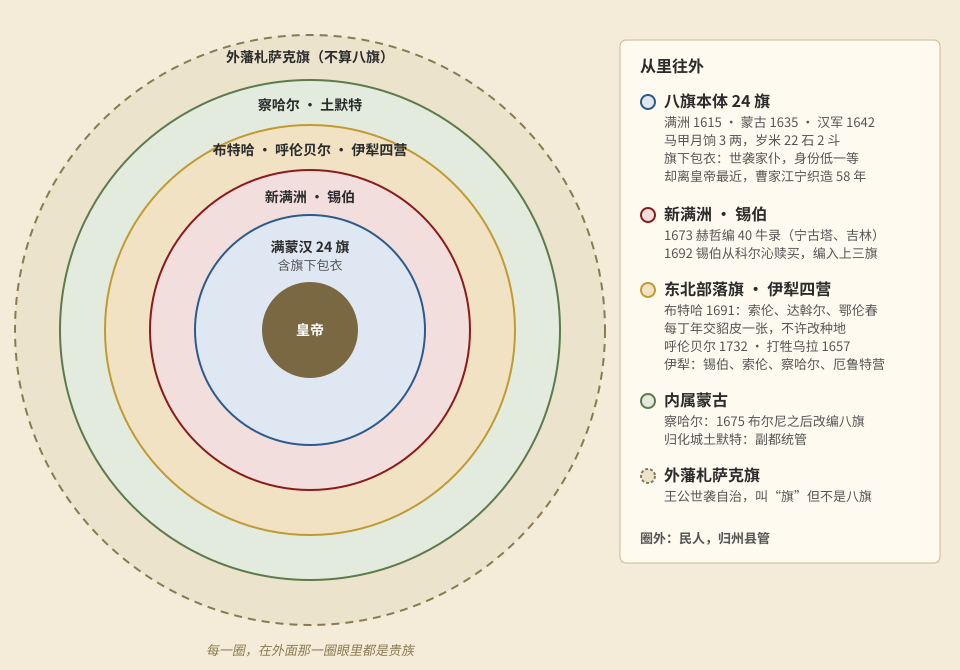

【旅行杂谈】八旗不只是满蒙汉：清代“旗”的同心圆

━━━━━━━━━━━━━━━━━━━━

◆ 从齐齐哈尔说起

━━━━━━━━━━━━━━━━━━━━

在齐齐哈尔附近转了两天，路牌上反复出现几个名字：梅里斯达斡尔族区、甘南、莫力达瓦达斡尔族自治旗。这一带是达斡尔人的地方。

327 期写黑龙江的城市，说到清前期这里的人口主要是驻防八旗、驿站人员，和本来就住在这儿的达斡尔、鄂温克、鄂伦春、赫哲等族。写完冒出几个问题：达斡尔人算不算旗人？八旗除了常说的满蒙汉 24 旗，外面还有多少组织？内蒙古的“察哈尔八旗”，跟北京那个八旗是什么关系？

查下来，先要纠正一个直觉。清代说“旗”，至少有三种意思：

一是八旗本体，满洲、蒙古、汉军各八旗，共 24 旗，皇帝直接统辖的军事和户籍组织。

二是内属旗，用八旗的编制和旗色，由朝廷派官管理，但不在 24 旗里，比如布特哈八旗、察哈尔八旗。

三是外藩札萨克旗，蒙古王公世袭管理自己的部众，朝廷只划地界、定规矩，不属于八旗。

三种都叫“旗”，离皇帝的远近不一样。把它们按远近排开，像一组同心圆。下面从里往外一圈一圈看。

━━━━━━━━━━━━━━━━━━━━

◆ 最里面一圈：24 旗本体

━━━━━━━━━━━━━━━━━━━━

满洲八旗 1615 年成型；蒙古八旗 1629 年起编，1635 年整编完成；汉军 1631 年起编，1642 年成八旗。

旗人吃钱粮。康熙年间定下的标准（《钦定户部则例》）：前锋、护军、领催月饷 4 两；马甲、匠役月饷 3 两；步甲 1.5 两。岁米马甲一级 22 石 2 斗，步甲 10 石 6 斗。

这就是俗话说的“铁杆庄稼”：按期发，旱涝不影响，终身领。

旗人分两块。一块是京旗，住北京内城，清末兵额 120,309 人，职官 6680 人。另一块是驻防八旗，分驻全国要地：顺治年间 1.5 万余人，康雍时 9 万余，清中叶 10 万余，驻防点 70 余处。将军级驻防最后有 13 个，盛京约 7000 人，西安约 6500，荆州约 5700。

旗人归八旗管，不归州县管，旗民分治。北京旗人住内城，民人住外城。不过日子并不都是好过的：研究清代旗人社会的历史学者刘小萌（写过《清代北京旗人社会》）提到，山东、山西人在内城开碓房、碾房，放贷盘剥旗人。常说旗人不许经商，可刘小萌的研究里，旗人实际上也做买卖。

────────────────────

💡 包衣：编在旗下的家仆

包衣是满语，意思是“家里的”，即世袭的家内仆从。每个旗下面都编有包衣佐领，包衣在法律上算旗人，可以做官，可以有财产，但身份比正身旗人低一等：正身旗人是皇帝的兵，包衣是主子家里的人。

内务府管的上三旗包衣伺候皇帝，下五旗包衣伺候各家王公。乾隆起，陆续把一部分汉人包衣放出旗。

身份低，离皇帝却最近。曹雪芹家是正白旗包衣，1663 年曹玺任江宁织造，此后曹家在这个位置上前后 58 年，其中曹寅一人做了 21 年，1727 年曹𫖯被抄家。对皇帝来说是家奴，对江南的人来说是一方要员。

────────────────────

同一个身份，从里往外看和从外往里看是两回事，这个现象后面每一圈都会再出现。

━━━━━━━━━━━━━━━━━━━━

◆ 第二圈：后来编进来的东北部族

━━━━━━━━━━━━━━━━━━━━

入关以后，东北还有很多部族陆续被编进旗。

新满洲，满语叫伊彻满洲。1673 年赫哲人请求内迁，编为 40 个牛录，驻宁古塔、吉林乌拉。

锡伯是另一种进法。1692 年，清廷从科尔沁蒙古手里把锡伯、卦尔察、达斡尔人“赎买”过来，编入上三旗，驻齐齐哈尔、伯都讷、吉林乌拉。

这一圈进了 24 旗的编制，领钱粮，但来源和语言跟老满洲不一样。

━━━━━━━━━━━━━━━━━━━━

◆ 第三圈：布特哈、呼伦贝尔、打牲乌拉、伊犁四营

━━━━━━━━━━━━━━━━━━━━

再往外，是只借八旗编制、不进 24 旗的组织。达斡尔人的问题，答案在这一圈。

布特哈八旗，1691 年设，归黑龙江将军管，成员是索伦（鄂温克）、达斡尔、鄂伦春。他们不吃北京旗人那样的全饷，义务是每丁每年交貂皮一张，朝廷回赏衣帽、靴鞋这些东西，叫“赏乌林”，皮子好的另给些银子；去猎场来回的开销自己出。平时打猎，战时出兵。1906 年撤。

所以达斡尔人算旗人，但大多数是布特哈这一圈的旗人，和北京吃钱粮的旗人不是一回事。一部分在 1692 年被编进上三旗，那是另一圈。

布特哈出的兵统称“索伦兵”。大小金川之役调过吉林索伦兵 2000，廓尔喀之役 1000 余人，清缅战争、白莲教之役也都有。乾隆后期已经丁壮不够，到嘉庆年间，官方文书里有了“繁殖缓慢”的说法。

最能打的这一圈，日子过得并不好。乾隆中期，呼伦贝尔冬天雪大，牲畜大批死掉，索伦人有的捕鱼，有的讨饭。朝廷派了新疆来的回人教他们种地，种了大约三年，有了收成。乾隆和大臣的反应是：索伦“向赖狩猎养蓄为生”，种了地会“从习汉俗，日久之后，忘其旧习，弃其技艺”。于是撤回教耕的人，开了的地交出来，“仍照旧习狩猎牧养”。

朝廷要的是一支能骑射的兵，不是一群吃饱了的农民。

呼伦贝尔八旗是从布特哈分出去的。1732 年从布特哈抽 3000 人移驻呼伦贝尔，编成索伦左右翼八旗，外加厄鲁特一旗；1734 年又把喀尔喀车臣汗部的巴尔虎人 2400 人编为新巴尔虎八旗；1743 年设副都统衔。

打牲乌拉总管衙门，1657 年设，在今吉林市龙潭区乌拉街，隶属内务府，专门给皇家采东珠、蜂蜜、鲟鳇鱼、松子。有 22 个采捕场、64 条采珠河，兵丁约 4276 人。1914 年才撤。

平定准噶尔以后，清朝设伊犁将军，驻惠远城。驻防兵除了满营，还有锡伯营、索伦营、察哈尔营、厄鲁特营。

锡伯营来自东北。1764 年，锡伯官兵 1020 人携家属 3275 人从盛京一带出发西迁，到达时 5050 人，路上还添了人口。

几圈的人在伊犁又被重新组合了一次：东北的锡伯、索伦，内属的察哈尔，加上投降的厄鲁特，一起守西北边境。

━━━━━━━━━━━━━━━━━━━━

◆ 第四圈：内属蒙古

━━━━━━━━━━━━━━━━━━━━

察哈尔原是蒙古大汗林丹汗的本部。1635 年，林丹汗的儿子额哲降清。1675 年布尔尼起兵反清，失败后察哈尔部被改编为八旗，迁到宣化、大同边外。从此察哈尔不再有自己的王公，由朝廷派官管，属于内属蒙古。1761 年设察哈尔都统，驻张家口。

────────────────────

💡 察哈尔八旗和大清国贵族代表的那个八旗什么关系

名字撞了，编制和旗色是借来的。

察哈尔八旗也分正黄、镶黄、正白、镶白、正红、镶红、正蓝、镶蓝，但它不是京城 24 旗里的蒙古八旗，而是单独编的一套，直属朝廷，属于内属旗。

今天内蒙古锡林郭勒盟有正蓝旗、镶黄旗、正镶白旗，这些地名大致来自察哈尔八旗。

所以在锡林郭勒看到“正蓝旗”，它和北京内城的正蓝旗共用一个名字，不是同一个组织。

────────────────────

同一圈的还有归化城土默特，也是内属旗，由副都统管理，隶属绥远城将军。1756 年从中分出札萨克旗，1760 年又撤了，内属和札萨克两种形式在这里来回换过。

━━━━━━━━━━━━━━━━━━━━

◆ 最外一圈：外藩札萨克旗

━━━━━━━━━━━━━━━━━━━━

再往外是外藩蒙古。每旗设一名札萨克当旗长，由蒙古王公世袭，承袭要报皇帝批准；各旗定期会盟，归理藩院管。它们叫“旗”，但不算八旗。

────────────────────

💡 内属还是外藩：看谁当旗长

内属蒙古和外藩蒙古，区别在旗长是谁。内属旗的旗长是朝廷派的官，叫总管、都统、副都统，可以撤换，旗里没有世袭的王公，直接归当地的将军或都统管。外藩札萨克旗的旗长是蒙古王公自己，世袭，保留爵位，各旗会盟，理藩院只是监管。外藩是“你的地盘你自己管，我来监督”；内属是“人还在，管事的换成了我的人”。

所以内属离皇帝更近，地位却不见得更高。察哈尔是因为布尔尼起兵，王公被取消，才成了内属，这是惩罚。土默特 1756 年分出过一个札萨克旗，1760 年札萨克被革职，那个旗又撤了。

外藩又分两块。内札萨克共二十四部、四十九旗，编成哲里木、卓索图、昭乌达、锡林郭勒、乌兰察布、伊克昭六个盟，大体就是今天内蒙古的前身。外札萨克的核心是漠北的喀尔喀四部，土谢图汗、车臣汗、札萨克图汗、赛音诺颜，到乾隆年间定为八十六旗，地域大致相当于今天的蒙古国；青海、阿拉善、科布多等地的蒙古各旗也算在外札萨克里。

“外藩”的“外”，是八旗系统之外的意思，跟内蒙古、外蒙古的“内外”不是一回事。北京人熟悉的内蒙古，在清代大部分也是外藩。

────────────────────

比如哲里木盟，以科尔沁为主，四部十旗，1999 年撤盟改成了通辽市。科尔沁是最早跟后金结盟的蒙古部落，孝庄就出自科尔沁，她和姑姑哲哲、姐姐海兰珠先后嫁给了皇太极。离皇帝最亲的外戚，在制度上反倒排在最外一圈。

━━━━━━━━━━━━━━━━━━━━

◆ 后来

━━━━━━━━━━━━━━━━━━━━

清朝结束后，“旗”这把尺子不再算数，人按语言和认同重新分类。同心圆被换成了另一把刀，切法完全不一样。

先是一段藏起来的日子。辛亥革命到 1924 年溥仪出宫，北京旗人失了钱粮，失学失业，很多人改汉姓、不提自己是旗人，这种状态一直延续到 1949 年。

1950 年代民族识别，满族的认定原则很宽：满洲、蒙古、汉军旗人的后代，自报满族的都认。所以第一圈 24 旗，连同旗下包衣，后代大多成了满族；汉军旗人里也有一部分当时填了汉族，后来没改。常说“汉军八旗也是满族”，就是这么来的：不是血统上变成了满人，是“旗人”这个身份在民族识别里被整体折算成了满族。

越往外，分得越开。

第二圈：锡伯成了锡伯族，2020 年 19 万多人。东北的锡伯人很多一度报成满族、汉族，1980 年代陆续改回锡伯族，核对时看家里供不供“喜利妈妈”、有没有家谱。赫哲人内迁编旗的那部分大多融进了满族，留在三江下游、没编旗的那部分，就是今天的赫哲族，在同江、饶河、抚远，2020 年 5373 人。

第三圈：布特哈的三支，各自成了一个民族。达斡尔族 1956 年 4 月确认，不归入蒙古族，2020 年 13 万多人。索伦成了鄂温克族：1958 年内蒙古把“索伦、通古斯、雅库特”三个叫法统一改称鄂温克，2020 年 3.4 万多人。鄂伦春族 2020 年 9168 人。呼伦贝尔的巴尔虎人成了蒙古族，今天的陈巴尔虎旗、新巴尔虎左右旗，“陈”就是 1732 年先来的，“新”是 1734 年后来的。打牲乌拉的后代是满族，1984 年那里成立了乌拉街满族乡。

伊犁那几营最乱。锡伯营是锡伯族；索伦营因为 1798 年、1834 年两次从锡伯营抽人补进去，到清末锡伯人已占多数，后代今天分属锡伯、达斡尔、鄂温克三族。新疆塔城的达斡尔族，就是 1763 年从布特哈调去的那一千来名官兵的后人，民国时还被叫作“索伦”，1953 年恢复达斡尔族名。

第四圈：察哈尔、土默特都是蒙古族。土默特人离汉地最近，1719 年还完全不懂汉语，道光年间普遍说蒙语，到 1949 年前后基本不会蒙古语了，民族身份留着，语言换掉了。

满族人口后来还有一个变化：1953 年 240 万，1964 年 270 万，1982 年 430 万，1990 年 985 万。1982 到 1990 年八年翻了一倍多，不是生出来的。1981 年国家出了恢复和改正民族成分的通知，很多人把民族改回了满族。2020 年约 1042 万。

当年不让进满洲那一圈的，民国时没人敢说自己在旗；再到八十年代，又有几百万人把身份改了回去。

━━━━━━━━━━━━━━━━━━━━

◆ 一张表

━━━━━━━━━━━━━━━━━━━━

| 圈层 | 组织 | 年份 | 一句话 | 今天的民族 |
|---|---|---|---|---|
| 本体 | 满洲八旗 | 1615 | 马甲月饷 3 两，岁米 22 石 2 斗 | 满族 |
| 本体 | 蒙古八旗、汉军八旗 | 1635、1642 | 京旗加 70 余处驻防 | 多数满族 |
| 本体 | 包衣（旗下） | 世袭 | 编在旗下的家仆，身份低于正身旗人，曹家任江宁织造 58 年 | 满族 |
| 后编 | 新满洲 | 1673 | 赫哲内迁，编 40 牛录 | 多数满族，留在原地的成了赫哲族 |
| 后编 | 锡伯等编入上三旗 | 1692 | 从科尔沁赎买 | 锡伯族 |
| 打牲 | 布特哈八旗 | 1691 | 每丁貂皮一张，不吃全饷，出索伦兵，不许改种地 | 达斡尔族、鄂温克族、鄂伦春族 |
| 打牲 | 打牲乌拉 | 1657 | 隶内务府，采东珠 | 满族 |
| 移驻 | 呼伦贝尔八旗 | 1732、1734 | 索伦左右翼、新巴尔虎 | 鄂温克族、达斡尔族、蒙古族（巴尔虎） |
| 西迁 | 伊犁四营 | 1764 | 锡伯 1020 官兵加 3275 家属西迁 | 锡伯族、达斡尔族、鄂温克族、蒙古族 |
| 内属 | 察哈尔八旗 | 1675 | 林丹汗旧部，改编内属 | 蒙古族 |
| 最外 | 外藩札萨克旗 | 清代 | 王公世袭，不算八旗 | 蒙古族 |

━━━━━━━━━━━━━━━━━━━━

◆ 从外面往里看

━━━━━━━━━━━━━━━━━━━━

排完这张表，我的感觉是：每一圈在外面那一圈眼里，都是贵族。

宗室王公看旗人，旗人是兵户，当差吃粮，没什么了不起。民人看旗人，旗人吃“铁杆庄稼”，按月领银子，不看年成，就是贵族。

今天也差不多。普通人看体制内，哪怕是最基层的编制工，也是贵族；考上了，还会有人眼红，写信举报。体制内的人自己看自己，可能只觉得是个上班的。

布特哈的达斡尔人交貂皮、不吃全饷，在北京旗人眼里大概不算什么；但在没有旗籍的人眼里，他也是“旗上的”。

还有一个我惯用的看法：清朝把人分进一个个不同的赛道，包衣、京旗、驻防、布特哈、内属、札萨克，各有各的规矩和待遇，不公平发生在赛道之间，每一圈眼里只有紧挨着的那一圈，谁也凑不成一个整体。

汉军旗人也不是一直“像汉人”。在齐齐哈尔博物馆，展板上有一位寿山将军，介绍里说他是袁崇焕的后人。

────────────────────

💡 寿山：袁崇焕的七世孙，大清的黑龙江将军

据《清史稿》：袁崇焕死后，家人流寓河南汝宁，后人袁文弼从军有功，编入宁古塔汉军，“五传至富明阿”。富明阿做到吉林将军，他的儿子就是寿山，汉军正白旗，黑龙江驻防。按这个世系，寿山是袁崇焕的七世孙。

父亲叫富明阿，儿子叫寿山，姓“袁”已经不出现了。旗人的习惯是称名不举姓，汉军旗人跟着满俗走，越早入旗走得越远。再往下还有“随名姓”：拿父辈名字的头一个字当后代的姓，裕庚的女儿就叫裕德龄、裕容龄。照这个规矩，大清要是不亡，寿山的儿孙多半就姓“寿”了。清亡以后，这一家又改回了袁姓。

1900 年俄军逼近齐齐哈尔，寿山穿戴好衣冠，吞金，躺进棺材，没死；叫部下开枪，打了几次才断气。他的弟弟永山，早在甲午年就战死在凤凰城下。袁崇焕 1630 年死在崇祯手里，二百七十年后，他的七世孙作为大清的黑龙江将军，死在俄国人面前。

────────────────────

把这一圈一圈排完，再回头看“满汉矛盾”这个说法，就对不上了。汉军八旗是汉人，却在旗里，吃钱粮；关内的汉人是民人，归州县管，纳粮当差。达斡尔、锡伯、索伦不是满洲，也在旗里。真正划开两边的，不是满还是汉，是在旗还是不在旗：一边有旗籍、吃“铁杆庄稼”，一边没有。1950 年代民族识别，旗人的后代自报满族就认，又一次说明“满族”这个身份，很大程度上是“旗人”换了个名字。

所以满人和汉人，从来都不是民族矛盾，而是阶级矛盾。

━━━━━━━━━━━━━━━━━━━━

划开两边的不是满还是汉，是在旗还是不在旗。

清代的“旗”至少三种：八旗本体、内属旗、外藩札萨克旗。

同心圆里每一圈，在外面那一圈眼里都是贵族。

━━━━━━━━━━━━━━━━━━━━

// 靳岩岩的 AI 学习笔记 × Claude 的文笔 × GPT 的严谨 × Gemini 的浪漫
// 2026年10月4日

━━━━━━━━━━━━━━━━━━━━

【摘要（发布用，不进正文）】

在齐齐哈尔见到达斡尔人的地方，追问八旗外面还有多少组织。包衣、24 旗、新满洲、布特哈、察哈尔、伊犁四营、札萨克旗，清代的“旗”是一组同心圆，每一圈在外面一圈眼里都是贵族。
