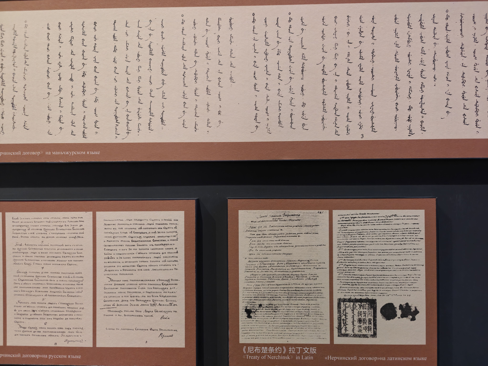

【旅行杂谈】爱辉和瑷珲：中俄往事

━━━━━━━━━━━━━━━━━━━━

◆ 同一个地方，两种写法

━━━━━━━━━━━━━━━━━━━━

10 月 3 日晚上到了黑河，住三晚。10 月 4 日在黑河城里和瑷珲镇转了一天，10 月 5 日过江，去对岸的布拉戈维申斯克一日游。

到了一看地图，有点意思。黑河市只有一个市辖区，叫“爱辉区”，“爱”是爱情的爱。从市区往南三十多公里，有个镇叫“瑷珲镇”，“瑷”带王字旁，“珲”也带王字旁。

两个名字说的是同一个地方。区用简单的写法，镇用复杂的写法。一个地级市里，同一个地名两套字，各管一摊。

这事要从名字本身说起。

━━━━━━━━━━━━━━━━━━━━

◆ 名字从哪来

━━━━━━━━━━━━━━━━━━━━

“瑷珲”是音译，原词是什么，有几种说法。

一说来自满语 aihūn，意思是“母貂”。一说来自蒙古语，意思是“可畏的武士”。还有一说是从汉字字面上讲，“瑷”和“珲”都是美玉。几种说法并存，没有定论。

能确定的是年份。1683 年，清朝设黑龙江将军，萨布素在黑龙江左岸（北岸）一处达斡尔人的屯落筑城，这是瑷珲旧城。1684 年，又在右岸（南岸）筑了新城，次年将军衙门迁入。黑龙江将军最早就驻在这里，1690 年移到墨尔根，1699 年再移到齐齐哈尔。墨尔根就是今天的嫩江市，和瑷珲一样归黑河管：将军衙门搬家的三站，有两站在今天黑河的地界上。

327 期讲黑龙江的城市怎么来的，把瑷珲算作“第一拨边防城”；将军最后落脚的齐齐哈尔，326 期 https://mp.weixin.qq.com/s/LKLotO22kp9gZosu_Wkmjg 写过。瑷珲这座右岸新城一直用到 1900 年。

━━━━━━━━━━━━━━━━━━━━

◆ 怎么改的

━━━━━━━━━━━━━━━━━━━━

改字发生在 1956 年。

那一年 12 月，瑷珲县改为爱辉县。当时正是中苏关系的蜜月期，同时也是简化字的浪潮。

同一时期改掉的生僻字地名不止这一个：黑龙江的铁骊县，1956 年 11 月 19 日改为铁力县；新疆的和阗，1959 年改为和田。“骊”改“力”，“阗”改“田”，“瑷珲”改“爱辉”，都是把难写难认的字换成同音的常用字。

之后，名字跟着行政区划一层层往下走。

1958 年，当地成立爱辉人民公社，后来改为爱辉镇。爱辉县 1983 年并入县级黑河市。1993 年 2 月 8 日黑河撤地设市，原来的县级黑河市改设爱辉区，是黑河唯一的市辖区。

2009 年，当地申请把爱辉区改名为瑷珲区，没有获得国务院批准。

2015 年 5 月 18 日，黑龙江省政府批准爱辉镇恢复原名瑷珲镇。官方给的理由，一是“让世人永铭惨痛历史”，二是配合瑷珲古城的旅游开发。

所以就成了现在这个样子：区叫爱辉，没改回来；镇叫瑷珲，改回来了。

官方理由里那句“惨痛历史”，指的是两件事，一件在 1858 年，一件在 1900 年。不过在 1858 年之前，中俄已经打了一百七十年交道，那一百七十年的样子，和后来很不一样。

━━━━━━━━━━━━━━━━━━━━

◆ 1689 到 1858：满洲皇帝眼里的俄国

━━━━━━━━━━━━━━━━━━━━

1689 年，中俄签《尼布楚条约》。清方代表是索额图、佟国纲，俄方是戈洛文。清方的翻译是两个耶稣会士，徐日升和张诚，谈判用的是拉丁语。**条约以拉丁文本为准**，另有满文本和俄文本；此后近两百年，这份条约都没有正式的汉文本。大清和欧洲国家签的第一份条约，正式文本里没有一个汉字。

10 月 4 日在瑷珲镇的历史陈列馆里，正好看到这三种文本挂在一起：满文的长长一整幅挂在上面，俄文本和拉丁文本两幅小一些，摆在下面。密密麻麻三种文字，就是没有汉字。

和俄国打交道的衙门也不是礼部。礼部管朝鲜、琉球这些朝贡国，俄国事务归理藩院，就是管蒙古、西藏的那个衙门。俄国不在朝贡国名单里。按近代国际关系的标准回头看，两国当时也算平等关系——《天朝的崩溃》里就提过，中俄条约里的逃人条款，类似今天通行的罪犯引渡条约。

这一百七十年里，清朝对俄国并不陌生：

1708 年设俄罗斯文馆，让八旗子弟学俄语。

1712 年，图理琛奉命出使伏尔加河边的土尔扈特部，穿过俄属西伯利亚，往返三年，回来写了《异域录》。这本书后来在欧洲很受关注。

1727 年签《恰克图条约》，之后在恰克图开了互市。乾隆朝几次关闭恰克图互市，拿断贸易给俄国施压，最长一次关到 1792 年订了市约才重开。

还有一件更出乎意料的事。雍正朝先后派了两个使团访俄，1731 年到莫斯科，1732 年到圣彼得堡，都向俄国的安娜女皇行了跪拜礼。当时清朝正要对准噶尔用兵，请俄国保持中立。清朝使臣向外国君主下跪，这是极少见的。

这和我们印象里“闭关锁国、天朝上国”的满洲皇帝不太一样。那一代满洲朝廷跟外面打交道，用的是拉丁语、满语，知道俄国是个什么样的国家，该谈就谈，该跪也跪。

────────────────────

💡 西学是怎么丢的

康熙学过几何。1689 年前后，传教士白晋、张诚用满语给他讲《几何原本》，讲稿整理成满文和汉文。1708 到 1718 年，用西法实测全国，画了《皇舆全览图》。1713 年在畅春园设蒙养斋算学馆，编了《数理精蕴》等一批书。

排斥西学的声音也一直在，而且来自汉人士大夫。1664 年，杨光先参劾汤若望，留下一句话：“宁可使中夏无好历法，不可使中夏有西洋人。”研究清代科学史的韩琦认为，康熙恰恰是把西学抓在自己手里，当作压汉人的本事，他说过 **“汉人于算法一字不知”**。

之后的节点是：1721 年，康熙对罗马教廷的禁约批了一句“禁止可也，免得多事”；1724 年，雍正全国禁教；乾隆朝，官员满语退化到乾隆要反复下谕训斥，他一边修圆明园西洋楼、收藏西洋钟表当玩物，一边在 1793 年给英国国王写“天朝物产丰盈，无所不有”；1838 年，最后一位在清廷供职的西洋传教士毕学源死在北京。

整个康雍乾时代以至于后来的嘉庆道光咸丰时代，汉人士大夫排斥西洋科学，从杨光先到后来，是一以贯之的。变的是满洲皇帝。康熙那一代拿西学压汉人，越往后，皇帝越汉化，倾向也越来越偏到汉人士大夫那一边，西学就这么跟着丢了。

────────────────────

到 1858 年，坐在瑷珲谈判桌前的，已经不是用拉丁语谈尼布楚的那一代人了。

━━━━━━━━━━━━━━━━━━━━

◆ 1858 年：瑷珲条约

━━━━━━━━━━━━━━━━━━━━

1858 年，英法联军攻陷大沽炮台。第三天，穆拉维约夫带着炮舰到了瑷珲，打着“帮中国防英国”的旗号要求签约。5 月 28 日，黑龙江将军奕山和穆拉维约夫签了《瑷珲条约》。

条约的内容：黑龙江以北约 60 万平方公里的土地划归俄国；乌苏里江以东的土地，由中俄两国共管。

这个条约清廷起初没有批准，还惩处了签约的奕山。但两年后，1860 年的中俄《北京条约》，把《瑷珲条约》确认了下来，而且原先“共管”的乌苏里江以东，也一并划给了俄国。

从那以后，瑷珲城对面的左岸就成了俄国的地方。1683 年筑的瑷珲旧城在北岸，这块原址也在界外了。

一个条约用了一座城的名字。这座城的名字从此不只是个地名。

━━━━━━━━━━━━━━━━━━━━

◆ 1900 年：海兰泡和江东六十四屯

━━━━━━━━━━━━━━━━━━━━

第二件事在四十二年后。

1900 年，庚子年。7 月 16 日到 21 日，俄国在对岸的海兰泡，就是今天的布拉戈维申斯克，驱赶、屠杀城里的华人，约 6000 人遇害。

同一时间，俄军对江东六十四屯下手。江东六十四屯在黑龙江左岸、结雅河以南，屯子里住的是中国人。俄军屠杀了约 2000 人，幸存的只有六七十人。之后这一片被俄国占据，同年 8 月俄方宣布其为“外结雅地区”，今天在俄罗斯阿穆尔州境内。

这两件事的味道不太一样。海兰泡的华人是在俄国城里讨生活的商贩和苦力，那种惨案后来也见过——1998 年 5 月印尼排华暴动就是这个路数：寄居的少数族裔，局势一乱先遭殃。六十四屯的人不是出了国，是国界线从头顶上跨过去了——条约里白纸黑字写着“永远居住”，四十二年后被签条约的国家自己撕了。

接着俄军越过黑龙江，打到右岸，攻占并焚毁了瑷珲城。从 1685 年用到 1900 年的这座将军城，烧完之后，据记载城里“只剩一棵松树”。

瑷珲城没了，城市的位置往北挪了三十多公里，挪到了海兰泡对面。那里原来有大黑河屯、小黑河屯两个屯子，后来发展成商埠。1909 年设黑河府，同一年，原地设瑷珲直隶厅。

黑河这座城，是接瑷珲的班长起来的。327 期那张表里，黑河的成形年份写的是“1900 年后”，就是这个原因。

━━━━━━━━━━━━━━━━━━━━

◆ 对岸那座城

━━━━━━━━━━━━━━━━━━━━

10 月 5 日要去的，就是江对面这座城。

────────────────────

💡 布拉戈维申斯克和海兰泡

布拉戈维申斯克 1856 年 6 月建城，比《瑷珲条约》还早两年。俄文名字的意思是“圣母领报”，也就是“报喜”。1858 年签约前夕，俄国人在这里奠基了报喜教堂，城名由此而来。

中国这边叫它“海兰泡”。名字来历有两说：一说来自满语“海兰包”，意思是榆树屯；一说来自蒙古语“哈喇淖尔”，意思是黑色的水泡子。

两座城隔着黑龙江，江面宽约 550 米。跨江的公路大桥 2019 年建成，2022 年 6 月 10 日才正式通车。

布拉戈维申斯克在俄罗斯阿穆尔州，2021 年人口约 22.6 万。

────────────────────

一座城的俄文名字记的是“报喜”，它对面那座中国城的镇名改回来，记的是“惨痛历史”。名字都跟 1858 年那个条约连着。

━━━━━━━━━━━━━━━━━━━━

◆ 两套字

━━━━━━━━━━━━━━━━━━━━

回头看这两个写法。1956 年改成爱辉，理由是字太难认，这是当年全国统一的做法，跟铁力、和田是一批。2015 年镇改回瑷珲，理由是要记住历史。区到现在还叫爱辉。

两套字放在一个市里，各有各的年份。

晚上在黑河市区逛夜市，满耳朵都是俄语。现在中俄互免签证，对岸的人过江来吃烧烤、买东西，跟串门一样，夜市上目测三成是俄国人。一百二十五年前也是这条江，江这边的人被赶进江里。

10 月 4 日去了瑷珲镇，10 月 5 日过江。

━━━━━━━━━━━━━━━━━━━━

1956 年因为字生僻改成爱辉，2015 年为了记住历史，镇改回了瑷珲。

1858 年一个条约用了这座城的名字，1900 年这座城被烧得只剩一棵松树。

黑河接了瑷珲的班，对岸的海兰泡叫布拉戈维申斯克，意思是报喜。

━━━━━━━━━━━━━━━━━━━━

// 靳岩岩的 AI 学习笔记 × Kimi 的文笔 × GPT 的严谨 × Gemini 的浪漫
// 2026年10月5日

━━━━━━━━━━━━━━━━━━━━

【摘要（发布用，不进正文）】

黑河有个爱辉区，往南三十多公里有个瑷珲镇。1956 年因字生僻改成爱辉，2015 年镇恢复瑷珲。这两个字背后是 1858 年的《瑷珲条约》和 1900 年的海兰泡、江东六十四屯，以及被焚的瑷珲城。
