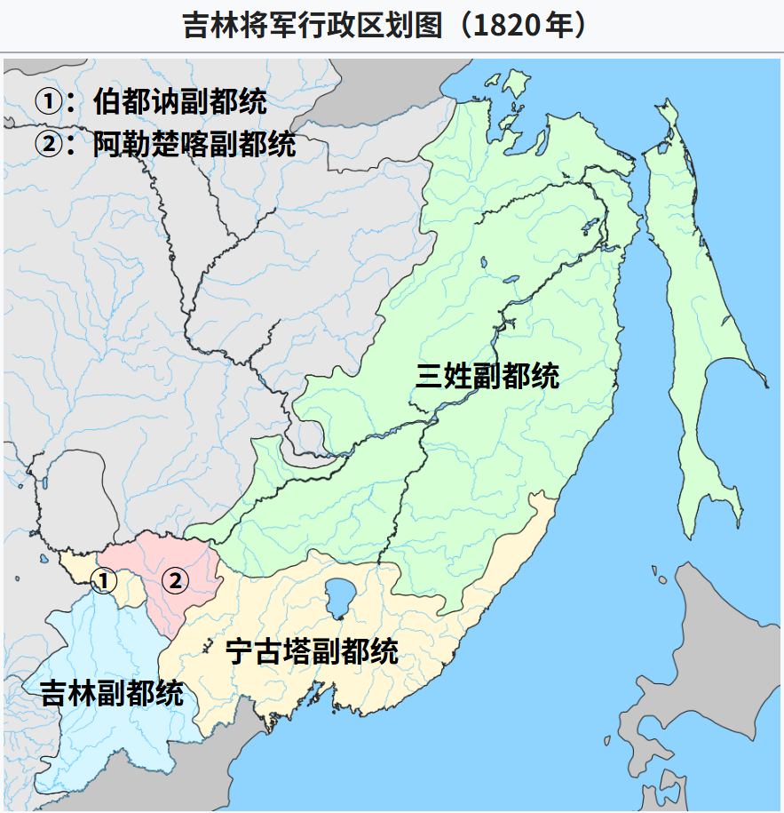
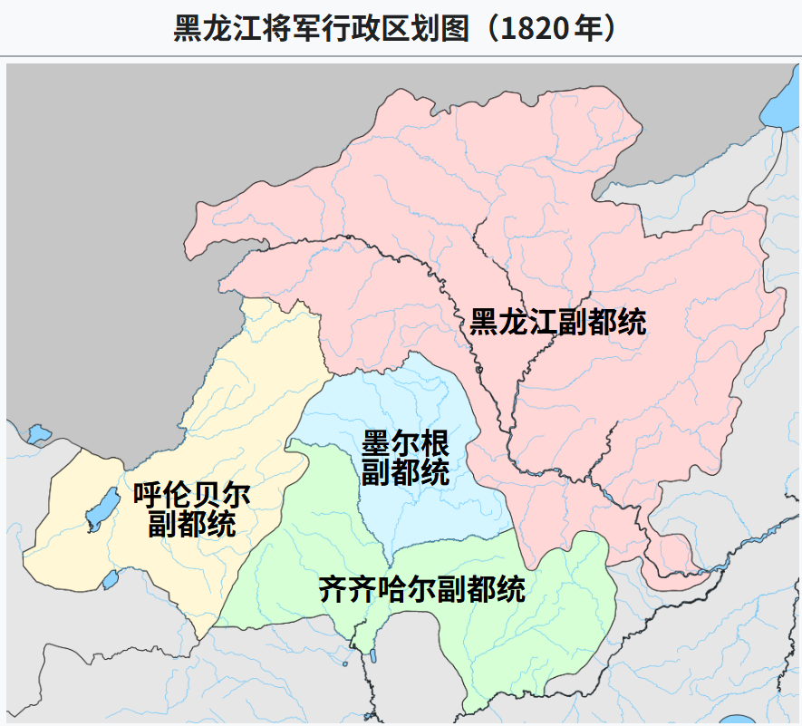
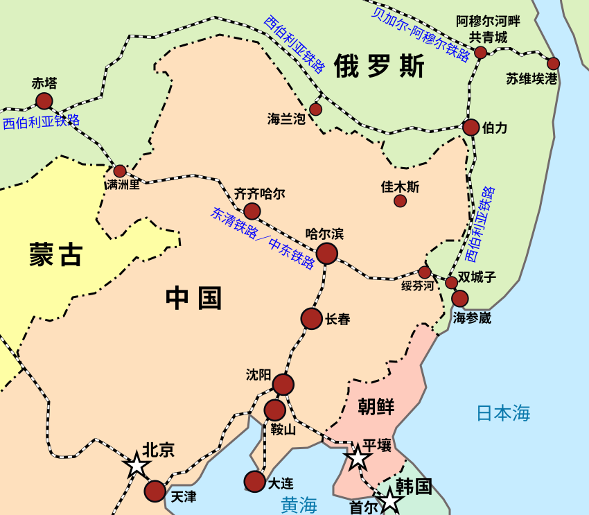

【旅行杂谈】宁古塔在哪：一个背得出、说不清的地方

━━━━━━━━━━━━━━━━━━━━

◆ 先回答：黑龙江省牡丹江市，宁安市

━━━━━━━━━━━━━━━━━━━━

10 月 7 日晚上到牡丹江，楼下就是步行街夜市，人挤人，烧烤摊一路排出去，这个城市的生活气息肉眼可见。

明天的计划：上午牡丹江博物馆，然后往南去宁古塔将军的衙门，再往南是渤海国上京遗址。

出这道题之前，先自问自答一下：宁古塔在哪？

**“发配宁古塔”这五个字，全国人民都会背——清宫剧里皇上一怒，大臣全家就上路了。但宁古塔具体在哪，九成九的人说不清。** 答案是：黑龙江省牡丹江市宁安市，市区往南三十多公里。

顺便破除一个望文生义：宁古塔没有塔。清初流放到这儿的文人记录过，满语里“宁古”是六，“塔”是个，合起来是“六个”——相传有六兄弟曾住在这儿。没塔，从来没有过。

────────────────────

💡 宁古塔怎么还有新城和旧城？

全国读者可能分不清海林和宁安，反正都在今天的牡丹江地界里。但在历史上，宁古塔确实搬过一次家：

顺治十年（1653 年）刚设昂邦章京时，城在海林的长汀镇古城村（挨着牡丹江支流海浪河），叫旧城。为什么后来搬了？因为海浪河是山溪性河流，一到夏秋暴雨连绵，河水猛涨，常常把城墙泡塌，衙门和营房全泡在泥水里，当兵的和老百姓出门得划木筏；再加上支流水运吞吐有限，康熙五年（1666 年）清廷顺着水路把城往南迁到了牡丹江干流的开阔台地上（也就是今天的宁安市区），叫新城。

最出名的流人吴兆骞，就是先在海林旧城住了 7 年水淹日子，又跟着大迁徙到宁安新城住了十几年。

────────────────────

不管新城还是旧城，都在牡丹江边上。搞清了地理坐标，接下来就是真正反直觉的一幕：它的行政归属。

━━━━━━━━━━━━━━━━━━━━

◆ 它不是黑龙江的，是吉林的起点

━━━━━━━━━━━━━━━━━━━━

今天宁安归黑龙江管，但在清代，这片地方不但不属于“黑龙江”，反而是“吉林”的发源地。

1653 年，清廷在这儿设宁古塔昂邦章京；1662 年改称宁古塔将军——注意，比黑龙江将军（1683 年设）早了二十多年。**黑龙江将军的辖区，就是从宁古塔将军辖区里析出来的。** 1676 年将军衙门搬去吉林乌拉，宁古塔留下副都统镇守——改名“吉林将军”更是 1757 年的事了。

水系也作证：牡丹江这条河，发源于吉林省敦化的长白山，向北流过镜泊湖、宁安、牡丹江市区，最后在依兰汇入松花江。**宁安是地地道道的松花江水系，跟吉林是一个盆里的事。** 清代两个将军辖区，大致就以松花江干流为界。

所以一句话：**宁古塔不是黑龙江的一部分，是吉林的起点——连黑龙江都是从它身上分出来的。**

━━━━━━━━━━━━━━━━━━━━

◆ 古代的高速公路是河

━━━━━━━━━━━━━━━━━━━━

为什么辖区要跟着水系走？因为**古代的长途运输，只有水路算得过来**。

陆路运粮运兵，几十里就是极限，翻山更是天价；一条船顺流而下，顶几十辆大车。所以东北的军政格局，本质上是水运网络的格局：谁的船能开到哪，将军的衙门就管到哪。

吉林这座城本身就是注脚。“吉林乌拉”，满语的意思是“沿江的城”——它还有个大名鼎鼎的别称：**船厂**。清初在这里设厂造战船，1685 年雅克萨之战，清军的水师就是从吉林船厂出发，顺松花江入黑龙江，再溯江而上开到雅克萨城下的。打仗打到哪，船就开到哪。

宁古塔本身也是这条线上的前线：首任昂邦章京沙尔虎达，1650 年代就带着宁古塔的兵船在松花江、黑龙江一带和沙俄交手。1658 年松花江口一战，沙尔虎达率水师歼灭俄国哥萨克首领斯捷潘诺夫的船队，斯捷潘诺夫葬身鱼腹；次年沙尔虎达在宁古塔病逝，长子巴海接任。**“发配宁古塔”是后来的面貌，起初它是清廷对抗沙俄东侵的最前沿堡垒。**

所以回头看这条分界就顺了：宁古塔—牡丹江—依兰—松花江—吉林，是一条完整的水路走廊，货、兵、公文都走它，这一片归吉林将军；齐齐哈尔—嫩江—黑龙江是另一条走廊，归黑龙江将军。两条水系最后在同江汇合，松花江是黑龙江的支流——两个航道网络各走各的，衙门也就各管各的。

━━━━━━━━━━━━━━━━━━━━

◆ “与披甲人为奴”：荒诞与文明的倒灌

━━━━━━━━━━━━━━━━━━━━

再说“发配”这件事本身。

清廷判词里最让人头皮发麻的一句，叫“发配宁古塔，与披甲人为奴”。

**这群“披甲人”到底是谁？** 影视剧里把它演得像阎罗殿里的恶鬼，其实他们是八旗里的降卒守军，地位比满洲正身旗丁低一截，只比家奴（阿哈）高一级。满清入关时兵力不足，把投降归顺的各族丁口编入边防军，发给盔甲器械，叫“披甲人”；东北的披甲人多是达斡尔、鄂伦春、锡伯这些部族出身，据传还有被俘的朝鲜人。他们平时耕种、打猎、捕鱼，战时披甲卖命。

朝廷把江南科场案的举人、进士、翰林千里迢迢押送过来，判给边疆不识字的降卒当奴隶，用心极其阴毒——不仅要剥夺你的自由，还要用极致的文化倒挂来践踏你的尊严。

但到了现实里，剧本往往全乱了。

最出名的流人是吴兆骞。1657 年丁酉江南科场案，他卷入其中，复查明明没有舞弊，1658 年照样被顺治定罪，1659 年七月走到宁古塔旧城（在今海林），1666 年又跟着官署迁到宁安新城，前后一住二十多年。

你以为他真的去给披甲人劈柴挑水当牛做马？

现实是：那些常年在白山黑水里摸爬滚打的粗豪军士，骤然在家里分到一个大名鼎鼎的江南文豪，谁敢真当下人使唤？吴兆骞会算账、能看懂官府文书、会写诉状、能教娃娃认字。在文盲率奇高的极寒边境，顶级知识分子本身就是极度稀缺的资源。

不仅披甲人供着他，连宁古塔的大当家——继任将军巴海，也慕名把他请进帅府，聘为首席幕宾，不仅替将军掌管机要文书，还担任塾师教巴海的两个儿子额生和尹生读书。

吴兆骞在宁古塔甚至过上了正常的家庭生活：顺治十八年（1661 年），他的结发妻子葛采真带着家眷仆人，千里迢迢从苏州一路赶到宁古塔寻夫团聚。在这片关外雪原上，他们生下了儿子吴桭臣，小名“苏还”（取“苏武还乡”、早还苏州之意）——日后正是吴桭臣写出了著名的《宁古塔纪略》，记录下那个时代东北最详实的风土人情。

后来朋友顾贞观写了两首泣血的《金缕曲》求纳兰性德搭救，纳兰明珠父子和江南文人凑巨款纳赎，1681 年吴兆骞才被赦免回京。

不仅吴兆骞，其他流人也是如此：方拱乾在这里写出了《绝域纪略》，成了黑龙江第一部地方志书；张缙彦写出了《宁古塔山水记》，1665 年还在宁古塔发起成立了“七子诗会”——黑龙江历史上第一个文人诗社，副都统和各级军官纷纷前来求诗求字。

**这不是说流放不苦。** 关内人走到这里，零下四十度的酷寒，长达半年的严冬封冻，路上走一两年、死在半道的尸骨枕藉，吴兆骞在家信里写“塞外绝无草木，白头人到此，唯有啼哭”——这些血泪全是真的。

但只要熬到了地头，**文明的重力场就会在蛮荒的边疆发生一次倒灌**：流放是残忍的刑罚，但客观上，这批人把诗书礼乐生生背到了这片连驿站都刚刚修通的黑土地上。东北东部的文化史，有一半是这群流人在风雪中写就的。

━━━━━━━━━━━━━━━━━━━━

◆ 从水路到铁路：“黄花甸子”的逆袭

━━━━━━━━━━━━━━━━━━━━

看明白水路和流人，再看眼前的城市格局，就引出了另一个反直觉的问题：

**既然宁古塔做了三百年的区域中心，为什么今天宁安反而成了牡丹江市代管的县级市？**

这又是技术演进对地缘格局的降维打击—— **水路退场，铁路登场**。

宁古塔（宁安）靠着牡丹江水路风光了几百年，但水路有个致命短板：一年里有四五个月是封冻期。

1901 年，沙俄修筑中东铁路东线（滨绥线）。铁路不一定沿着老城走，工程师挑了地势更平坦的江段跨江，在牡丹江沿岸一片夏天开满野黄花的江滩荒原上建了一座小车站。那片荒甸子，当地人管它叫“黄花甸子”或者“黄花站”，车站定名为“牡丹江站”。

当时谁也想不到，这个荒滩小站会把身旁的千年重镇整个翻过来。

铁路是全天候的。1933 年，为了掠夺东满的煤铁木材和构建进攻苏联的军事基地，图佳铁路（图们到佳木斯）动工，1937 年全线通车，正好在中东铁路东线的牡丹江站十字相交！

两条大动脉一咬合，黄花甸子瞬间成了东北东部最大的铁路枢纽和工业心脏。1937 年，伪满设立牡丹江省、年底建牡丹江市，全力打造所谓的“国防要塞”；而偏安一隅的老宁古塔（1913 年已改称宁安县），在铁路网络上被甩到了一条支线上。

新中国成立后，牡丹江顺理成章承接了工业化和铁路红利，定型为地级市；1993 年宁安撤县设市，如今由牡丹江市代管。

**三百年前，水路选中了宁古塔；三百年后，铁路选中了牡丹江。** 地理没有变，河流没有变，变的是人类征服距离的技术工具。

━━━━━━━━━━━━━━━━━━━━

◆ 省界定型：为什么黑吉边界长成这样

━━━━━━━━━━━━━━━━━━━━

最后说回省界。

1907 年清廷在东北“改流归治”，废除将军制，改设行省。宁古塔副都统辖区随吉林将军一起变成了新设的吉林行省——没错，**清末民初的吉林省，管着今天的牡丹江、宁安、依兰、密山**，大半个黑龙江东部当年都在吉林省肚子里。

之后的几十年，省界如走马灯：伪满时期为了便于统制和防苏，把东北细分成十几个小省，牡丹江一带先后归过滨江省、牡丹江省、东安省，全是沿铁路切出来的单元。光复之后更热闹：绥宁省、牡丹江专区、牡丹江省、松江省，三四年换了三四次牌子。

真正的大结局发生在 **1954 年 6 月 19 日**：中央决定撤销松江省，并入黑龙江省，哈尔滨、牡丹江、佳木斯一并归入——今天的黑龙江省版图，正是那天定型的。

来牡丹江之前，我一直以为现在的黑吉分野来自南满北满那条日俄势力线。真正查下来才明白：

**线的位置，不在那儿。** 日俄那条势力线在长春宽城子，深处吉林腹地，根本不是省界。今天这条黑吉省界，底子是清代吉林将军与黑龙江将军划江而治的古老分界，收尾于 1954 年松江省并入黑龙江的调整。

**但格局的分量，确实是铁路给的。** 中东铁路的 T 字骨架，彻底打破了松花江水系的自然封套，把东北从“江河流域”重塑成了“铁路走廊”。哈尔滨成为核心，牡丹江成为枢纽，老宁古塔让位给新工业城——旧行政区划的碎片最终被铁路大工业全盘打包，落成了今天的模样。

所以准确的说法是：**线的位置是清朝留下的，线的分量是铁路给的。**

━━━━━━━━━━━━━━━━━━━━

◆ 明天

━━━━━━━━━━━━━━━━━━━━

明天上午先去牡丹江博物馆，然后奔宁安。

宁古塔将军衙门旧址在宁安市区，地面当年的建筑早没了，剩一块旧址碑。再往前三十多公里，就是渤海国的上京龙泉府——那段更古老的征服者序列第一次出场的地方。

终于要看到真的了。

━━━━━━━━━━━━━━━━━━━━

参考资料：

吴桭臣《宁古塔纪略》（“宁古塔”满语“六个”的出处，流人后裔亲历，吴兆骞之子所著）

杨宾《柳边纪略》（流人杨越之子两赴宁古塔省亲所记，清初宁古塔风土史料）

方拱乾《绝域纪略》（黑龙江第一部地方志书）

张缙彦《宁古塔山水记》（黑龙江第一部山水游记；1665 年七子诗会）

《清史稿·列传三十·沙尔虎达传》（1658 松花江口抗俄大捷、1659 病逝、子巴海袭职）

黑龙江省人民政府官网“历史沿革”（两将军辖区四至、1954 年松江省并入）

━━━━━━━━━━━━━━━━━━━━

“发配宁古塔”全国人民都会背，但九成九说不清宁古塔在哪——它在牡丹江的宁安，而且没有塔。

宁古塔不是黑龙江的一部分，是吉林的起点；连黑龙江将军，都是从它辖区里分出来的。

三百年前，水路选中了宁古塔；三百年后，铁路选中了牡丹江。线的位置是清朝留下的，线的分量是铁路给的。

━━━━━━━━━━━━━━━━━━━━

// 靳岩岩的 AI 学习笔记 × Kimi 的文笔 × GPT 的严谨 × Gemini 的浪漫
// 2026年10月9日

━━━━━━━━━━━━━━━━━━━━

【摘要（发布用，不进正文）】

“发配宁古塔”全国人民都会背，但它在哪？黑龙江牡丹江宁安市，而且没有塔。它曾是吉林的起点，黑龙江将军辖区就是从它身上分出来的。三百年前水路选中宁古塔，三百年后铁路选中牡丹江——线的位置是清朝留下的，分量是铁路给的。
